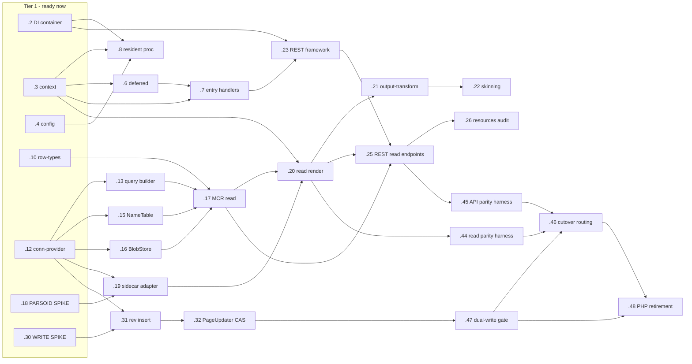

# Breakdown: Reimplement MediaWiki core as a TypeScript/Node engine

> **Epic plan:** [nodejs-migration.md](./nodejs-migration.md) · **Epic issue:** `mw-9pd`
> **Stories:** 47 · **Critical path:** `ws2 conn-provider → ws2 MCR read` ∥ `ws3 spike → sidecar adapter` → ws3 read render → output-transform → skinning, certified by the ws7 read-parity harness
> **Ready now (`bd ready`):** the two front-loaded spikes (`mw-9pd.18` Parsoid contract, `mw-9pd.30` write-invariants) + the un-blocked foundations (`mw-9pd.2/.3/.4` runtime, `mw-9pd.10/.12` data layer)

This is the point-in-time design artifact that accompanies the beads graph. **Beads is the single source of truth for status/tracking** — this doc references bead IDs and does not restate their mutable state. Use `bd ready` for what's startable and `bd show <id>` for a story's full spec.

## Summary

The Epic was decomposed into **47 stories under epic `mw-9pd`**, calibrated to the agreed scope: **WS1–WS4 (the near-term critical path) decomposed deep into implementable-blind stories; WS5–WS7 represented as milestone-grain stories** carrying the verified design notes and explicit needs-spike/decision flags, because much of that work is gated on decisions and spikes that haven't happened yet (the resident runtime model, the Parsoid-over-network contract, the dual-run write policy).

The shape is a strangler: a runtime foundation + a shared-schema data layer feed a **proving read-path vertical slice** (Title → MCR read → Parsoid sidecar → output-transform → skin) that is A/B'd against PHP, then the REST/Action read APIs, then the correctness-critical write path, then auxiliary breadth, then progressive read-only-first cutover and PHP retirement. Two spikes are deliberately front-loaded because they de-risk the two cliffs the Epic flagged: the **Parsoid network contract** (`mw-9pd.18`) and the **write-path data-compat invariants** (`mw-9pd.30`).

The decomposition followed one-capability-per-story (model+service+API+tests of the same capability live in one story); stories split only on genuine blocking sub-dependencies. The dependency graph is a validated DAG (`bd ready` surfaces exactly the intended tier-1; no cycles).

## What verification changed about the Epic

The high-value payoff of the per-area code reads. Held to the confirmed / corrected / still-open distinction.

### Confirmed (from code)
- **Schema is language-agnostic and generated**, gated by `AbstractSchemaTest` — the run-both-engines-on-one-DB property is real. (WS2; `sql/tables.json`, `AbstractSchemaTestBase::assertSQLSame`)
- **Reads are genuinely safe** — revisions/content/blobs are immutable, WAN-cached by address, no read-time CAS/mutation; the only read-time mutation is `rev_deleted` audience filtering. (WS2; `RevisionStore`, `SqlBlobStore`)
- **REST is DI-clean / JSON-native / OpenAPI'd** with a built-in machine-readable contract oracle (`/specs/v0` + `satisfyApiSpec`); the Action API `formatversion=1` envelope is the concrete unbreakable shape. (WS4; `includes/Rest/Router.php`, `Api/ApiResult.php`)
- **Skins are PHP/Mustache** (`SkinMustache`) — server-side skinning is a genuine rewrite. (WS3)

### Corrected (the code contradicted the Epic — surfaced loudly)
1. **The Parsoid over-network DataAccess already exists** (`vendor/wikimedia/parsoid/src/Config/Api/DataAccess.php`). The Epic's "biggest unproven piece" is precedented — the spike (`mw-9pd.18`) is about **latency / N+1 / batching, not feasibility**. (WS3)
2. **Parsoid calls *back* into the legacy PHP Parser** for `parseWikitext`/`preprocessWikitext` (extension tags + template expansion; `includes/parser/Parsoid/Config/DataAccess.php:422/449`). This is the single biggest hidden dependency — it drove the decision to scope the proving slice to **content with no templates and no extension tags** so Parsoid never calls back. (WS3)
3. **`resources/` reuse is two-tier, not "largely reusable."** `mw.Api`/`mw.Rest` JS clients reuse freely against contract JSON; but the in-wiki UI bootstraps from PHP-emitted `RLCONF`/`RLPAGEMODULES` + server-rendered skin HTML (`startup.js:123-125`, `OutputPage`) → **blocked on WS3** re-implementing that emission. Handoff #5 therefore lands on WS3, not WS4. (WS4 → `mw-9pd.26` feeds WS3 `mw-9pd.22`)
4. **The write path is event-driven** (`PageLatestRevisionChangedEvent` + `EventDispatchEngine`, post-commit/cancel-on-rollback), and the Epic **missed a whole class of non-idempotent counters** — `category.cat_*`, `change_tag_def.ctd_count`, `site_stats.*`, `user.user_editcount` — which have no transactional coupling and are the worst shared-DB corruption hazard. `recentchanges` is a separate deferred subsystem with its own actor/comment dedup. (WS5; `PageUpdater`, `EventDispatchEngine`, `CategoryCountUpdateJob`)
5. **Core ships real DB-backed search** (`SearchMySQL/Sqlite/Postgres` via `$wgSearchType=null` auto-resolution), *not* delegated to CirrusSearch (an out-of-scope extension that overrides the config). Search cannot be skipped — but Elasticsearch-grade relevance is out. (WS6)
6. **Parser-test fixtures are a parity oracle only for legacy `html/php`, not Parsoid** (`html/parsoid` is annotation-laden DOM; the engines diverge by design — handbook ch.10 #6). The harness must be **engine-aware (Parsoid-vs-Parsoid)**, DOM-normalized. **Dual-*write* on a shared DB is unsafe** (no cross-engine coordination of `SCHEMA_COMPAT_*` migrations) → **cutover must be read-only-first**; there is no in-repo traffic-routing layer (it's net-new). (WS7)
7. Minor (WS1): `opensearch_desc.php` is a 308 redirect, not a handler (6 web handlers, not 7+1); the hook system can't be *fully* dropped (internal lifecycle hooks + Domain Events remain → `mw-9pd.5`); `RequestContext::getMain()` is the real request-isolation challenge; ~400 lines of `MediaWikiEntryPoint` output-buffer/fastcgi machinery should **not** be ported (Node does async-after-response natively); `vendor/` is present (handbook caveat stale).

### Still open (carried into implementation, flagged on stories)
- **Resident runtime model** — request isolation + async-context propagation (AsyncLocalStorage vs explicit threading) + the deferred-work model. Gates WS1 and, transitively, WS5's scheduling. (`mw-9pd.3/.6/.8`)
- **Parsoid network contract performance** — latency budget for a network round-trip on the parse hot path. (spike `mw-9pd.18`)
- **`resources/` front-end strategy** — server-render skin HTML in TS vs pivot to a client-rendered shell (changes WS3 scope dramatically). (`mw-9pd.26` → `mw-9pd.22`)
- **Incremental-counter ownership** under dual-run — route through exactly-once jobs vs leave to PHP. (`mw-9pd.35`, decision-first)
- **i18n store backend / `LanguageXx` quirk-subclass count**; **file-schema migration stage** to target; **multi-year team runway** (the dominant non-technical risk, unchanged from the Epic).

## Stories

Grouped by workstream. Format: `id` — title — effort/priority — key dependencies. Full spec via `bd show <id>`.

### WS1 — Runtime foundation, DI & entry points (deep)
- `mw-9pd.2` — TS service container (DI engine) — high, P0. *(tier-1)*
- `mw-9pd.3` — Per-request context + request-isolation model — high, P0. *(tier-1)*
- `mw-9pd.4` — Config system (schema-as-data → Config + ServiceOptions) — high, P0. *(tier-1)*
- `mw-9pd.5` — Internal lifecycle-event seam (extension hooks dropped) — medium, P1. ← .2
- `mw-9pd.6` — Deferred-work model (PRESEND/POSTSEND redesign) — high, P1. ← .3
- `mw-9pd.7` — Entry-point handler framework (6 web handlers + CLI seam) — high, P1. ← .3, .6
- `mw-9pd.8` — Resident-process model (boot-once, isolation, lifecycle) — xhigh, P0. ← .2, .3, .4
- `mw-9pd.9` — Logging & observability foundation — medium, P2. ← .2, .4

### WS2 — Data-access layer on the shared schema (deep)
- `mw-9pd.10` — TS row-types codegen from `sql/tables.json` — high, P0. *(tier-1)*
- `mw-9pd.11` — DDL generator + parity gate vs `tables-generated.sql` — xhigh, P0. ← .10
- `mw-9pd.12` — Connection provider (replica/primary, groups, domains) — high, P0. *(tier-1)*
- `mw-9pd.13` — Fluent SelectQueryBuilder (read subset) + Expression — high, P0. ← .12
- `mw-9pd.14` — ChronologyProtector read-side (read-your-writes wait) — xhigh, P1. ← .12 (related .36)
- `mw-9pd.15` — NameTableStore read (3-tier cache; normalization asymmetry) — medium, P0. ← .12
- `mw-9pd.16` — SqlBlobStore read path (address resolution + decompress) — high, P1. ← .12
- `mw-9pd.17` — **MCR read model** (byte-parity vs PHP RevisionStore) — xhigh, P0. ← .10, .13, .15, .16

### WS3 — Read path + Parsoid sidecar — the proving slice (deep)
- `mw-9pd.18` — **SPIKE: Parsoid DataAccess-over-network contract & latency** — high, P0. *(tier-1)*
- `mw-9pd.19` — TS Parsoid-sidecar adapter (serve DataAccess/PageConfig/SiteConfig) — xhigh, P0. ← .18, .12
- `mw-9pd.20` — TS read render → ParserOutput-equivalent + Parsoid ParserCache — xhigh, P1. ← .19, .17, .3
- `mw-9pd.21` — OutputTransform pipeline (DOM path) — high, P1. ← .20
- `mw-9pd.22` — Server-side skinning (one Mustache skin) + same-URL serving — high, P1. ← .21 (related .26)

### WS4 — API surfaces (moderate-deep + milestones)
- `mw-9pd.23` — REST framework core (Router + Handler + ObjectFactory routes + ParamValidator) — high, P0. ← .2, .7
- `mw-9pd.24` — REST OpenAPI / discovery generation — medium, P0. ← .23
- `mw-9pd.25` — First REST read endpoints (page source + bare + html) — high, P1. ← .23, .17, .20
- `mw-9pd.26` — `resources/` coupling audit + reuse plan (Handoff #5) — medium, P1. ← .25 (feeds .22)
- `mw-9pd.27` — Action API framework + first read module — xhigh, P2. ← .23, .17, .20
- `mw-9pd.28` — *milestone* REST breadth (revision/history/transform/media/search) — xhigh, P3. ← .23, .25
- `mw-9pd.29` — *milestone* Action API breadth (modules + formatters + help) — xhigh, P3. ← .27

### WS5 — Write path & derived data (deep verification, milestone stories)
- `mw-9pd.30` — **SPIKE: write-path data-compat invariants + golden corpus** — xhigh, P1. *(tier-1; early unblocker)*
- `mw-9pd.31` — *milestone* Core revision insert (revision/slots/content/text/ip_changes) — xhigh, P2. ← .30, .12
- `mw-9pd.32` — *milestone* PageUpdater-equivalent + `page_latest` CAS — xhigh, P2. ← .31
- `mw-9pd.33` — *milestone* Derived data (links/page_props/categorylinks + parser-cache) — high, P3. ← .32, .6
- `mw-9pd.34` — *milestone* Change-tracking events (recentchanges + change_tag + EditResult) — xhigh, P3. ← .32, .6
- `mw-9pd.35` — *milestone* Incremental counters (decision-gated) — xhigh, P3. ← .34
- `mw-9pd.36` — *milestone* ChronologyProtector write-side / read-your-writes — xhigh, P2. ← .30

### WS6 — Identity, i18n, media, search, maintenance (milestones)
- `mw-9pd.37` — *milestone* Authority-equivalent permissions — xhigh, P2. ← .12 (related .38)
- `mw-9pd.38` — *milestone* Sessions + authentication (SessionManager + AuthManager + CSRF) — xhigh, P2. ← .12
- `mw-9pd.39` — *milestone* Localisation / i18n engine (LCStore-equivalent) — xhigh, P2. ← .4
- `mw-9pd.40` — *milestone* Files subsystem (FileBackend → FileRepo → File + thumbs) — xhigh, P3. ← .12, .7
- `mw-9pd.41` — *milestone* Core SearchEngine + DB backend + index maintenance — high, P3. ← .12
- `mw-9pd.42` — *milestone* Job workers (JobRunner + JobQueue backend) — high, P3. ← .6 (related .33)
- `mw-9pd.43` — *milestone* Special-page framework + operational maintenance CLI — xhigh, P3. ← .39, .7

### WS7 — Cutover, dual-run & PHP retirement (near-term harnesses + milestones)
- `mw-9pd.44` — Engine-aware read-path parity harness (Parsoid-vs-Parsoid) — high, P1. ← .20
- `mw-9pd.45` — API wire-parity harness (Action + REST contract diff) — medium, P1. ← .25
- `mw-9pd.46` — *milestone* Progressive per-surface cutover routing (read-only-first) — high, P3. ← .44, .45, .47
- `mw-9pd.47` — *milestone* Dual-write safety gate (single-writer + shadow-write parity) — xhigh, P3. ← .32
- `mw-9pd.48` — *milestone* PHP retirement (Parsoid sidecar retained) — high, P3. ← .46, .47

## Dependency graph & sequence

**Parallel groups (tiers — stories sharing no blocker):**
- **Tier 1 (now):** `.2 .3 .4` (runtime) · `.10 .12` (data) · `.18` (Parsoid spike) · `.30` (write spike)
- **Tier 2:** `.5 .6 .9` (runtime) · `.11 .13 .15 .16` (data) · `.19` (sidecar adapter) · `.31` (rev insert)
- **Tier 3:** `.7 .8` (runtime) · `.17` (MCR read) · `.20` (read render) · `.32` (PageUpdater CAS) · `.36`
- **Tier 4+:** `.21 → .22` (transform → skin) · `.23 → .24/.25` (REST) · `.27` (Action) · `.33 .34` · WS6 milestones (`.37–.43`) once their foundations land
- **Terminal:** `.44/.45` (parity harnesses) → `.46/.47` (cutover gates) → `.48` (retirement)

## Integration & parity validation

Per-story acceptance criteria don't prove the whole works together. The cross-story validation is captured as **explicit WS7 stories that depend on what they certify**, so they can't be skipped:
- `mw-9pd.44` (read parity harness) consumes WS3's render output and is the oracle that certifies the proving slice — compare **Parsoid-vs-Parsoid against `html/parsoid` fixtures**, never `html/php`.
- `mw-9pd.45` (API wire-parity harness) consumes WS4's endpoints and validates them against the PHP contract (reusing the built-in `/specs/v0` OpenAPI oracle for REST).
- `mw-9pd.47` (dual-write safety gate) consumes WS5's write invariants and is the row-level shadow-write parity gate that must pass before any write surface cuts over.
- `mw-9pd.46`/`mw-9pd.48` gate progressive cutover and retirement on those parity reports.

The reusable oracles are the repo's own fixtures: `tests/parser/*.txt` (`html/parsoid` sections) and `tests/api-testing/` contract specs.

## Open questions & risks carried into implementation

- **Multi-year team runway** — the dominant non-technical risk (unchanged from the Epic); determines feature-parity vs useful-subset.
- **Resident runtime model** is the load-bearing unknown for WS1 and, transitively, WS5 scheduling and WS5/WS2 ChronologyProtector (`.3 .6 .8 .36`).
- **Parsoid network latency** on the parse hot path (`.18`).
- **`resources/` strategy** (server-render vs client shell) sizes WS3's skin/output rewrite (`.26 → .22`).
- **Incremental-counter ownership** under dual-run is decision-first (`.35`); dual-write is gated read-only-first (`.47`).
- **Known scope gap:** a dedicated `Title`/`LinkCache` subsystem port (god-node) is currently absorbed into `mw-9pd.20` for the constrained slice; a fuller port may warrant its own story once the slice proves out.

Cross-cutting findings are also stored in beads memory (`bd memories`) so future sessions inherit them.

## Working the graph

- `bd ready` — what's unblocked right now (starts with the two spikes + the foundations).
- `bd show <id>` — a story's full spec (scope, code-verified design notes, acceptance, test approach, open questions).
- `bd dep tree <id>` — what blocks / is blocked by a story.
- Commit with the issue id in the message, e.g. `... (mw-9pd.17)`, so work stays traceable.
- `bd memories` — the cross-cutting verification findings.
