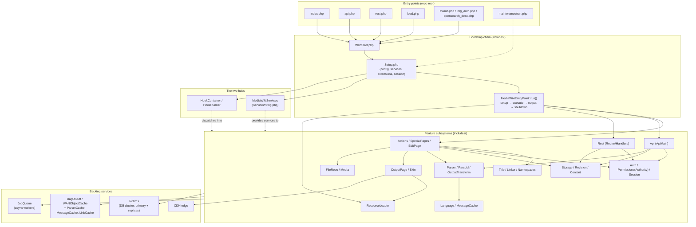

# Architecture

> Part of the MediaWiki core senior-onboarding handbook. MW_VERSION 1.47.0-alpha,
> PHP >= 8.3. This is the **big-picture** document: how the pieces fit together
> and what a request actually does end-to-end. It builds on the root
> [`AGENTS.md`](../../AGENTS.md) and [`includes/AGENTS.md`](../../includes/AGENTS.md),
> and links *into* the 14 subsystem deep-dives under
> [`subsystems/`](subsystems/) for the depth — it does not re-document them.
> Everything here was read from the source in this checkout; no toolchain was run
> (the repo ships no `vendor/`, see "ENVIRONMENT" below). Inferences are labelled
> **(inferred)**; genuine gaps are in [Open questions](#open-questions).

## Style & rationale

MediaWiki core is a **modular, shared-nothing PHP monolith** — the classic
"LAMP" application shape, scaled up. Two properties define the architecture and
explain almost every trade-off below:

1. **Shared-nothing, boot-per-request.** There is no long-lived application
   process. Every HTTP request starts a fresh PHP process (or worker), boots the
   entire framework from scratch, serves one response, and tears everything down.
   No in-memory application state survives between requests; all cross-request
   state lives in external stores (DB, cache, job queue). This is the standard
   PHP execution model, and MediaWiki leans into it: it is trivially
   horizontally scalable (any app server can serve any request — stick a load
   balancer in front and add boxes), and a crash or memory leak in one request
   cannot corrupt another. The cost is **boot overhead on every request**:
   autoloader, config, service wiring, and extension registration all run again
   each time.

2. **Extended in-process, not over the network.** MediaWiki is extended by
   loading PHP into the same process — via the **hook system** and the **service
   container** — rather than by calling out to separate microservices. An
   extension is code that runs *inside* the same request, sharing the same
   service container and the same DB connections. There is enormous power here
   (extensions can observe and override almost anything; see the
   [hooks deep-dive](subsystems/hooks-and-extension-registration.md)), but the
   coupling is real: a slow or buggy hook handler slows or breaks the host
   request, and the "stable interface" contract (`@stable to call` /
   `@stable to extend` vs `@internal`) is the only thing holding the blast radius
   in check.

**Why this shape works at Wikipedia scale.** The boot cost is mitigated by PHP
**opcache** (compiled bytecode is cached in shared memory across requests, so
re-`require`-ing thousands of files is cheap) and by **heavy caching at every
tier** so that most expensive work (parsing wikitext, rendering skins) is done
once and reused. The shared-nothing model is what lets the same codebase run on
a single SQLite file for a hobbyist and on hundreds of app servers behind a CDN
for Wikipedia. The production topology that core is *designed for* (and whose
assumptions are baked into the code — replica-lag handling, CDN max-age,
chronology protection, the job queue) is:

```
            Internet
               │
        ┌──────▼──────┐
        │     CDN      │  (Varnish/ATS; caches anonymous page views)
        └──────┬──────┘
        ┌──────▼──────┐
        │ Load balancer│
        └──────┬──────┘
   ┌───────────┼───────────┐
┌──▼──┐     ┌──▼──┐     ┌──▼──┐
│ app │ ... │ app │ ... │ app │   (stateless PHP workers; each boots MW per request)
└──┬──┘     └──┬──┘     └──┬──┘
   └─────┬─────┴─────┬─────┘
   ┌─────▼────┐ ┌────▼─────┐ ┌──────────┐
   │ DB cluster│ │  cache   │ │job queue │
   │ primary + │ │ memcached│ │ (async   │
   │ replicas  │ │ + WAN    │ │ workers) │
   └──────────┘ └──────────┘ └──────────┘
```

The app servers are stateless; everything stateful is a backing service. This is
the architectural through-line for the rest of this document.

> Note on accuracy: the CDN / load-balancer / replicated-cluster topology above
> is the production deployment MediaWiki targets, evidenced in-code by CDN
> max-age logic (`OutputPage::setCdnMaxage`, `ActionEntryPoint::performAction`),
> replica-lag handling and `ChronologyProtector` cookies in
> `MediaWikiEntryPoint::commitMainTransaction()`, and the `Rdbms` LoadBalancer.
> The *exact* products and counts are operational, not in this repo
> ([Open questions](#open-questions)).

## Component map (diagram)

There are **seven web entry points plus one CLI entry point**, all in the repo
root. Each is a thin script: it defines a couple of constants, boots the
framework through the **shared bootstrap chain**, then constructs and `run()`s an
entry-point handler. Everything fans out from the **two hubs** —
`MediaWikiServices` (the DI container) and `HookContainer` (the hook
dispatcher) — into the feature subsystems, which talk to the backing stores.



**Entry points and their handlers** (each handler is a `MediaWikiEntryPoint`
subclass; the script just constructs it with `RequestContext::getMain()`, a fresh
`EntryPointEnvironment`, and `MediaWikiServices::getInstance()`, then calls
`run()`):

| Script | Handler | Purpose | Deep-dive |
|---|---|---|---|
| `index.php` | `MediaWiki\Actions\ActionEntryPoint` | Browser navigations → Action or SpecialPage | [actions-special-pages-editing](subsystems/actions-special-pages-editing.md) |
| `api.php` | `MediaWiki\Api\ApiEntryPoint` (→ `ApiMain`) | The Action API | [action-api](subsystems/action-api.md) |
| `rest.php` | `MediaWiki\Rest\EntryPoint` | The REST API | [rest-api](subsystems/rest-api.md) |
| `load.php` | `MediaWiki\ResourceLoader\ResourceLoaderEntryPoint` | JS/CSS module delivery (`MW_NO_SESSION`) | [output-skins-resourceloader](subsystems/output-skins-resourceloader.md) |
| `thumb.php` | thumbnail handler | On-demand media thumbnails | [files-media-uploads](subsystems/files-media-uploads.md) |
| `img_auth.php` | protected-file handler | Access-controlled file serving | [files-media-uploads](subsystems/files-media-uploads.md) |
| `opensearch_desc.php` | search-descriptor handler | OpenSearch XML descriptor | — |
| `maintenance/run.php` | `Maintenance` subclasses (CLI) | ~200 CLI scripts | (see `maintenance/AGENTS.md`) |

The uniform handler shape is enforced by `MediaWikiEntryPoint::run()`
(`includes/MediaWikiEntryPoint.php`), which sequences every web request as
**`setup() → execute() → prepareForOutput() → postOutputShutdown()`**, wrapping
`execute()` in a top-level `try/catch` that routes any uncaught `Throwable` to
`MWExceptionHandler`. Subsystem-specific behaviour lives only in the subclass's
`execute()`.

## How components communicate

Three communication channels, by latency/coupling, and that is essentially the
whole story:

1. **Synchronous, in-process: the service container.** A component obtains its
   collaborators from `MediaWikiServices` (legacy code) or, in modern code, has
   them **constructor-injected** — the wiring closures in `ServiceWiring.php`
   pull from the container, and business logic should *not* reference the
   container itself. This is an ordinary PHP method call: no serialization, no
   network. It is the default way two components in the same request talk. See
   [service-container-and-config](subsystems/service-container-and-config.md) and
   [`docs/Injection.md`](../Injection.md).

2. **Synchronous, in-process, *inverted*: hook dispatch.** When core wants to let
   *other* code (extensions, or another part of core) observe or override a step,
   it does not call those components directly — it calls a typed `HookRunner`
   method (`$this->getHookRunner()->onSomethingHappened(...)`), and
   `HookContainer` invokes every registered handler in turn. This is still an
   in-process call, but it is **inversion of control**: the caller does not know
   who answers. `HookRunner` is the single most-connected node in the codebase
   (~1084 structural edges), which is the quantitative signature of "extended
   in-process." Some hooks are being superseded by a typed **Domain Event**
   system (see the [hooks deep-dive](subsystems/hooks-and-extension-registration.md)).

3. **Persistence and cross-request: Rdbms, cache, and the job queue.**
   - **Database** — all SQL goes through the `Rdbms` library
     (`includes/libs/rdbms/`) via `IConnectionProvider`: `$dbr` for replicas
     (reads), `$dbw` for the primary (writes), with query builders. A single
     request runs inside a **transaction round** that the entry point commits at
     the end. See [database-rdbms](subsystems/database-rdbms.md) and
     [`docs/database.md`](../database.md).
   - **Cache** — the multi-tier object cache (`BagOStuff` /
     `WANObjectCache`) plus the high-value derived caches (ParserCache,
     MessageCache, LinkCache, HTMLFileCache) is how one request's expensive work
     is reused by later requests *and* by other app servers. This is the
     primary cross-request communication mechanism for read-heavy traffic.
   - **Job queue** — work that does not need to finish before the response
     (link-table updates, cache purges, notifications, etc.) is enqueued as a
     **job** and run **asynchronously** by separate workers. This is how the
     synchronous request offloads slow or fan-out work. Both are covered in
     [caching-deferred-jobs](subsystems/caching-deferred-jobs.md).

A useful mental rule: **same request = method call (container) or hook
(dispatch); different request = cache or job (async); durable state = Rdbms.**
Nothing in core talks to another *core component* over HTTP — the only HTTP that
core originates internally is the optional async-job trigger (an HTTP request to
`Special:RunJobs`, see below) and outbound fetches in specific features.

## Lifecycle of a representative request (sequence diagram)

The canonical request is a **logged-out user viewing an existing article**
(`GET /wiki/Foo`). This traces the hot path through `index.php`. Where the CDN
and ParserCache **short-circuit** is called out explicitly — at Wikipedia scale
most such requests never reach PHP at all (CDN hit), and most that do never
re-parse (ParserCache hit).

**Stage 0 — bootstrap (runs once per request, every request).** `index.php`
defines `MW_ENTRY_POINT='index'`, runs the PHP-version check, then
`require`s `includes/WebStart.php` (`includes/Setup.php`). The boot does, in
order (`Setup.php`):
- Detect and load **`LocalSettings.php`** via `SettingsBuilder`
  (`$wgSettings`) — the per-site config; if absent, show the installer hint and
  die.
- `enterRegistrationStage()` → **`ExtensionRegistry`** loads every enabled
  extension/skin from its `extension.json`/`skin.json` (`loadFromQueue()` /
  `finish()`), merging their config and **registering their hook handlers**.
- `enterReadOnlyStage()`, then `MediaWikiServices::allowGlobalInstance()` and
  `define('MW_SERVICE_BOOTSTRAP_COMPLETE', 1)` — the **service container** is now
  usable. Config from `MainConfigSchema` (the `$wg*` schema) is fully expanded.
- Initialize tracer, exception handler, the `SetupAfterCache` hook
  (`(new HookRunner(...))->onSetupAfterCache()`), and — unless `MW_NO_SESSION` —
  the **`SessionManager`** and, if a valid session user is present,
  `AuthManager::autoCreateUser()`.

After boot, `index.php` constructs `ActionEntryPoint` and calls `run()`.

**Stage 1+ — handling.** Inside `ActionEntryPoint::execute()` →
`performRequest()` → `performAction()`:

```mermaid
sequenceDiagram
    autonumber
    actor U as Browser (logged-out)
    participant CDN as CDN edge
    participant EP as index.php + Setup.php
    participant AE as ActionEntryPoint
    participant TL as Title / namespaces
    participant AU as Authority (permissions)
    participant AR as Article / ViewAction
    participant RS as RevisionStore
    participant PC as ParserCache
    participant P as Parser
    participant OP as OutputPage + Skin
    participant RL as ResourceLoader (load.php, separate request)

    U->>CDN: GET /wiki/Foo
    alt CDN hit (anonymous, cacheable)
        CDN-->>U: cached HTML  ⟵ short-circuit, no PHP
    else CDN miss
        CDN->>EP: forward request
        EP->>EP: WebStart → Setup<br/>(config, services, extensions, session)
        EP->>AE: run() → setup() → execute()
        AE->>TL: resolve URL → Title
        Note over AE: optional HTMLFileCache hit ⟶ short-circuit (3rd-party)
        AE->>AU: authorizeRead('read', Title)
        AU-->>AE: allowed (else PermissionsError / Badtitle)
        AE->>AR: ActionFactory → ViewAction.show()
        AR->>RS: fetch current revision + content
        AR->>PC: get ParserOutput(Title, ParserOptions)
        alt ParserCache hit
            PC-->>AR: cached ParserOutput  ⟵ short-circuit, no parse
        else ParserCache miss
            AR->>P: parse wikitext → ParserOutput
            P-->>AR: ParserOutput
            AR->>PC: store ParserOutput
        end
        AR->>OP: addParserOutput(...) (HTML + RL module names)
        OP->>OP: Skin wraps body; declares <link>/<script> to load.php
        OP-->>AE: full HTML document (+ Cdn-Maxage)
        AE->>EP: prepareForOutput(): commit txn round,<br/>save session, ChronologyProtector
        EP-->>CDN: HTTP response (cacheable for anons)
        CDN-->>U: HTML (and caches it)
        U->>RL: GET load.php?modules=... (declared modules)
        RL-->>U: JS/CSS bundle
        EP->>EP: postOutputShutdown():<br/>fastcgi_finish_request → deferred updates → maybe run jobs
    end
```

Key points in that flow, with file anchors:

- **Title resolution** — the URL is parsed into a `Title`
  (`ActionEntryPoint::parseTitle` / `getTitle`); `Title` is the page-identity
  value object that threads through everything
  ([title-linking-namespaces](subsystems/title-linking-namespaces.md)).
- **Permission check** — `performRequest()` calls
  `$context->getAuthority()->authorizeRead('read', $title, ...)`; failure throws
  `PermissionsError` or redirects to `Special:Badtitle`. `Authority` is the
  modern permission interface
  ([auth-permissions-sessions](subsystems/auth-permissions-sessions.md)).
- **Dispatch** — `performAction()` resolves the action name (default `view`) via
  `ActionFactory`, then calls `$action->show()`. For `ViewAction` this drives
  `Article::view()`.
- **Content + parse** — `Article`/`WikiPage` fetch the current revision via
  **`RevisionStore`** ([storage-revisions-content](subsystems/storage-revisions-content.md))
  and obtain rendered HTML as a **`ParserOutput`**, going through **ParserCache**
  first; only on a miss does the **Parser** run
  ([parser-and-content-transform](subsystems/parser-and-content-transform.md),
  [caching-deferred-jobs](subsystems/caching-deferred-jobs.md)).
- **Output assembly** — `OutputPage` accumulates the HTML and, crucially, **the
  set of ResourceLoader module names** the page needs; the **Skin** wraps it in
  chrome. The actual JS/CSS is fetched by the browser in a *separate* request to
  `load.php`
  ([output-skins-resourceloader](subsystems/output-skins-resourceloader.md)).
- **CDN short-circuit** — for cacheable views, `performAction()` sets a CDN
  max-age (`OutputPage::setCdnMaxage`), so subsequent anonymous requests for the
  same URL are served by the CDN without touching PHP at all. This is the single
  most important performance property of the whole system for read traffic.

**Stage N — commit and post-send shutdown** (`MediaWikiEntryPoint`):
- `prepareForOutput()` → `commitMainTransaction()`: commit the primary
  transaction round, run **PRESEND** deferred updates, save the session, and run
  `ChronologyProtector::shutdown()` so the client's *next* request sees its own
  writes despite replica lag (the `cpPosIndex`/`UseDC` cookies). If a replica was
  lagged or the message cache was disabled, the CDN max-age is lowered to avoid
  caching stale data.
- The response body is flushed to the client.
- `postOutputShutdown()` → `doPostOutputShutdown()`: if FastCGI is available,
  `fastcgi_finish_request()` ends the client connection *first*, then the
  process runs **POSTSEND** deferred updates and `schedulePostSendJobs()` — which
  (per `$wgJobRunRate`) may run a few queued jobs inline or, with
  `$wgRunJobsAsync`, fire an HTTP request to `Special:RunJobs`. The user is not
  blocked on any of this.

## Cross-cutting concerns (config, DI, hooks, logging, errors, observability)

These cut across every subsystem and every request; they are wired up during
Stage 0 boot and consumed everywhere after.

- **Configuration.** The canonical config schema is `MainConfigSchema.php` (the
  `$wg*` settings) with name constants in `MainConfigNames.php`. At boot,
  `SettingsBuilder` (`$wgSettings`) loads defaults from the schema, overlays
  `LocalSettings.php` and any extension config, and expands dynamic defaults.
  Code reads config through `Config`/`MainConfigNames`, **not** by touching
  `$wg*` globals directly in new code. Details:
  [service-container-and-config](subsystems/service-container-and-config.md).
- **Dependency injection.** New services are factory closures in
  `ServiceWiring.php` with a typed getter on `MediaWikiServices`; collaborators
  are constructor-injected. The migration away from `wf*()` globals
  (`includes/GlobalFunctions.php`) and static singletons toward DI is ongoing —
  the codebase is a mix of both. Authority: [`docs/Injection.md`](../Injection.md).
- **Hooks & extension registration.** Extensions register via
  `extension.json`/`skin.json`, loaded by `ExtensionRegistry` during boot; core
  calls extension code through typed `HookRunner` façades. This is the principal
  boundary between "core" and "everything else."
  [hooks-and-extension-registration](subsystems/hooks-and-extension-registration.md).
- **Logging.** `LoggerFactory` returns PSR-3 loggers (Monolog under the hood);
  channels like `rdbms`, `runJobs`, `replication`, `Settings` are used
  throughout. The legacy `wfDebug()`/`wfDebugLog()` globals still appear widely
  and funnel into the same system.
- **Error / exception handling.** `MWExceptionHandler` is installed during boot
  and is the universal sink: `MediaWikiEntryPoint::run()` catches any `Throwable`
  from `execute()` and routes it there (`CAUGHT_BY_ENTRYPOINT`), and post-send
  failures roll back primary changes. Each entry point can render errors in its
  own format (HTML page, API error structure, REST JSON). `ActionEntryPoint` will
  even fall back to a stale `HTMLFileCache` copy during a DB outage.
- **Profiling & stats.** `Profiler` (with the transaction profiler that sets
  per-request DB query *expectations* by HTTP method), `StatsFactory`, telemetry
  tracing (`Tracer`/`SpanInterface`), and `ProfilingContext` are initialized at
  boot and threaded through the handlers. Method names like
  `doPrepareForOutput` / `doPostOutputShutdown` are load-bearing for the
  arc-lamp flame-graph tooling (noted in their docblocks).
- **Deferred updates.** `DeferredUpdates` lets a request register work to run at
  the end — split into **PRESEND** (must finish before the response, run in
  `commitMainTransaction`) and **POSTSEND** (run after the client is served, in
  `doPostOutputShutdown`). This is the in-process complement to the job queue:
  same request, just later. [caching-deferred-jobs](subsystems/caching-deferred-jobs.md).

## Boundaries & trade-offs

- **Core vs extensions / skins.** This repo is the *engine only*; the
  `extensions/` and `skins/` directories are empty placeholders. Hundreds of
  features (and every skin — skins *are* extensions) live in separate repos and
  load in-process via `wfLoadExtension()`/`wfLoadSkin()` and `extension.json`.
  The contract between them is (a) the hook interfaces and (b) classes/methods
  marked `@stable to call` / `@stable to extend`; `@internal` and `@unstable` are
  not part of the contract. **Trade-off:** maximal extensibility and a huge
  ecosystem, paid for with in-process coupling (a bad extension can break or slow
  the host request) and a heavy backward-compatibility burden — breaking a stable
  interface requires a deprecation path (`wfDeprecated()` / `@deprecated`), which
  is why deprecated shims accumulate.
- **`includes/libs/` — the framework-agnostic core.** Several libraries (`rdbms`,
  `objectcache`, `ParamValidator`, `filebackend`, …) live under `includes/libs/`
  and are mirrored as standalone `wikimedia/*` Composer packages. They must stay
  decoupled from MediaWiki globals and the service locator so they remain
  independently publishable. **Trade-off:** clean reusable boundaries, at the
  cost of some duplication and indirection where core must adapt globals into the
  library's explicit-config style.
- **Legacy globals → DI migration.** The architecture is mid-migration: god-node
  globals (`wfMessage` ~262 edges, `wfDeprecated` ~251, `wfDebug` ~188) and
  static singletons coexist with constructor-injected services. New code uses DI;
  old code is converted opportunistically. **Trade-off:** you cannot assume
  *either* style when reading — both are "correct" depending on vintage — but the
  direction of travel is unambiguous (toward DI).
- **Boot-per-request vs a resident app.** Re-booting the framework each request
  is simple and crash-isolating but inherently re-does work; the mitigation is
  opcache plus caching, not a long-lived process. There is no application-server
  daemon to manage, which is part of why MediaWiki is easy to deploy on
  commodity LAMP hosting.

## Where to go deeper (links into subsystem deep dives)

Ordered roughly by where they sit in the lifecycle above:

- Boot & the two hubs — [service-container-and-config](subsystems/service-container-and-config.md),
  [hooks-and-extension-registration](subsystems/hooks-and-extension-registration.md)
- The `index.php` path — [actions-special-pages-editing](subsystems/actions-special-pages-editing.md)
- The other entry points — [action-api](subsystems/action-api.md),
  [rest-api](subsystems/rest-api.md),
  [output-skins-resourceloader](subsystems/output-skins-resourceloader.md) (also `load.php`)
- Page identity & resolution — [title-linking-namespaces](subsystems/title-linking-namespaces.md)
- Security gate — [auth-permissions-sessions](subsystems/auth-permissions-sessions.md)
- Content & rendering — [storage-revisions-content](subsystems/storage-revisions-content.md),
  [parser-and-content-transform](subsystems/parser-and-content-transform.md)
- Performance infrastructure — [database-rdbms](subsystems/database-rdbms.md),
  [caching-deferred-jobs](subsystems/caching-deferred-jobs.md)
- Cross-cutting — [localisation](subsystems/localisation.md),
  [files-media-uploads](subsystems/files-media-uploads.md)

Authoritative source docs referenced throughout: [`docs/Injection.md`](../Injection.md),
[`docs/Hooks.md`](../Hooks.md), [`docs/database.md`](../database.md).

<a id="open-questions"></a>
## Open questions

- **Exact production topology.** The CDN product (Varnish/ATS), load-balancer,
  number of app servers, replica counts, and multi-DC layout are operational
  facts not present in this repo; the code only *assumes* such a topology (CDN
  max-age, replica-lag handling, `ChronologyProtector`, `UseDC`/`cpPosIndex`
  cookies, the `Special:RunJobs` async trigger). Treat the topology diagram as
  the intended deployment **(inferred from in-code evidence)**, not a measured
  fact.
- **Default job-queue backend.** The code is backend-agnostic (`JobQueueGroup`);
  which concrete queue runs in production (e.g. a Redis/Kafka-backed queue vs the
  DB-backed default) is a deployment choice not fixed here.
- **opcache as the boot-cost mitigation** is the standard PHP deployment practice
  and is consistent with the boot-per-request design, but is an operational
  configuration, not something this repo enforces — labelled **(inferred)** above.
- **CLI bootstrap differences.** `maintenance/run.php` boots a CLI variant
  (`MW_ENTRY_POINT='cli'`, `DEFER_CLI_MODE`, no session, different job/output
  handling); the precise divergence from the web chain was not fully traced here
  and lives in `maintenance/` (see `maintenance/AGENTS.md`).
