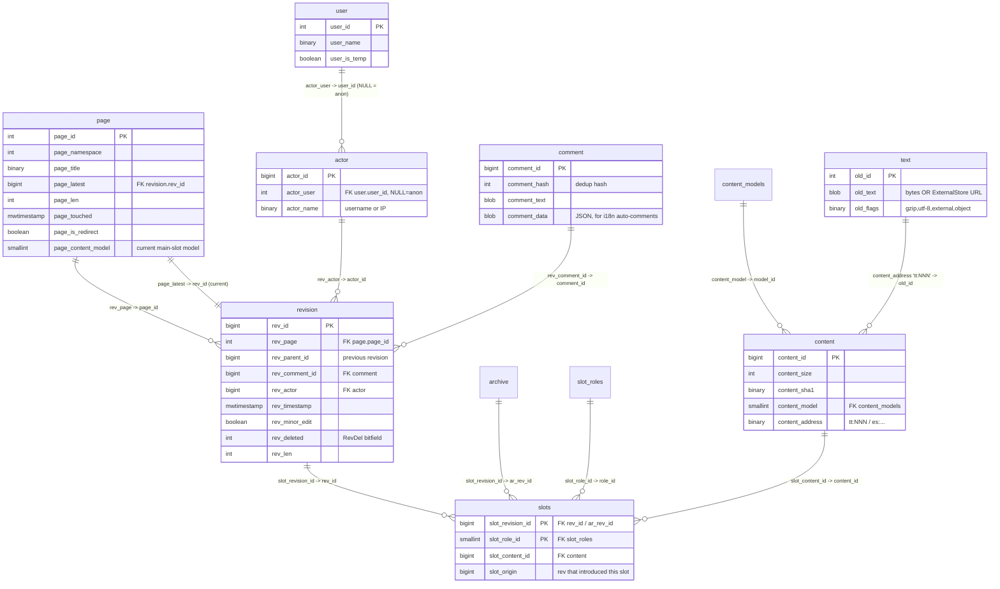

# Data Model & Schema Evolution

> Part of the MediaWiki core senior-onboarding handbook. MW_VERSION at time of
> writing: **1.47.0-alpha**. Databases: MySQL/MariaDB (canonical), PostgreSQL,
> SQLite.
>
> **Foundation — read first, this doc builds on them and does not repeat them:**
> root `AGENTS.md`; `includes/AGENTS.md`; `maintenance/AGENTS.md`;
> `docs/database.md` (DB-access patterns), `docs/schema.md` (one-liner: the
> abstract schema is the source of truth). The graph report lives at
> `graphify-out/GRAPH_REPORT.md` (`graph.json` is 36 MB — grep it, don't open it).
>
> **Scope boundary.** Sibling subsystem docs *own* the semantics of the tables
> their subsystem manages; this doc owns the **cross-cutting data model** (how the
> core entities relate), the **abstract→generated schema mechanism**, and the
> **schema-evolution workflow**. Where a table's behaviour belongs to a subsystem,
> this doc links rather than re-documents:
> [storage-revisions-content](subsystems/storage-revisions-content.md) (page /
> revision / slots / content / text / archive),
> [files-media-uploads](subsystems/files-media-uploads.md) (image / oldimage /
> filearchive / file / filerevision / filetypes / uploadstash),
> [auth-permissions-sessions](subsystems/auth-permissions-sessions.md) (user /
> user_groups / block / block_target),
> [title-linking-namespaces](subsystems/title-linking-namespaces.md) (linktarget
> and the `*links` backlink tables),
> [caching-deferred-jobs](subsystems/caching-deferred-jobs.md) (what's cached over
> the store and how it's kept consistent).

---

## Core entities & relationships (ER diagram)

The center of gravity is the **page → revision → slots → content → blob** chain
(the Multi-Content-Revisions / MCR model), wrapped by two normalization
indirections — **actor** (who) and **comment** (edit summary) — that nearly every
history-bearing table funnels through. The diagram below is faithful to
`sql/tables.json` (column names and FK directions verified against the abstract
schema); it shows the *logical* foreign keys. **Note:** MediaWiki's abstract
schema declares almost no physical `FOREIGN KEY` constraints — these relationships
are enforced in application code, not by the RDBMS (see *Invariants*).



### The MCR storage chain, in words

1. **`page`** — one row per wiki page; the identity + *current-state* row.
   `page_latest` points at the current revision; `page_content_model` is the model
   of the current main slot.
2. **`revision`** — one row per edit. **Metadata only, no content** (this is the
   MCR split — `rev_text_id` is gone). Carries `rev_parent_id` (the history
   chain), `rev_actor`/`rev_comment_id` (the indirections), `rev_deleted` (the
   RevDel visibility bitfield), and `rev_len`.
3. **`slots`** — the n:m join between a revision and its content. Each row is
   `(slot_revision_id, slot_role_id) → slot_content_id`, plus `slot_origin` (the
   revision that *introduced* this slot's content). A revision normally has one
   `main` slot but can carry several named slots.
4. **`content`** — one row per distinct content object: `content_size`,
   `content_sha1`, `content_model` (→ `content_models`), and an opaque
   **`content_address`**.
5. **`text`** — the legacy blob store. A `tt:NNN` address resolves to
   `text.old_id`; `old_flags` records compression/encoding/`external`. With
   ExternalStore enabled, `old_text` holds a URL (e.g. `es:DB://cluster/...`),
   not the bytes themselves.

`content_models` and `slot_roles` are small **`NameTableStore`** tables that
normalize the repeated strings `"wikitext"`, `"main"`, etc. into integer IDs
(`change_tag_def` is a third such table, shared with change-tagging).

### The two normalization indirections (used everywhere)

- **`actor`** maps a user-name *or* IP address to an `actor_id`. `actor_user` is
  the `user.user_id` for registered users or `NULL` for anonymous/IP actors.
  History-bearing tables store an actor FK rather than a raw username:
  `rev_actor`, `ar_actor`, `log_actor`, `rc_actor`, plus the file tables
  (`img_actor`, `oi_actor`, `fa_actor`, `fr_actor`). Accessed via the
  `ActorStore`/`ActorNormalization` services
  ([auth-permissions-sessions](subsystems/auth-permissions-sessions.md)).
- **`comment`** holds edit summaries / log reasons, best-effort de-duplicated by
  `comment_hash` (with optional `comment_data` JSON for localizable
  auto-generated comments). FK columns: `rev_comment_id`, `ar_comment_id`,
  `log_comment_id`, `rc_comment_id`. Accessed via the `CommentStore` service.

> *(Verified: the actor/comment FK columns above were enumerated from
> `sql/tables.json`.)* Both normalizations were themselves staged migrations (the
> historical `MIGRATION_*`/`SCHEMA_COMPAT_*` work) — see *Zero-downtime patterns*.

### The other core entities (owners in brackets)

| Cluster | Tables | Owner doc |
|---|---|---|
| Page/revision/content | `page`, `revision`, `slots`, `content`, `content_models`, `slot_roles`, `text`, `archive`, `ip_changes` | [storage-revisions-content](subsystems/storage-revisions-content.md) |
| Identity & rights | `user`, `user_groups`, `user_former_groups`, `user_properties`, `actor`, `block`, `block_target`, `bot_passwords` | [auth-permissions-sessions](subsystems/auth-permissions-sessions.md) |
| Links graph | `pagelinks`, `templatelinks`, `categorylinks`, `category`, `imagelinks`, `externallinks`, `iwlinks`, `existencelinks`, `linktarget`, `page_props` | [title-linking-namespaces](subsystems/title-linking-namespaces.md) |
| Activity feeds | `logging`, `recentchanges`, `watchlist`, `watchlist_label`, `change_tag`, `change_tag_def` | logging/RC consumed across subsystems |
| Files | `image`, `oldimage`, `filearchive`, `uploadstash` (old) → `file`, `filerevision`, `filetypes` (new) | [files-media-uploads](subsystems/files-media-uploads.md) |

The links tables share a pattern worth knowing: `*_from` is the source
`page_id`; the *target* has been migrated from a denormalized `(namespace,title)`
pair to a single FK into the shared **`linktarget`** table (`pl_target_id`,
`tl_target_id`, `cl_target_id`, `il_target_id`) — see the worked migration
examples below. `existencelinks` (added 1.45) and `category`/`page_props` round
out the derived-links picture (details:
[title-linking-namespaces](subsystems/title-linking-namespaces.md)).

---

## Where the schema lives & how it maps to storage

There are three layers, and **only the first is hand-edited**:

1. **Abstract schema — `sql/tables.json`** (~5,500 lines, ~one entry per table).
   This is *the source of truth*. Each table is an object with `name`, `comment`,
   `columns`, `indexes`, `pk`, and optional `table_options`. Columns use
   **abstract types** — not raw SQL types — drawn from a fixed enum in
   `docs/abstract-schema-table.json`:

   ```
   bigint  binary  blob  boolean  datetimetz  decimal  float  integer
   mwenum  mwtimestamp  mwtinyint  smallint  string  text
   ```

   Per-column `options` carry `notnull`, `default`, `unsigned`, `length`,
   `autoincrement`, `fixed`, `scale`/`precision`, and a `PlatformOptions` bag
   (e.g. `enum_values` for `mwenum`, `allowInfinite` for timestamps). The
   `mw*`-prefixed types are MediaWiki abstractions: `mwtimestamp` (a 14-char
   binary timestamp on MySQL, with platform variants), `mwenum`, `mwtinyint`.
   The abstract layer is what lets one definition target MySQL, PostgreSQL, and
   SQLite without per-DB drift.

2. **Generated per-DB SQL — `sql/{mysql,postgres,sqlite}/tables-generated.sql`.**
   Produced from `tables.json` by the **`SchemaGenerator`** (Doctrine DBAL under
   the hood). **Do not hand-edit and do not read wholesale** — they are large,
   machine-written `CREATE TABLE` dumps. Regenerated with
   `maintenance/run generateSchemaSql` *(documented, not run here — no toolchain
   in this checkout)*.

3. **Live storage.** Row bytes live in the RDBMS, *except* page-content blobs,
   which are addressed indirectly: `content.content_address` → `text.old_id`
   (`tt:` scheme) or → an **ExternalStore** cluster URL (`es:` scheme, with
   `old_flags=external`). The MCR read path resolves the address through
   `SqlBlobStore`, decompresses per `old_flags`, and unserializes via the slot's
   `ContentHandler`
   ([storage-revisions-content](subsystems/storage-revisions-content.md)). File
   *bytes* live in a `FileBackend` (filesystem or Swift), not in the DB at all
   ([files-media-uploads](subsystems/files-media-uploads.md)).

**Schema-change patches** live in `sql/abstractSchemaChanges/*.json` (abstract,
hand-written) and generate `sql/{mysql,postgres,sqlite}/*.sql` patch files. An
abstract change file (schema in `docs/abstract-schema-changes.schema.json`) has
`comment`, `before`, and `after` — each of `before`/`after` is a full
`abstract-schema-table.json` table definition (an empty `before` object means
"table creation"). The generator diffs `before`→`after` to emit the per-DB
`ALTER`/`CREATE` SQL.

---

## Invariants & constraints

- **Revisions are immutable.** A `RevisionRecord` is never edited in place — a new
  edit writes a new `revision` row. The *only* permitted mutation of an existing
  revision is its **visibility** (`rev_deleted` RevDel bitfield) and physical
  content suppression. (Full semantics:
  [storage-revisions-content](subsystems/storage-revisions-content.md).)
- **Content-address indirection is permanent.** Once a `content_address` is
  written it is never repointed; identical content can be shared by many slots.
  **Inherited slots** (e.g. a section edit that leaves other slots untouched)
  store no new blob — `slot_origin < slot_revision_id` reuses the prior `content`
  row and address.
- **Actor / comment indirection.** History tables store `*_actor` / `*_comment_id`
  FKs, never raw usernames or summary text. Always read/write them through
  `ActorStore` / `CommentStore`; hand-joining is a foot-gun (and a migration
  hazard during the file-table transition, which also uses actor columns).
- **`NameTableStore` IDs are transaction-volatile.** An ID returned by
  `acquireId()` for `content_models`/`slot_roles`/`change_tag_def` can disappear on
  rollback — don't cache it across a transaction boundary.
- **Few physical FK constraints.** The abstract schema mostly omits SQL
  `FOREIGN KEY`s (a historical choice for MySQL/replication performance and for
  cross-DB portability). Referential integrity is an *application* invariant, not
  a database one — so "FK" throughout this doc means "logical reference". *(This
  is an inference from the table definitions, which declare `pk`/`indexes` but no
  `foreignKeys` key in the abstract-schema format; treat the rationale as
  indicative.)*
- **The abstract schema must match the generated SQL.** `AbstractSchemaTest`
  (under `tests/phpunit/structure/`) is the gate — see the workflow below.
- **Deletion archives, it doesn't move content.** Deleting a page writes `archive`
  rows that *reference the same* `slots`/`content`/blobs; undeletion re-links them.
  `slots.slot_revision_id` references either `rev_id` or `ar_rev_id`.
- **MySQL is canonical; queries are tuned for it.** Postgres/SQLite are supported
  but secondary. Avoid `SELECT *` with `GROUP BY` (Postgres is strict), keep
  queries indexed, and respect replication lag (`docs/database.md`).

---

## Making a schema change (the migration workflow)

This is the part to internalize — the workflow matters as much as the static
schema. All commands below are **documented, not run** (no toolchain in this
checkout; see `maintenance/AGENTS.md`).

**1. Edit the abstract schema.**
   - *New table*, or *column/index change on an existing table that you also
     change at install time*: edit **`sql/tables.json`**.
   - *Altering an existing table on upgrade*: add a change file under
     **`sql/abstractSchemaChanges/`** with `comment` + `before` + `after`. (For a
     new table you typically do both: add to `tables.json` *and* add a creation
     change file so existing installs get it via `update.php`.)

**2. Regenerate per-DB SQL** for **all three** platforms *(documented, not run)*:

   ```sh
   maintenance/run generateSchemaSql          # rebuilds sql/*/tables-generated.sql
   maintenance/run generateSchemaChangeSql    # rebuilds sql/*/<patch>.sql from the change file
   ```

   Never hand-write the generated SQL — it must come from the generator so all
   three dialects stay in lockstep.

**3. Register the change in the `DatabaseUpdater`.** Add an entry to
   `getCoreUpdateList()` in **`includes/Installer/MysqlUpdater.php`** (and the
   matching `SqliteUpdater` / `PostgresUpdater` as needed). Entries are
   `[ <op>, <table>, <field/index>, <generated-patch.sql> ]` or
   `[ 'runMaintenance', SomeScript::class ]`. The updater exposes typed ops:
   `addTable`, `addField`, `addIndex`, `modifyField`, `modifyTable`,
   `dropField`, `dropIndex`, `dropTable`, `modifyPrimaryKey`,
   `changeTableOption`, plus `runMaintenance` and `addPostDatabaseUpdateMaintenance`
   for data backfills. Real, current excerpt (`MysqlUpdater::getCoreUpdateList`):

   ```php
   // 1.44
   [ 'addTable', 'file', 'patch-file.sql' ],
   [ 'addField', 'categorylinks', 'cl_target_id', 'patch-categorylinks-target_id.sql' ],
   // 1.45
   [ 'addIndex', 'categorylinks', 'cl_timestamp_id', 'patch-categorylinks-cl_timestamp_id.sql' ],
   [ 'migrateCategorylinks' ],                              // a backfill helper method
   [ 'modifyPrimaryKey', 'categorylinks', [ 'cl_from', 'cl_target_id' ], 'patch-categorylinks-pk.sql' ],
   [ 'dropField', 'categorylinks', 'cl_to', 'patch-categorylinks-drop-cl_to-cl_collation.sql' ],
   ```

   The list is ordered by MW version and applied in order. `DatabaseUpdater::doUpdates()`
   runs `core` → `extensions` → `stats`; each applied step is recorded in the
   **`updatelog`** table by an idempotency key (`updateRowExists()` /
   `insertUpdateRow()`), so re-running `update.php` is safe. Between steps,
   `runUpdates()` calls `waitForReplication()` so an upgrade doesn't outrun the
   replicas. *(Flow verified from `DatabaseUpdater::doUpdates`/`runUpdates`.)*

   - **New installs skip redundant steps** via `getInitialUpdateKeys()`: keys
     listed there are pre-seeded into `updatelog` on a fresh install so
     shrink/constraint patches that are already baked into `tables-generated.sql`
     aren't reapplied.
   - **Extensions** don't touch `MysqlUpdater`; they implement the
     **`LoadExtensionSchemaUpdates`** hook and call `addExtensionUpdate` /
     `addExtensionTable` / `addExtensionField` etc. on the passed `DatabaseUpdater`.

**4. Apply it.** Operators run `maintenance/run update` *(documented, not run)*,
   which executes the pending update-list entries against their DB.

**5. The gate: `AbstractSchemaTest`.** This structure test
   (`tests/phpunit/structure/AbstractSchemaTest.php`, base
   `AbstractSchemaTestBase.php`) **fails CI** unless:
   - every entry in `tables.json` / change files is *valid* against the JSON
     schema (`testSchemaIsValid`, `testSchemaChangesAreValid`);
   - the committed `tables-generated.sql` for each platform **byte-matches** what
     the generator would produce (`testSchemasHaveAutoGeneratedFiles`); and
   - each change file's generated patch SQL matches
     (`testSchemaChangesHaveAutoGeneratedFiles`).
   If you edit the abstract schema and forget to regenerate, this test tells you.
   *(Verified from the test's `assertFileExists` / `assertSQLSame` assertions.)*

> Related generated-artifact gate: adding/moving a class needs
> `generateLocalAutoload` (`AutoLoaderStructureTest`) — out of scope here but the
> same "generated file must match" discipline (root `AGENTS.md`).

---

## Zero-downtime / online migration patterns (the SCHEMA_COMPAT stages)

A plain `ALTER TABLE` is fine for a small wiki running `update.php` during a
maintenance window, but it is **not** acceptable for a billion-row table on a live
Wikimedia cluster. For data-shape changes (split a column into a new table,
normalize repeated values, change a key), MediaWiki uses a **staged migration**
driven by a config flag and the `SCHEMA_COMPAT_*` bit-field. The flags
(`includes/Defines.php`):

```
SCHEMA_COMPAT_WRITE_OLD   0x01     SCHEMA_COMPAT_READ_OLD    0x02
SCHEMA_COMPAT_WRITE_TEMP  0x10     SCHEMA_COMPAT_READ_TEMP   0x20
SCHEMA_COMPAT_WRITE_NEW   0x100    SCHEMA_COMPAT_READ_NEW    0x200
```

with composites `SCHEMA_COMPAT_OLD`, `SCHEMA_COMPAT_NEW`, `SCHEMA_COMPAT_WRITE_BOTH`,
`SCHEMA_COMPAT_READ_BOTH`, and the older ordered `MIGRATION_OLD` →
`MIGRATION_WRITE_BOTH` → `MIGRATION_WRITE_NEW` → `MIGRATION_NEW` constants used by
historical migrations. **Code checks the `SCHEMA_COMPAT_*` bits to decide each
read/write; the `MIGRATION_*` constants are stage *labels*, never used in bitwise
ops.** *(Verified from the `Defines.php` doc comment.)*

### The canonical sequence

| Stage | Flags | What happens |
|---|---|---|
| 0. Baseline | `READ_OLD \| WRITE_OLD` | Only the old schema exists/used. New tables may not exist yet. |
| 1. Add new schema | (deploy `tables-generated.sql` change) | Create the new tables/columns (empty). No behaviour change. |
| 2. Dual-write | `READ_OLD \| WRITE_BOTH` | Every write goes to **both** old and new. Reads still from old → safe rollback (just stop reading new). |
| 3. Backfill | run maintenance script | A batched backfill script copies historical rows old→new, throttling on replication lag. |
| 4. Read-new | `READ_NEW \| WRITE_BOTH` | Reads switch to new (with fallback); writes still go to both → still rollback-safe. |
| 5. Write-new only | `WRITE_NEW \| READ_NEW` | Stop writing old. The old tables are now dead weight. |
| 6. Cleanup | `SCHEMA_COMPAT_NEW` / drop | Drop old columns/tables and remove the feature flag. |

Reads/writes branch on the active bits; queries are built through a
migration-aware query builder so callers don't sprinkle `if` statements
everywhere.

### Worked example — the live file-tables migration

The `image`/`oldimage`/`filearchive` tables are being replaced by normalized
`file` / `filerevision` / `filetypes`, governed by **`$wgFileSchemaMigrationStage`**
(`MainConfigSchema::FileSchemaMigrationStage`). Its own history comment documents
the rollout: **added in 1.44** (writing supported), **1.47 added support for
reading the new schema**. Currently `default => SCHEMA_COMPAT_OLD`, with supported
values:

```
SCHEMA_COMPAT_WRITE_OLD | SCHEMA_COMPAT_READ_OLD   (SCHEMA_COMPAT_OLD)   ← default
SCHEMA_COMPAT_WRITE_BOTH | SCHEMA_COMPAT_READ_OLD                        ← dual-write
SCHEMA_COMPAT_WRITE_BOTH | SCHEMA_COMPAT_READ_NEW                        ← read-new, still dual-write
```

In code: `LocalFile` writes to old and/or new tables per the
`SCHEMA_COMPAT_WRITE_OLD` / `WRITE_NEW` bits, and **`FileSelectQueryBuilder`** is
the single read path that branches on the stage to query either
`image`/`oldimage` or `file`/`filerevision`. The recent-commit trail shows the
migration being driven one consumer at a time — e.g.
`ApiQueryAllImages: Use fr_id as secondary sort with new file tables`, and the
`NewFilesPager`/`ImageListPager` "ensure filerevision is queried before file"
audits. **Takeaway for a new engineer:** treat any direct `image`/`oldimage`
query as a migration hazard; go through `FileSelectQueryBuilder`. Full detail:
[files-media-uploads](subsystems/files-media-uploads.md).

The normalization is the same shape as the historical **actor** and **comment**
migrations (which moved usernames/summaries out of `revision` into the `actor`/
`comment` tables) and the in-flight **linktarget** migration (moving link targets
out of `(namespace,title)` columns into the shared `linktarget` table — see the
`*_target_id` columns and the `migratePagelinks`/`migrateCategorylinks`/
`migrateImagelinks` updater steps).

### Backfill scripts

Stage 3 is a `runMaintenance`/`addPostDatabaseUpdateMaintenance` entry in the
update list pointing at a batched script (examples from the current update list:
`MigrateRevisionCommentTemp`, `MigrateExternallinks`, `MigrateBlocks`,
`PopulateUserIsTemp`, `FixInconsistentRedirects`). They iterate in primary-key
batches and wait on replication, so they can run for hours against a large wiki
without lagging replicas (`docs/database.md` "Lag avoidance").

### Third-party `update.php` vs WMF online schema changes

- **Third-party installs** typically run `maintenance/run update` once during an
  upgrade window. For them the staged flags often collapse: the patch lands and
  the backfill runs inline; an `ALTER`/`CREATE` against a small DB is cheap.
- **Wikimedia** *cannot* `ALTER` huge tables inline. WMF applies the SQL change
  out-of-band per-replica with online-schema-change tooling
  *(inference: this is the well-known WMF DBA practice for billion-row tables;
  the specific tool/runbook is not in this repo — see open questions)*, then walks
  `$wg*MigrationStage` forward across deploys, running backfills as jobs/scripts.
  The `SCHEMA_COMPAT_*` design exists precisely so that the *same code* serves both
  audiences: small wikis flip straight to NEW, WMF steps through WRITE_BOTH →
  READ_NEW → WRITE_NEW at its own pace with rollback available at every stage.

---

## Caching & consistency

The store is fronted by several caches — the *what* lives here, the *how* in
[caching-deferred-jobs](subsystems/caching-deferred-jobs.md):

- **`LinkCache`** — in-process cache of `page` existence/metadata rows, populated
  by `PageStore`/`LinkBatch`. Avoids re-querying `page` for every link rendered.
- **`WANObjectCache`** over hot rows — `RevisionStore::getKnownCurrentRevision()`
  caches the current revision; `LocalFile` WAN-caches file metadata (with a cache
  `VERSION` constant bumped on shape changes). Reads in *lagged-replica mode*
  automatically shorten cache TTLs so stale data converges (`docs/database.md`).
- **`NameTableStore`** WAN-caches the `content_models` / `slot_roles` /
  `change_tag_def` id↔name maps (these tables are tiny and nearly append-only).
- **ParserCache / derived data** — links tables, `page_props`, `category` counts,
  `recentchanges`, search index, and SiteStats are all **derived** from the
  canonical revision and (re)built by `DerivedPageDataUpdater` /`LinksUpdate` as
  deferred updates after a save
  ([storage-revisions-content](subsystems/storage-revisions-content.md),
  [caching-deferred-jobs](subsystems/caching-deferred-jobs.md)).

**Consistency model:** the canonical tables (`page`/`revision`/`slots`/`content`)
are written transactionally with CAS on `page_latest`; everything downstream
(caches + derived tables) is **eventually consistent**, refreshed by deferred
updates and jobs and bounded by cache TTLs. During replication lag MediaWiki uses
chronology protection + shortened TTLs rather than blocking.

---

## Retention & archival

- **Page/revision deletion → `archive`.** Deleting a page moves its `revision`
  rows into `archive` (`ar_*`), but leaves `slots`/`content`/`text` in place — the
  archive rows reference the same content. `Special:Undelete` re-links them.
  `slots.slot_revision_id` therefore validly references either `rev_id` or
  `ar_rev_id`. (Owner:
  [storage-revisions-content](subsystems/storage-revisions-content.md).)
- **Revision visibility (RevDel)** is *not* deletion — `rev_deleted` /
  `ar_deleted` bitfields hide the actor/comment/content of a revision while the
  row stays in place; visibility is enforced at read time by the `$audience`
  parameter.
- **File versioning & deletion.** Superseded file versions go to `oldimage`
  (old schema) / non-latest `filerevision` rows (new schema); *deleted* files go
  to `filearchive` and their bytes move to the backend `deleted` zone. "Old"
  (superseded but public) ≠ "archived" (deleted from view). (Owner:
  [files-media-uploads](subsystems/files-media-uploads.md).)
- **Blobs are effectively write-once.** `content_address` is never repointed, and
  with **ExternalStore** the actual bytes live on a separate, append-oriented
  cluster (`es:` addresses, `old_flags=external`) — old revisions' text is never
  rewritten in place. This is what makes immutable history cheap to keep.
- **`recentchanges` is a rolling window**, not permanent history — rows older than
  `$wgRCMaxAge` (`MainConfigSchema::RCMaxAge`) are pruned (the durable record is
  `logging` + `revision`). `uploadstash` is transient per-user scratch space,
  cleaned up after publish/abandon.

---

## Foundation (links)

**In-tree authoritative docs**
- `sql/tables.json` — the abstract schema (source of truth).
- `docs/schema.md`, `docs/database.md` — schema pointer + DB-access patterns.
- `docs/abstract-schema.schema.json`, `docs/abstract-schema-table.json`,
  `docs/abstract-schema-changes.schema.json` — the JSON schemas the abstract
  files are validated against.
- Root `AGENTS.md` (schema-is-generated discipline), `includes/AGENTS.md`,
  `maintenance/AGENTS.md` (`update` / `generateSchemaSql` /
  `generateSchemaChangeSql`).

**Code of record**
- `includes/Installer/DatabaseUpdater.php` (+ `MysqlUpdater` / `SqliteUpdater` /
  `PostgresUpdater`) — the update list and apply mechanics.
- `maintenance/generateSchemaSql.php`, `maintenance/generateSchemaChangeSql.php`,
  `MediaWiki\Maintenance\SchemaGenerator` — the abstract→SQL generator.
- `tests/phpunit/structure/AbstractSchemaTest.php` (+ base) — the gate.
- `includes/Defines.php` — `SCHEMA_COMPAT_*` / `MIGRATION_*` flags.
- `includes/MainConfigSchema.php` — `FileSchemaMigrationStage` and friends.

**Sibling handbook pages** (table semantics & migrations in flight):
[storage-revisions-content](subsystems/storage-revisions-content.md),
[files-media-uploads](subsystems/files-media-uploads.md),
[auth-permissions-sessions](subsystems/auth-permissions-sessions.md),
[title-linking-namespaces](subsystems/title-linking-namespaces.md),
[caching-deferred-jobs](subsystems/caching-deferred-jobs.md),
[database-rdbms](subsystems/database-rdbms.md).

**MediaWiki.org:** *Manual:Database layout*, *Multi-Content Revisions (MCR)*,
*Manual:Schema changes*, *Development policy/Schema changes*.

### Open questions / unverified

- **Physical foreign keys.** I inferred (from `tables.json` declaring only
  `pk`/`indexes`, no `foreignKeys`) that core relies on application-level
  referential integrity rather than DB FK constraints. The rationale
  (replication/perf/portability) is the conventional MediaWiki explanation but
  was not confirmed from an in-repo design doc.
- **WMF online-schema-change tooling.** The exact tool and runbook WMF uses to
  apply `ALTER`s on huge tables out-of-band is operational knowledge that lives
  outside this repo; the claim that WMF does *not* run inline `ALTER`s on big
  tables is well-established practice but not sourced from this checkout.
- **File migration end-state.** As of this checkout `$wgFileSchemaMigrationStage`
  defaults to `SCHEMA_COMPAT_OLD` and the supported values stop at
  `WRITE_BOTH | READ_NEW` (no `SCHEMA_COMPAT_NEW`/old-table-drop yet). The
  `image`/`oldimage` retirement timeline is in progress, not landed.
- **Exact PRESEND/POSTSEND tiering and full ordering of derived-data updates** is
  owned by [caching-deferred-jobs](subsystems/caching-deferred-jobs.md) and
  [storage-revisions-content](subsystems/storage-revisions-content.md); I did not
  re-verify it here.
- I read representative slices of `tables.json` and several change files plus the
  full `MysqlUpdater` list; I did **not** exhaustively audit every one of the ~60+
  tables or every `abstractSchemaChanges` patch, nor the Postgres/SQLite updater
  lists column-by-column.
