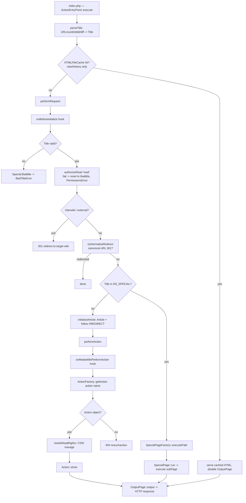

# Subsystem: Actions, Special Pages & Editing

> Part of the MediaWiki core engineering handbook. This document covers the
> **`index.php` web request path** — the "front door" for human web users.
> MW_VERSION 1.47.0-alpha. PHP >= 8.3.
>
> Foundation: read the root `AGENTS.md` and `includes/AGENTS.md` first. This
> document builds on the **service container** (`MediaWikiServices` /
> `ServiceWiring.php`) and the **hook system** (`HookContainer` / `HookRunner`)
> documented in the `service-container-and-config` and
> `hooks-and-extension-registration` sibling docs, and does not re-explain them.

## Responsibility & boundaries

This subsystem owns the **`index.php` entry point**: turning a browser navigation
into an HTTP response. Three concrete things live here:

1. **Request routing** (`includes/Actions/ActionEntryPoint.php`) — parse the URL
   into a `Title`, decide whether it is a special page or an ordinary article,
   resolve the `action`, run permission/redirect checks, and dispatch.
2. **Actions** (`includes/Actions/`) — things you *do to one existing page*:
   `view` (the default), `edit`, `history`, `delete`, `protect`, `rollback`,
   `watch`, `info`, etc. Each is an `Action` subclass selected by the `?action=`
   query parameter.
3. **Special pages** (`includes/SpecialPage/` + `includes/Specials/`) — pages in
   the `Special:` namespace that are *generated by code*, not stored as wiki
   content: `Special:RecentChanges`, `Special:Search`, `Special:UserLogin`, the
   ~40 maintenance "query pages", etc.

It also owns the two pieces of UI machinery that everything above leans on:

4. **The editing controller** (`includes/EditPage/` + the newer
   `includes/PageEdit/`) — the `action=edit` form, edit-conflict handling, the
   constraint/anti-abuse gate, and the handoff to the storage layer.
5. **HTMLForm** (`includes/HTMLForm/`) — the declarative form framework used by
   form-based actions and special pages.

**Where the boundaries are.** This subsystem is a *router and a set of
controllers*; it does almost no domain work itself. It hands off to:

- **Article view rendering** → `Article` / `WikiPage` → parser (`Article::view()`
  is called by `ViewAction`; the parser/content-transform and
  output-skins-resourceloader subsystems own what happens next).
- **Saving a revision** → `WikiPage::newPageUpdater()->saveRevision()` (the
  storage-revisions-content subsystem). EditPage builds the content; it does
  **not** write rows.
- **Permissions / blocks / login** → `Authority` / `PermissionManager` /
  `AuthManager` (the auth-permissions-sessions subsystem).
- **The Action API** (`api.php`, `includes/Api/`) is a *separate* entry point and
  a *sibling subsystem* — but note that `ApiEditPage` reuses the very same
  `EditPage` object for `action=edit` via the API. EditPage is shared; the
  routing in `ActionEntryPoint` is not.

`load.php`, `rest.php`, `api.php`, `thumb.php`, etc. are **not** routed through
`ActionEntryPoint` — they have their own entry-point classes.

## Internal structure (key files & their roles)

### Routing & action layer (`includes/Actions/`)

| File | Role |
|---|---|
| `ActionEntryPoint.php` | **The `index.php` handler** (`extends MediaWikiEntryPoint`). Owns `parseTitle()`, `performRequest()`, `tryNormaliseRedirect()`, `initializeArticle()`, `performAction()`. Marked `@internal For use in index.php`. |
| `Action.php` | Abstract base class for all actions. `@stable to extend`. Defines `show()`, `getName()`, `getRestriction()`, `needsReadRights()`, `requiresWrite()`/`doesWrites()`, `requiresUnblock()`, `checkCanExecute()`. |
| `FormlessAction.php` | "Just do something" actions (view, watch, rollback). One abstract method: `onView()`. `@stable to extend`. |
| `FormAction.php` | "Show a form, then act on it" actions (delete, protect). Wires an `HTMLForm`; abstract `onSubmit()` + `onSuccess()`. `@stable to extend`. |
| `ActionFactory.php` | Resolves an action name to an `Action` object via `ObjectFactory`. Holds `CORE_ACTIONS` (the built-in map) and merges `$wgActions`. Also computes the *effective* action name (`getActionName()`). Service: `ActionFactory`. |
| `ViewAction.php` | The default action. A thin wrapper that calls `Article::view()`. |
| `EditAction.php` / `SubmitAction.php` | `action=edit` / `action=submit`. Both `extends FormlessAction`; instantiate `EditPage` and call `edit()`. |
| `Hook/` | Action-related hook interfaces: `CustomEditorHook`, `GetActionNameHook`, `ActionModifyFormFieldsHook`, `ActionBeforeFormDisplayHook`, `InfoActionHook`, history hooks, watch hooks. |

Concrete actions in the same directory: `DeleteAction`, `HistoryAction`,
`InfoAction`, `ProtectAction`/`UnprotectAction`, `PurgeAction`, `RawAction`,
`RenderAction`, `RollbackAction`, `RevertAction`, `MarkpatrolledAction`,
`WatchAction`/`UnwatchAction`, `CreditsAction`, `McrUndoAction`/`McrRestoreAction`,
`FileDeleteAction`.

### Special pages (`includes/SpecialPage/` + `includes/Specials/`)

`SpecialPage/` holds the **base classes and the factory**; `Specials/` holds the
**~200 concrete core special pages** (`SpecialRecentChanges`, `SpecialSearch`,
`SpecialUserLogin`, …).

| File | Role |
|---|---|
| `SpecialPage.php` | Abstract base. `@stable to extend`. Lifecycle: `run()` → `beforeExecute()` → `execute($subPage)` → `afterExecute()`. Static helpers `getTitleFor()`, `getTitleValueFor()`. Permission helpers `checkPermissions()`, `userCanExecute()`, `requireLogin()`, `requireNamedUser()`, `checkLoginSecurityLevel()`. |
| `SpecialPageFactory.php` | **Registration + dispatch.** Holds `CORE_LIST`, merges `$wgSpecialPages`, fires `SpecialPage_initList`. Resolves aliases (`resolveAlias()`, `getLocalNameFor()`), instantiates (`getPage()` via `ObjectFactory`), and runs (`executePath()`, `capturePath()`). Service: `SpecialPageFactory`. |
| `UnlistedSpecialPage.php` | Subclass shortcut: `isListed()` returns false (works, but not shown on `Special:SpecialPages`). |
| `IncludableSpecialPage.php` | Subclass shortcut: `isIncludable()` returns true (can be transcluded with `{{Special:Foo/params}}`). |
| `RedirectSpecialPage.php` | Abstract base for special pages that redirect elsewhere; implement `getRedirect($subpage)`. Has `personallyIdentifiableTarget()` (T109724 leak guard). |
| `RedirectSpecialArticle.php` | `RedirectSpecialPage` specialized for redirects to an *article* (e.g. `Special:MyPage`), with a fixed allow-list of preserved query params. |
| `DisabledSpecialPage.php` | Concrete drop-in to **disable** a page: `DisabledSpecialPage::getCallback('Name', 'msg')` in `$wgSpecialPages`. |
| `FormSpecialPage.php` | Base for form-based special pages — wires `HTMLForm`. Implement `getFormFields()`, `onSubmit()`, optionally `onSuccess()`/`alterForm()`/`getDisplayFormat()`. |
| `QueryPage.php` (+ `PageQueryPage`, `ImageQueryPage`, `WantedQueryPage`) | Base for cached/expensive list queries (the maintenance-report family). Provides SQL plumbing, caching in miser mode, `formatRow()`. |
| `ChangesListSpecialPage.php` | Base for change-feed pages (RecentChanges, Watchlist): filter groups + `ChangesList`. |
| `ContributionsSpecialPage.php` | Base for paged contribution listings (`extends IncludableSpecialPage`). |
| `AuthManagerSpecialPage.php` / `LoginSignupSpecialPage.php` | Bases for auth flows; build an HTMLForm from `AuthenticationRequest`s and submit to `AuthManager`. See auth-permissions-sessions. |
| `Hook/` | `SpecialPage_initListHook`, `SpecialPageBeforeExecuteHook`, `SpecialPageAfterExecuteHook`, `SpecialPageBeforeFormDisplayHook`, `ChangesListSpecialPage*Hook`, `RedirectSpecialArticleRedirectParamsHook`. |

### Editing (`includes/EditPage/` + `includes/PageEdit/`)

| File | Role |
|---|---|
| `EditPage/EditPage.php` | The **edit controller / UI layer** (~4000 lines). `@newable`, `implements IEditObject`. Public entry `edit()`; also `importFormData()`, `attemptSave()`, `getExpectedParentRevision()`. Builds the edit form, parses the POST, and delegates the actual save. |
| `EditPage/IEditObject.php` | The `AS_*` save-status constants (`AS_SUCCESS_UPDATE`, `AS_SUCCESS_NEW_ARTICLE`, `AS_CONFLICT_DETECTED`, `AS_BLANK_ARTICLE`, `AS_SPAM_ERROR`, `AS_HOOK_ERROR`, …). |
| `EditPage/Constraint/` | The **constraint package** (`@since 1.36`, `@internal`): `EditConstraint` (abstract base), `EditConstraintRunner`, `EditConstraintFactory`, and ~16 concrete constraints (size, spam, read-only, authorization, the `EditFilterMergedContent` gate, etc.). |
| `EditPage/` helpers | `IntroMessageBuilder`, `PreloadedContentBuilder`, `PageEditingHelper`, `TextboxBuilder`, `TextConflictHelper`, `SpamChecker`, `TemplatesOnThisPageFormatter` — pieces being extracted out of the EditPage monolith. |
| `PageEdit/PageEdit.php` | The **extracted save engine** (`@since 1.47`, `@internal`). `EditPage` builds a `PageEditInputs` and calls `PageEdit::edit()`; `PageEdit::doEdit()` runs the constraint runners, resolves edit conflicts, and calls the storage layer. |
| `PageEdit/` value objects | `PageEditFactory` (service `_PageEditFactory`), `PageEditInputs`, `PageEditResult`, `PageEditStatus` (a `StatusValue<int>` carrying an `AS_*` code). |

> Heads-up for anyone last familiar with older MediaWiki: **the save/constraint/
> conflict logic has been moving out of `EditPage` into `MediaWiki\PageEdit`**
> (`@since 1.47`). The old `WikiPage::doUserEditContent()` call is gone; the
> persistence call is now `PageUpdater::saveRevision()`. `EditPage` is the UI; the
> EditPage class header literally warns: *"Surgeon General's Warning: prolonged
> exposure to this class is known to cause headaches, which may be fatal."*

### Forms (`includes/HTMLForm/`)

| File | Role |
|---|---|
| `HTMLForm.php` | The framework (`extends ContextSource`, `@stable to extend`). `factory()`, `setSubmitCallback()`, `prepareForm()`, `show()`, `trySubmit()`, `displayForm()`. Holds the `$typeMappings` registry (type string → field class). |
| `OOUIHTMLForm.php` | OOUI-rendered form (the established default style for special pages). |
| `CodexHTMLForm.php` | Codex-rendered form (`@since 1.41`; the newer WMF design system). |
| `HTMLFormField.php` | Abstract base for a single field (`getInputHTML()`, `validate()`). `@stable to extend`. |
| `Field/` | ~40 concrete field types (`HTMLTextField`, `HTMLSelectField`, `HTMLCheckField`, `HTMLUserTextField`, `HTMLTitleTextField`, …). |

## Main flows

### Flow 1 — `index.php` routing (the front door)

`ActionEntryPoint::execute()` → `performRequest()` is the spine. The decision
tree:



Key facts hiding in that diagram:

- **`Title` first, action second.** `parseTitle()` (in `ActionEntryPoint`) builds
  the `Title` from `title=`, or from `curid=`, or from `oldid=`/`diff=` (which can
  *override* the title for non-special pages), falling back to the main page. A
  malformed title becomes `Special:Badtitle`.
- **Special page vs. article is a namespace check.** `$title->isSpecialPage()`
  (i.e. `NS_SPECIAL`) routes to `SpecialPageFactory::executePath()`; everything
  else becomes an `Article` and goes through `performAction()`.
- **Read permission is checked twice on purpose.** Once early in
  `performRequest()` (to catch special pages and leak-proof the response by
  resetting `$context`/`$wgTitle` to `Special:Badtitle` on failure — T34276), and
  again inside `Article::view()`. The early reset is a deliberate
  information-leak defense.
- **`getActionName()` ≠ the raw `?action=`.** `ActionFactory::getActionName()`
  normalizes to lowercase, maps compatibility aliases (`historysubmit`→`view`,
  `editredlink`→`edit`), turns disabled actions into `nosuchaction`, fires the
  `GetActionName` hook, and forces `view` for anything that can't be a `WikiPage`
  (special pages). The *effective* action is cached on `RequestContext`.
- **Special pages only do "view".** A `?action=edit` on `Special:RecentChanges`
  is meaningless — special pages are reached via `executePath`, not the action
  dispatch.

### Flow 2 — Special page dispatch & registration

`SpecialPageFactory::executePath($title, $context)`:

1. Split the path into `name/subpage` on the first `/` (T4087 — subpages may
   themselves contain `/`).
2. `getPage($name)` → `resolveAlias()` (case-folds, spaces→underscores, maps
   localized alias → canonical) → `ObjectFactory::createObject()` on the spec.
   Unknown name → `404` + `nosuchspecialpage` error.
3. **Canonical-URL redirect** (GET only): if the requested name isn't the
   canonical local name, 301 to the canonical title. POST is *not* redirected
   (would lose the form data).
4. Inject context/hooks/content-language/factory into the page, then
   `$page->run($subpage)`.

`SpecialPage::run()` is `final`: it fires `SpecialPageBeforeExecute`, calls
`beforeExecute()` (return false to abort), then `execute($subPage)`, then
`afterExecute()` and `SpecialPageAfterExecute`. The default `execute()` calls
`setHeaders()` → `checkPermissions()` → `checkLoginSecurityLevel()` →
`outputHeader()`, so a subclass that calls `parent::execute()` gets permission
checks for free.

**Registration** is config-driven:

- Core pages live in `SpecialPageFactory::CORE_LIST` as ObjectFactory specs
  (`['class' => SpecialFoo::class, 'services' => [...]]`). Some are conditionally
  added in `getPageList()` (Search unless `$wgDisableInternalSearch`,
  email pages, `JavaScriptTest`, `EditRecovery`, …).
- `$wgSpecialPages` (declared `MainConfigSchema::SpecialPages`) is merged on top;
  this is what `LocalSettings.php` and the `SpecialPages` attribute in
  `extension.json`/`skin.json` populate (handled by
  `includes/registration/ExtensionProcessor.php`). The value may be a class-name
  string, a callable, an `[$obj, 'method']` callback, or a full ObjectFactory
  spec with `services` — all must yield a `SpecialPage`.
- The `SpecialPage_initList` hook fires **once** (the list is cached) and lets
  extensions add or *disable* pages conditionally.
- **Aliases / localization** come from `$specialPageAliases` in each
  `languages/messages/Messages*.php` (format: `canonical => [aliases...]`, first
  alias is the preferred local name). `getAliasList()` inverts this to
  `alias => canonical` and force-maps every canonical name to itself.

### Flow 3 — The edit flow

```mermaid
sequenceDiagram
    participant U as Browser
    participant EA as EditAction (FormlessAction)
    participant EP as EditPage (UI controller)
    participant PE as PageEdit (save engine, @since 1.47)
    participant CR as EditConstraintRunner(s)
    participant PU as WikiPage::PageUpdater (storage)

    U->>EA: GET/POST index.php?action=edit
    EA->>EA: onCustomEditor hook (extension may take over)
    EA->>EP: new EditPage(article); edit()
    EP->>EP: importFormData() — GET vs POST
    alt GET (or token fail / forced preview)
        EP->>EP: getContentObject() (preload/section/undo)
        EP->>U: showEditForm() — textbox + hidden fields + wpEditToken
    else POST with valid token & wpSave
        EP->>EP: attemptSave() -> internalAttemptSave()
        EP->>EP: build PageEditInputs
        EP->>PE: PageEditFactory::newPageEdit(inputs)->edit()
        PE->>CR: preliminary / new-page / existing-page / post-merge runners
        Note over CR: spam, read-only, authorization,<br/>page-size, EditFilterMergedContent, ...
        CR-->>PE: first not-OK PageEditStatus aborts
        PE->>PE: detect conflict (edittime/editRevId) + merge3
        PE->>PU: newPageUpdater()->setContent()->saveRevision()
        PU-->>PE: doEditStatus (AS_SUCCESS_* / conflict)
        PE-->>EP: PageEditResult (status)
        EP->>EP: handleStatus(): redirect on success,<br/>re-show form on conflict/error
        EP->>U: redirect to article OR re-render form
    end
```

Notable mechanics:

- **GET vs POST is decided by `formtype`.** `importFormData()` sets
  `$this->formtype` to `save` / `preview` / `diff` / `initial`. A POST that passes
  the token check yields `save`; a fresh GET yields `initial`.
- **CSRF.** The form embeds `wpEditToken` (`$user->getEditToken()`).
  `tokenOk()` calls `$user->matchEditToken()`. **On mismatch the save is not
  rejected outright — it is downgraded to a preview** (`$this->preview = true`),
  so the user sees their work and a "session expired" notice rather than losing
  it. (With `$wgRawHtml`, a bad token *suppresses* the preview to avoid an XSS
  vector.) HTMLForm has the same posture: GET forms skip the token; anonymous
  users bypass it (session tokens have no value for them); registered users must
  match.
- **Constraints gate the save**, run as four ordered `EditConstraintRunner`
  passes inside `PageEdit::doEdit()` (preliminary → new-page/existing-page →
  post-merge). A constraint returns a `PageEditStatus`: **OK = passed,
  not-OK = failed**, and the runner stops at the first failure. Constraints
  include `SpamRegexConstraint`, `ReadOnlyConstraint`, `AuthorizationConstraint`,
  `PageSizeConstraint`, `ChangeTagsConstraint`, `DefaultTextConstraint` (blank
  article), `NewSectionMissingSubjectConstraint`, and the all-important
  `EditFilterMergedContentHookConstraint`.
- **`EditFilterMergedContent` is the anti-abuse extension point.** It runs
  *after* content is merged but *before* `saveRevision()`. AbuseFilter,
  SpamBlacklist, and ConfirmEdit (CAPTCHA) hook here. A handler can set fatals on
  the by-reference `Status` and/or return false to abort the save; EditPage
  re-renders the form with the hook's error (or, for ConfirmEdit, a blank-error
  CAPTCHA prompt).
- **Edit-conflict detection** compares the page's current
  timestamp/`getLatest()` against the submitted `wpEdittime` / `editRevId`.
  Mismatch → attempt a 3-way merge (`ContentHandler::merge3` via
  `getExpectedParentRevision()`); on merge failure the status is
  `AS_CONFLICT_DETECTED`, `handleStatus()` re-shows the form, and
  `TextConflictHelper` renders the current text plus `wpTextbox2` (the user's
  original, read-only). A stale `wpEdittime` is tolerated for the *same user*; a
  stale `editRevId` conflicts even for the same user.
- **The storage handoff is exactly one place:**
  `WikiPage::newPageUpdater()->setContent(SlotRecord::MAIN, $content)` …
  `->saveRevision($comment, $flags)` inside `PageEdit::doEdit()`. Everything
  past that point belongs to the storage-revisions-content subsystem.

### Flow 4 — HTMLForm (used by Flow 2 and Flow 3's siblings)

You hand HTMLForm a **descriptor** (`fieldname => spec`) and a context; it
builds, displays, validates, and processes. `HTMLForm::show()`:

1. `prepareForm()` — load request data into field values.
2. `tryAuthorizedSubmit()` — check the form identifier + CSRF token
   (`requestIsAuthorized()`); if OK, `trySubmit()`.
3. `trySubmit()` — run every field's `validate()` (required + `validation-callback`),
   and if all pass, call the submit callback.
4. If the callback returns `true` or a good `Status`, success (caller does
   nothing more); otherwise `displayForm()` re-renders with errors.

The **submit-callback / trySubmit contract** is load-bearing and reused
everywhere (including `FormAction` and `FormSpecialPage`):

- `true` or a **good `Status`** → success.
- `false` → not submitted / cancelled.
- a fatal `Status`, an HTML `string`, or an `array` of message specs → failure
  (rendered as errors).

`HTMLForm::factory($displayFormat, …)` picks the class: `'ooui'` →
`OOUIHTMLForm`, `'codex'` → `CodexHTMLForm`, otherwise plain `HTMLForm` with
`'table'`/`'div'`/`'inline'`/`'raw'`. You cannot switch *into or out of* a
subclass format after construction — use `factory()`.

`FormSpecialPage` is the canonical glue: subclass it, implement `getFormFields()`
+ `onSubmit()`, optionally `onSuccess()`/`alterForm()`/`getDisplayFormat()`, and
its `execute()` builds the form via `factory()`, wires the callback, and shows it.

## State & data it owns

This subsystem is almost entirely **stateless request-handling code**. It owns no
database tables. What it "owns" is transient request state and a few caches:

- **`RequestContext`** is the request-scoped state bag it reads and mutates:
  `Title`, `WikiPage`, `OutputPage`, `User`/`Authority`, `WebRequest`, `Skin`,
  language, and the cached **effective action name** (`getActionName()`).
  `ActionEntryPoint` repeatedly resets `$context->setTitle()` (to `Special:Badtitle`
  on errors, to a redirect target, etc.) — that mutation *is* the routing.
- **The legacy `$wgTitle`, `$wgOut`, `$wgRequest`, `$wgLang` globals** are still
  written here for backward compatibility (`SpecialPageFactory::capturePath()`
  saves/restores them around transcluded special pages).
- **In-memory registries**: `SpecialPageFactory`'s page list + alias list
  (built once, hooks fired once) and `ActionFactory`'s `CORE_ACTIONS` + merged
  `$wgActions`.
- **Form/edit state** lives in request parameters, not persistent storage: the
  `wp*` fields (`wpTextbox1`, `wpSummary`, `wpEditToken`, `wpEdittime`,
  `wpStarttime`, `editRevId`, `wpMinoredit`, `wpAntispam` honeypot,
  `wpUnicodeCheck`, …). The `AS_*` codes in `IEditObject` are the vocabulary for
  the *result* of a save.
- **HTMLFileCache** (`$wgUseFileCache`) — an optional low-level HTML cache for
  `view`/`history` that `ActionEntryPoint` checks before doing any work (off in
  WMF production; a knob for third-party wikis).

## Dependencies (in / out)

**Depends on (out):**

- **Service container** (`MediaWikiServices`) — `ActionFactory`,
  `SpecialPageFactory`, `_PageEditFactory`, `_EditConstraintFactory`,
  `WikiPageFactory`, `PermissionManager`, `RevisionLookup`, `UrlUtils`,
  `LanguageConverterFactory`, `HTMLCacheUpdater`, `StatsFactory`, and (inside
  EditPage/constraints) a long tail of others. New code uses `ObjectFactory`
  specs so services are injected, not service-located.
- **Hooks** (`HookContainer`/`HookRunner`) — many extension points (see below).
- **Title / linking / namespaces** — `Title`, `NS_SPECIAL`, alias resolution.
- **Output / skins / ResourceLoader** — `OutputPage` is the universal sink;
  `ViewAction` → `Article::view()` produces the parsed body.
- **Auth / permissions / sessions** — `Authority::authorizeRead()`,
  `PermissionManager`, `AuthManager` (login/signup special pages),
  reauthentication (`checkLoginSecurityLevel`).
- **Storage / revisions / content** — `WikiPage::newPageUpdater()->saveRevision()`
  is the single save handoff; `ContentHandler::merge3` for conflict merges.
- **Parser / content transform** — preview rendering, `Article::view()`.

**Consumed by (in):**

- **`index.php`** instantiates `ActionEntryPoint` — the only production caller of
  the routing.
- **Skins** call `SpecialPageFactory` (`getUsablePages`, `getListedPages`,
  `getLocalNameFor`) and `Special:SpecialPages` to build navigation; the parser
  calls `executePath(..., $including=true)` / `capturePath()` for
  `{{Special:Foo}}` transclusion.
- **`ApiEditPage`** (the Action API) reuses `EditPage` directly (`importFormData()`
  + `attemptSave()`), bypassing the `edit()` UI flow.
- **Extensions** subclass `Action`, `SpecialPage`/`FormSpecialPage`, and
  `HTMLFormField`, and register via `$wgActions` / `$wgSpecialPages` /
  `extension.json`.

## Extension / customization points (actions, special pages, HTMLForm)

**Custom action** — add a class and register it:

- Subclass `FormlessAction` (just-do-it) or `FormAction` (form + submit), or
  `Action` directly. Implement `getName()` and `show()` (or `onView()` /
  `onSubmit()`+`onSuccess()`). Override `needsReadRights()`,
  `requiresWrite()`/`doesWrites()`, `requiresUnblock()`, `getRestriction()` as
  needed.
- Register in `$wgActions['myaction'] = MyAction::class;` (or an ObjectFactory
  spec, a callable, `false` to disable a core action, or `true` to use
  `MyactionAction` by convention). In `extension.json` use the `Actions`
  attribute (a plain config map merged into `$wgActions`).
- Content-model-specific actions: a `ContentHandler` can supply
  `getActionOverrides()`, which take precedence over `$wgActions` for that model.
- Hooks: `GetActionName` (rewrite the resolved action), `CustomEditor` (replace
  the editor for `action=edit`), `MediaWikiPerformAction` (intercept before
  dispatch).

**Custom special page** — add a class and register it:

- Subclass `SpecialPage` (or `FormSpecialPage` for a form, `IncludableSpecialPage`
  for transclusion, `UnlistedSpecialPage` to hide it, `RedirectSpecialPage` to
  redirect, `QueryPage`/`ChangesListSpecialPage`/`ContributionsSpecialPage` for
  the listing families). Call `parent::__construct('CanonicalName')` and implement
  `execute($subPage)`. Use constructor DI for services (the modern pattern — see
  `SpecialSearch`).
- Register via `$wgSpecialPages['CanonicalName'] = [ 'class' => …, 'services' =>
  [...] ];` or the `SpecialPages` attribute in `extension.json`.
- Add localized aliases in your extension's i18n alias file
  (`$specialPageAliases`). Override `getRestriction()` for a required right,
  `getGroupName()` for the `Special:SpecialPages` grouping, `isListed()` /
  `isIncludable()` as needed.
- Hooks: `SpecialPage_initList` (add/disable pages), `SpecialPageBeforeExecute` /
  `SpecialPageAfterExecute`, `SpecialPageBeforeFormDisplay`.

**HTMLForm** — the declarative path:

- Define a descriptor (`'type' => 'text' | 'select' | 'check' | 'user' | …`
  mapped through `HTMLForm::$typeMappings`, plus `label-message`, `required`,
  `default`, `validation-callback`, `section`, `hide-if`, …) and a submit
  callback. Use `HTMLForm::factory('ooui', $descriptor, $context)`.
- For per-field types, subclass `HTMLFormField` and reference it via `'class'`.
- Validation: `'required'` + `'validation-callback'` (returns `true` / error
  string / `StatusValue`). Errors are collected and re-displayed automatically.

## Invariants & gotchas

- **Action vs. special page is a frequent confusion.** Actions apply to *exactly
  one existing page* and are selected by `?action=`; special pages live in the
  `Special:` namespace and are reached via `SpecialPageFactory`, not the action
  dispatch. A special page effectively only ever runs "view".
- **`ActionFactory::getAction()` return values are tri-state:** an `Action`
  object (use it), `null` (unrecognized → `nosuchaction`), or `false`
  (explicitly disabled). A *missing class* is treated as disabled (logged, not
  thrown).
- **Disabled / unknown actions become `nosuchaction`** (404 in `performAction`).
  `historysubmit`→`view` and `editredlink`→`edit` are compatibility aliases.
- **Read permission is enforced before the title is exposed.** On failure
  `ActionEntryPoint` resets `$context`/`$wgTitle` to `Special:Badtitle` *before*
  rendering, to avoid leaking page existence via skins/`$wgTitle` (T34276); the
  same dance protects `Special:MyPage`-style redirects (T109724).
- **`resolveAlias()` is case-insensitive and folds spaces to underscores**, with
  a Turkish/Azerbaijani dotted-İ fallback (T288402). Canonical names always win
  alias conflicts; an alias never resolves to a *different* page's canonical name.
- **POST is never redirected to the canonical special-page URL** (would lose form
  data); GET is 301'd to canonical. `tryNormaliseRedirect()` likewise only
  normalizes `action=view` GETs with no extra params.
- **CSRF on edit fails *soft*:** a bad `wpEditToken` downgrades save→preview
  rather than discarding input. HTMLForm POST forms auto-embed `wpEditToken`;
  **GET forms and anonymous users skip the token** by design.
- **OutputPage coupling is pervasive.** Actions and special pages write to
  `$this->getOutput()` rather than returning a response; `ActionEntryPoint` calls
  `$output->output(true)` at the very end. If an action "produces nothing," check
  whether it wrote to OutputPage or returned a string that got dropped.
- **Includable special pages run with reduced context.** When transcluded
  (`{{Special:Foo}}`), `including()` is true, the page may be cached as an anon
  (`maxIncludeCacheTime()`), and `capturePath()` swaps the request globals; don't
  rely on per-user state in an includable page unless you override the cache TTL.
- **`EditPage` is a monolith mid-refactor.** Save logic now lives in
  `MediaWiki\PageEdit` (`@since 1.47`); `IEditConstraint`/`CONSTRAINT_PASSED`
  *no longer exist* — constraints return a `PageEditStatus` (OK = pass). Don't
  assume older method names: it's `displayPermissionStatus()` /
  `displayViewSourcePage()`, not `displayPermissionsError`; and
  `PageUpdater::saveRevision()`, not `WikiPage::doUserEditContent()`.
- **`EditPage`, `PageEdit`, the constraints, and `IEditObject` are `@internal`
  or `@newable` with caveats** — treat them as core-only. The `@stable to extend`
  contract for extensions is `Action`/`FormAction`/`FormlessAction`,
  `SpecialPage`/`FormSpecialPage`/`UnlistedSpecialPage`/`IncludableSpecialPage`/
  `RedirectSpecialPage`, and `HTMLForm`/`HTMLFormField` — *not* EditPage.
- **The `EditFilterMergedContent` hook is the abuse-filter seam.** It runs after
  merge, before save; returning false aborts. Anything touching spam/CAPTCHA/
  abuse belongs here, not in a constraint you add to core.

## How to make a typical change here

> Toolchain not present in this checkout. Commands below are the project's
> canonical commands from `composer.json` (**not run here**). After adding/moving
> a class, regenerate the autoloader: `php maintenance/run.php
> generateLocalAutoload` (enforced by `AutoLoaderStructureTest`).

**Add a special page (in core):**
1. Create `includes/Specials/SpecialMything.php` — `class SpecialMything extends
   SpecialPage`, constructor-inject services, `parent::__construct('Mything')`,
   implement `execute($subPage)` (call `parent::execute()` for the standard
   permission/header checks, or replicate them).
2. Add it to `SpecialPageFactory::CORE_LIST` as
   `'Mything' => [ 'class' => SpecialMything::class, 'services' => [...] ]`.
3. Add aliases to `languages/messages/MessagesEn.php` `$specialPageAliases`
   (`'Mything' => [ 'Mything' ]`) and a description message
   (`mything` key) in `languages/i18n/en.json` + `qqq.json`.
4. Regenerate `autoload.php`. Add a case/coverage to the special-page tests.
   *(In an extension, skip steps 2 — register via the `SpecialPages` attribute
   in `extension.json` and ship aliases in your i18n alias file.)*

**Add a custom action (in an extension):**
1. `class MyAction extends FormlessAction` (or `FormAction`); implement
   `getName()` + `onView()` (or `getFormFields()`/`onSubmit()`/`onSuccess()`).
   Set `needsReadRights()`/`doesWrites()`/`getRestriction()` correctly.
2. Register: `extension.json` `"Actions": { "myaction": "MyAction" }` (or
   `$wgActions['myaction'] = …` in `LocalSettings.php`).

**Tune the edit flow (add a save rule):** add a new `EditConstraint` subclass in
`includes/EditPage/Constraint/`, wire it through `EditConstraintFactory`, and add
it to the appropriate runner in `PageEdit::doEdit()` (preliminary /
new-page / existing-page / post-merge). Return a not-OK `PageEditStatus` carrying
an `AS_*` code to fail. For anti-abuse/spam, prefer the `EditFilterMergedContent`
hook over a new core constraint.

**Add a form to a special page:** subclass `FormSpecialPage`, implement
`getFormFields()` (descriptor) + `onSubmit()` + (optionally) `onSuccess()`; set
`getDisplayFormat()` to `'ooui'` (incumbent) or `'codex'` (newer). The base class
handles CSRF, validation, and rendering.

**Testing.** Run the relevant suites (config first):
`composer phpunit:config` then `composer phpunit` (the destructive integration
suite — never against a data-bearing wiki). The behavioral contracts are pinned
in `tests/phpunit/includes/SpecialPage/SpecialPageTest.php`,
`tests/phpunit/includes/SpecialPage/SpecialPageFactoryTest.php`,
`tests/phpunit/unit/includes/Actions/ActionFactoryTest.php`,
`tests/phpunit/includes/EditPage/EditPageTest.php`, and
`tests/phpunit/integration/includes/HTMLForm/HTMLFormTest.php`.

## Foundation

- **Foundation read first:** root `AGENTS.md`, `includes/AGENTS.md`,
  `docs/Hooks.md`, `docs/Injection.md`.
- **Sibling subsystems this one hands off to** (do not duplicate them):
  - `storage-revisions-content` — what `PageUpdater::saveRevision()` does.
  - `output-skins-resourceloader` — `OutputPage`, `Article::view()` rendering,
    skins that consume `SpecialPageFactory`.
  - `auth-permissions-sessions` — `Authority`/`PermissionManager`/`AuthManager`,
    the login/signup special pages, reauthentication.
  - `parser-and-content-transform` — preview rendering, `merge3`.
  - `title-linking-namespaces` — `Title`, `NS_SPECIAL`, alias resolution.
  - `action-api` / `rest-api` — sibling entry points; `ApiEditPage` reuses
    `EditPage`.
  - `hooks-and-extension-registration` — `extension.json` `Actions`/`SpecialPages`
    attributes, `ExtensionProcessor`.
  - `service-container-and-config` — `$wgActions`/`$wgSpecialPages` schema,
    `ActionFactory`/`SpecialPageFactory`/`_PageEditFactory` wiring.

### Open questions / genuine unknowns

- **OOUI vs. Codex as the recommended form style.** The code carries no explicit
  "use Codex" directive; `CodexHTMLForm` is `@since 1.41` and the WMF
  design-system direction, while OOUI is the incumbent default (and what
  `FormSpecialPage` special-cases). The forward direction is *inferred* as Codex;
  this is not a quoted project policy.
- **`CodexHTMLForm` stability contract** — its file header has `@since 1.41` but
  (as observed) no explicit `@stable to extend` marker, so its extension-contract
  status is unconfirmed.
- **The exact end-state of the EditPage → PageEdit extraction** (T157658). As of
  1.47 the save engine is in `MediaWiki\PageEdit`, but `EditPage` is still
  `@newable` and large; how much more moves, and whether `EditPage` itself
  becomes a service, is an active migration, not a settled design.
- **`ParametersHelper`** exists as a file in `includes/EditPage/` but its exact
  responsibilities were not traced in this pass (the other helpers —
  `IntroMessageBuilder`, `PreloadedContentBuilder`, `PageEditingHelper`,
  `TextboxBuilder` — were).
