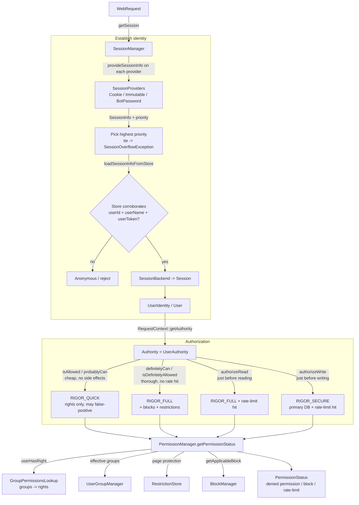
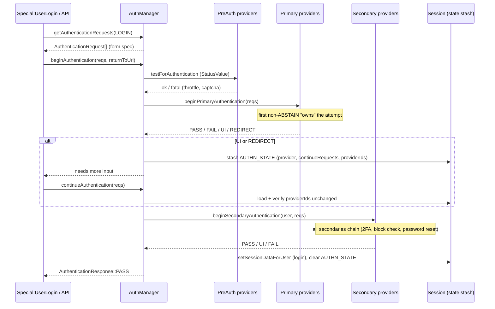

# Subsystem: Authentication, Permissions & Sessions

> Part of the MediaWiki core senior-onboarding handbook. Sibling subsystems are
> documented under `docs/handbook/subsystems/`. This document owns the **security
> spine** of the engine: who the user *is* (`User`/`UserIdentity`/`Session`), how
> they *authenticate* (`AuthManager`), what they *may do* (`Authority` /
> `PermissionManager`), and how they are *blocked* (`Block`). The global Security
> Model doc references this subsystem for mechanism; it owns the threat-model
> narrative. This doc is **defensive**: it describes how the system protects
> itself, not how to attack it.
>
> Reads it builds on (don't re-read): root `AGENTS.md`, `includes/AGENTS.md`,
> `docs/Injection.md`, `docs/Hooks.md`. Cross-refs into siblings:
> `service-container-and-config` (every service here is wired in
> `ServiceWiring.php`), `caching-deferred-jobs` (session store, rate-limit
> counters, expiry jobs), `actions-special-pages-editing` /
> `action-api` / `rest-api` (the consumers that must call into here before any
> write).

---

## Responsibility & boundaries

This subsystem answers four questions for every request:

1. **Who is acting?** — Establish an identity from the incoming `WebRequest`.
   `includes/Session/` turns cookies/tokens/headers into a verified `Session`,
   and that session yields a `UserIdentity`. `includes/User/` models the three
   *kinds* of identity (anonymous, temporary, named).
2. **Did they prove who they are?** — `includes/Auth/` (`AuthManager`) runs the
   pluggable login / account-creation / account-linking flows.
3. **Are they allowed to do X?** — `includes/Permissions/` exposes the modern
   **`Authority`** abstraction over `PermissionManager` (rights), `RestrictionStore`
   (per-page protection) and `RateLimiter` (throttling).
4. **Are they blocked from doing X?** — `includes/Block/` evaluates blocks against
   the action/target, and the permission layer consults it on every gated action.

**In scope:** the five directories `includes/User/`, `includes/Permissions/`,
`includes/Session/`, `includes/Auth/`, `includes/Block/`, plus the CSRF/edit-token
mechanism that lives across `Session/` and `User/`.

**Out of scope (owned elsewhere):** the password-hashing primitives
(`includes/Password/`), the email/confirmation plumbing (`includes/Mail/`), the
*storage* of actor IDs in revisions (`ActorStore`/`ActorNormalization` — touched
here only as the boundary where `UserIdentity` becomes a storage row), the
actual auth *providers* shipped by extensions (OAuth, CentralAuth, 2FA), and the
content/edit pipeline that *calls* `authorizeWrite` (see
`actions-special-pages-editing`).

**The boundary worth internalizing:** *application logic asks `Authority`, never
`User->isAllowed()` directly, and never trusts request-supplied identity without
the session store corroborating it.* Both of those are migrations-in-progress
(see "Invariants").

---

## Internal structure (key files & their roles)

### Permissions — the modern access-control surface

- **`Permissions/Authority.php`** — the interface (`@since 1.36`) that represents
  "the authority of the current execution context." This is *the* abstraction new
  code depends on. It exposes the full permission-check vocabulary (see "Main
  flows" for the semantics): `isAllowed` / `probablyCan` / `definitelyCan` /
  `isDefinitelyAllowed` / `authorizeAction` / `authorizeRead` / `authorizeWrite`,
  plus `getUser()`, `getBlock()`, and the identity trichotomy
  `isRegistered()`/`isTemp()`/`isNamed()`.
- **`Permissions/UserAuthority.php`** — the production `Authority` implementation,
  wrapping a `User`, the current `WebRequest`/UI context, `PermissionManager`,
  `RateLimiter` and `BlockErrorFormatter`. It is where the rigor ladder and
  rate-limit side-effects are actually wired (it maps each Authority method to a
  `PermissionManager::RIGOR_*` level and a rate-limit increment policy).
- **`Permissions/SimpleAuthority.php` / `UltimateAuthority.php`** — fixed-allow-list
  and allow-everything implementations, for system/maintenance actors and tests.
  `UltimateAuthority` is the "bypass all checks" actor; treat its use as a
  deliberate, audited decision.
- **`Permissions/PermissionManager.php`** (~66 KB) — the engine behind
  `UserAuthority`. Owns `getPermissionStatus()` (the canonical check),
  `userCan()`/`quickUserCan()`, `userHasRight()`/`userHasAnyRight()`/`userHasAllRights()`,
  `getUserPermissions()`, `isEveryoneAllowed()`, and `getApplicableBlock()` (the
  block↔action junction). Holds the `CORE_RIGHTS` and `CORE_IMPLICIT_RIGHTS`
  lists and the three rigor constants.
- **`Permissions/GroupPermissionsLookup.php`** — pure, config-only mapping of
  *groups → rights* from `$wgGroupPermissions` / `$wgRevokePermissions` /
  `$wgGroupInheritsPermissions`. No DB, no user. `getGroupPermissions(array $groups)`
  unions grants then subtracts revocations (revocation always wins).
- **`Permissions/RestrictionStore.php`** (`@since 1.37`) — per-page protection
  (the `page_restrictions` data): protection levels, expiry, cascading protection
  sources. Cached in-process and via WAN cache.
- **`Permissions/RateLimiter.php`** (`@since 1.39`) — throttling, backed by the
  `WRStats` library (counter buckets). `read` is hard-coded non-limitable for
  performance. Reads `$wgRateLimits` / `$wgRateLimitsExcludedIPs`.
- **`Permissions/PermissionStatus.php`** — a `StatusValue` subclass that carries
  *why* a check failed: the denied permission name, the offending `Block`, and a
  rate-limit-exceeded flag. `throwErrorPageError()` converts it into the right
  UI exception (`UserBlockedError` / `ThrottledError` / `PermissionsError`).

### Identity — the User model

- **`User/UserIdentity.php`** — the minimal read-only identity interface:
  `getId()`, `getName()`, `isRegistered()`, `equals()`. **Deliberately does not
  expose an actor ID** (since 1.37 that is a storage detail, fetched via
  `ActorNormalization`).
- **`User/UserIdentityValue.php`** — the immutable value-object implementation.
  Factories `newAnonymous()`, `newRegistered()`, `newExternal()`.
- **`User/User.php`** (~107 KB) — the legacy "god object." It **implements
  `Authority`, `UserIdentity` *and* `UserEmailContact`** simultaneously, and still
  carries DB reads/writes for the `user`, `user_properties`, `user_groups`,
  `user_newtalk`, `watchlist` and `block` tables. Its own docblock points new code
  at narrower replacements: `UserIdentityValue`, `Authority` via
  `RequestContext::getAuthority`, `UserOptionsManager`, `PermissionManager`,
  `BlockManager`, etc. Most of its permission methods are `@deprecated` thin
  shims over `Authority`/`PermissionManager`.
- **`User/UserFactory.php`** — the DI-friendly way to obtain `User` objects,
  replacing the `User::newFrom*` statics. `newFromName/Id/UserIdentity/Authority`,
  `newAnonymous`, `newTempPlaceholder`.
- **`User/UserIdentityUtils.php`** (`@since 1.41`) — defines the trichotomy
  authoritatively: `isTemp()` = name matches the temp pattern; `isNamed()` =
  `isRegistered() && !isTemp()`. `getShortUserTypeInternal()` returns
  `'anon' | 'temp' | 'named'`.
- **`User/UserNameUtils.php`** — name validation ladder
  (`NONE → VALID → USABLE → CREATABLE`) and `isTemp()`/`getCanonical()`.
- **`User/UserGroupManager.php`** (~39 KB) — *membership* management: explicit
  groups (`user_groups` table), implicit groups (`*`, `temp`/`user`,
  autopromotion), expiry (lazily enforced at read time, with `UserGroupExpiryJob`
  for cleanup), and the autopromote/`$wgAddGroups`/`$wgRemoveGroups` machinery.
  Feeds `GroupPermissionsLookup`.
- **`User/UserGroupMembership.php`** — the `(userId, group, expiry)` value object.
- **`User/TempUser/`** — temporary-account support (see "State & data" and the
  dedicated section below): `TempUserConfig` (interface), `RealTempUserConfig`,
  `TempUserCreator`, `Pattern` (username template), pluggable serial
  providers/mappings.
- **`User/BotPassword.php`** + `BotPasswordStore.php` — application-specific
  passwords, scoped by grants + restrictions, keyed by central user id.
- **`User/CentralId/`** — `CentralIdLookup` (cross-wiki identity; default
  `LocalIdLookup` makes central id == local id on a single wiki).

### Sessions — request → identity

- **`Session/SessionManager.php`** (~39 KB) — the service (`getSessionManager()`).
  Picks the winning session among providers, verifies it against the store,
  materializes `SessionBackend`s, and owns session-ID generation/validation.
- **`Session/Session.php`** — the **front object**, the modern replacement for
  PHP's `$_SESSION`. Per-request; delegates almost everything to the backend.
  Hosts the CSRF token API (`getToken`/`hasToken`/`resetToken`).
- **`Session/SessionBackend.php`** — the **shared workhorse** behind one or more
  `Session` fronts; owns persistence to the store, ID rotation, persist/unpersist.
- **`Session/SessionProvider.php`** — the abstraction: maps a `WebRequest` to a
  `SessionInfo`. Subclasses: `CookieSessionProvider` (the default),
  `ImmutableSessionProviderWithCookie` (abstract base for request-carried auth),
  `BotPasswordSessionProvider`.
- **`Session/SessionInfo.php`** / **`UserInfo.php`** — immutable value objects: a
  candidate session (with a *priority*) and its (possibly unverified) user.
- **`Session/CsrfTokenSet.php`** (`@since 1.37`) — the modern CSRF/edit-token API
  (`getToken`/`matchToken`/`matchTokenField`), replacing `User::getEditToken`.
- **`Session/Token.php`** — the CSRF token value object: an HMAC of
  `timestamp + salt` keyed by a per-session secret, with constant-time
  comparison and optional expiry.

### Authentication — the login flow

- **`Auth/AuthManager.php`** (~117 KB) — the authentication coordinator and entry
  point. Runs the Pre → Primary → Secondary provider pipeline across requests,
  stashing per-flow state in the session.
- **`Auth/AuthenticationProvider.php`** + the three subtype interfaces
  (`PreAuthenticationProvider`, `PrimaryAuthenticationProvider`,
  `SecondaryAuthenticationProvider`) and their `Abstract*` bases.
- **`Auth/AuthenticationRequest.php`** — a value object for a set of form fields
  (the building block both for rendering forms and for submitting data).
- **`Auth/AuthenticationResponse.php`** — the state-machine signal
  (`PASS/FAIL/ABSTAIN/UI/REDIRECT/RESTART`).
- Concrete providers shipped in core: `LocalPasswordPrimaryAuthenticationProvider`,
  `TemporaryPasswordPrimaryAuthenticationProvider`,
  `CheckBlocksSecondaryAuthenticationProvider`, `ThrottlePreAuthenticationProvider`,
  `ResetPasswordSecondaryAuthenticationProvider`, `Throttler` (the helper).

### Blocks — gating actions

- **`Block/BlockManager.php`** (~30 KB) — assembles the *applicable* block for a
  user+request from DB blocks, IP/range/autoblocks, system (proxy/DNSBL/soft-range)
  blocks, XFF-derived blocks, and the block cookie.
- **`Block/Block.php`** (interface) / **`AbstractBlock.php`** (base) — the
  "applies to X" contract: `appliesToRight`, `appliesToTitle`, `appliesToNamespace`,
  `appliesToUsertalk`, `isSitewide`, `getType`.
- **`Block/DatabaseBlock.php`** (stored, can autoblock, can be partial) /
  **`SystemBlock.php`** (ephemeral, IP-based, e.g. proxy/DNSBL) /
  **`CompositeBlock.php`** (strictest-wins combination of several blocks).
- **`Block/BlockRestrictionStore.php`** + `Restriction/` (`PageRestriction`,
  `NamespaceRestriction`, `ActionRestriction`) — partial-block targeting.
- **`Block/BlockTarget.php`** + `BlockTargetFactory.php` (`@since 1.44`) — the
  target abstraction (`UserBlockTarget`, `AnonIpBlockTarget`, `RangeBlockTarget`,
  `AutoBlockTarget`) with redaction for autoblocks.

---

## Main flows

### Flow A: request → session → user → Authority permission check

**The permission-check vocabulary** — the single most important thing to learn in
this subsystem. The methods form a deliberate ladder of *cost*, *thoroughness*,
and *side-effects*:

| Method | When to use | Rigor | Blocks? | Rate limit |
|---|---|---|---|---|
| `isAllowed($perm)` / `isAllowedAny`/`isAllowedAll` | "Is this right granted in general?" — UI decisions | rights only | no | no |
| `probablyCan($action, $page)` | "Should I offer this UI control?" — may false-positive | `RIGOR_QUICK` | no | no |
| `isDefinitelyAllowed($action)` / `definitelyCan($action, $page)` | "User *intends* to act but hasn't committed" — e.g. show edit page vs read-only warning | `RIGOR_FULL` | yes | **checks, does not increment** |
| `authorizeAction($action)` / `authorizeRead($action, $page)` / `authorizeWrite($action, $page)` | **Immediately before performing the action** | Action/Read = `RIGOR_FULL`, **Write = `RIGOR_SECURE`** | yes | **checks AND increments** |

The discipline this encodes (pinned by `UserAuthorityTest`):

- **`probablyCan` may produce false positives** — it is for deciding which buttons
  to render, never for access control.
- **Only the `authorize*` family has side effects** (incrementing the rate-limit
  counter). `probablyCan`/`definitelyCan` peek the limit but never consume it. So
  rendering a form a hundred times does not exhaust a user's edit quota; only the
  actual submit does.
- **`authorizeWrite` uses `RIGOR_SECURE`**, which consults the **primary DB** so a
  block or page-protection change cannot be missed due to replication lag. Reads
  use `RIGOR_FULL` (replica, lag-tolerant) on purpose, to avoid hammering the
  primary.
- **Reads are privileged**: `read` is non-limitable (RateLimiter short-circuits)
  and is never block-gated unless `$wgBlockDisablesLogin` is set.
- A `PermissionStatus` passed in as the aggregator captures *why* it failed (the
  permission, the `Block`, the rate-limit flag) so the UI can render the right
  message; pass `null` for a fast boolean.

**Inside `PermissionManager::getPermissionStatus()`** the check is a pipeline of
sub-checks chosen by action: `read` has its own whitelist path; `create`/`edit`
run quick-permission → hooks → namespace/special → site/user config →
page-restrictions → cascading-protection → action-permissions → user-block. With
`$short = true` it short-circuits on the first failure (the boolean path); with a
status aggregator it accumulates all failures.

**`getUserPermissions()`** is the rights-resolution core: effective groups
(`UserGroupManager`) → group rights (`GroupPermissionsLookup`) → `UserGetRights`
hook → intersect with the session's allowed rights (`getAllowedUserRights()`, how
OAuth/bot-password sessions *narrow* rights) → `UserGetRightsRemove` hook → if
`$wgBlockDisablesLogin` and the user is blocked, intersect down to anonymous
rights. Results are cached per-request keyed `u:<id>` / `anon:<name>`.

### Flow B: login (the AuthManager state machine)

Provider roles and ordering:

- **PreAuthenticationProvider** — gate-keeping *before* credentials are checked
  (per-IP throttle via `ThrottlePreAuthenticationProvider`, captcha). Returns a
  `StatusValue`; any fatal aborts the whole flow.
- **PrimaryAuthenticationProvider** — associates submitted data with an account.
  Multiple primaries are **alternatives**: the first non-`ABSTAIN` owns the
  attempt; if all abstain, login fails (`authmanager-authn-no-primary`). Type
  constants `TYPE_CREATE` / `TYPE_LINK` / `TYPE_NONE` declare what a primary can do.
- **SecondaryAuthenticationProvider** — runs *after* a primary identified the user.
  Secondaries **chain** (all run): second factor, sitewide-block check
  (`CheckBlocksSecondaryAuthenticationProvider`), forced password reset.

`AuthenticationResponse` is the state machine: `PASS` (done), `FAIL` (stop, no
login), `ABSTAIN` (this provider doesn't handle it), `UI` (need more input —
pause and stash), `REDIRECT` (bounce to a third party — pause and stash),
`RESTART` (third-party auth succeeded but no local user — feed into account
creation; AuthManager-internal). State lives in the session under
`AuthManager::authnState` (and the analogous keys for account creation/linking);
`continueAuthentication()` re-validates `providerIds` so a config/hook change
mid-flow fails safe rather than completing with a different provider set.

`securitySensitiveOperationStatus($operation)` is the re-authentication gate for
sensitive actions (changing email, etc.): returns `SEC_OK` / `SEC_REAUTH` /
`SEC_FAIL` based on how recently the user *interactively* authenticated
(`$wgReauthenticateTime`). A stolen session does not count as recent ownership
proof, because only interactive logins set the security level.

---

## State & data it owns

| Table | Owner | What |
|---|---|---|
| `user` | `User` / `UserFactory` | id, name, email, password hash, timestamps |
| `user_groups` | `UserGroupManager` | explicit group memberships + `ug_expiry` |
| `user_properties` | (`UserOptionsManager`, adjacent) | per-user options |
| `block` (formerly `ipblocks`) | `DatabaseBlockStore` | stored blocks |
| `ipblocks_restrictions` | `BlockRestrictionStore` | partial-block targeting |
| `bot_passwords` | `BotPasswordStore` | app passwords (central-id keyed) |
| `page_restrictions` | `RestrictionStore` | per-page protection |
| `actor` | (`ActorStore`, boundary) | actor IDs — storage layer, not on `UserIdentity` |

Non-DB state it owns:

- **Session store** (a `BagOStuff`/object cache, see `caching-deferred-jobs`):
  the serialized session blob = `data` (app key/values incl. CSRF token secrets)
  + `metadata` (`provider`, `userId`, `userName`, `userToken`, `remember`,
  `forceHTTPS`, `expires`, `persisted`). Non-persistent sessions are written
  **cache-only**, never to the shared backend.
- **Rate-limit counters** — `WRStats` buckets in the object cache.
- **Per-request caches** — `PermissionManager` rights cache, `UserAuthority`
  block + rate-limit-outcome cache, `RestrictionStore` page-restriction cache.

---

## Dependencies (in / out)

**Depends on (out):**

- `service-container-and-config` — every service here (`SessionManager`,
  `AuthManager`, `PermissionManager`, `BlockManager`, `UserFactory`,
  `UserGroupManager`, `RateLimiter`, `RestrictionStore`) is wired in
  `includes/ServiceWiring.php` and reads `$wg*` via `ServiceOptions` snapshots
  (e.g. `PermissionManager::CONSTRUCTOR_OPTIONS` lists `GroupPermissions`,
  `RevokePermissions`, `WhitelistRead`, `BlockDisablesLogin`, `RateLimits`, …).
- `database-rdbms` — `IConnectionProvider` for `user`/`block`/`user_groups`/… ;
  the **`RIGOR_SECURE` ↔ primary DB** relationship is a direct dependency on the
  read/replica split.
- `caching-deferred-jobs` — session store, rate-limit counters, WAN cache for
  restrictions/rights, and deferred jobs (`UserGroupExpiryJob`,
  `UserEditCountInitJob`, temp-account expiry).
- `title-linking-namespaces` — `PageIdentity`/`LinkTarget` are the targets of
  `probablyCan`/`authorize*`; namespace protection and `RestrictionStore` work in
  terms of `Title`/`NamespaceInfo`.
- `hooks-and-extension-registration` — extension points (see below).

**Consumed by (in):**

- `actions-special-pages-editing` — `RequestContext::getAuthority()` is the
  canonical accessor; actions/edit code must `authorizeWrite` before saving.
  `Special:UserLogin`, `Special:CreateAccount`, `Special:LinkAccounts`,
  `Special:ChangeEmail`, `Special:UserLogout` drive `AuthManager`.
- `action-api` — `ApiLogin`, `ApiClientLogin`, `ApiAMCreateAccount` (via
  `ApiAuthManagerHelper`); `api.php` requests can authenticate via
  `BotPasswordSessionProvider`. API modules check rights via `Authority`.
- `rest-api` — handlers check `Authority` and CSRF where relevant.
- Essentially **all** of core, transitively: `RequestContext::getUser()` →
  `User::newFromSession()` → `Session::getUser()`.

---

## Extension / customization points

> These are the *defensive* extension contracts — how to plug in auth/rights/
> blocks the supported way. Mechanism only; the threat model is the Security
> Model doc's.

- **Authentication providers** — register via `$wgAuthManagerAutoConfig`.
  Implement one of `PreAuthenticationProvider` / `PrimaryAuthenticationProvider` /
  `SecondaryAuthenticationProvider` (extend the matching `Abstract*` base). This
  is the supported way to add a login method, an extra pre-check, or a second
  factor. **Do not call `AuthManager` directly** to build your own login page —
  its own docblock warns this "will very likely end up in security
  vulnerabilities"; subclass `AuthManagerSpecialPage` or use the
  `clientlogin`/`createaccount` API. This provider model is the modern replacement
  for the old single-`$wgAuth` `AuthPlugin` (one global auth backend → an ordered,
  multi-step, multi-factor pipeline). *[Inference: the "replaced AuthPlugin"
  framing is MediaWiki history, not stated verbatim in these files; the structural
  evidence is the provider-pipeline design.]*
- **Rights** — declare a new right in `$wgAvailableRights`, grant it to groups via
  `$wgGroupPermissions`, add `right-<name>` / `action-<name>` i18n messages
  (`languages/i18n/en.json` + `qqq.json`). Core's own rights are in
  `PermissionManager::CORE_RIGHTS`; implicit (non-group) rights in
  `CORE_IMPLICIT_RIGHTS` / `$wgImplicitRights`.
- **Groups** — `$wgGroupPermissions` (group→rights), `$wgRevokePermissions`
  (always-wins revocation), `$wgGroupInheritsPermissions` (inheritance),
  `$wgAddGroups`/`$wgRemoveGroups` (who may assign), `$wgAutopromote`/
  `$wgAutopromoteOnce` (automatic membership, e.g. `autoconfirmed`).
- **Session providers** — `$wgSessionProviders` (instantiated by `ObjectFactory`).
  Implement `SessionProvider`; choose the two capability flags carefully
  (`persistsSessionId()`, `canChangeUser()`) — cookie-style = both true; request-
  carried auth (SSL cert, OAuth) = both false, via `ImmutableSessionProviderWithCookie`.
- **Hooks** — `GetUserPermissionsErrors`/`getUserPermissionsErrorsExpensive`,
  `UserGetRights`/`UserGetRightsRemove`, `UserIsBlockedFrom`/`GetUserBlock`,
  `SecuritySensitiveOperationStatus`, `SessionCheckInfo`/`SessionMetadata`,
  `UserEffectiveGroups`/`GetAutoPromoteGroups`. See `docs/Hooks.md`.
- **Central identity** — extend `CentralIdLookup` (e.g. CentralAuth) for wiki-farm
  identity; default is `LocalIdLookup`.

### How to make a typical change here

- **Add a permission/right:** add the right name to `$wgAvailableRights` (or
  `$wgImplicitRights` if it isn't group-controlled), grant it in
  `$wgGroupPermissions['<group>']['<right>'] = true`, add `right-<right>` and
  (if it gates a page action) `action-<right>` messages to `en.json`/`qqq.json`.
  Then gate the code path with `$authority->isAllowed('<right>')` (UI) /
  `$authority->authorizeWrite('<right>', $page)` (the actual write).
- **Check a permission the modern way:** obtain the `Authority` from
  `RequestContext::getAuthority()` (or an injected `Authority`), then:
  `probablyCan` to decide whether to show a control; `definitelyCan` /
  `isDefinitelyAllowed` to decide whether to show a form vs a read-only warning;
  `authorizeRead` / `authorizeWrite` *immediately before* the read/write. Never
  reach for `User->isAllowed()` / `PermissionManager` directly in new code, and
  never gate a write on `probablyCan`.
- **Add an authentication provider:** pick the type (Pre for pre-checks, Primary
  for a credential mechanism, Secondary for post-identification steps), extend the
  `Abstract*` base, implement `getUniqueId()` + `getAuthenticationRequests()` + the
  begin/continue methods returning the right `AuthenticationResponse`, register in
  `$wgAuthManagerAutoConfig`. Honor the existence-non-leak invariant (return the
  same failure for "no such user" as for "wrong password").
- **Remember:** after adding/moving any class, regenerate `autoload.php`
  (`php maintenance/run.php generateLocalAutoload`); add new services to
  `ServiceWiring.php` + a `MediaWikiServices` getter (see
  `service-container-and-config`).

---

## Temporary accounts (TempUser) — the notable recent addition

Temporary accounts are a privacy feature stabilizing around MW 1.39–1.42 (current
tree is 1.47.0-alpha). The motivation *[inference, strongly implied by the design
in `UserIdentityUtils` + `TempUser/`]*: stop recording the **IP address** of
unregistered editors as the public actor. Instead, an anonymous visitor performing
a qualifying action (e.g. `edit`) gets an auto-created pseudonymous account with a
pattern name like **`~2024-1`** (prefix `~`, year, serial), so their edits are
attributed to that handle rather than their IP.

Key contracts:

- **Three user kinds, not two.** `isRegistered()` is `id != 0` and is **true for
  both temp and named users**. The temp/named split is purely the name-pattern
  test in `UserIdentityUtils::isTemp()` / `UserNameUtils::isTemp()`. So:
  anonymous = `!isRegistered()`; temp = `isRegistered() && isTemp()`; named =
  `isRegistered() && !isTemp()` = `isNamed()`.
- **Config** is `$wgAutoCreateTempUser`, surfaced via `TempUserConfig`:
  `isEnabled()` (creating new temp accounts), `isKnown()` (a superset — recognize
  existing temp accounts even after disabling creation), `isTempName()`,
  `isReservedName()` (deny *manual* creation that would collide),
  `isAutoCreateAction()`, `getMatchCondition()` (LIKE/NOT-LIKE so SQL queries can
  include/exclude temp accounts).
- **Creation** goes through `TempUserCreator` → `AuthManager::autoCreateUser(...,
  AUTOCREATE_SOURCE_TEMP)`. Username acquisition reserves a serial in the DB
  (pluggable `SerialProvider`), maps it to a display serial (pluggable
  `SerialMapping`, supporting obfuscation), and double-checks for collisions via
  `CentralIdLookup` because serial acquisition is not guaranteed collision-safe.
  IP-based throttles guard both name acquisition and creation.
- **Soft blocks treat temp like anon.** `BlockManager` uses
  `$applySoftBlocks = !isNamed($user)`, so temp (and anon) users are still caught
  by IP/soft/range blocks.
- **AuthManager dissociates temp from new permanent accounts** during account
  creation/login (the temp session is invalidated and switched to anonymous) so a
  later registration is not linked back to the temp identity.

---

## Invariants & gotchas (security-relevant, defensive)

These are the must-not-break facts. Several are enforced by tests
(`SessionManagerTest`, `UserAuthorityTest`, `AuthManagerTest`, `BlockManagerTest`).

1. **Corroborate, don't trust.** Request-supplied identity (a username cookie) is
   *unverified* until the session **store** confirms it. `loadSessionInfoFromStore`
   rejects on user-ID mismatch, name mismatch, anon↔non-anon mismatch, and
   **user-token mismatch**, and an unverified user with no store metadata fails
   ("probably just a session timeout"). `SessionBackend` *refuses to construct* a
   session for an unverified user. Verified identity (OAuth, SSL cert, matching
   token) is accepted; everything else degrades to anonymous.
2. **Always authorize via `Authority` immediately before a write**, using
   `authorizeWrite` (which uses `RIGOR_SECURE` / primary DB and increments the rate
   limit). Gating a write on `probablyCan`/`isAllowed` is a bug — those are UI-only
   and may false-positive, skip blocks, and skip rate limits.
3. **The rate limit is consumed only by `authorize*`** — exactly once per action
   per request (the limit cache dedupes peeks vs increments). Don't call
   `authorizeWrite` speculatively.
4. **Revocation always wins** in group→rights resolution
   (`$wgRevokePermissions` overrides `$wgGroupPermissions`, including across
   inheritance). `isEveryoneAllowed` returns false if a right is revoked anywhere.
5. **Sessions narrow rights, never widen them.** `getAllowedUserRights()` (OAuth,
   bot passwords) is `array_intersect`ed with the user's group rights — a scoped
   session can only have *fewer* rights than the underlying account.
6. **Don't leak account existence.** `LocalPasswordPrimaryAuthenticationProvider`
   returns the *same* failure for "no such user" as for "wrong password"
   (T134100). Normalized usernames and third-party auth results must not be shown
   to users (they can leak private data, e.g. an email→username mapping).
   `failReasons` exists to send the truth to *extensions* (e.g. CheckUser) without
   leaking it to the client.
7. **Re-auth for sensitive operations**, and only *interactive* logins count as
   recent ownership proof. `securitySensitiveOperationStatus` downgrades
   `REAUTH → FAIL` when re-authentication is impossible.
8. **CSRF tokens are per-session-secret HMACs with constant-time comparison.**
   The *secret* lives in the session (`wsTokenSecrets`); the emitted token is
   `HMAC(timestamp+salt, secret)`. `Token::match` uses `hash_equals` and can
   enforce a max-age. Anonymous users get a fixed `LoggedOutEditToken` (there is no
   session secret to bind to). New sessions pre-seed the default token secret to
   avoid a replication race on first save (T279664). Use **`CsrfTokenSet`** in new
   code, not `User::getEditToken`.
9. **Block cookies are HMAC-signed** with `$wgSecretKey` (tampered → ignored),
   capped at 24h expiry. IP/range cookie blocks apply only to anon users; user
   cookie blocks only for autoblocking blocks. Without a secret key the raw id is
   trusted (T152951 — set a secret key).
10. **Autoblocks must not leak the underlying IP.** XFF block lookups explicitly
    *exclude* autoblocks so a spoofed `X-Forwarded-For` cannot reveal an
    autoblocked user's IP (T285159). Autoblock targets are never user-creatable and
    are redacted via `AutoBlockTarget` / `getRedactedTarget()`.
11. **`hideuser`/suppress** hides the username everywhere and disables the
    talk-page exemption shortcut when the user is hidden.
12. **`$wgBlockDisablesLogin`** turns any block into an effective login-disable: a
    blocked user is stripped down to the rights an anonymous user has. This is
    computed *after* the rights hooks (so exemptions are honored) and guards against
    an infinite loop where `GetUserBlock` handlers themselves check permissions
    (T384197 / T129738).
13. **Partial vs sitewide blocks.** Blocks default to **sitewide**. Base
    "applies to X" predicates reduce to `isSitewide()`; only `DatabaseBlock`
    consults `BlockRestrictionStore`. `appliesToRight('edit')` returns *null*
    (unsure) deliberately, so action-blocks take precedence while title-based
    partial-block exemptions still take effect for edit.
14. **`getBlock` caller contract:** if a user is IP-block-exempt, the caller must
    pass `$request = null` (so IP-derived blocks are not assembled). `UserAuthority`
    / `PermissionManager::getApplicableBlock` handle this; the deprecated
    `getUserBlock` did the exempt check itself.
15. **Cross-wiki safety:** every identity/block/target is a `WikiAwareEntity`;
    `assertWiki()` guards prevent mixing a value object from one wiki into another.
16. **`User` is being dismantled.** Its permission methods are deprecated shims
    over `Authority`. Don't add logic to `User`; add it to the narrow service and
    route through `Authority`.

---

## Foundation

- **Service wiring & config** (where everything here is registered and gets its
  `$wg*` values): `docs/handbook/subsystems/service-container-and-config.md`,
  `docs/Injection.md`, `includes/ServiceWiring.php`,
  `includes/MainConfigSchema.php`.
- **Hooks** (the extension points listed above): `docs/Hooks.md`,
  `docs/handbook/subsystems/hooks-and-extension-registration.md`.
- **The read/replica split** that `RIGOR_FULL` vs `RIGOR_SECURE` rides on:
  `docs/database.md`, `docs/handbook/subsystems/database-rdbms.md`.
- **Consumers** that must call into this subsystem before acting:
  `docs/handbook/subsystems/actions-special-pages-editing.md`,
  `action-api.md`, `rest-api.md`.
- **Targets of permission checks:**
  `docs/handbook/subsystems/title-linking-namespaces.md`.
- **Session store / rate-limit counters / expiry jobs:**
  `docs/handbook/subsystems/caching-deferred-jobs.md`.

### Open questions / genuine unknowns

- The `SessionStore` implementations (`SingleBackendSessionStore`,
  `MultiBackendSessionStore`) and `JwtSessionCookieHelper` were identified by
  filename/usage but not read in depth here; the JWT-based session cookie path
  (`SessionManager::getJwtData`/`validateJwtSubject`, `JWT_SUB_ANON`) is newer
  (1.45-era) and its full rollout/intent is not documented in the files read.
- `ServiceWiring.php` itself was not opened in this pass — the exact factory
  closures and option lists for each service are stated from the classes'
  `CONSTRUCTOR_OPTIONS`, not from the wiring (the toolchain/`vendor/` is absent,
  per the environment constraint, so nothing here was executed).
- Whether the "TempUser replaced IP-as-actor" framing is the *official* stated
  motivation (vs. inferred from the design) was not confirmed against a
  Phabricator task in this pass.
