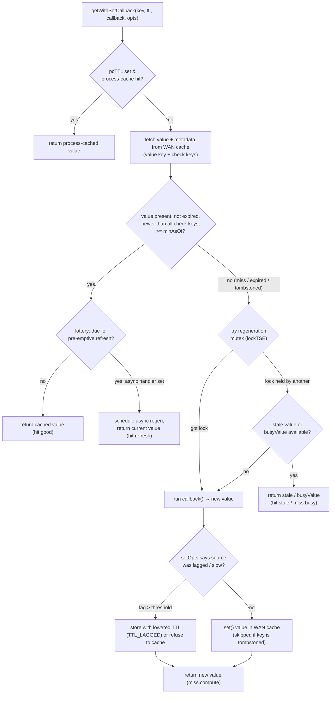

# Subsystem: Caching, Deferred Updates & Job Queue

> Part of the MediaWiki core senior-onboarding handbook. Scope: the performance
> infrastructure that lets MediaWiki run at Wikipedia scale — the multi-tier
> object-cache stack (`BagOStuff` / `WANObjectCache`), the high-value derived
> caches (ParserCache, MessageCache, LinkCache, HTMLFileCache), deferred updates,
> the job queue, and PoolCounter stampede protection.
>
> Authoritative source docs (read them; this page assumes them):
> `docs/memcached.md`, `docs/deferred.txt`, `includes/libs/objectcache/README.md`,
> `includes/JobQueue/README.md`.
> Foundation: root `AGENTS.md`, `includes/AGENTS.md`, `docs/Injection.md`,
> `docs/database.md` (the cache and the DB are joined at the hip — see
> "replication-lag interplay" below).
>
> Siblings this page leans on: `database-rdbms.md` (transaction rounds, replica
> lag, `IConnectionProvider`), `parser-and-content-transform.md` (ParserCache is
> *its* output cache), `localisation.md` (MessageCache loads the `MediaWiki:`
> namespace), `title-linking-namespaces.md` (LinkCache, LinksUpdate),
> `service-container-and-config.md` (everything here is wired in `ServiceWiring`).
> The global **Performance** doc references this page for the *how*.

---

## Responsibility & boundaries

This subsystem answers four related questions:

1. **Where do I put a computed value so I don't recompute it?** — the object-cache
   tiers (`includes/libs/objectcache/`, `includes/ObjectCache/`).
2. **How do I cache a value *correctly* when there are many servers in many
   datacenters and a replicated, lagged database underneath?** — `WANObjectCache`.
   This is the crown jewel; most of this page is about getting it right.
3. **How do I do slow work without making the user wait?** — deferred updates
   (`includes/Deferred/`) run after the HTTP response is flushed; the job queue
   (`includes/JobQueue/`) runs work in a separate process, later.
4. **How do I stop a thousand web servers from all regenerating the same expensive
   thing at once?** — PoolCounter (`includes/PoolCounter/`) and `WANObjectCache`'s
   own mutex.

### Two hard boundaries

- **`includes/libs/objectcache/` is a standalone library.** It is mirrored as the
  Composer package **`wikimedia/objectcache`** and lives in the
  `Wikimedia\ObjectCache\` namespace. Like `rdbms`, it **must stay
  framework-agnostic**: no `$wg*` globals, no `MediaWikiServices`, no `wf*()`.
  Config arrives via constructor params. The MediaWiki-specific wiring lives
  *outside* the library, in `includes/ObjectCache/` (`ObjectCacheFactory`,
  `SqlBagOStuff`) and `includes/ServiceWiring.php`. If you want a `$wg` value
  inside `includes/libs/objectcache/`, you are in the wrong file.
- **A cache is not a database.** WANObjectCache data "should be treated as equally
  up-to-date to data from a replica database, and is thus essentially subject to
  the same replication lag" (`WANObjectCache.php` class doc). Never read the cache
  to decide a write to a source store, except for immutable data.

---

## The cache tier model

There are **four access scopes** a cache can have. The single clearest statement
is the `BagOStuff` class doc (`includes/libs/objectcache/BagOStuff.php`):

| Scope | Backing | Sharing / consistency | MediaWiki name |
|---|---|---|---|
| (a) one PHP process | PHP array (`HashBagOStuff`) | none — dies with the request | `getLocalServerInstance` falls back here in CLI; LinkCache, MessageCache tier 1 |
| (b) one app server | APCu (or SQLite) | per-server, **not replicated** | **local server cache** (`LocalServerObjectCache`) |
| (c) all servers in one datacenter | memcached or MySQL | shared in the DC, **not cross-DC** | **local cluster cache** (`getLocalClusterInstance`) |
| (d) all servers in all datacenters | mcrouter / dynomite / DB | replicated, eventually consistent | **main stash** (`MainObjectStash`); WAN cache wraps (c) and *broadcasts purges* to reach (d) |

Picking the right tier is the first correctness decision. The rules of thumb:

- **Local server cache (APCu)** — for *very hot* keys where a per-server copy is
  fine and slight staleness across servers is acceptable. It is **not shared**;
  every web server has its own copy and there is no cross-server invalidation
  except by TTL or by an external check key. In CLI it is an `EmptyBagOStuff`.
  Wired as the `LocalServerObjectCache` service.
- **Local cluster cache** — shared *within one DC*. Use for per-cluster
  coordination: rate-limit counters, regeneration mutexes. Configured by
  `$wgMainCacheType`. This is also the BagOStuff that **`WANObjectCache` wraps**.
- **WAN cache (`MainWANObjectCache`)** — the cache-aside read-through layer for
  derived data. Reads/writes hit the local DC's cluster cache; **purges are
  broadcast to all DCs**. This is what you almost always want for "cache a value
  derived from the DB." Returns a `WANObjectCache`, *not* a `BagOStuff`.
- **Main stash (`MainObjectStash`, `$wgMainStash`)** — cross-DC replicated,
  "Last Write Wins" eventual consistency (a PA/EL system). For lightweight data,
  both ephemeral and permanent, that genuinely must be visible in all DCs. Default
  `CACHE_DB`. Tolerate evictions and temporary inter-DC inconsistency; avoid
  writing to it during non-POST requests (CDN routes POSTs to the primary DC).
- **MicroStash (`$wgMicroStashType`)** — ephemeral (seconds/minutes), high write
  volume, **TTL must be respected before eviction** (unlike LRU caches). Used by
  the rate limiter and `ChronologyProtector`.

### `CACHE_*` constants → backends

Defined in `includes/Defines.php`; resolved by `ObjectCacheFactory::newFromId()`:

| Constant | Backend |
|---|---|
| `CACHE_NONE` (0) | `EmptyBagOStuff` (no-op) |
| `CACHE_DB` (1) | `SqlBagOStuff` (the `objectcache` DB table) |
| `CACHE_ANYTHING` (-1) | first real cache among `$wgMainCacheType`, `$wgMessageCacheType`, `$wgParserCacheType`, else `CACHE_DB`, else `CACHE_NONE` if storage is disabled (installer) |
| `CACHE_ACCEL` (3) | APCu (`APCUBagOStuff`), or `EmptyBagOStuff` if APCu absent |
| `CACHE_MEMCACHED` | `MemcachedPhpBagOStuff` (alias) |
| `CACHE_HASH` | `HashBagOStuff` (in-process, mostly testing) |

`$wgObjectCaches` is the registry mapping cache IDs → class+params. The
purpose-based settings (`$wgMainCacheType`, `$wgParserCacheType`,
`$wgMessageCacheType`, `$wgMainStash`, `$wgMicroStashType`) point at IDs in it.
**Default `$wgMainCacheType` is `CACHE_NONE`** — a stock install does not cache in
memcached; you must opt in. This is why a freshly installed wiki "works but is
slow": all the WAN-cache machinery is running against an `EmptyBagOStuff`.

---

## Internal structure (key files & their roles)

### Object cache — the library (`includes/libs/objectcache/`)

| File | Role |
|---|---|
| `BagOStuff.php` | The abstract key-value interface (`@stable to extend`). `get/set/add/merge/delete`, `lock/unlock/getScopedLock`, `makeKey/makeGlobalKey`, `incrWithInit`, durability QoS. |
| `WANObjectCache.php` | **The crown jewel.** Multi-DC cache-aside layer with `getWithSetCallback`, tombstones, check keys, mutex/interim values. ~3000 lines. |
| `MultiWriteBagOStuff.php` | Wraps several BagOStuffs as tiers (e.g. memcached in front of SQL); writes to all, reads top-down, backfills on `READ_VERIFIED`. |
| `CachedBagOStuff.php` | Wraps one BagOStuff with an in-process memory cache. |
| `MemcachedBagOStuff.php` (+ `…PhpBagOStuff`, `…PeclBagOStuff`) | memcached backends; 250-char key limit handling, mcrouter routing prefix. |
| `RedisBagOStuff.php`, `RedisConnectionPool.php` | Redis backend. |
| `HashBagOStuff.php` | In-process array (per request). `EmptyBagOStuff.php` — no-op. `APCUBagOStuff.php` — per-server APCu. |
| `MapCacheLRU.php` | Bounded in-process LRU map (used heavily by the derived caches; not a BagOStuff). |

### Object cache — the MediaWiki wiring (`includes/ObjectCache/`)

| File | Role |
|---|---|
| `ObjectCacheFactory.php` | Service that turns `CACHE_*` ids / `$wgObjectCaches` entries into `BagOStuff` instances; `getInstance`, `getLocalServerInstance`, `getLocalClusterInstance`. |
| `ObjectCache.php` | Legacy static facade, **deprecated** (≥1.42) — forwards to the factory. New code injects the factory or the named services. |
| `SqlBagOStuff.php` | `CACHE_DB`/`$wgMainStash` default backend; stores rows in the `objectcache` table (`keyname`, `value`, `exptime`). Probabilistic GC on write. |

### Derived caches (`includes/Cache/`, plus parser/language)

| File | Role |
|---|---|
| `includes/Parser/ParserCache.php` | Cache of parsed `ParserOutput` for latest revisions. Highest-value cache. BagOStuff-backed (`$wgParserCacheType`). |
| `includes/Parser/ParserCacheFactory.php` | Hands out named ParserCache / RevisionOutputCache instances. |
| `includes/Language/MessageCache.php` | Three-tier cache of `MediaWiki:`-namespace UI messages per language. |
| `includes/Page/LinkCache.php` | Per-request page-existence/metadata cache (+ optional WAN tier for transclusion targets). |
| `includes/Cache/HTMLFileCache.php`, `FileCacheBase.php` | On-disk full-HTML cache for anonymous views (`$wgUseFileCache`). |
| `includes/Cache/BacklinkCache.php`, `BacklinkCacheFactory.php` | "What links here" results + partitioning for job fan-out. |
| `includes/Cache/HTMLCacheUpdater.php` | Schedules CDN + file-cache purges for a set of titles. |

### Deferred updates (`includes/Deferred/`)

| File | Role |
|---|---|
| `DeferredUpdates.php` | The static facade: `addUpdate`, `addCallableUpdate`, `doUpdates`, `tryOpportunisticExecute`. PRESEND/POSTSEND stages. |
| `DeferrableUpdate.php` / `DeferrableCallback.php` | Base interface (`doUpdate()`) + origin name. |
| `DeferredUpdatesScope*.php` | The real engine: per-stage queues, sub-queues, merge logic, transaction rounds, job-queue fallback. |
| `DataUpdate.php` | Base for "secondary data" updates; carries a transaction ticket. |
| `EnqueueableDataUpdate.php` | Bridge to the job queue: `getAsJobSpecification()` — used as the **retry mechanism** when a deferred update fails. |
| `MergeableUpdate.php` | Collapse duplicate updates of the same class (`SiteStatsUpdate`, `CdnCacheUpdate`, …). |
| `TransactionRoundAwareUpdate.php`, `…DefiningUpdate.php`, `AutoCommitUpdate.php`, `AtomicSectionUpdate.php` | DB-transaction interaction strategies. |
| `LinksUpdate/LinksUpdate.php` | The canonical secondary-data update: rewrites `pagelinks`/`templatelinks`/`categorylinks`/… after an edit. |
| `RefreshSecondaryDataUpdate.php` | Orchestrates the on-edit secondary updates; degrades to a single `refreshLinks` job on failure. |

### Job queue (`includes/JobQueue/`)

| File | Role |
|---|---|
| `JobQueueGroup.php` | The caller-facing entry: `push()` / `lazyPush()` / `pop()`. One group per wiki/domain. |
| `JobQueueGroupFactory.php` | Memoizes one group per domain; guards against bogus foreign wikis. |
| `JobQueue.php` | One queue per job *type*; `push/batchPush`, `pop`, `ack`, root-job dedup. |
| `Job.php` / `RunnableJob.php` / `GenericParameterJob.php` | The job base class + interfaces; `run()`, `allowRetries()`, dedup info. |
| `IJobSpecification.php` / `JobSpecification.php` | Serializable description of a job (type + JSON params) without loading its class. |
| `JobFactory.php` | Turns a type name + params into a `Job` object via `$wgJobClasses`. |
| `JobRunner.php` | The claim→run→commit→deferred-flush→ack loop. |
| `JobQueueDB.php` | Default backend — the `job` DB table. |
| `JobQueueRedis.php`, `JobQueueFederated.php`, `JobQueueMemory.php` | Redis backend; sharded federation for wiki farms; in-memory (testing). |
| `Jobs/` | Built-in jobs: `RefreshLinksJob`, `HTMLCacheUpdateJob`, `CdnPurgeJob`, `NullJob`, `DuplicateJob`, `DoubleRedirectJob`, `ThumbnailRenderJob`, upload-pipeline jobs, … |

### PoolCounter (`includes/PoolCounter/`)

| File | Role |
|---|---|
| `PoolCounter.php` | Abstract semaphore: N workers may regenerate the same key concurrently; others wait/queue/timeout. |
| `PoolCounterWork.php` | Template method: `doWork` / `getCachedWork` / `fallback` / `error`. |
| `PoolCounterWorkViaCallback.php` | Convenience wrapper taking those four as callbacks. |
| `PoolCounterFactory.php` | Creates instances from `$wgPoolCounterConf`; **returns `PoolCounterNull` if a type is unconfigured**. |
| `PoolCounterClient.php`, `PoolCounterRedis.php`, `PoolCounterNull.php` | Backends: standalone `poolcounterd` daemon; Redis; the default no-op. |

---

## Main flows

### Flow 1 — `WANObjectCache::getWithSetCallback` (cache-aside, the crown jewel)

This is the **only** method you should normally use to cache derived data. The
contract: you give it a key, a TTL, and a callback that recomputes the value from
the source of truth; it returns a fresh-enough value, regenerating only when
necessary, and protecting against stampedes and stale writes.

```php
$value = $cache->getWithSetCallback(
    $cache->makeKey( 'cat-attributes', $catId ),   // key (wiki-scoped)
    $cache::TTL_MINUTE,                              // nominal TTL
    function ( $oldValue, &$ttl, array &$setOpts ) use ( $catId ) {
        $dbr = $services->getConnectionProvider()->getReplicaDatabase();
        // CRITICAL: tell WANCache how lagged/snapshotted this read is
        $setOpts += Database::getCacheSetOptions( $dbr );
        return $dbr->newSelectQueryBuilder()->...->fetchRow();
    },
    [
        'checkKeys' => [ $cache->makeKey( 'cat-config' ) ], // dependency purge
        'lockTSE'   => 30,   // one regenerator at a time; others get stale value
        'pcTTL'     => $cache::TTL_PROC_LONG, // also process-cache in this request
    ]
);
```



Why each piece exists — this is the part you cannot get from the file tree:

- **Cache-aside, not write-through.** Callers never `set()` directly in the hot
  path; they describe *how to regenerate* and let WANCache decide when. This is
  what makes the multi-DC and stampede logic possible.
- **`$setOpts += Database::getCacheSetOptions($dbr)` is mandatory in the callback.**
  It tells WANCache the replica's lag and snapshot age. If the data came from a
  badly lagged replica, WANCache **lowers the TTL** (to `TTL_LAGGED`, 30s) or
  refuses to cache it at all — so a stale read does not get stuck in cache for the
  full TTL. Forgetting this line is the most common WANCache bug.
- **`lockTSE` (regeneration mutex).** When a hot key expires, only one thread gets
  the mutex and regenerates; the others reuse the last stale value. This is the
  *in-cache* answer to thundering herd (distinct from PoolCounter — see below).
- **`busyValue`.** If there is *no* value at all (eviction/deletion) and someone
  else holds the mutex, return this placeholder instead of stampeding.
- **`checkKeys` (dependency invalidation without enumerating dependents).** A value
  depends on an entity that millions of keys also depend on? Put that entity's
  check key in `checkKeys`; calling `touchCheckKey()` on it makes *every* dependent
  value stale at once, without deleting millions of keys.
- **`version`.** Bump it when you change the cached value's *shape*. Old and new
  code run simultaneously during a rolling deploy; versioning routes each to its
  own variant key so neither corrupts the other.
- **`pcTTL` (process cache).** Avoid re-hitting memcached for the same key within
  one request. Note: purges are not seen while process-cached — fine because the
  callback uses (lagged) replicas anyway.

#### Why naive `get()`/`set()` is wrong in multi-DC — tombstones & hold-off

The naive pattern `if (!$v = $cache->get($k)) { $v = compute(); $cache->set($k,$v); }`
plus `$cache->delete($k)` on change has a fatal race in a replicated, multi-DC
world:

1. DB row changes; `delete($k)` is called.
2. Another request misses, reads the **lagged replica** (still old data), and
   `set($k, oldData)`.
3. The stale value is stuck until TTL.

`WANObjectCache::delete()` solves this with a **tombstone + hold-off period**
(`HOLDOFF_TTL`, ~11s = MAX_COMMIT_DELAY 3 + MAX_READ_LAG 7 + 1). `delete()` does
not erase the key; it writes a special `PURGED:<time>` tombstone. During the
hold-off, `get()` returns false **and `set()` refuses to overwrite the tombstone**,
so a value computed from lagged data cannot be persisted. Frequently-read keys
during hold-off use short-lived "interim" values (the `i` sister key) to avoid a
stampede while still not poisoning the real key. Purges are **broadcast to all
DCs** asynchronously (via mcrouter/dynomite); other DCs may serve stale values for
the broadcast latency — treat the cache like a replica DB.

Best practice: issue the `delete()` from a **pre-commit hook**
(`$dbw->onTransactionPreCommitOrIdle(...)`) so the tombstone lands exactly as the
write commits, closing the "T1 deletes, T2 backfills, T1 commits" window.

Internally each logical key maps to several **"sister" keys** under the `WANCache:`
prefix: `v` (value/tombstone), `t` (check-key timestamp), `m` (mutex lock),
`i` (interim value).

### Flow 2 — Edit → deferred update → job-queue handoff

This is the canonical write path and shows how all three async mechanisms compose.

```mermaid
sequenceDiagram
    participant U as User (edit request)
    participant EP as Entry point
    participant DB as Database (round)
    participant DU as DeferredUpdates
    participant JQ as JobQueue
    participant JR as JobRunner (later, separate process)

    U->>EP: POST edit
    EP->>DB: write revision (main transaction round)
    EP->>DU: addUpdate(RefreshSecondaryDataUpdate, ...)  [POSTSEND]
    Note over EP,DB: commitMainTransaction(): commit main round FIRST
    EP->>DU: doUpdates(PRESEND)  (runs pre-send updates)
    EP-->>U: flush HTTP response
    Note over EP: response sent; ignore_user_abort(true)
    EP->>DU: doUpdates() (POSTSEND)
    DU->>DU: RefreshSecondaryDataUpdate runs LinksUpdate for THIS page (inline)
    DU->>JQ: queueRecursiveJobs(): push RefreshLinksJob for BACKLINKED pages
    Note over DU,JQ: if a bundled update THROWS → getAsJobSpecification()<br/>→ one deduped refreshLinks job (the retry path)
    JR->>JQ: pop RefreshLinksJob (minutes later)
    JR->>JR: own trx round → job->run() (re-parse, LinksUpdate) → commit → doUpdates()
    JR->>JQ: ack
```

Key facts:

- **PRESEND vs POSTSEND.** `PRESEND` runs *after the main DB round commits but
  before the bytes go out*; `POSTSEND` runs *after* the response is flushed, with
  the process detached from the client (`ignore_user_abort(true)`). Default stage
  for `addUpdate`/`addCallableUpdate` is **POSTSEND**. Use PRESEND only when the
  user must see the effect immediately, or to relieve lock contention (the update
  gets its own transaction after the main commit).
- **The page's own LinksUpdate runs inline** (as a deferred update); **backlinked
  pages are refreshed asynchronously** via `RefreshLinksJob` — because a popular
  template can have millions of backlinks, far too many to update in one request.
- **The job-queue fallback is the retry mechanism for deferred updates.** A
  deferred update that *throws* and is an `EnqueueableDataUpdate` is automatically
  re-queued as a job. `RefreshSecondaryDataUpdate` exists specifically to bundle
  the on-edit secondary updates and, on any failure, degrade to a single deduped
  `refreshLinksPrioritized` job. **Deferred updates themselves get no retry** — if
  you need retries, use a real job.
- **`lazyPush` is preferred over `push`.** `lazyPush` buffers jobs into a
  `JobQueueEnqueueUpdate` (a `MergeableUpdate`) that flushes after the response.
  Use `push` only when you must surface an enqueue failure to the caller.

### Flow 3 — PoolCounter (cross-server stampede protection)

PoolCounter is a **cluster-wide semaphore** (named for the "Michael Jackson
effect": in 2009 a single hugely popular page, repeatedly purged, had every web
server re-parse it simultaneously and melted the cluster). It limits how many
servers may *simultaneously* run an expensive task with the same key.

`PoolCounterWork::execute()` template:

- `acquireForAnyone()` — "I want this done, but if someone else does it, I'll read
  their result." Returns `LOCKED` (you do it), `DONE` (someone else did; call
  `getCachedWork()`), or queue-full/timeout → `fallback()` (serve stale) →
  `error()`.
- `acquireForMe()` — "I must do it myself" (used when the result isn't cacheable).
- On lock-service failure it **fails open**: log and just do the work.

The main consumer is page parsing: `ParserOutputAccess::newPoolWork()` builds a
`PoolCounterWorkViaCallback` whose `doWork` is the parse and `doCachedWork` reads
the ParserCache. The pools are configured in `$wgPoolCounterConf` per type
(`ArticleView`, `HtmlRestApi`, `ApiParser`, `FileRender`, `diff`, …).

**Default backend is `PoolCounterNull` — no limiting at all** unless you configure
`$wgPoolCounterConf` to point at the `poolcounterd` daemon or Redis. A stock wiki
relies only on WANCache's `lockTSE` mutex.

**PoolCounter vs WANCache `lockTSE`** (they are complementary):

| | PoolCounter | WANCache `lockTSE` |
|---|---|---|
| Scope | whole cluster (external daemon/Redis) | one cache key, via memcached |
| Gates | an arbitrary expensive *task* (parse, thumbnail, diff) | regeneration of one cache *value* |
| Storage | none — result lands in ParserCache etc. | the value itself |
| Granularity | coarse, task-level, queue+timeout+fallback | fine, key-level, stale-while-revalidate |

---

## State & data it owns

- **Cache backends:** memcached / Redis clusters (out of repo), the `objectcache`
  DB table (`SqlBagOStuff`), APCu (per server), on-disk file cache
  (`$wgFileCacheDirectory`).
- **The `job` DB table** (`JobQueueDB`) or Redis queues (`JobQueueRedis`): the
  durable job backlog.
- **In-process state:** `LinkCache` entries, `MessageCache` tier-1 LRU,
  `ParserCache` metadata proc-cache, the deferred-updates scope stack — all live
  only for the current request/process.
- **WANCache check keys & root-job dedup keys:** long-lived coordination markers
  (check keys persist a year; root-job signatures 28 days).

### The high-value derived caches in detail

- **ParserCache** (`$wgParserCacheType`, default effectively `CACHE_DB`; large
  farms use `MultiWriteBagOStuff` = memcached over SQL). Caches parsed
  `ParserOutput`. **Two-key scheme:** a metadata "pointer" key
  (`…|#|idoptions`) records *which* ParserOptions actually affect this page; the
  value key (`…|#|idhash:<hash>`) is keyed by page id + a hash of *only those*
  options + revision. So a request varying only on irrelevant options still hits.
  **Invalidation is save-through, not delete:** on edit,
  `DerivedPageDataUpdater::doParserCacheUpdate()` *writes* a fresh entry for the
  new revision rather than purging the old one. This is compatible with async
  `MultiWriteBagOStuff` replication.
- **MessageCache** (`$wgMessageCacheType`, default `CACHE_ANYTHING`). Three tiers:
  in-process LRU → local-server APCu (`$wgUseLocalMessageCache`) → cluster
  WAN/main cache. Loads *all* `MediaWiki:`-namespace messages for a language in one
  query, validated by a hash stored in a WAN key. `MessageCache::replace()` (on a
  message-page edit) patches the in-process copy, schedules a PRESEND
  `MessageCacheUpdate`, and **`touchCheckKey()`s the validation key** — which makes
  every other server's local copy fail its hash check and reload. See
  `localisation.md`.
- **LinkCache** (`includes/Page/LinkCache.php`). Per-request in-process cache of
  page existence/id/length so the parser doesn't hit the DB for every `[[link]]`;
  populated in bulk by `LinkBatch`. It *also* has an optional WAN tier, but only
  for high-reuse transclusion targets (NS_TEMPLATE, NS_FILE, NS_CATEGORY,
  NS_MEDIAWIKI, `.css`/`.js`) — deliberately *not* normal content pages. See
  `title-linking-namespaces.md`.
- **HTMLFileCache** (`$wgUseFileCache`, default false). Full rendered HTML on disk
  for *anonymous* `view`/`history` only; served very early in the request (before
  parsing/output assembly), and even during DB outages (`MODE_OUTAGE`). Purged via
  `HTMLCacheUpdater` / `HtmlFileCacheUpdate`.

---

## Dependencies (in / out)

**In (this subsystem depends on):**

- `Rdbms` (`database-rdbms.md`) — `SqlBagOStuff`, `JobQueueDB`, and *every*
  WANCache callback read replicas via `IConnectionProvider`. Transaction rounds
  drive deferred-update and job-runner semantics (`Database::getCacheSetOptions`,
  `commitPrimaryChanges`, `getEmptyTransactionTicket`).
- `MediaWikiServices` / `ServiceWiring` (`service-container-and-config.md`) — all
  caches, the job-queue group, the pool-counter factory are services.
- `includes/libs/` siblings: `RedisConnectionPool`, `Stats`, `Telemetry`.

**Out (consumed by — essentially everything performance-sensitive):**

- **Parser** (`parser-and-content-transform.md`) — ParserCache + PoolCounter.
- **Localisation** (`localisation.md`) — MessageCache, LocalisationCache.
- **Title/Links** (`title-linking-namespaces.md`) — LinkCache, LinksUpdate,
  BacklinkCache.
- **Storage/editing** — `DerivedPageDataUpdater` schedules the secondary-data
  updates and parser-cache saves; CDN purges.
- **Output/skins**, **APIs**, **special pages** — WANCache for assorted derived
  data; jobs for async work (thumbnails, uploads, notifications).
- **External:** memcached, Redis, the `poolcounterd` daemon, mcrouter/dynomite
  (multi-DC purge routing) — all out of this repo.

---

## Extension / customization points

- **Custom cache backends:** subclass `BagOStuff` (`@stable to extend`) and add an
  entry to `$wgObjectCaches`. Keep the class framework-agnostic if it belongs in
  `includes/libs/objectcache/`.
- **Custom jobs:** subclass `Job` (implement `run()`), register the type in
  `$wgJobClasses` (core: `MainConfigSchema.php`; extensions: `extension.json`),
  optionally add `$wgJobTypeConf` for a non-default backend, enqueue via
  `JobQueueGroup::lazyPush()`. See "How to add a job" below.
- **Cache-invalidation hooks:** `RejectParserCacheValue`, `ParserCacheSaveComplete`,
  `LinksUpdate`/`LinksUpdateComplete`, `HTMLFileCache__useFileCache`.
- **PoolCounter pools:** add a type to `$wgPoolCounterConf` and wrap an expensive
  operation in `PoolCounterWorkViaCallback`.
- **Deferred updates:** implement `DeferrableUpdate` (or just
  `DeferredUpdates::addCallableUpdate()`); implement `MergeableUpdate` to collapse
  duplicates, `EnqueueableDataUpdate` to get automatic job-queue retry.

---

## Invariants & gotchas

These are the things that break production if you get them wrong.

1. **In a WANCache callback, always do `$setOpts += Database::getCacheSetOptions($dbr)`.**
   Omitting it lets values computed from a lagged replica get cached at full TTL —
   sticky stale data. The single most common WANCache mistake.
2. **Use `getWithSetCallback`, not raw `get()`/`set()`/`delete()`** for derived
   data. Raw get/set is racy in multi-DC; the tombstone/hold-off logic only
   protects you through the proper API.
3. **Treat the cache as a replica DB.** Never read cache to gate a write to a
   source store (except immutable data). Purges are asynchronous across DCs.
4. **Issue `delete()` from a pre-commit hook**, not before/after the write, to
   avoid the lagged-backfill race during the hold-off window.
5. **Version your cached value shape (`'version'` opt).** Rolling deploys run old
   and new code at once; unversioned shape changes corrupt each other's reads.
6. **`makeKey()` is wiki-scoped; `makeGlobalKey()` is shared across the farm.** Use
   `makeGlobalKey` only for data identical across wikis; mixing them up either
   leaks data between wikis or wastes cache space.
7. **Default `$wgMainCacheType` is `CACHE_NONE`.** Don't assume memcached exists;
   the WAN cache may be wrapping an `EmptyBagOStuff`.
8. **Jobs must be idempotent.** The queue guarantees **at-least-once**, not
   exactly-once, and ordering is implementation-defined ("callers should not assume
   any particular execution order"). Network partitions/failover can re-run a job.
9. **As of 1.43 no runner distinguishes transient vs non-transient errors.** A job
   that can fail non-transiently should catch it internally and return `true` to
   avoid pointless retries; throwing/returning `false` retries up to `maxTries`
   (default 3).
10. **`Job::allowRetries()` is advisory under changeprop** — distributed runners may
    still retry on timeout (T358939). Don't rely on it alone for "run once."
11. **A deferred update that throws is logged but does not abort siblings, and gets
    no retry** (unless `EnqueueableDataUpdate`). PRESEND `ErrorPageError`s are
    rethrown to the user only if headers aren't sent yet — so **check permissions
    before enqueueing**, not inside the update.
12. **Deferred-update ordering:** stage-ordered (PRESEND before POSTSEND), then FIFO
    within a stage; `MergeableUpdate`s of the same class collapse and move to the
    *back* of the queue (so they run after related non-mergeables). Updates
    scheduled by a running update go into a sub-queue and run before the parent
    moves on.
13. **Deferred updates must not run inside the caller's transaction round** — the
    main round is committed first, then each update gets its own round (or an
    explicit/implicit one per `TransactionRoundAwareUpdate`). Recursing into
    `doUpdates()` is illegal unless the in-progress update declares
    `TRX_ROUND_ABSENT`.
14. **In CLI / maintenance scripts, deferred updates only drain opportunistically**
    (between transaction-free moments) — long scripts must call
    `commitTransactionRound` / let `tryOpportunisticExecute` fire, or the queue
    grows unbounded and updates are lost on crash. (In web requests
    `tryOpportunisticExecute` is a no-op; the entry point drains the stages.)
15. **The runner gives each job its own transaction round + post-job
    `DeferredUpdates::doUpdates()` flush**, asserts no round is open on entry,
    inherits the originating request's `requestId` for tracing, and stops on
    replica lag ≥ 3s or memory ≥ 95%.
16. **`docs/deferred.txt` is largely historical** (it predates the scope-stack
    engine and still talks about view counts). The authoritative narrative is the
    `DeferredUpdates.php` class docblock.

---

## How to make a typical change here

### How to cache a value correctly with WANObjectCache

1. Get the WAN cache: `$cache = $services->getMainWANObjectCache();` (or inject it).
2. Build a wiki-scoped key: `$cache->makeKey('my-feature', $id)` (or
   `makeGlobalKey` if identical across wikis).
3. Call `getWithSetCallback($key, $ttl, $callback, $opts)`:
   - In `$callback`, read from a **replica** (`getReplicaDatabase()`), and **always
     add `$setOpts += Database::getCacheSetOptions($dbr);`**.
   - Choose a TTL (or `TTL_INDEFINITE` + check keys for purge-driven invalidation).
   - For hot keys add `'lockTSE' => 30` and/or `'busyValue'`.
   - For dependency-based invalidation add `'checkKeys' => [...]` and call
     `touchCheckKey()` when the dependency changes.
   - If the value shape might change across deploys, set `'version' => N`.
   - To purge on change: `delete($key)` from a DB pre-commit hook (or
     `touchCheckKey()` on a shared check key).
4. Decide the **tier**: most derived data → WAN cache; truly per-server-hot →
   local server cache; cross-DC must-replicate state → main stash.

### How to add a job

1. **Write the class** under `includes/JobQueue/Jobs/` (core) or your extension.
   Implement `RunnableJob`/extend `Job`; put logic in `run()`:
   - Return `true` for success *or* a non-retryable failure handled internally.
   - Return `false` or throw to request a retry (bounded by `maxTries`, default 3).
   - **Make it idempotent** (at-least-once delivery).
   - Prefer `GenericParameterJob` (`__construct(array $params)`) with
     JSON-serializable params; take a `PageReference` first arg only if needed.
   - Override `allowRetries()` / `getDeduplicationInfo()` / root-job params as
     appropriate.
2. **Register the type** in `$wgJobClasses` (core: `MainConfigSchema.php`;
   extension: `extension.json`). Default storage is `JobQueueDB`; add a
   `$wgJobTypeConf['<type>']` entry only to change backend/order/claimTTL. Add to
   `$wgJobTypesExcludedFromDefaultQueue` if it should only run via explicit
   `--type`.
3. **Regenerate `autoload.php`** for a new core class:
   `php maintenance/run.php generateLocalAutoload` (enforced by
   `AutoLoaderStructureTest`). *(Command not run here — no toolchain in this
   checkout.)*
4. **Enqueue:** `$services->getJobQueueGroup()->lazyPush( new MyJob($page, $params) )`
   — or push a `JobSpecification('myType', $params, ['removeDuplicates' => true])`
   when the handler class need not be loaded locally. Prefer `lazyPush`; use
   `push` only to surface enqueue errors.
5. **Run it:** `maintenance/run.php runJobs` (often in a `flock`'d loop/cron with
   `$wgJobRunRate = 0`), or rely on opportunistic in-request execution
   (`$wgJobRunRate`, default 1), or Wikimedia's changeprop. Inspect with
   `maintenance/run.php showJobs`. *(Commands not run here.)*

### Verifying changes

- Unit/integration tests encode the contracts: `WANObjectCacheTest`,
  `BagOStuffTest`, `DeferredUpdatesTest`, `JobQueueTest`, `PoolCounterTest`
  (under `tests/phpunit/`). Run via `composer phpunit:unit` / `composer phpunit`
  after `composer phpunit:config`. *(Not run here — no toolchain; see
  `tests/AGENTS.md`.)*

---

## Foundation

- **Authoritative source docs:** `docs/memcached.md`,
  `includes/libs/objectcache/README.md` (WANCache stats + strategies),
  `includes/JobQueue/README.md` (`@ref jobqueuearch`), `docs/deferred.txt`
  (historical). The `WANObjectCache.php` and `DeferredUpdates.php` class docblocks
  are the real specs.
- **Repo conventions:** root `AGENTS.md`, `includes/AGENTS.md`, `docs/Injection.md`
  (services), `docs/database.md` (transaction rounds & replica lag — essential
  background for WANCache and the job runner).
- **External design references (off-repo, cited by the code):** Wikimedia's
  "Memcached for MediaWiki" and "Backend performance practices" guides on
  wikitech.wikimedia.org.

> Environment note: this checkout has no PHP/Composer/Node toolchain. All
> `composer`/`maintenance/run.php`/`phpunit` commands above are quoted from
> `composer.json` / the scripts and were **not executed here**.

---

### Open questions / genuine unknowns

- **mcrouter/dynomite production routing** for cross-DC purge broadcast is
  documented in the `WANObjectCache` class doc but configured outside this repo
  (Wikimedia infra); the exact WMF topology is not verifiable from this checkout.
- **`PoolWorkArticleView`** is still referenced by name in some docs/comments, but
  the live parse path runs through `ParserOutputAccess::newPoolWork()` building a
  `PoolCounterWorkViaCallback`; whether a standalone `PoolWorkArticleView` class
  still exists was not confirmed (grep did not surface a class definition under
  `includes/`).
- **`EnqueueJob`** (a historically referenced job for batched enqueueing) does not
  exist in this checkout; lazy/batched enqueueing now goes through the
  `JobQueueEnqueueUpdate` deferred update. Treat `EnqueueJob` as removed.
- The exact `objectcache` and `job` table DDL lives in `sql/tables.json` /
  generated SQL (owned by the data-model handbook page) and was confirmed only via
  column references in `SqlBagOStuff`/`JobQueueDB`, not the schema files.
- Distributed-runner (changeprop) retry/timeout behavior is described in the
  JobQueue README but its config lives in Wikimedia infra, not this repo.
