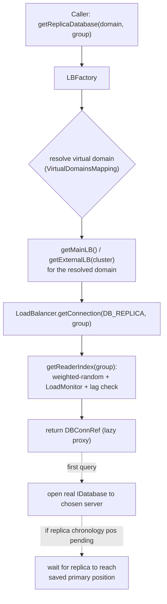
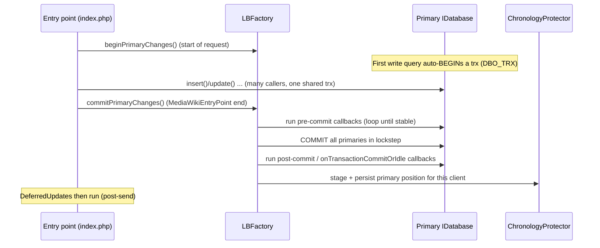

# Subsystem: Database (Rdbms)

> Part of the MediaWiki core senior-onboarding handbook. Scope: the `Rdbms`
> library at `includes/libs/rdbms/` — the data-access foundation every
> storage-owning subsystem sits on. For the schema itself (tables, abstract
> schema, migrations) see the data-model handbook page; for the services that
> *consume* this library see `storage-revisions-content`, `title-linking-namespaces`,
> `caching-deferred-jobs`, and `actions-special-pages-editing`.
>
> Authoritative source doc: `docs/database.md` (read it; this page assumes it).
> Foundation: root `AGENTS.md`, `includes/AGENTS.md`, `docs/Injection.md`.

---

## Responsibility & boundaries

`Rdbms` is MediaWiki's relational-database abstraction layer. Its job:

1. **Speak SQL to MySQL/MariaDB, PostgreSQL and SQLite** behind one interface
   (`IDatabase` / `IReadableDatabase`), so application code is portable across
   all three DBMSs.
2. **Hide a replicated topology.** Production Wikimedia runs one writable
   *primary* and many read-only *replicas* per cluster, across multiple
   datacenters. The library decides which physical server a connection lands on,
   handles replication lag, and provides read-your-writes ("chronology")
   consistency — all invisibly to callers.
3. **Manage transactions** — implicit per-request transaction "rounds" that make
   a web request all-or-nothing, plus explicit transactions and atomic sections.
4. **Discourage hand-written SQL** via fluent query builders that quote values,
   apply table prefixes, and stay DBMS-portable.

### The hard boundary: this is a *standalone* library

`includes/libs/rdbms/` is mirrored as the Composer package **`wikimedia/rdbms`**
and is used outside MediaWiki. Everything under it lives in the
`Wikimedia\Rdbms\` namespace and **must stay framework-agnostic**:

- **No `$wg*` globals.** No `MediaWikiServices`, no `wfMessage()`, no
  service-locator access. Dependencies are passed in via constructors / config
  arrays.
- All MediaWiki-specific glue lives **outside** the library, principally in
  `includes/DB/MWLBFactory.php` (note: `includes/DB/`, *not* `includes/libs/rdbms/`).
  `MWLBFactory` is the bridge: it reads `$wgLBFactoryConf`, `$wgDBservers`,
  `$wgVirtualDomainsMapping`, etc. from `MainConfigSchema`, normalizes them, and
  constructs the agnostic `LBFactory`. **If you find yourself wanting a `$wg`
  value inside `includes/libs/rdbms/`, you are in the wrong file — plumb it
  through `MWLBFactory` and the config array instead.**

This invariant is load-bearing: breaking it makes the library un-publishable and
is the single most common reason an Rdbms patch gets rejected on Gerrit.

---

## Internal structure (key files & their roles)

### Entry points (what application code touches)

| File | Role |
|---|---|
| `LBFactory/IConnectionProvider.php` | **The modern, narrow entry point.** Just `getPrimaryDatabase()`, `getReplicaDatabase()`, `getEmptyTransactionTicket()`, `commitAndWaitForReplication()`. The docblock literally says "No methods should be added unless absolutely needed." Obtain via `MediaWikiServices::getConnectionProvider()`. `@since 1.40`. |
| `Database/IDatabase.php` | Full read/write connection interface (extends `IReadableDatabase`). Returned by `getPrimaryDatabase()`. Holds the transaction, atomic-section, callback, and lock API. |
| `Database/IReadableDatabase.php` | Read-only subset. Returned by `getReplicaDatabase()` — you *cannot* call `insert()`/`update()` on it, the type system stops you. |
| `QueryBuilder/SelectQueryBuilder.php` and `InsertQueryBuilder` / `UpdateQueryBuilder` / `DeleteQueryBuilder` / `ReplaceQueryBuilder` / `UnionQueryBuilder` | Fluent builders, created via `$db->newSelectQueryBuilder()` etc. The preferred way to write any query. |
| `Expression/Expression.php`, `IExpression.php` | Type-safe WHERE-condition objects (`$db->expr('field','>',5)`), replacing raw SQL condition strings. |
| `IDBAccessObject.php` | The `READ_NORMAL` / `READ_LATEST` / `READ_LOCKING` / `READ_EXCLUSIVE` recency-flag constants that storage classes accept. |

### Topology / connection management (the engine room)

| File | Role |
|---|---|
| `LBFactory/ILBFactory.php` + `LBFactory/LBFactory.php` | Manager of all `ILoadBalancer` instances (one per *cluster*). Owns the shared `ChronologyProtector` and `TransactionProfiler`. Orchestrates **transaction rounds** across all primary connections. The concrete `LBFactory` (`getConnectionProvider()` returns *this*; `ConnectionProvider` service just aliases `getDBLoadBalancerFactory()`). |
| `LBFactory/LBFactorySingle.php` | One pre-supplied `IDatabase`. For tests / tiny tools. |
| `LBFactory/LBFactorySimple.php` | A flat `servers` array (one main cluster + optional external clusters). Typical small/medium third-party wiki. |
| `LBFactory/LBFactoryMulti.php` | Multi-section, multi-cluster sharding (`sectionsByDB` routes each DB name to a section). Wikipedia-scale. |
| `LoadBalancer/ILoadBalancer.php` + `LoadBalancer/LoadBalancer.php` | One **cluster's** servers. Picks a replica by weighted-random + lag + `LoadMonitor` adjustment; holds the primary as server index 0 (`WRITER_INDEX`). Defines `DB_PRIMARY = -2`, `DB_REPLICA = -1`. |
| `LoadBalancer/LoadBalancerSingle.php`, `LoadBalancerDisabled.php` | Degenerate single-server / disabled variants. |
| `LoadMonitor/LoadMonitor.php` | Measures each replica's health and open-connection count (MySQL `INFORMATION_SCHEMA.PROCESSLIST`), caches state (10s refresh / 60s preserve), and *de-weights* over-subscribed servers. Circuit-breaks (`DBConnectionError`) when every replica is down. `LoadMonitorNull` is the no-op for single-server. |
| `Database/DBConnRef.php` | A **lazy, shareable proxy** to an `IDatabase`. This is usually what you actually hold (see Gotchas). |
| `Database/Domain/DatabaseDomain.php` | The `(dbname, schema, prefix)` value object that identifies *which* dataset a connection targets — the key to foreign-wiki access. |
| `ConnectionManager/ConnectionManager.php`, `SessionConsistentConnectionManager.php` | Convenience wrappers that remember a fixed domain + replica group; the session-consistent variant forces reads to the primary after the first write. |

### Concrete drivers & SQL generation

| Area | Files |
|---|---|
| Base driver | `Database/Database.php` (the ~god class — query execution, retry, transaction state, callbacks) implementing `IDatabase`. |
| DBMS drivers | `Database/DatabaseMySQL.php`, `DatabasePostgres.php`, `DatabaseSqlite.php` (+ `DatabaseFactory.php`). |
| SQL dialects | `Platform/SQLPlatform.php` (+ `MySQLPlatform`, `PostgresPlatform`, `SqlitePlatform`). Builds SQL strings; the portability layer. |
| Result sets | `Database/ResultWrapper/*` (`IResultWrapper`, driver-specific wrappers, `FakeResultWrapper`). |
| Transaction state | `Database/TransactionManager.php` (per-connection state machine: BEGIN/COMMIT/ROLLBACK, atomic-section savepoint stack, the three callback queues). |
| Schema (DBAL) | `DBAL/*` — wraps Doctrine DBAL to translate the abstract schema (`sql/tables.json`) into per-DBMS DDL. (Owned operationally by the data-model / `maintenance` topics.) |

### Cross-cutting

- `ChronologyProtector.php` — read-your-writes across replicas (detailed below).
- `TransactionProfiler.php` — performance expectations / slow-query + too-many-connections warnings.
- `ReadOnlyMode.php`, `ConfiguredReadOnlyMode.php` — read-only state.
- `Exception/*` — the `DBError` hierarchy.
- `defines.php` — re-exports `DBO_*` and `DB_PRIMARY`/`DB_REPLICA` constants into the global namespace for legacy callers.

---

## Main flows

### 1. Acquiring a connection (the modern path)

```php
$dbProvider = MediaWikiServices::getInstance()->getConnectionProvider();
$dbr = $dbProvider->getReplicaDatabase();   // IReadableDatabase
$dbw = $dbProvider->getPrimaryDatabase();   // IDatabase
```

`getConnectionProvider()` returns the `LBFactory` itself. Resolution:



Key non-obvious points:
- You almost always receive a **`DBConnRef`**, not a raw `Database`. It defers
  the TCP connection until the first query and lets the `LoadBalancer`
  transparently **share one physical connection among many callers** holding
  refs to the same (server, domain) — which is why most callers in a request
  with the same role/group end up in the *same transaction*.
- **Query groups** (`getReplicaDatabase(false, 'vslow')`, also `'api'`, `'dump'`)
  *prefer* a server subset; they are a hint, not a guarantee, and replica-only.

### 2. The implicit transaction round (web request lifecycle)

This is the single most important concept and where new developers get burned.



- In **non-CLI (web) mode** every primary connection has **`DBO_TRX`** set
  (via `DBO_DEFAULT`). The *first* query on a connection silently opens a
  transaction that stays pending until the entry point calls
  `commitPrimaryChanges()` near end of request. This makes a whole web request
  atomic, but also means **locks are held from your first write to end of
  request** — hence the "do all computation before your writes" rule in
  `docs/database.md`.
- In **CLI/maintenance mode**, `DBO_TRX` is effectively off: queries autocommit.
  This is why maintenance scripts must call `waitForReplication()` between
  batches and why behavior differs subtly between web and CLI.
- A **transaction round** = `beginPrimaryChanges()` … `commitPrimaryChanges()`.
  Rounds span *all* primary connections across *all* clusters, giving best-effort
  distributed all-or-nothing semantics. Direct `IDatabase::commit()`/`rollback()`
  on a round-owned connection is **disabled** — only the `LBFactory` may resolve
  the round. Use atomic sections (`startAtomic`/`endAtomic`/`cancelAtomic`) for
  sub-units inside the round.

### 3. ChronologyProtector — read-your-writes across replicas

The problem: a user saves an edit (write → primary), then immediately reloads
(read → a replica that hasn't replicated the write yet) and sees stale data.

The fix (`ChronologyProtector.php`, `@since 1.27`):
- After a request writes, the primary's binlog/replication **position** is saved
  to a fast cache (`cpStash` BagOStuff), keyed by a **client ID** derived from
  IP + User-Agent (HMAC'd with `$wgChronologyProtectorSecret`). A short-lived
  cookie (`cpPosIndex`, TTL 10s) and a `UseDC=master` cookie ride along.
- On the client's *next* request, before issuing any replica reads, the
  `LoadBalancer` **waits** for the chosen replica to catch up to that saved
  position (`waitForPrimaryPos`). If the wait times out, the request enters
  "lagged replica mode" and caching TTLs are shortened so stale data converges.
- **Storage requirements** (see the docblock): the `cpStash` must be low-latency,
  DC-local, and may lose data without catastrophe (worst case = a user sees their
  own write a moment late). It is *not* a durable store.
- Disabled in CLI mode and on some special API entry points
  (`disableChronologyProtection()`).

### 4. getEmptyTransactionTicket / commitAndWaitForReplication

For batch code (jobs, deferred updates) that needs to commit mid-process and let
replicas catch up *without* hijacking an outer caller's transaction round:

```php
$ticket = $dbProvider->getEmptyTransactionTicket( __METHOD__ );
// ... do a batch of writes ...
$dbProvider->commitAndWaitForReplication( __METHOD__, $ticket );
```

The ticket is only granted when no primary changes are pending; passing it back
proves you own (or may act on behalf of) the round, so the factory will actually
commit and wait. A mismatched ticket is logged and the commit/wait is skipped —
this prevents a callee from committing a caller's half-finished transaction.

---

## State & data it owns

The library owns **connection-level and request-level state**, not persistent
data:

- **Live connection handles** per `(server index, domain)`, pooled in each
  `LoadBalancer`, fronted by `DBConnRef` proxies.
- **Transaction state** per connection (`TransactionManager`): trx open/error,
  the atomic-section savepoint stack, and three callback queues
  (`onTransactionPreCommitOrIdle`, `onTransactionCommitOrIdle`,
  `onTransactionResolution`).
- **Transaction-round state** in `LBFactory` (round stage machine, the ticket
  counter, list of touched clusters).
- **Chronology positions** (transiently, in `cpStash`) and **load/lag estimates**
  (transiently, in srvCache/WAN cache, via `LoadMonitor`).
- **Read-only state** (`ReadOnlyMode`).

It owns **no schema and no table data** — table definitions live in `sql/` and
are documented in the data-model handbook page.

---

## Dependencies (in / out)

**In (what it needs):** Only generic, injectable collaborators — `BagOStuff` /
`WANObjectCache` (`wikimedia/objectcache`), a PSR-3 logger, a `StatsFactory`,
optional `CriticalSectionProvider`. All passed via the `LBFactory` config array.
**No MediaWiki services.**

**Bridge layer:** `includes/DB/MWLBFactory.php` + `includes/ServiceWiring.php`
construct the agnostic library from MediaWiki config. Relevant services:
`DBLoadBalancerFactory` (the `LBFactory`), `ConnectionProvider` (alias to it),
`DBLoadBalancer` (the main `getMainLB()`), `ChronologyProtector`,
`DatabaseFactory`, `ReadOnlyMode`. Config comes from `MainConfigSchema`:
`LBFactoryConf`, `DBservers`, `VirtualDomainsMapping` (`@since 1.41`),
`ChronologyProtectorSecret`, `DatabaseReplicaLagWarning/Critical`, etc.

**Out (who consumes it):** essentially every persistence-touching subsystem —
`storage-revisions-content` (BlobStore, RevisionStore, the `external store`
clusters), `title-linking-namespaces` (LinkCache, link tables, `LinksTable`
virtual domain), `auth-permissions-sessions`, `caching-deferred-jobs`
(JobQueueDB, deferred updates that ride transaction callbacks), the
`action-api` / `rest-api` query modules, special pages (especially
`QueryPage`-derived ones — the only place unindexed queries are tolerated), and
`maintenance/` scripts.

---

## Extension / customization points

- **Custom query builders.** `SelectQueryBuilder` is `@stable to extend`;
  core subclasses it (e.g. `PageSelectQueryBuilder`) to add domain-specific
  fluent methods while keeping the generic interface. This is the sanctioned way
  to package reusable queries.
- **Virtual domains** (`$wgVirtualDomainsMapping`). An extension declares a
  logical domain name (e.g. `'virtual-botpasswords'`) and the site admin maps it
  to a real `(cluster, db)`. The extension code calls
  `getPrimaryDatabase('virtual-foo')` and stays deployment-agnostic. Core's own
  virtual domains are listed in `MWLBFactory::CORE_VIRTUAL_DOMAINS`.
- **External clusters** (`getExternalLB('clusterName')`) for bulk/auxiliary
  storage (e.g. the `external store` for revision text).
- **Pluggable `LoadMonitor` / `ChronologyProtector` stashes** via config.
- **Transaction callbacks** (`onTransactionCommitOrIdle`,
  `onTransactionPreCommitOrIdle`, `onTransactionResolution`) are the primary way
  other subsystems hook side effects (cache purges, secondary-store writes) to
  the DB commit lifecycle. Deferred updates and the job queue are built on these.

---

## Invariants & gotchas

1. **`$dbr` is read-only; never write to a replica.** `getReplicaDatabase()`
   returns `IReadableDatabase` which has no write methods. The `docs/database.md`
   warning is literal: a write that succeeds on the primary but collides on a
   replica halts replication and can take hours to repair.
2. **Library must stay framework-agnostic.** No `$wg*`, no `MediaWikiServices`,
   no `wf*()` inside `includes/libs/rdbms/`. Glue goes in `includes/DB/MWLBFactory.php`.
3. **`wfGetDB()` is gone.** It used to be *the* way to get a connection; it has
   been **fully removed from core** (zero references remain in `includes/`). Do
   not reintroduce it or `MediaWikiServices::...->getDBLoadBalancer()->getConnection(DB_*)`
   in new code — use `getConnectionProvider()`.
4. **Don't write on a GET request.** Web GETs must be cacheable and idempotent;
   writing on GET also fights the implicit transaction round and chronology
   protection. Defer writes to POST handlers, jobs, or `DeferredUpdates`.
5. **You usually hold a `DBConnRef`, and it is shared.** Do **not** call
   `close()` on it, and do **not** mutate its domain/prefix — those throw,
   because the underlying connection is owned by the `LoadBalancer` and reused by
   other callers. The connection is lazy: holding a ref does not open a socket.
6. **Implicit vs explicit transactions.** In web mode `DBO_TRX` means your first
   query already opened a transaction; calling `begin()` then is a no-op-ish
   warning, and `commit()` on a round-owned handle is disabled. Use atomic
   sections for sub-units; let the entry point resolve the round.
7. **Locks held until end of request.** Because of the implicit round, every
   `FOR UPDATE` / write lock persists until `commitPrimaryChanges()`. Minimize
   lock window: compute first, write last. Avoid locking reads (`FOR UPDATE`) —
   they deadlock easily in InnoDB; prefer `INSERT IGNORE` + `affectedRows()` or
   conditions in the `UPDATE WHERE`.
8. **Replication lag is real (≤1s typical, up to ~30s).** Don't assume a read
   reflects a just-committed write unless chronology protection covers it.
   In maintenance scripts call `waitForReplication()` between batches; never
   call it while a transaction is still open.
9. **Recency flags (`IDBAccessObject`).** `READ_NORMAL` (replica, possibly
   stale) is the default; only escalate to `READ_LATEST`/`READ_LOCKING`/
   `READ_EXCLUSIVE` when a read determines a write. Higher QoS = more primary
   load and contention.
10. **Cross-DBMS portability traps.** MySQL is canonical. PostgreSQL is stricter:
    `GROUP BY` must list every non-aggregate `SELECT` column (so never
    `SELECT *` with `GROUP BY`); type coercion differs. Test SQLite + Postgres,
    not just MySQL. The `Platform/*` classes are where dialect differences live.
11. **Foreign-/cross-wiki access uses domains, not new globals.** To touch
    another wiki's DB, pass its domain ID (`(dbname, schema, prefix)`) — in
    MediaWiki obtained via `WikiMap`/`getDBLoadBalancerFactory()` — rather than
    re-pointing config. Domain string format hyphen-escapes (`?h`, `??`).
12. **`COUNT(*)` is O(N).** Unindexed queries are rejected in review except in
    `QueryPage`-derived special pages. Use `estimateRowCount()` /
    `fetchRowCount()` consciously.
13. **`TransactionProfiler` will rat you out.** Exceeding configured expectations
    (too many writes/queries/connections, slow queries > ~0.25s event /
    transactions holding locks > 3s) logs warnings and bumps stats. Use
    `silenceForScope()` only when you genuinely know better.
14. **Query builders are single-use.** A builder mutates state as you chain; run
    exactly one query per instance. To reuse a "template", `clone` it before each
    variation. Always set `->caller(__METHOD__)` for profiling/SHOW PROCESSLIST.

---

## How to make a typical change here

### Write a read query the right way

```php
$dbr = $dbProvider->getReplicaDatabase();
$res = $dbr->newSelectQueryBuilder()
    ->select( [ 'rev_id', 'rev_timestamp' ] )
    ->from( 'revision' )
    ->where( [ 'rev_page' => $pageId ] )
    ->andWhere( $dbr->expr( 'rev_timestamp', '>', $cutoff ) ) // Expression, not raw SQL
    ->orderBy( 'rev_timestamp', SelectQueryBuilder::SORT_DESC )
    ->limit( 50 )
    ->caller( __METHOD__ )
    ->fetchResultSet();
foreach ( $res as $row ) { /* ... */ }
```

Use `expr()` / `andExpr()` / `orExpr()` instead of string conditions; they quote
values and compose safely. Reach for raw SQL only for DDL-ish things the builders
can't express, and then `tableName()` + `addQuotes()` are mandatory.

### Write a write query the right way

```php
$dbw = $dbProvider->getPrimaryDatabase();
$dbw->newInsertQueryBuilder()
    ->insertInto( 'mytable' )
    ->row( [ 'mt_key' => $key, 'mt_value' => $value ] )
    ->onDuplicateKeyUpdate()      // upsert
    ->uniqueIndexFields( [ 'mt_key' ] )
    ->set( [ 'mt_value' => $value ] )
    ->caller( __METHOD__ )
    ->execute();
```

For multi-step writes that must be atomic *within* the request round, wrap them
in `startAtomic()/endAtomic()` (or `doAtomicSection()`), using `ATOMIC_CANCELABLE`
+ `cancelAtomic()` if you need to back out just that section. Let the entry point
own the COMMIT; don't call `commit()` yourself.

### Add a reusable, domain-specific query builder

Subclass `SelectQueryBuilder` (it's `@stable to extend`), add typed fluent
methods, expose a `newXxxQueryBuilder()` factory on your store class. See
`MediaWiki\Page\PageSelectQueryBuilder` for the pattern.

### Tie a side effect to commit

Use `onTransactionCommitOrIdle()` (run after commit / immediately if no trx) for
cache purges and secondary writes, or `onTransactionPreCommitOrIdle()` when the
side effect must be atomic with the current transaction. Don't fire cache purges
inline before commit — a rollback would leave caches wrong.

### Touch the library itself (rare)

- Keep it framework-agnostic. Add new MediaWiki config plumbing in
  `includes/DB/MWLBFactory.php` + `MainConfigSchema`, not in the library.
- Honor the test contract in `tests/phpunit/unit/includes/libs/Rdbms/`
  (DBLESS unit tests: `DatabaseSQLTest`, the `Platform/*` tests, the
  `QueryBuilder/*` tests, `ChronologyProtectorTest`, `DatabaseDomainTest`,
  `ConnectionManager*Test`, `TransactionProfilerTest`). Cross-DBMS SQL changes
  must keep `MySQLPlatformTest` / `PostgresPlatformTest` / `SqlitePlatformTest`
  green.
- If you add/rename a class, regenerate `autoload.php`
  (`php maintenance/run.php generateLocalAutoload`).
- **Environment note:** no toolchain in this checkout (no `vendor/`/`composer`).
  Commands above are from the project's `composer.json`/`package.json` and were
  **not run here**.

---

## Foundation

- `docs/database.md` — authoritative, short; read it (replication, lag, lock
  contention, query groups, supported DBMSs, `GROUP BY` portability).
- `docs/Injection.md` — how `ConnectionProvider` / `LBFactory` are wired as
  services; inject `IConnectionProvider`, never `MediaWikiServices`.
- `includes/AGENTS.md` — places the DB layer in the broader `includes/` map and
  restates the "libs must stay decoupled" rule.
- Code: `includes/libs/rdbms/` (library), `includes/DB/MWLBFactory.php` (bridge),
  `includes/ServiceWiring.php` (wiring), `includes/MainConfigSchema.php` (config).
- Related handbook pages: `storage-revisions-content`,
  `title-linking-namespaces`, `caching-deferred-jobs`,
  `actions-special-pages-editing`, and the data-model / schema-evolution page
  (which owns `sql/`, the abstract schema, and migrations — out of scope here).

### Open questions / gaps

- **DBAL / Doctrine boundary.** `DBAL/*` translates the abstract schema to DDL,
  but the operational story (when generated SQL is regenerated, who runs
  `generateSchemaSql`) belongs to the data-model/maintenance pages — confirm the
  exact ownership split with that worker to avoid double-documentation.
- **Multi-DC routing specifics.** The `UseDC=master` cookie and primary-DC
  routing are described at the library level here, but the actual edge/CDN
  routing rules live in Wikimedia infrastructure (not this repo); the precise
  contract between cookie and edge was not verified from code in this checkout.
- **Postgres/SQLite support tier.** `docs/databases/` subdir is referenced by
  `docs/database.md` for per-DBMS caveats but was not read for this page; exact
  current support levels should be cross-checked there.
- **`DatabaseFactory` vs `DatabaseMysqli`.** The prompt referenced
  `DatabaseMysqli`; the current driver file is `Database/DatabaseMySQL.php`
  (mysqli-based). Naming has evolved — flagged in case other handbook pages cite
  the old name.
