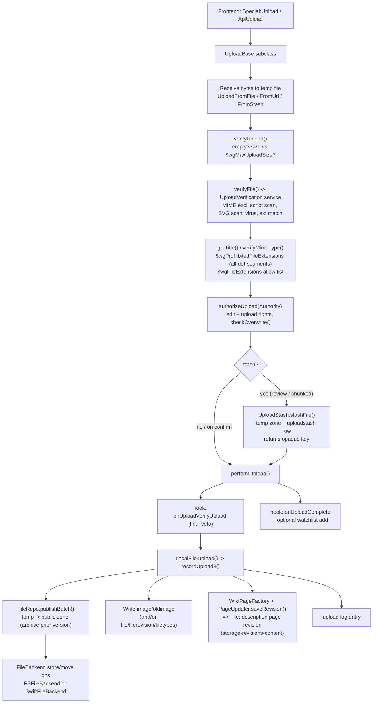
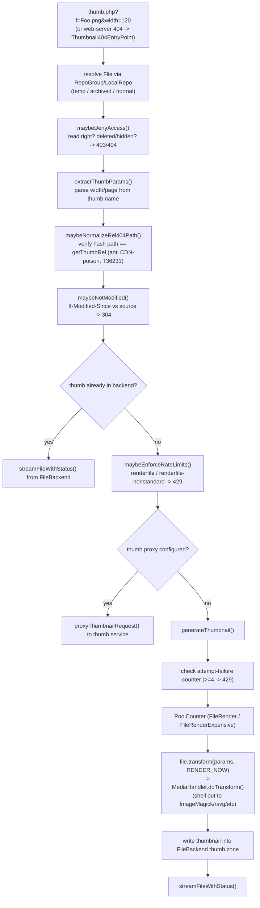

# Subsystem: Files, Media & Uploads

> Part of the MediaWiki core engineering handbook. Builds on the root `AGENTS.md`
> and `includes/AGENTS.md`. Cross-references its siblings under
> `docs/handbook/subsystems/`. MW_VERSION at time of writing: **1.47.0-alpha**.

This subsystem is how an uploaded file becomes (a) bytes in some storage system,
(b) a row-set in the database, (c) a File-namespace description page, and (d) a
stream of thumbnails served on demand. It is one of the older, gnarliest corners
of core: a four-decade-of-web-tech storage abstraction, a security-critical
upload trust boundary, and a media-handler plugin system that shells out to
external converters. Two things make it tricky to reason about right now: a
**live database schema migration** (the `image`/`oldimage` tables are being
replaced by normalized `file`/`filerevision`/`filetypes` tables), and the fact
that almost everything is **layered behind abstractions** so the same code runs
on a single laptop disk and on Wikimedia's Swift object cluster serving
Commons.

---

## Responsibility & boundaries

**Owns:**

- The **layered file model**: `File` (logical, DB-backed description object) over
  `FileRepo` (repo policy: naming, hashing, zones, archival) over `FileBackend`
  (physical storage: filesystem or object store).
- The **`RepoGroup`** — the prioritized list of repos (local first, then foreign
  repos like Commons) that resolves a filename to a `File`.
- **Media handlers** (`includes/Media/`) — per-format metadata extraction and
  thumbnail generation.
- The **upload pipeline** (`includes/Upload/`) — receive → verify → stash →
  publish, including the **security verification** that is a key trust boundary.
- The **on-demand thumbnail** entry point (`thumb.php`) and the
  **protected-file** entry point (`img_auth.php`).
- The DB tables `image`, `oldimage`, `filearchive`, `uploadstash`, and the new
  `file`, `filerevision`, `filetypes`.

**Does NOT own (delegates to siblings):**

- The actual page revision / wikitext content of the File description page —
  created by `LocalFile::upload()` calling into **storage-revisions-content**
  (`WikiPageFactory` / `PageUpdater`). See
  `docs/handbook/subsystems/storage-revisions-content.md`.
- Title/namespace resolution (NS_FILE) — **title-linking-namespaces**.
- Permission / right checks (`upload`, `reupload`, `read`, `renderfile`) —
  **auth-permissions-sessions**.
- The `Special:Upload` form and `ApiUpload` module — those are *frontends* that
  drive `UploadBase`; see **actions-special-pages-editing** and **action-api**.
- MIME detection itself lives in the standalone `Wikimedia\Mime\MimeAnalyzer`
  library (`includes/libs/mime`).
- The CSS parser used for SVG checks is the `Wikimedia\CSS` library.

The boundary that matters most for a new senior engineer: **`FileRepo` and
`FileBackend` are deliberately split.** `FileRepo` knows MediaWiki policy (where
a file's hash directory goes, what a "thumb zone" is, that deletes go to an
archive). `FileBackend` knows nothing about MediaWiki — it is a framework-
agnostic library (`includes/libs/filebackend/`, namespace `Wikimedia\FileBackend`)
that only knows "store these bytes at this storage path." Keep that decoupling.

---

## Internal structure (key files & their roles)

### Layer 1 — `File` objects (`includes/FileRepo/File/`, namespace `MediaWiki\FileRepo\File`)

The `File` object is a **process-local cache of information about one file**
(per the architecture note in `includes/FileRepo/README.md`, Tim Starling 2007).
It is the primary public entry point because file access can be cached, whereas
repo access should not.

- **`File.php`** (`abstract File`, ~72 KB) — `@stable to extend`. The base
  abstraction. Holds the bitfield constants (`DELETED_FILE`, `RENDER_NOW`,
  `RENDER_FORCE`, `DELETE_SOURCE`), the `transform()` entry to thumbnailing, and
  lazy-initialised members (name, extension, handler, path, url, hashPath…).
  Implements `MediaHandlerState`. Rule of thumb from the README: *"the file
  subclass is smarter than the repository subclass"* — DB access and high-level
  logic live in the file, not the repo.
- **`LocalFile.php`** (~86 KB) — the workhorse. A file in the local wiki's DB.
  Owns: loading from DB **and a WANObjectCache** (`VERSION = 13` cache version,
  `getCacheKey()` / `loadFromCache()` / `invalidateCache()`), `upload()` →
  `recordUpload3()` (writes rows + creates the description-page revision),
  `purgeCache()` / `purgeThumbnails()`, and the schema-migration branching (see
  below). This is the class that ties files into the rest of core.
- **`OldLocalFile.php`** — a *prior* version of a local file (the `oldimage`
  table / `filerevision` rows that are not the latest). Identified by archive
  name `<timestamp>!<name>`.
- **`ArchivedFile.php`** — a **deleted** file (the `filearchive` table). Distinct
  from "old": old = superseded but visible; archived = deleted from public view.
- **`ForeignAPIFile.php`** / **`ForeignDBFile.php`** — files that physically live
  on another wiki (e.g. Commons), reached via its API or its DB.
- **`UnregisteredLocalFile.php`** — a file on disk with no DB row (used for temp
  zone, stash, parser tests).
- **Batch helpers**: `LocalFileDeleteBatch`, `LocalFileMoveBatch`,
  `LocalFileRestoreBatch` — the multi-step DB+backend transactions for
  delete/move/undelete.
- **`FileSelectQueryBuilder.php`** — `@internal`. Builds the SELECT for `file` /
  `oldfile` / `archivedfile`, **branching on `$wgFileSchemaMigrationStage`** to
  query either the old (`image`/`oldimage`) or new (`file`/`filerevision`)
  tables. This is the single most important class for understanding the migration.
- **`MediaFileTrait.php`**, **`MetadataStorageHelper.php`** — shared helpers
  (API response shaping, split-metadata storage).

### Layer 2 — `FileRepo` (`includes/FileRepo/`, namespace `MediaWiki\FileRepo`)

Repo = configuration + policy about a storage method. *"The repository should in
general provide a minimal API needed to access the storage backend efficiently"*
(README).

- **`FileRepo.php`** (`class FileRepo`, ~62 KB) — base repo. Defines:
  - **Zones**: `public`, `thumb`, `transcoded`, `temp`, `deleted` (constructor,
    line ~231). Each maps to a backend container. This is the policy layer's core
    concept — files live in zones, not raw paths.
  - **Hash paths**: `getHashPath()` / `getHashPathForLevel()` — by default
    `hashLevels = 2`, so a file `Foo.png` lands under `f/fa/Foo.png` using
    `md5(name)`. This **shards** files so no single directory holds millions of
    entries (a filesystem killer; less critical for object stores but kept for
    portability).
  - **Virtual URLs**: `mwrepo://<repo>/<zone>/<rel>` — an internal handle that
    `RepoGroup::splitVirtualUrl()` resolves back to a repo+zone+path.
  - Batch operations `storeBatch()`, `publishBatch()`, `deleteBatch()`,
    `quickImport()` that translate to `FileBackend` operations.
  - Flags: `DELETE_SOURCE`, `OVERWRITE`, `OVERWRITE_SAME`, `SKIP_LOCKING`.
- **`LocalRepo.php`** — *"stores files in the local filesystem and registers them
  in the wiki's own database. This is the most commonly used file repository
  class."* Adds DB access (the base `FileRepo` intentionally has none) and the
  `LocalFile`/`OldLocalFile` factories.
- **`ForeignAPIRepo.php`** — a read-only repo backed by **another wiki's Action
  API** (the classic "use Commons images on your wiki" setup). Caches API
  metadata (`apiThumbCacheExpiry` 1 day, `fileCacheExpiry` 1 month) because, per
  its own doc comment, *"This is often the performance bottleneck for
  ForeignAPIRepo"* — every file's metadata + every high-DPI variant is fetched
  serially during the parse.
- **`ForeignDBRepo.php`** / **`ForeignDBViaLBRepo.php`** — a repo backed by direct
  read access to another wiki's image DB + a shared backend (Wikimedia-style
  shared-storage setup). `ForeignDBRepo extends LocalRepo`.
- **`FileBackendDBRepoWrapper.php`** — wraps a backend so SHA1-addressed storage
  layouts can map a logical name to a content-hash path via the DB.
- **`RepoGroup.php`** — the prioritized list (local + foreign). `findFile()`,
  `findFiles()`, `findBySha1()`, `checkRedirect()` — all try local first, then
  each foreign repo in order, with a 500-entry `MapCacheLRU` for `findFile()`.
- **Entry-point implementations** (the actual logic behind the root scripts):
  `ThumbnailEntryPoint.php` (`thumb.php`), `Thumbnail404EntryPoint.php`
  (web-server 404 → thumbnail), `AuthenticatedFileEntryPoint.php`
  (`img_auth.php`).

### Layer 3 — `FileBackend` (`includes/libs/filebackend/`, namespace `Wikimedia\FileBackend`)

Framework-agnostic storage abstraction. *"Any MediaWiki interaction with stored
files should thus use a FileBackend object"* (`includes/FileBackend/README.md`).

- **`FileBackend.php`** (`abstract`, ~66 KB) — `@stable to extend`, `@since 1.19`.
  Defines storage paths as `mwstore://<backend>/<container>/<path>`. Declares the
  abstract operation set. Key callers' contract (from the class doc): always
  `prepare()` the parent dir before writing; always `clean()` when a dir may
  become empty; never assume operations are atomic; never assume immediate
  consistency (use the `latest` flag when correctness matters).
- **`FileBackendStore.php`** (`abstract extends FileBackend`, ~68 KB) — the base
  for *single* concrete stores. Subclasses implement the `do*Internal()`
  primitives (`doCreateInternal`, `doStoreInternal`, `doCopyInternal`,
  `doMoveInternal`, `doDeleteInternal`, `doGetFileStat`, `doPublishInternal`,
  list methods). The base orchestrates batches via `doOperationsInternal()`.
- **`FSFileBackend.php`** — local/mounted filesystem store (the default).
- **`SwiftFileBackend.php`** (~63 KB) — OpenStack Swift / Ceph RADOS+RGW object
  store. This is what Wikimedia production uses. `SwiftAuthProvider.php` handles
  auth.
- **`FileBackendMultiWrite.php`** — a *proxy* backend that writes to several
  internal backends at once. *"useful for transitioning from one backend to
  another"* (e.g. migrating FS → Swift while keeping both in sync). Locking and
  read-only checks are handled by the proxy.
- **`MemoryFileBackend.php`** — in-memory, for tests.
- **`HTTPFileStreamer.php`** — streams a file to the HTTP response with range /
  conditional-request support; used when serving originals and thumbnails.
- **`FileOpBatch.php`, `FileOps/`, `FileOpHandle/`, `FileIteration/`** — the
  file-operation model and directory iterators.
- **`LockManager/`** (under `includes/FileBackend/`) — lock managers; locking is
  effective only if one is registered (`$wgLockManagers`). For object stores,
  locking matters mainly when a read must determine a write.

### `FileBackendGroup` (`includes/FileBackend/`, namespace `MediaWiki\FileBackend`)

The MediaWiki glue (not in the lib — it's allowed to touch services/config). It
registers backends from `$wgFileBackends` and **auto-creates a back-compat
`FSFileBackend` for every repo** that didn't name an explicit backend, mapping
each repo's zones to containers (`<repo>-public`, `<repo>-thumb`,
`<repo>-transcoded`, `<repo>-deleted`, `<repo>-temp` — see
`FileBackendGroup::__construct`). It injects the default backend params
(mimeCallback, tmpFileFactory, WAN/srv caches, the `FileOperation` logger). This
is the bridge between "repo config" and "a live `FileBackend` instance."

### Layer 4 — Media handlers (`includes/Media/`, namespace `MediaWiki\Media`)

- **`MediaHandler.php`** (`abstract`, `@stable to extend`) — base for all
  format support. Two phases: **metadata extraction at upload/props time**
  (`getSizeAndMetadata(MediaHandlerState, $path)`, modern since 1.37; legacy
  `getMetadata()`/`getImageSize()`) and **transform at thumbnail time**
  (`normaliseParams()` → `doTransform()` → `MediaTransformOutput`). Abstract
  methods a handler must satisfy: `getParamMap`, `validateParam`,
  `makeParamString`, `parseParamString`, `normaliseParams`, `doTransform`
  (`getTransform()` is `final`). Metadata-validity constants: `METADATA_GOOD`,
  `METADATA_BAD`, `METADATA_COMPATIBLE`.
- **`MediaHandlerFactory.php`** (`@since 1.28`) — MIME-type → handler-class
  registry = `$wgMediaHandlers` + `self::CORE_HANDLERS` (user config wins).
  Obtain it via `MediaWikiServices::getMediaHandlerFactory()`. Drops handlers
  whose `isEnabled()` is false.
- **`ImageHandler` → `TransformationalImageHandler` → `BitmapHandler` →
  `ExifBitmapHandler` → `JpegHandler`** — the raster chain.
  `TransformationalImageHandler` (`@since 1.24`) is the base for shell-out
  scalers; `getScalerType()` picks `im` (ImageMagick `convert`), `gd`, `imext`
  (Imagick ext), `custom`, or `client`. `BitmapHandler` has the real
  ImageMagick/GD implementations.
- **`SvgHandler.php`** — extends `ImageHandler` directly; **rasterizes SVG to
  PNG** via a configured converter (`$wgSVGConverters`); supports per-language
  rendering. **`SVGReader.php`** parses SVG metadata.
- Other concrete handlers: `PNGHandler`, `GIFHandler`, `TiffHandler`,
  `WebPHandler`, `BmpHandler`, `XCFHandler`, `Jpeg2000Handler`, `DjVuHandler`
  (multipage). Audio/video (Ogg/TimedMediaHandler) ship as **extensions**, not
  core.
- **`MediaTransformOutput.php`** (`@stable to extend`) — represents a transform
  *result* (does not run it). Concrete subclasses **`ThumbnailImage`** (success,
  `toHtml()` builds the ``) and **`MediaTransformError`** /
  `TransformParameterError` / `TransformTooBigImageAreaError` (failure, with
  `getHttpStatusCode()`). Owns streaming via `streamFileWithStatus()`.
- Metadata extractors: `Exif.php`, `IPTC.php`, `FormatMetadata.php`,
  `BitmapMetadataHandler.php`, `JpegMetadataExtractor.php`,
  `PNGMetadataExtractor.php`, `GIFMetadataExtractor.php`.

### Layer 5 — Upload pipeline (`includes/Upload/`, namespace `MediaWiki\Upload`)

- **`UploadBase.php`** (~50 KB, `@stable to extend`) — the pipeline engine.
  Verification result codes (`OK`/`SUCCESS = 0`, `EMPTY_FILE`,
  `MIN_LENGTH_PARTNAME`, `ILLEGAL_FILENAME`, `FILETYPE_MISSING`,
  `FILETYPE_BADTYPE`, `VERIFICATION_ERROR`, `FILE_TOO_LARGE`,
  `WINDOWS_NONASCII_FILENAME`, `FILENAME_TOO_LONG`) and `CODE_TO_STATUS`.
- **Upload sources**: `UploadFromFile` (browser POST), `UploadFromStash`
  (re-publish an already-stashed file), `UploadFromUrl` (server-side fetch,
  needs `upload_by_url` + `$wgAllowCopyUploads`), `UploadFromChunks` (large files
  sent in sequential chunks, assembled in the stash).
- **`UploadStash.php`** + **`UploadStashFile.php`** — a temporary, per-user store
  (`uploadstash` table + the local repo's temp zone) that holds verified-but-not-
  yet-published files. Users get an **opaque key**, never a forgeable server path.
- **`UploadVerification.php`** (~34 KB, service `@since 1.45`) — the extracted
  **content-security** service (see the defensive section below).
  `SVGCSSChecker.php` is its CSS-in-SVG checker.
- **`Exception/`** — typed upload exceptions; **`Hook/`** — the upload hook
  interfaces.

---

## Main flows

### Flow A — The upload pipeline

Key facts:
- **`UploadBase` does not write the revision directly.** It hands off to
  `LocalFile::upload()` → `recordUpload3()`, which writes the file rows, creates
  the **File-namespace description-page revision** via `PageUpdater`, writes the
  upload log, and invalidates the WAN cache. This is the seam into
  **storage-revisions-content**.
- **Stashing happens before publish** for three reasons: (1) a verified upload
  can be reviewed / renamed / warning-confirmed before the user commits; (2)
  chunked uploads assemble incrementally in the stash; (3) the user only ever
  holds an opaque key, never a server path, closing a path-forgery hole.
- **Hooks** (all `@stable to implement`): `onUploadCreateFromRequest`,
  `onUploadVerifyFile`, `onUploadStashFile`, `onUploadVerifyUpload`,
  `onUploadComplete`, `onIsUploadAllowedFromUrl`.

### Flow B — Thumbnail on demand (`thumb.php` / `ThumbnailEntryPoint`)

Key facts:
- Thumbnails are generated **lazily on first request** when
  `$wgGenerateThumbnailOnParse = false` + the repo's `transformVia404` is on: the
  parser emits a thumb URL, the web server 404s on the missing file, and a
  rewrite sends it to `thumb.php` (via `Thumbnail404EntryPoint`), which renders,
  **caches the result into the FileBackend thumb zone**, and streams it.
- The **`rel404` hash-path verification** (`maybeNormalizeRel404Path`, T36231)
  exists because a malicious or malformed thumb URL could otherwise poison a CDN
  cache with content under a path that wouldn't be purged when the file is
  deleted. It enforces the canonical hash path or 301-redirects the long form.
- **PoolCounter** + an **attempt-failure counter** (≥ 4 failures → HTTP 429,
  recorded even on PHP fatals via `register_shutdown_function`) protect against
  thundering-herd render stampedes on expensive transforms.

### Flow C — Protected files (`img_auth.php` / `AuthenticatedFileEntryPoint`)

For private wikis: set `$wgUploadDirectory` to a non-web-accessible dir and point
`$wgUploadPath` at `img_auth.php`. Every original-file request then runs through
`AuthenticatedFileEntryPoint::execute()`, which checks the user's `read` right
(and per-title `userCan('read')` on non-public wikis) **before** streaming the
bytes via the backend; otherwise it returns 403 (`img-auth-accessdenied`). For
security, the denial reason is hidden by default unless `$wgImgAuthDetails` is set.

---

## State & data it owns

### Old schema (default; `SCHEMA_COMPAT_OLD`)

| Table | Holds | Key columns |
|---|---|---|
| `image` | Current version of each local file | `img_name` (= description-page title in NS_FILE), `img_size`, `img_width`, `img_height`, `img_metadata`, `img_bits`, `img_media_type`, `img_major/minor_mime`, `img_sha1`, `img_timestamp`, actor/comment |
| `oldimage` | Superseded prior versions | `oi_name`, `oi_archive_name` (`<timestamp>!<name>`), mirror of image columns |
| `filearchive` | **Deleted** files (post-delete record) | `fa_id`, `fa_name`, `fa_storage_key`, deletion metadata |

### New schema (in migration; `file`/`filerevision`/`filetypes`)

Normalized model introduced in **1.44** (writing) with **read support added in
1.47** (per `MainConfigSchema::FileSchemaMigrationStage` history):

| Table | Holds |
|---|---|
| `file` | One row per logical file: `file_id` (PK), `file_name`, `file_latest` (FK → `fr_id`), `file_type` (FK → `filetypes.ft_id`), `file_deleted`. |
| `filerevision` | One row per file **revision** (`fr_id` PK, `fr_file` FK → `file_id`, …). Replaces the image/oldimage split — current vs old is just `file.file_latest` vs other `filerevision` rows. |
| `filetypes` | Deduplicated `(ft_media_type, ft_major_mime, ft_minor_mime)` tuples, referenced by `file.file_type`. Replaces the repeated per-row MIME columns. |

`uploadstash` (owned by the upload subsystem) is unchanged: `us_id`, `us_user`,
`us_key` (the opaque key), `us_path`/`us_orig_path`, `us_source_type`,
`us_status` (`finished` / `chunks`), `us_chunk_inx`, `us_size`, `us_sha1`,
`us_mime`, `us_media_type`.

### Backend storage

Bytes live in **zones → containers** in a `FileBackend`: `public`, `thumb`,
`transcoded`, `temp`, `deleted`. Default layout shards by `md5(name)` hash dirs
(`f/fa/Foo.png`) at `hashLevels = 2`. On Wikimedia this is Swift; on a default
install it's the local filesystem under `$wgUploadDirectory`.

> **The schema migration is the single biggest gotcha in this subsystem right
> now.** Code that reads files must go through `FileSelectQueryBuilder`, which
> branches on `$wgFileSchemaMigrationStage`. `LocalFile` writes to old and/or new
> tables depending on the `SCHEMA_COMPAT_WRITE_OLD` / `SCHEMA_COMPAT_WRITE_NEW`
> bits. Recent commits (e.g. `1e11a4bda59` "use fr_id as secondary sort with new
> file tables", `b992592266f` "Avoid writing to image/oldimage if config is not
> WRITE_OLD", the `NewFilesPager`/`ImageListPager` "make sure filerevision is
> queried before file" series) show pagers and API modules being audited
> one-by-one for join ordering and dual-read correctness. Treat any direct query
> against `image`/`oldimage` as a migration hazard.

---

## Dependencies (in / out)

**Inbound (who consumes this subsystem):**
- The **parser** — `[[File:Foo.png|thumb]]` resolves via `RepoGroup::findFile()`
  and emits transforms (parser-and-content-transform).
- **action-api** — `ApiUpload`, `ApiQueryImageInfo`, `ApiQueryAllImages`.
- **actions-special-pages-editing** — `Special:Upload`, `Special:ListFiles`,
  `Special:NewFiles`, the File description page action.
- **output-skins-resourceloader** — image rendering in page output.
- The root entry points `thumb.php` and `img_auth.php`.

**Outbound (what this subsystem depends on):**
- **storage-revisions-content** — `LocalFile::upload()` creates the description
  page revision through `WikiPageFactory` / `PageUpdater`.
- **database-rdbms** — `IConnectionProvider`, the query builders.
- **title-linking-namespaces** — NS_FILE titles, `File::normalizeTitle()`.
- **auth-permissions-sessions** — `Authority` / right checks (`upload`,
  `reupload*`, `read`, `renderfile`, `upload_by_url`).
- **caching-deferred-jobs** — `WANObjectCache` for `LocalFile`, deferred updates
  for async backend ops, the job queue (`UploadFromUrlJob`, thumbnail purges),
  PoolCounter for render throttling.
- **service-container-and-config** — `RepoGroup`, `FileBackendGroup`,
  `MediaHandlerFactory`, `UploadVerification` are all services in
  `ServiceWiring.php`.
- **External binaries** (shelled out via `MediaWiki\Shell\Shell`): ImageMagick
  `convert`, `rsvg`/Inkscape/Batik, `jpegtran`, ExifTool, the configured
  antivirus scanner.
- **External storage** (optional): an OpenStack **Swift** / Ceph object cluster.

---

## Extension / customization points

- **Add a media handler**: write a class extending the closest base
  (`ImageHandler` / `TransformationalImageHandler` / `BitmapHandler` for
  raster-via-shell-out, or `MediaHandler` directly), implement the abstract
  surface not already covered, override `getThumbType()` if the thumb format
  differs from the source (as SVG→PNG), and **register it in `$wgMediaHandlers`**
  keyed by MIME type. No factory code change needed. See the how-to below.
- **Add a foreign repo**: configure `$wgForeignFileRepos` with a `class`
  (`ForeignAPIRepo` for API-backed Commons-style, `ForeignDBViaLBRepo` for
  shared-DB). `RepoGroup` searches these after the local repo.
- **Add a storage backend**: subclass `FileBackendStore` (implement the
  `do*Internal()` primitives) and register it in `$wgFileBackends`. It must stay
  framework-agnostic if it lives in `includes/libs/filebackend/`.
- **Customize the local repo**: `$wgLocalFileRepo` (zones, `hashLevels`,
  `transformVia404`, `thumbScriptUrl`, `initialCapital`).
- **Hook into uploads**: the six upload hooks listed in Flow A.
- **Hook into thumbnail HTML**: `ThumbnailBeforeProduceHTML`,
  `BitmapHandlerTransform`, `BitmapHandlerCheckImageArea`.
- **Custom converters**: `$wgCustomConvertCommand`, `$wgSVGConverters[...]`.

---

## Invariants & gotchas

### The upload trust boundary (described defensively)

The upload path is one of MediaWiki's most security-sensitive surfaces — an
attacker who can get the server (or a victim's browser) to treat an uploaded
file as active content can achieve stored XSS or worse. **The point here is that
layered, defense-in-depth checks exist and why; the specifics are intentionally
high-level — do not treat this as a bypass guide.** Verification is the
`UploadVerification` service (since 1.45), invoked from
`UploadBase::verifyFile()`:

- **Extension policy** — `$wgProhibitedFileExtensions` is a hard deny-list
  checked against **every dot-segment** of the name (not just the last one),
  because some web servers fall back to an earlier "extension" when choosing a
  handler (defends double/pseudo extensions like `evil.php.png`).
  `$wgFileExtensions` + `$wgStrictFileExtensions` provide an allow-list.
- **MIME consistency** — `$wgVerifyMimeType` rejects types on
  `$wgMimeTypeExclusions` and ensures the declared extension matches the detected
  MIME, so a browser can't be tricked into content-sniffing a dangerous type.
- **Embedded-script detection** — scans leading bytes (whole file for `text/*`),
  normalizing UTF-16/entity encodings to defeat obfuscation, looking for
  HTML/JS markers (gated by `$wgDisableUploadScriptChecks`).
- **SVG hardening** — SVG is XML and can carry `<script>`, event handlers, and
  external references. The checker rejects non-allowlisted namespaces, scripting
  elements/attributes, unsafe `href` schemes, and dangerous XML-encoding
  mismatches; **`SVGCSSChecker`** additionally bans remote `url()`/`@import` in
  CSS. SVGs are also **rasterized to PNG** for thumbnails rather than served raw
  (unless native rendering is explicitly enabled via `$wgSVGNativeRendering`).
- **Antivirus** — optional shell-out scanner (`$wgAntivirus`,
  `$wgAntivirusSetup`, `$wgAntivirusRequired`).
- **Decompression-bomb guard** — `$wgMaxImageArea` (~12.5M px default) caps the
  source pixel area for scalers that fully decompress (PNG via IM/GD), preventing
  a tiny file from exhausting memory when thumbnailed. (Note: intentionally
  **skipped for JPEG + ImageMagick**, which downscales without full decode.
  `$wgMaxThumbnailArea` does **not** exist in core — the relevant limit is
  `$wgMaxImageArea`.)
- **Shell-out hygiene** — all converter invocations go through
  `MediaWiki\Shell\Shell` with per-argument escaping; ImageMagick paths get
  extra `escapeMagick*` handling and `+set Thumb::URI` to avoid leaking local
  paths (T108616).

### Other invariants

- **Layer discipline**: `FileBackend` (lib) must never reach into MediaWiki
  globals/services. `FileRepo` carries the policy; `LocalRepo` (not base
  `FileRepo`) carries the DB access. Don't push DB logic down into `FileRepo`.
- **File deletion ≠ page deletion.** Deleting a file moves its bytes to the
  `deleted` zone and records a `filearchive` row; the description *page* is a
  separate revision/content concern. Undelete is `LocalFileRestoreBatch`.
- **"Old" vs "archived" are different.** Old = a superseded-but-public prior
  version (`oldimage`/non-latest `filerevision`). Archived = deleted from public
  view (`filearchive`). `OldLocalFile` vs `ArchivedFile`.
- **Operations are not atomic.** Per the backend README, file moves/creates can
  partially apply; the upload/delete batches use locking + careful ordering, and
  callers should use MVCC patterns (never mutate stored files in place).
- **Consistency is eventual** on object stores. Use the `latest` flag when a read
  must reflect a recent write; directory listings have no such flag and may be
  stale.
- **`RepoGroup::findFile()` is cached** (60s LRU) — pass `latest`/`private`/
  `ignoreRedirect` to bypass it.
- **Foreign repo latency** is a real performance trap: `ForeignAPIRepo` fetches
  metadata per file (and per high-DPI variant) serially during the parse. Its
  caches (`apiThumbCacheExpiry`, `fileCacheExpiry`, the metadata cache added in
  1.38) are load-bearing, not optional niceties.
- **Thumbnail 404 / cache poisoning**: the `rel404` hash verification (T36231)
  must not be weakened — it's what keeps unpurgeable CDN cache entries from being
  created.
- **The schema migration**: never assume `image`/`oldimage` is authoritative;
  go through `FileSelectQueryBuilder` and respect `$wgFileSchemaMigrationStage`.

> **No `FileJournal` in this checkout.** The historical `FileJournal` (an
> append-only log of backend operations) is referenced in the backend README's
> design discussion but does **not** appear as a class under
> `includes/libs/filebackend/` here — *(inference: it was removed/relocated in a
> recent refactor, or this checkout post-dates its removal; not verified.)* Don't
> assume a journaling layer is present.

---

## How to make a typical change here

### Add a new media handler (e.g. a hypothetical `image/foo`)

1. Create `FooHandler` extending the closest base. For a raster format that you
   thumbnail by shelling out, extend `TransformationalImageHandler` /
   `BitmapHandler` and just override `getScalerType()` + the metadata methods;
   for something exotic, extend `MediaHandler` and implement the full abstract
   set (`getParamMap`, `validateParam`, `makeParamString`, `parseParamString`,
   `normaliseParams`, `doTransform`).
2. Provide metadata/size: override
   `getSizeAndMetadata(MediaHandlerState $state, $path)` (modern API). Override
   `getThumbType()` if the thumbnail is a different format than the source.
3. Override capability predicates as needed: `mustRender()`, `canRender()`,
   `isVectorized()`, `isMultiPage()`/`pageCount()`, `isAnimatedImage()`,
   `isExpensiveToThumbnail()`, `isEnabled()` (gate on required converter config).
4. Register the MIME mapping: `$wgMediaHandlers['image/foo'] = FooHandler::class;`
   (user config overrides `CORE_HANDLERS`).
5. If the class lives in core, regenerate `autoload.php`:
   `php maintenance/run.php generateLocalAutoload` (not run here —
   `AutoLoaderStructureTest` enforces it).
6. Add a handler test (see `includes/Media` tests) covering metadata extraction
   and a transform.

### Touch the read path of files (the migration-aware way)

1. Build queries through `FileSelectQueryBuilder::newForFile()` /
   `newForOldFile()` / `newForArchivedFile()` — **do not** hand-write
   `image`/`oldimage` SELECTs. It branches on `$wgFileSchemaMigrationStage`.
2. If you write file rows, branch on the `SCHEMA_COMPAT_WRITE_OLD` /
   `SCHEMA_COMPAT_WRITE_NEW` bits exactly as `LocalFile` does (write to whichever
   schema(s) the stage enables).
3. For pagers/joins, mind ordering: when reading new, ensure `filerevision` is
   joined/queried correctly relative to `file` and use `fr_id` as the secondary
   sort (see the `NewFilesPager`/`ImageListPager`/`ApiQueryAllImages` commits).

### Add a verification check to the upload path

Implement `onUploadVerifyFile` (content-only, runs early) or
`onUploadVerifyUpload` (has file + user-entered metadata, final veto) rather than
editing `UploadBase`. Set `&$error` to a message to reject. Keep new checks in
the spirit of defense-in-depth; gate anything expensive behind config.

### Testing (commands not run here — no toolchain in this checkout)

- Unit: `composer phpunit:unit` (e.g. `FileBackendTest`,
  `tests/phpunit/unit/includes/libs/FileBackend/`).
- Integration (DB-destructive): `composer phpunit:config` then `composer phpunit`
  for `FileRepoTest`, `LocalFileTest`, `UploadBaseTest`, `SwiftFileBackendTest`.
- Contracts these tests encode: `FileRepoTest` enforces that a repo **must** have
  `name` + `backend` and rejects initial-capital mismatches; `LocalFileTest`
  pins the hash-path / zone-URL / archive-URL / thumb-URL derivations and the
  DB+cache + metadata round-trip (`testLoadFromDBAndCache`,
  `testLegacyMetadataRoundTrip`, `testRecordUpload3`, the
  `testUpload_*`/`testReUpload_eventEmission` event-emission cases);
  `UploadBaseTest` pins title validation, `verifyUpload`, and `$wgMaxUploadSize`.

---

## Foundation

This document builds on, and does not repeat:

- Root `AGENTS.md` / `CLAUDE.md` — project-wide conventions (DI, hooks, Gerrit,
  schema-is-generated, `autoload.php`-is-generated).
- `includes/AGENTS.md` — the core spine (services, hooks, DB layer) and the
  stable/internal contract markers.
- `includes/FileRepo/README.md` — the file/repo architecture rationale (Tim
  Starling, 2007): *file = cache, repo = config, file subclass is smarter*.
- `includes/FileBackend/README.md` — the storage abstraction rationale (object
  stores vs filesystems, operations, consistency, locking, sharding).
- `docs/database.md` — DB access patterns the file query builders follow.
- `docs/Injection.md`, `docs/Hooks.md` — the service + hook mechanics used by
  `RepoGroup`, `FileBackendGroup`, `MediaHandlerFactory`, and the upload hooks.

Sibling subsystem docs to read alongside this one
(`docs/handbook/subsystems/`):

- **storage-revisions-content** — where `LocalFile::upload()` creates the
  description-page revision; the Data Model doc for table evolution.
- **parser-and-content-transform** — the consumer that resolves `[[File:…]]`.
- **auth-permissions-sessions** + the Security Model doc — the upload trust
  boundary and `read`/`renderfile` rights.
- **caching-deferred-jobs** — WAN cache, PoolCounter, thumbnail purge jobs.
- **action-api** / **actions-special-pages-editing** — the upload frontends.
- **service-container-and-config** — where these services are wired.
