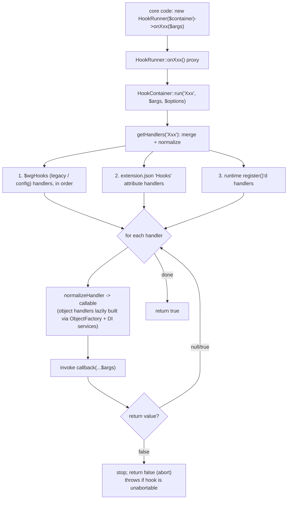

# Subsystem: Hooks & Extension Registration

> Part of the MediaWiki core senior-onboarding handbook. Scope: the universal
> extension point (`HookRunner`/`HookContainer`, the #1 most-connected node in
> the codebase), the `XxxHook::onXxx()` interface convention, how extensions and
> skins register themselves via `extension.json`/`skin.json`
> (`ExtensionRegistry`/`ExtensionProcessor`), and the newer Domain Event system
> that is intended to replace a certain class of hook.

## Responsibility & boundaries

This subsystem answers two coupled questions:

1. **"How does code in core (or one extension) let other code observe or
   override behaviour?"** — the **hook system**: `HookContainer` (the dispatcher
   service), the `HookRunner` classes (typed façades core calls through), and the
   `XxxHook` interfaces that define each extension point's contract.
2. **"How does an extension/skin announce its existence and wire itself in?"** —
   **extension registration**: `ExtensionRegistry` loads `extension.json` /
   `skin.json`, `ExtensionProcessor` turns the JSON into globals, autoloader
   entries, attributes, and (crucially for hook #1) the normalized `Hooks`
   attribute that `HookContainer` reads.

A third, newer piece lives here too: the **Domain Event system**
(`includes/DomainEvent/`, MW 1.44+) — an observer/listener mechanism that is a
deliberate *modern alternative* to hooks for "something changed" notifications,
sharing the same dispatch engine under the hood.

What is **out of scope** (owned by siblings): the DI container and service
factories themselves (→ `service-container-and-config`); what individual hooks
*do* (every other subsystem fires its own); deferred updates / the job queue that
domain-event listeners run on top of (→ `caching-deferred-jobs`).

Why this matters: `HookRunner` has ~1084 structural edges — by a wide margin the
most-connected node in core. Almost every feature in MediaWiki is reached, at
some point, through a hook. Understanding *exactly* how a hook is declared,
registered, and dispatched is foundational to reading the rest of the codebase.

## Internal structure (key files & their roles)

### Hook dispatch — `includes/HookContainer/`

- **`HookContainer.php`** — the one service that actually runs hooks
  (`@since 1.35`). It is **not** aware of hook interfaces or parameter types — it
  just holds normalized handler lists keyed by hook name and calls them.
  `run( $hook, $args, $options )` iterates handlers and applies the
  abort/deprecation/`noServices` logic. Also: `register()` (runtime/legacy
  registration), `scopedRegister()` (test-scoped, returns a `ScopedCallback`),
  `isRegistered()`, `getHandlerDescriptions()` (for Special:Version), and
  `salvage()` (preserves handlers across `MediaWikiServices::resetGlobalInstance()`
  — it implements `SalvageableService`).
- **`HookRunner.php`** — a ~140 KB generated-by-hand class that implements
  **every** core hook interface (the file starts with ~600 `implements
  \MediaWiki\…\Hook\XxxHook,` lines) and provides one `onXxx()` proxy method per
  hook that forwards to `$this->container->run( 'Xxx', [ ...args ] )`. This is the
  god node. It is marked `@internal` — core calls it; extensions must **not**.
  There are **three** core runner classes (see Hooks.md): `HookRunner` (general
  core), `ApiHookRunner` (Action-API hooks), and
  `ResourceLoader\HookRunner` (RL hooks). Some hooks appear in two runners.
- **`HookRegistry.php`** — interface with three getters: `getGlobalHooks()`
  (legacy `$wgHooks`), `getExtensionHooks()` (the normalized `Hooks` attribute),
  `getDeprecatedHooks()`.
- **`StaticHookRegistry.php`** — the immutable production implementation of
  `HookRegistry`; constructed in ServiceWiring from `$wgHooks` + the extension
  attributes. Also used to build local containers in tests.
- **`DeprecatedHooks.php`** — registry of deprecated core hooks (an inline
  `@phpcs-require-sorted-array` literal at the top, e.g. `ArticleDelete` →
  `[ deprecatedVersion => '1.37', silent => true ]`) plus any added by extensions.
  `markDeprecated()` throws if a hook is double-registered.
- **`ProtectedHookAccessorTrait.php`** — `getHookContainer()` /
  `getHookRunner()` helpers for **legacy classes not yet on DI**; they pull from
  the global `MediaWikiServices`. New code should inject `HookContainer` instead.

### Hook contracts — `includes/Hook/` (and `*/Hook/` throughout the tree)

~584 `XxxHook.php` interface files repo-wide (93 in `includes/Hook/` alone). Each
is a one-method interface named after the hook with `Hook` appended, method named
with `on` prepended (e.g. `EditFilterMergedContentHook::onEditFilterMergedContent()`).
They live in a `Hook` sub-namespace of the calling component
(`MediaWiki\Foo\Hook\…`). The interface doc comment carries `@stable to
implement` — this is the **extension-facing contract**; the method signature is
the API. Colons/dashes in legacy hook names become underscores in the
interface/method name (e.g. `SkinTemplateNavigation::Universal` →
`onSkinTemplateNavigation__Universal`).

### Extension registration — `includes/Registration/`

- **`ExtensionRegistry.php`** (`@since 1.25`) — the singleton that `queue()`s
  `extension.json`/`skin.json` paths, then `loadFromQueue()` reads+caches them and
  `exportExtractedData()` applies the results: merges globals into `$GLOBALS`
  (with per-key merge strategies), registers autoloader namespaces/classes,
  defines constants, stores **attributes**, and runs extension `callbacks`.
  Heavily caches the *processed* result in APC/local-server cache (keyed on a
  vary-hash of MW version, the queue, abilities, etc.) so the JSON is not
  re-parsed every request. `getAttribute( $name )` is the read API. It also
  implements `DomainEventSubscriber` and exposes `registerListeners()` to wire
  extension `DomainEventIngresses` into the event source.
- **`ExtensionProcessor.php`** — the workhorse that turns one decoded
  `extension.json` into globals + attributes + autoload data. `extractHooks()` is
  the load-bearing method for this subsystem: it decides, per hook entry, whether
  a handler is **legacy** (a function/string → goes into `$wgHooks` /
  `globals['wgHooks']`) or **new-style** (references a `HookHandlers` entry → goes
  into the `Hooks` *attribute*, normalized to
  `[ 'handler' => [ 'name' => "<ExtName>-<HandlerName>", 'class' => …, 'services' => … ], 'extensionPath' => … ]`).
  It throws `UnexpectedValueException` if `Hooks` references a handler name with no
  matching `HookHandlers` definition. `extractDomainEventIngresses()` does the
  analogous thing for events.
- **`Processor.php`** — the interface `ExtensionProcessor` implements.
- **`VersionChecker.php`** — validates `requires` constraints (MediaWiki version,
  PHP version, loaded PHP extensions, "abilities" like shell, and inter-extension
  dependencies) using Composer Semver.
- **`ExtensionJsonValidator.php`** + **`ExtensionJsonValidationError.php`** —
  validates an `extension.json` against `docs/extension.schema.v2.json`
  (JSON-Schema; no duplicate keys; SPDX license; `www.mediawiki.org` HTTPS URLs;
  supported `manifest_version`). Backs the `validateRegistrationFile` maintenance
  script and the structure test.
- **`ExtensionDependencyError.php`**, **`MissingExtensionException.php`** — error
  types for failed dependency/version checks and missing JSON files.

### Domain events — `includes/DomainEvent/` (`@since 1.44`)

- **`DomainEvent.php`** — immutable base class for event objects. Subclasses
  **must** call `declareEventType()` in their constructor; supports an event-type
  *chain* (an event can be compatible with multiple/parent types) and an
  `isReconciliationRequest()` flag (for catch-up/reindex passes, e.g. null edits).
- **`DomainEventDispatcher.php`** (interface) — `dispatch( $event, $dbProvider )`:
  delivers **after the current DB transaction commits**, never inside it;
  at-least-once semantics intended.
- **`DomainEventSource.php`** (interface) — `registerListener()` /
  `registerSubscriber()`: how listeners subscribe.
- **`DomainEventSubscriber.php`** / **`InitializableDomainEventSubscriber.php`** —
  subscriber contracts (bundle related listeners on one object).
- **`DomainEventIngress.php`** — base class extensions subclass; auto-discovers
  listener methods named `handle{EventType}Event()` for the event types declared
  in the subscriber's `events` spec.
- **`EventDispatchEngine.php`** — the concrete `DomainEventDispatcher` +
  `DomainEventSource`. **Key tribal fact:** it is implemented on top of
  `HookContainer` + `DeferredUpdates`, so every event type *also functions as a
  hook name*. There are two ways to observe an event: **synchronously** via a hook
  handler on that name, or **asynchronously / post-commit** via a registered
  listener (run through `DeferredUpdates`).

## Main flows

### 1. Dispatching a hook (the hot path)

A core component obtains a `HookContainer` by DI (or via
`ProtectedHookAccessorTrait` if legacy), wraps it in a `HookRunner`, and calls the
typed method:

```php
( new HookRunner( $this->hookContainer ) )->onArticleDelete( $page, $user, $reason, … );
```

`HookRunner::onArticleDelete()` just calls
`$this->container->run( 'ArticleDelete', [ $page, $user, &$reason, … ] )`.
`HookContainer::run()` then:



Ordering is fixed and load-bearing: **legacy `$wgHooks` handlers run first, then
new-style `Hooks`-attribute handlers, then runtime-registered ones** (so legacy
handlers get the first chance to abort). Return-value contract: `false` aborts and
returns `false`; `null`/`true` continues; **anything else throws**
`UnexpectedValueException`. A hook run with `abortable => false` throws if any
handler returns `false`. Handler callables are normalized lazily and cached per
container; object handlers are instantiated on first use via `ObjectFactory`
(which is what injects the declared `services`).

### 2. Registering & resolving a new-style (object) handler

In `extension.json`:

```json
"HookHandlers": {
    "main": {
        "class": "MediaWiki\\Extension\\Foo\\HookHandler",
        "services": [ "ReadOnlyMode" ]
    }
},
"Hooks": {
    "ArticleDelete": "main"
}
```

`ExtensionProcessor::extractHooks()` rewrites this into the `Hooks` *attribute*
with a unique handler `name` (`"Foo-main"`) and `extensionPath`. At dispatch time
`HookContainer::makeExtensionHandlerCallback()` calls
`ObjectFactory->createObject( $spec )` (instantiating the class with its injected
services, **cached by handler name** so one instance is shared across hooks) and
returns `[ $obj, 'onArticleDelete' ]`.

### 3. Static (function) handlers — the legacy path

A plain string/callable in `Hooks` (or anything in `$wgHooks`) is a **static
handler**: a free function or `Class::staticMethod`. No DI. `ExtensionProcessor`
routes these to `$wgHooks` (`globals['wgHooks']`, merged via
`array_merge_recursive`). This is the pre-1.35 style; new code uses object
handlers so it can take injected services.

### 4. Bootstrap order (where it all gets wired)

`includes/Setup.php` drives it: `ExtensionRegistry::getInstance()` gets its
`SettingsBuilder`, then `loadFromQueue()` (parse/cache/apply all queued
`extension.json` files — this is where `$wgHooks`, the `Hooks` attribute, and
`DeprecatedHooks` get populated), then `finish()` (after which **queuing another
extension throws** `LogicException`). The `HookContainer` service factory
(`ServiceWiring.php`, the `'HookContainer'` entry) then builds a
`StaticHookRegistry` from `$wgHooks` + the `Hooks` / `DeprecatedHooks` attributes.
The `MediaWikiServices` hook is fired from inside `MediaWikiServices` init
(`onMediaWikiServices()`), notably while the container is still being set up.
Deprecation warnings for hooks are emitted lazily via
`HookContainer::emitDeprecationWarnings()` (called from `ViewAction`, not at
bootstrap, to avoid the cost on every request).

## State & data it owns

- **`HookContainer`** owns the normalized, per-process handler lists
  (`$handlers`, `$handlerObjects`, `$extraHandlers`) and the shared handler-object
  instances. This is request-scoped state, not persisted.
- **`ExtensionRegistry`** owns the in-memory `loaded` credits map, the
  `attributes` array (including `Hooks`, `DeprecatedHooks`, `DomainEventIngresses`,
  and ~every other extension capability), and a **cache** of the processed
  registration data (APC/local-server cache, `CACHE_VERSION` bumped to invalidate).
  It mutates global state: `$GLOBALS` (config + `$wgHooks`), the autoloader, and
  PHP `define()`d constants.
- **`DeprecatedHooks`** owns the deprecated-hook registry.
- **`EventDispatchEngine`** owns listener/subscriber lists per event type
  (request-scoped).
- Persistent schema: **none** — this subsystem owns no DB tables. (`extension.json`
  files on disk are its source of truth, read at bootstrap.)

## Dependencies (in / out)

**Depends on (out):**
- `Wikimedia\ObjectFactory` — to build object hook handlers (and event
  subscribers) with their declared service dependencies. This is the bridge to
  `service-container-and-config`.
- `MediaWikiServices` / `ServiceWiring` — `HookContainer` is itself a registered
  service; object handlers receive injected services.
- `ObjectCache` (`BagOStuff`) — `ExtensionRegistry` caches processed registration.
- `Composer\Semver` — version-constraint checks.
- `DeferredUpdates` (`caching-deferred-jobs`) — domain-event listeners run as
  deferred, post-commit updates.
- `wfDeprecated` / `MWDebug` — deprecation warnings; `IConnectionProvider` — used
  by the event dispatcher to hook delivery onto transaction commit.

**Depended on by (in):** essentially **everything**. Every subsystem that fires a
hook (parser, output/skins, storage/revisions, action/REST API, auth, special
pages/editing, files, …) calls a `HookRunner`. ResourceLoader and the Action API
have their own runner classes. `SpecialPage\Hook`, `ApiQuerySiteInfo`, and
`SpecialVersion` read handler metadata. `service-container-and-config` consumes
the `HookContainer` factory and extension attributes; localisation/messages,
namespaces, jobs, etc. are all configured through extension attributes this
subsystem exports.

## Extension / customization points

This subsystem **is** MediaWiki's primary customization surface. The main knobs:

- **`extension.json` / `skin.json`** top-level keys (validated by
  `docs/extension.schema.v2.json`): `manifest_version`, `Hooks`, `HookHandlers`,
  `DeprecatedHooks`, `DomainEventIngresses`, `AutoloadClasses`/`AutoloadNamespaces`,
  `ServiceWiringFiles`, `config`, `MessagesDirs`, `attributes`, `requires`,
  `callback`, and many more (those others are owned by sibling subsystems).
- **Registering a handler**: `HookHandlers` (ObjectFactory spec, optionally with
  `services` / `optional_services`) + `Hooks` mapping a hook name to a handler.
  Object handlers implement the `XxxHook` interface.
- **Defining a hook** (for an extension that wants its own extension point):
  create a `XxxHook` interface in your `Hook` sub-namespace, add an `onXxx()` proxy
  to *your own* hook-runner class, and call it. Extensions should define their own
  runner rather than reuse core's `HookRunner` (which is `@internal` and may
  change).
- **Deprecating a hook**: core hooks go into `DeprecatedHooks`'s literal;
  extensions use the `DeprecatedHooks` attribute. Extensions **acknowledge**
  deprecation with `"deprecated": true` on a handler, enabling **call filtering**
  (the deprecated handler is silently skipped if-and-only-if MW knows the hook is
  deprecated — giving forward and backward compat across version skews). `silent:
  true` suppresses warnings during a soft-deprecation period.
- **Runtime registration**: `HookContainer::register()` (and `$wgHooks` in
  `LocalSettings.php`) for code outside extension.json; `scopedRegister()` for
  tests.
- **Domain events**: define a `DomainEvent` subclass, dispatch via
  `DomainEventDispatcher`; subscribe with a `DomainEventIngress` registered under
  the `DomainEventIngresses` attribute with an `events` list.

## Invariants & gotchas

These are enforced by structure/unit tests
(`tests/phpunit/unit/includes/HookContainer/`,
`tests/phpunit/unit/includes/Registration/`,
`tests/phpunit/structure/`) — breaking them fails CI:

- **Every `HookRunner` method must come from exactly one hook interface**, and no
  two interfaces may share a method name (`HookRunnerTestBase::testAllMethodsInheritedFromInterface`).
  A runner can't have a stray hook method.
- **Hook interface shape**: name ends in `Hook`, exactly one method, method starts
  with `on`, is public and non-static (`testHookInterfacesConvention`).
- **Runner → container fidelity**: every arg is forwarded to `run()` unchanged
  including **by-reference params**; the name passed to `run()` must map back to the
  method via the exact `'on' . ucfirst($hook)` normalization with `:`/`-` → `_`
  (`testHookContainerArguments`). The normalization is inlined (not a shared
  helper) **deliberately** — hooks are a hot path.
- **Abortability ↔ void contract**: a hook run with `abortable => false` must have
  a `void`-returning interface method, and vice versa. The only sanctioned
  exceptions are in two whitelist arrays in `HookRunnerTest` — a living registry of
  known tech debt ("ideally there should be none").
- **There is NO core test that all hooks are documented in `docs/Hooks.md`** —
  doc/coverage enforcement is via the reflection tests + Phan, not a doc test.
- **Broken handlers fail differently by registration path**: a bad callable passed
  to `register()` throws *immediately*; a bad callable that arrived via the
  registry/constructor is tolerated and only errors *if its hook actually fires*
  (`mayBeCallable()` even tolerates classes extending an unloadable parent). This
  is intentional: it lets you register handlers for hooks defined by an extension
  that may not be installed without fatals, while still surfacing genuine typos.
- **Returning a non-bool/non-null from a handler throws.** Returning `false`
  aborts (and breaks every later handler) — most callers don't check the return,
  so returning `false` from a non-abortable-by-convention hook just sabotages other
  extensions. Prefer by-reference "replacement" params, and only when the doc says
  replacement is expected.
- **Service injection is a double-edged sword**: some services are expensive or
  unsafe to build inside a hot/early hook. Use one handler per hook injecting only
  what it needs. A hook run with `noServices` throws if its handler declares
  services.
- **`getHandlers()` caches the normalized list per hook per container** — handlers
  registered after a hook first fires won't be seen for that hook (except via the
  `extraHandlers` merge path on first resolution). `salvage()` exists precisely to
  carry handler state across a services reset and throws if called after handlers
  already exist.
- **Registration ordering / `finish()`**: extensions load via the queue at
  bootstrap; queuing after `finish()` throws "tried to load late". The
  registration result is **cached** — bump `ExtensionRegistry::CACHE_VERSION` (or
  the schema's `MANIFEST_VERSION`) when the processing logic changes, or stale
  cache will bite.
- **Global merge strategies** matter: `$wgHooks` merges with
  `array_merge_recursive`; other globals use `array_plus`, `array_plus_2d`,
  `array_replace_recursive`, `provide_default`. A locally-set falsy value
  (`false`/`0`/`''`/`[]`) is **not** overwritten by an extension default (T100767),
  and re-`define()`ing a constant with a different value throws.
- **`extension.schema.v1.json` is frozen** (md5-asserted) — manifest_version 1
  must never gain features. Every global the processor can extract **must** be
  documented in the v2 schema or `ExtensionProcessorTest::testGlobalSettingsDocumentedInSchema`
  fails.
- **Domain events deliver after commit, never inside the transaction**, via
  `DeferredUpdates`; listeners must be **idempotent** (at-least-once). Event types
  double as hook names, so a synchronous in-transaction observer is still possible
  via a plain hook handler on the same name. `EventSubscriptionTest` checks that a
  declared ingress actually subscribes to exactly its declared `events`.
- **`@internal` on `HookRunner`**: extensions must not call core's runner; they
  should create their own. Core hook interfaces can be reorganized without notice
  for callers — the *interface* (`@stable to implement`) is the contract for
  *handlers*, not the runner.

## How to make a typical change here

> Toolchain note: commands below come from `composer.json`; **not run here** (no
> vendor/, no composer/php on PATH in this checkout).

**Add a new core hook:**
1. Create the interface `MediaWiki\Foo\Hook\MyThingHook` with a single
   `onMyThing( … )` method; document params; add `@stable to implement` (and
   `@since`) to the interface doc comment.
2. Add `\MediaWiki\Foo\Hook\MyThingHook,` to `HookRunner`'s `implements` list and
   an `onMyThing()` proxy method that calls `$this->container->run( 'MyThing', […] )`.
   Honor the abortability↔void rule (if you call it with `abortable => false`, make
   the interface method return `void`).
3. Fire it from your component via an injected `HookContainer` wrapped in
   `HookRunner` (don't reach for the global service locator in new code).
4. Regenerate the autoloader: `php maintenance/run.php generateLocalAutoload`
   (`AutoLoaderStructureTest` enforces it). Run the unit tests under
   `tests/phpunit/unit/includes/HookContainer/` — `HookRunnerTestBase` will police
   the interface/runner contract.
5. Document on mediawiki.org Manual:Hooks (no in-repo doc test, but it's expected).

**Handle an existing hook from an extension:** add a `HookHandlers` entry
(class + any `services`) and a `Hooks` mapping in `extension.json`; implement the
`XxxHook` interface on the handler class (omit the word "Hook" from the key in
`Hooks`). Prefer one small handler per hook injecting only what it needs.

**Deprecate a hook:** add it to `DeprecatedHooks` (core literal or the
extension.json attribute) with `deprecatedVersion`/`component`; mark the interface
`@deprecated` (on the *interface*, so implementing is deprecated, not just
calling). Use `silent: true` for the soft-deprecation phase. Tell migrating
extensions to acknowledge with `"deprecated": true` to activate call filtering.

**Add a domain event:** subclass `DomainEvent` (call `declareEventType()` in the
ctor); dispatch via the `DomainEventDispatcher` service after your write. Provide
an ingress (subclass `DomainEventIngress` with `handle{Type}Event()` methods) and,
for extensions, register it under `DomainEventIngresses` with an `events` list.

**Change extension.json processing:** edit `ExtensionProcessor`, update
`docs/extension.schema.v2.json` to match (or `ExtensionProcessorTest` fails), and
consider bumping `ExtensionRegistry::CACHE_VERSION` so cached registrations are
invalidated. Validate a file with the `validateRegistrationFile` maintenance
script.

## Foundation

- Module map for the PHP core: [`includes/AGENTS.md`](../../../includes/AGENTS.md)
  (see "The spine" — Hook system + `MediaWikiServices` are the top two hubs).
- Repo-wide map and conventions: [`AGENTS.md`](../../../AGENTS.md).
- Authoritative subsystem docs: [`docs/Hooks.md`](../../Hooks.md),
  [`docs/Events.md`](../../Events.md), [`docs/extension.schema.v2.json`](../../extension.schema.v2.json),
  and for the DI bridge [`docs/Injection.md`](../../Injection.md).
- Related handbook subsystems: `service-container-and-config` (ObjectFactory / DI
  that builds object handlers and event subscribers), `caching-deferred-jobs`
  (DeferredUpdates backing domain-event delivery), and every feature subsystem as
  a hook consumer (`parser-and-content-transform`, `output-skins-resourceloader`,
  `storage-revisions-content`, `action-api`, `rest-api`,
  `actions-special-pages-editing`, `auth-permissions-sessions`,
  `files-media-uploads`, `localisation`, `title-linking-namespaces`).
