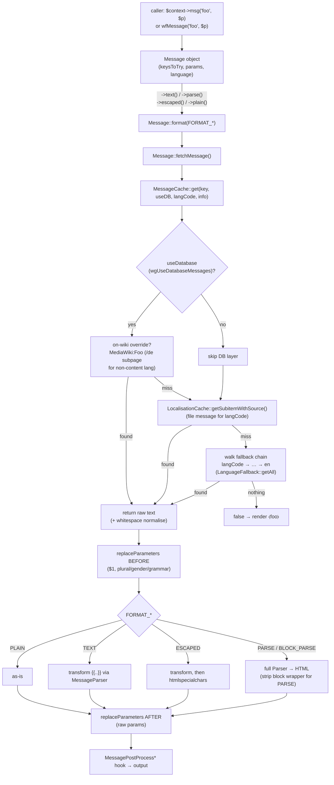

# Subsystem: Localisation (i18n / L10n)

> Part of the MediaWiki core senior-onboarding handbook. Foundation reading: root `AGENTS.md`, `includes/AGENTS.md`, and the authoritative (if terse) `docs/Language.md`. This document goes deep on how every UI string and locale-aware value is produced.

i18n/L10n is not a feature bolted onto MediaWiki — it is a defining constraint of the whole platform. The software ships in ~500 languages, every user-facing string is a translatable message, and "never hard-code UI English" is enforced by tooling (the banana checker). If you internalise one thing: **a message has a long, cached lifecycle from a JSON file on disk, through a language fallback chain, possibly overridden by an on-wiki `MediaWiki:` page, through parameter substitution (plural/gender/grammar), then escaped/parsed for the target output — and the escaping step is a security boundary.**

---

## Responsibility & boundaries

This subsystem owns:

1. **The Message system** — `Message` (the object behind `$context->msg()` and the `wfMessage()` god node, 262 graph edges), `RawMessage`, `MessageValue`/`MessageSpecifier` interop, and `MessageLocalizer` (the interface a context implements so callers can ask it for messages).
2. **Language objects** — `Language` (~165 KB, the locale behaviour bag: number/date formatting, directionality, plural/gender/grammar dispatch, namespace names) and its `LanguageXx` subclasses for languages whose rules can't be data-driven.
3. **The two caches** — `LocalisationCache` (the compiled merge of all *file-based* localisation data) and `MessageCache` (on-wiki `MediaWiki:` namespace overrides). These are the performance heart of the subsystem; see [caching-deferred-jobs](caching-deferred-jobs.md).
4. **The data on disk** — `languages/i18n/*.json` (translatable strings), `languages/messages/MessagesXx.php` (per-language config), `languages/data/` (CLDR-ish plural/grammar/collation data).
5. **Locale-aware formatting** — numbers, dates, lists, directionality (LTR/RTL), and **LanguageConverter** for script/variant conversion (zh-hans ↔ zh-hant, sr-latn ↔ sr-cyrl, etc.).

It does **not** own: wikitext parsing (it *calls* the parser for `->parse()`; see [parser-and-content-transform](parser-and-content-transform.md)), the `MediaWiki:` namespace page-storage mechanics (see [storage-revisions-content](storage-revisions-content.md) / [title-linking-namespaces](title-linking-namespaces.md)), or the ResourceLoader JS-side message delivery (`mw.msg`; see [output-skins-resourceloader](output-skins-resourceloader.md)).

---

## Internal structure (key files & their roles)

All PHP lives under `includes/Language/` (the directory is also reachable as `includes/language/` — case-insensitive on this macOS checkout, but the canonical namespace is `MediaWiki\Language\`). Message classes are namespaced `MediaWiki\Message\`.

### The Message system
- `includes/Language/Message/Message.php` (~48 KB) — the `Message` class. `@author Niklas Laxström`, "First implemented with MediaWiki 1.17 … intended to replace the old wfMsg* functions that over time grew unusable." Holds: `keysToTry` (fallback key list), `parameters`, target `language`, `isInterface` flag, `useDatabase` flag, `contextPage`. Implements `Stringable`, `MessageSpecifier`, `Serializable`.
- `includes/Language/RawMessage.php` — a `Message` whose "key" is literally the message text (used when you have wikitext in hand, not a key).
- `includes/Language/MessageLocalizer.php` — single-method interface `msg( $key, ...$params ): Message`. `IContextSource`, `Skin`, `OutputPage`, ResourceLoader `Context`, special pages, etc. all implement it. **This is the preferred entry point** because the localizer knows the correct language; `wfMessage()` falls back to global `RequestContext` and "in rare circumstances when sessions are not available … can lead to errors."
- `includes/Language/MessageInfo.php` — tiny value object the cache fills in during a lookup: `langCode` (which language the message was actually found in) and `usedKey` (which key resolved, after normalisation/overrides). `Message::fetchMessage()` uses it to record `fetchedLangCode` / `overriddenKey`.
- `wfMessage()` / `wfMessageFallback()` in `includes/GlobalFunctions.php:602/630` — thin wrappers over `Message::newFromSpecifier()` / `Message::newFallbackSequence()`. Legacy but ubiquitous; do not add new `wf*` helpers, but these two stay.

### Language objects & factory
- `includes/Language/Language.php` (~165 KB) — the base locale class. Key methods: `formatNum()` (3490), `sprintfDate()` (841), `convertPlural()` (4243), `convertGrammar()` (4090), `gender()` (4208), `getDir()`/`isRTL()` (3309/3301), `getNamespaces()` (340), `listToText()`/`commaList()` (3706/3732), `getMessageFromDB()` (663), `getFallbackLanguages()` (321). It reads everything from the injected `LocalisationCache`.
- `includes/Language/LanguageFactory.php` — the service that produces `Language` objects. `getLanguage($code)` normalises (via `DummyLanguageCodes` remaps + BCP-47), caches up to `LANG_CACHE_SIZE = 10` distinct objects (T40439), and `newFromCode()` picks the subclass: it tries `\MediaWiki\Languages\Language<Code>` (e.g. `LanguageZh`), then walks the fallback chain until a class exists, finally defaulting to base `Language`. Invalid built-in codes (uselang= hacks) get a bare `Language`.
- `includes/Languages/LanguageXx.php` (~33 subclasses, namespace `MediaWiki\Languages\`) — special-case rules that data can't express. Examples: `LanguageGa` overrides `convertGrammar()` for Irish; `LanguageZh extends LanguageZh_hans` and does Chinese segmentation; `LanguageAr`, `LanguageGa`, `LanguageHy`, etc. carry plural/grammar/gender quirks. Most languages need **no** subclass — they are pure data.
- `includes/Languages/LanguageQqx.php` — the magic `qqx` pseudo-language: instead of message *text* it returns the message *key* in parentheses. `?uselang=qqx` is the single most useful debugging tool in this subsystem (see Gotchas).

### Language metadata services
- `includes/Language/LanguageFallback.php` — resolves fallback chains. `getAll($code, $mode)` returns the chain; `LanguageFallbackMode` distinguishes `MESSAGES` (chain ends in `en`) vs `STRICT` (only explicit fallbacks, no implicit `en`).
- `includes/Language/LanguageNameUtils.php` — `isValidCode()` (syntax), `isValidBuiltInCode()` (internal-code form), `isSupportedLanguage()` (actually shipped), `getLanguageNames()`. `LanguageNameSearch.php` + `languages/data/LanguageNameSearchData.json` back the language-selector autocomplete.
- `includes/Language/LanguageCode.php` — converts between MediaWiki-internal codes and BCP-47 (`bcp47ToInternal()` and friends). The internal/BCP-47 split is a recurring source of confusion; `Language implements Bcp47Code`.

### LanguageConverter (script/variant conversion)
- `includes/Language/LanguageConverter.php` (~38 KB) — converts text between writing variants of one language (e.g. Simplified ↔ Traditional Chinese). `static $languagesWithVariants` lists which languages have variants.
- `includes/Language/LanguageConverterFactory.php` — maps a base code to a converter class (`ZhConverter`, `SrConverter`, `KuConverter`, …, in `includes/Language/Converters/`). Returns `TrivialLanguageConverter` for languages without variants. Honours `$wgDisableLangConversion`.
- `includes/Language/ConverterRule.php` — parses the `-{ … }-` conversion markup. `ILanguageConverter` is the interface.

### The caches & their storage
- `includes/Language/LocalisationCache.php` (~46 KB) — compiled per-language data. Holds ~25 data categories (see "State & data it owns"). Pluggable backend via `LCStore`.
- `includes/Language/LCStore*.php` — backends: `LCStoreCDB` (binary CDB files), `LCStoreDB` (`l10n_cache` SQL table), `LCStoreStaticArray` (PHP `.l10n.php` arrays that ride the opcache, with *late fallback*), `LCStoreNull` (no-op, for the installer). Selected by `$wgLocalisationCacheConf['store']` (`files`/`db`/`array`/`detect`).
- `includes/Language/Dependency/` — `FileDependency` (file mtimes), `MainConfigDependency` (config values like `ExtensionMessagesFiles`), `ConstantDependency` (class constants like `LocalisationCache::VERSION`). These decide when the cache is stale.
- `includes/Language/MessageCache.php` (~55 KB) — on-wiki `MediaWiki:` overrides, with a 4-level cache hierarchy (process → local-server → cluster WAN → DB).
- `includes/Language/MessageParser.php` — the `{{PLURAL}}/{{GRAMMAR}}/{{GENDER}}` + template transform engine used when a message needs `->parse()`/`->text()` (MessageCache's own `transform()`/`parse()` are deprecated since 1.44 and delegate here).

---

## Main flows

### A. Compile-time (build): file data → LocalisationCache

This happens during install/update or via `php maintenance/run.php rebuildLocalisationCache` (`maintenance/rebuildLocalisationCache.php`; `--force`, `--threads=N`, `--lang=codes`). For each language `recache($code)`:

1. Read core `MessagesXx.php` (namespace names, magic words, formats, `$fallback`, …) and register a `FileDependency` on it.
2. Read plural rules from `languages/data/plurals.xml` (+ `plurals-mediawiki.xml`) and compile them.
3. Read all `*.json` from every dir in `$wgMessagesDirs` (core: `languages/i18n/`; plus every extension's) for `$code` and each fallback code.
4. Read extension `$wgExtensionMessagesFiles` (legacy PHP i18n).
5. **Merge across the fallback chain** with per-key strategies: maps (`messages`, `namespaceNames`, …) union with `+`; `specialPageAliases` merge recursively; `magicWords` have bespoke merge; core-only keys (`fallback`, `rtl`, transform tables, …) never merge from extensions.
6. Fire `onLocalisationCacheRecache` / `onLocalisationCacheRecacheFallback` hooks.
7. Write to the `LCStore`, tagging each message with its source language (`"de:…"`) so MessageCache can later stop the fallback walk at the right place.

**Why cache at all?** Without it, every request would `stat()` and parse dozens of JSON/PHP files per language and re-run the fallback merge (e.g. `zh-cn → zh-hans → en`). The compiled cache pre-merges this once. `manualRecache` mode further avoids the per-request `stat()` of every extension i18n file. `LCStoreStaticArray` (1.46+) additionally leverages PHP opcache and dedups via *late fallback* (merge fallbacks at read time, keeping `.l10n.php` files ~80% smaller).

### B. Run-time: `key → text/HTML` (the message-resolution path)

The lookup order inside `MessageCache::get()` is the crux: **on-wiki `MediaWiki:` override (if `useDB`) beats the shipped file message, and a more-specific language beats a fallback.** For a non-content language the override is read from a language subpage (`MediaWiki:Foo/de`); for the content language it's the bare page (`MediaWiki:Foo`). The fallback walk stops once it reaches the source language that provided the shipped default (tracked via `getSubitemWithSource()`), preventing loops.

Format selection (`Message::format()`, line 1036) maps the five `FORMAT_*` constants to behaviour and is where the **escaping security boundary** lives — see Gotchas. Note `__toString()` always uses `FORMAT_PARSE` (a deliberate "safe by default" choice, security fix T146416), so string-interpolating a `Message` is escaped, but calling the wrong explicit method is not.

### C. On-wiki edit: invalidating MessageCache across the cluster

When an admin saves `MediaWiki:Sidebar`, the `PageSaveComplete` path calls `MessageCache::replace()`, which (1) updates the in-process cache immediately, then (2) queues a `MessageCacheUpdate` deferred update that, after the DB commit, refreshes the local-server and cluster (WAN) caches and **touches a WAN check-key** so every other app server treats its local copy as volatile and re-reads from the DB replica. Small messages live in a serialised per-language blob; messages over `$wgMaxMsgCacheEntrySize` are stubbed `!TOO BIG` in the blob and fetched individually from WAN cache.

---

## State & data it owns

### On disk — the source-of-truth split (critical mental model)

| Path | Format | Contents | Edited by |
|------|--------|----------|-----------|
| `languages/i18n/en.json` | JSON | **English source strings.** `@metadata.authors` + `key → value`. Values may contain `$1`, `{{PLURAL:$1|…}}`, `{{GENDER:…}}`. | **Developers** (in core, with the code change) |
| `languages/i18n/qqq.json` | JSON | **Documentation** for each message: what it means, what each `$1` is, context. One entry per `en.json` key. | Developers (mandatory alongside `en.json`) |
| `languages/i18n/<code>.json` | JSON | **Translations** (de, fr, zh-hans, …). ~500 files. | **translatewiki.net only** — do NOT hand-edit in core |
| `languages/i18n/<subdir>/` | JSON | Domain-scoped message bundles: `datetime/`, `preferences/`, `exif/`, `botpasswords/`, `interwiki/`, `userrights/`, `languageconverter/`, `codex/`, … each with its own en/qqq/per-language files | en/qqq by devs; rest by translatewiki |
| `languages/messages/MessagesXx.php` | PHP | Per-language **config, not translatable prose**: `$fallback`, `$rtl`, `$namespaceNames`, `$namespaceAliases`, `$namespaceGenderAliases`, `$specialPageAliases`, `$magicWords`, `$digitTransformTable`, `$separatorTransformTable`, `$dateFormats`, `$defaultDateFormat`, `$bookstoreList`, `$linkTrail`, etc. | Developers / language maintainers |
| `languages/data/plurals.xml`, `plurals-mediawiki.xml` | XML | CLDR plural rules (one/few/many/other per language) | Imported from CLDR |
| `languages/data/grammarTransformations/<code>.json` | JSON | Regex-based noun-inflection rules for grammatical cases (e.g. Russian genitive) — used by `{{GRAMMAR}}` for project names | Language maintainers |
| `languages/data/LanguageNameSearchData.json` | JSON | Generated search index of language names | Generated (`languageNameIndexer.php`) |
| `languages/data/first-letters-root.php` | PHP | Collation first-letter data for category indexing | Generated/maintained |

**Why two file formats?** JSON files hold the *translatable* strings (clean key→value, ideal for the translatewiki.net workflow and the banana checker). `MessagesXx.php` hold *executable/structural* config (namespace names that double as parser tokens, magic-word regexes, format strings) that predates JSON and isn't word-for-word translation. New translatable text always goes in JSON; new structural language config goes in the PHP file.

**The translatewiki.net workflow** is the single most important tribal fact here: developers write `en.json` + `qqq.json`; translators work on translatewiki.net; a bot periodically syncs the per-language `<code>.json` files back into core (and into extensions). **Editing `de.json` directly in a core patch is wrong** — it will be overwritten and it bypasses the translator community. Fix translations on translatewiki, not in Gerrit.

### In memory / persistent caches

- **LocalisationCache** holds, per language: `messages`, `namespaceNames`, `namespaceAliases`, `namespaceGenderAliases`, `magicWords`, `specialPageAliases`, `fallback`/`fallbackSequence`, `rtl`, `digitTransformTable`, `separatorTransformTable`, `numberingSystem`, `dateFormats`/`jsDateFormats`/`datePreferences`/`defaultDateFormat`, `imageFiles`, `bookstoreList`, `linkTrail`/`linkPrefixCharset`, `pluralRules`/`compiledPluralRules`/`pluralRuleTypes`, `preloadedMessages`, plus metadata keys `deps`/`list`/`preload`. The unit test `LocalisationCacheTest::testAllKeysSplitIntoCoreOnlyAndNonCoreOnly` pins the invariant that `CORE_ONLY_KEYS` (settable only in core `MessagesXx.php`, never by extensions) and the rest partition `ALL_KEYS` exactly.
- **MessageCache** holds the on-wiki `MediaWiki:` overrides as a serialised per-language blob (4-level: process LRU `MAX_REQUEST_LANGUAGES`, local APC, WAN memcached `TTL_DAY`, DB authoritative).

---

## Dependencies (in / out)

**In (what this subsystem needs):**
- `MediaWikiServices` / `ServiceWiring.php` for all wiring — `ContentLanguage` (772), `LanguageFactory` (1240), `LanguageFallback` (1254), `LanguageNameUtils` (1268), `LanguageConverterFactory` (1230), `LeximorphFactory` (1278), `LocalisationCache` (1374), `MessageCache` (1491), `MessageFormatterFactory` (1522), `MessageParser` (1526), `FormatterFactory` (1030). See [service-container-and-config](service-container-and-config.md).
- `$wg*` config: `UseDatabaseMessages`, `MaxMsgCacheEntrySize`, `AdaptiveMessageCache`, `LocalisationCacheConf`, `CacheDirectory`, `MessagesDirs`, `ExtensionMessagesFiles`, `DummyLanguageCodes`, `GrammarForms`, `DisableLangConversion`, `LanguageCode` (the wiki's content language).
- The DB/RDBMS layer (MessageCache `l10n`/page reads; `LCStoreDB`) — see [database-rdbms](database-rdbms.md).
- The object-cache stack (WAN/local/APC) — see [caching-deferred-jobs](caching-deferred-jobs.md).
- The Parser, but only lazily, for `->parse()`/`->parseAsBlock()` — see [parser-and-content-transform](parser-and-content-transform.md).
- The Hook system — see [hooks-and-extension-registration](hooks-and-extension-registration.md).
- `wikimedia/cldr-plural-rule-parser`, `wikimedia/bcp-47-code`, `wikimedia/message-*` (`MessageValue`, `ParamType`, `ListType`) Composer libraries.

**Out (who depends on this):** essentially *everything*. `wfMessage()` is one of the most-connected nodes in the codebase (262 graph edges spanning >120 communities — skins, special pages, API, output, auth, every error path). Any code that produces user-facing text or a locale-aware value goes through here.

---

## Extension / customization points

1. **Add messages** — extensions ship their own `i18n/` dir registered via `extension.json` `"MessagesDirs"`; same en.json/qqq.json/per-language layout. Translatewiki picks them up too.
2. **On-wiki overrides** — admins edit `MediaWiki:<key>` (or `MediaWiki:<key>/<lang>`) when `$wgUseDatabaseMessages` is on. This is how site-specific wording and the sidebar/license footer are customised without code.
3. **Language subclasses** — `includes/Languages/LanguageXx.php` for plural/gender/grammar/segmentation rules that data can't express. Rare; prefer data.
4. **LanguageConverters** — `includes/Language/Converters/XxConverter.php` registered in `LanguageConverterFactory` for new variant languages.
5. **Hooks** — `LocalisationCacheRecache`/`LocalisationCacheRecacheFallback` (inject data at compile time), `MessageCacheFetchOverrides` (programmatic key→value override), `MessagesPreLoad`, `MessagePostProcessText`/`MessagePostProcessHtml` (post-process formatted output), `MessageCache::get` override hook.
6. **`$wgGrammarForms`** — config-driven grammar overrides without a subclass.

---

## Invariants & gotchas

### Escaping: `->text()` vs `->parse()` vs `->escaped()` vs `->plain()` (security boundary)
This is the #1 source of XSS in MediaWiki. Pin the contract (encoded in `MessageTest::testToString`):
- `->plain()` — text as-is, parameters substituted, **no transform, no escaping**. Almost never what you want for HTML output.
- `->text()` — `{{…}}` transforms run (plural/gender/grammar/templates), **but no HTML escaping**. Safe only when the result goes somewhere already escaped or non-HTML (e.g. an HTML *attribute value* set via a builder that escapes, a log line, a textarea body).
- `->escaped()` — transform **then `htmlspecialchars`**. The right choice when inserting message text directly into HTML.
- `->parse()` / `->parseAsBlock()` — full wikitext→HTML parse; output is HTML and is sanitised. Use when the message is meant to contain wiki markup/links.
- `(string)$msg` / `"$msg"` — implicitly `->parse()` (safe-by-default, T146416). Convenient but heavyweight; don't interpolate in hot loops.
- A **missing** message renders `⧼key⧽` (using `⧼`/`⧽`, not `<>`, to dodge double-escaping) — a visible red flag, never silent.
- **Raw parameters** (`->rawParams()`) bypass escaping and are substituted *after* the escape step — that is their entire (dangerous) purpose; only pass already-safe HTML.

### `{{PLURAL}}`, `{{GENDER}}`, `{{GRAMMAR}}` and `$1`
- Parameters are positional: `$1`, `$2`, … Numbers beyond the supplied params are left literal.
- **Never concatenate translated fragments.** Word order, plural agreement, and grammar differ per language; build the full sentence as one message with parameters so translators can reorder. "You have $1 {{PLURAL:$1|message|messages}}" — not `"You have " . $n . pluralWord`.
- `convertPlural()` (Language.php:4243) consults Leximorph/CLDR compiled rules and supports explicit `0=…`/`n=…` forms via `handleExplicitPluralForms()`. Plural rules fall back along the language chain (`LocalisationCacheTest::testPluralRulesFallback`: `arz` inherits `ar`).
- `gender()` needs the *user* whose gender it depends on, not the viewer.

### Caches
- **After adding/changing a message you must rebuild the LocalisationCache** in some setups (`php maintenance/run.php rebuildLocalisationCache`, or it auto-recaches when a `FileDependency` mtime changes — but `manualRecache`/`forceRecache` setups won't). Stale cache = stale or missing message.
- The LocalisationCache is the **file** layer; the MessageCache is the **on-wiki** layer. A message can exist in one and not the other. `useDatabase(false)` / `->inContentLanguage()->useDatabase(false)` skips the on-wiki layer (used when the on-wiki override must not apply, e.g. some maintenance/security contexts).
- Editing a `MediaWiki:` page only propagates cluster-wide via the deferred `MessageCacheUpdate` + WAN check-key touch — there's no synchronous global flush.

### Language codes
- Two code spaces: MediaWiki-internal (`be-tarask`, underscores in some legacy spots) vs BCP-47 (`be-tarask` mostly aligns but not always). Convert via `LanguageCode`; validate user input with `LanguageNameUtils::isValidCode()` *before* `LanguageFactory::getLanguage()`.
- `qqq` is the documentation pseudo-language and is **not** a real language (`isSupportedLanguage('qqq') === false`).

### Debugging
- `?uselang=qqx` renders every message as its `(key)` — instantly tells you which message produces a given string and what fallback keys exist. Indispensable.
- `?uselang=<code>` forces a UI language; `?variant=<v>` forces a LanguageConverter variant.

### The banana checker (build invariant)
`npm run lint` runs `grunt-banana-checker` over each `languages/i18n/` dir (config in `Gruntfile.js`). It enforces: **every `en.json` key has a `qqq.json` entry and vice-versa**, parameter (`$1`…) consistency between source and translations, no blank/invalid keys, valid JSON. CI fails otherwise. Structure tests (`ApiStructureTest`) additionally assert that API error/param codes have matching i18n messages. *(Commands cited from `package.json`/`Gruntfile.js`; not run here — no toolchain in this checkout.)*

---

## How to make a typical change here

**Add a new UI message:**
1. Add the key + English text to `languages/i18n/en.json` (use `$1` params, `{{PLURAL}}`/`{{GENDER}}` as needed; never hard-code English in PHP/JS).
2. Add a matching entry to `languages/i18n/qqq.json` documenting the message and each parameter — banana requires it.
3. Use it: `$this->msg( 'my-key', $count )->escaped()` (HTML context) / `->text()` (already-escaped context) / `->parse()` (wikitext message). Prefer a `MessageLocalizer` (`$context->msg()`) over `wfMessage()`.
4. Do **not** add `de.json`/`fr.json` etc. — translators handle those on translatewiki.net.
5. If your test or environment uses a non-auto-recaching LocalisationCache, run `php maintenance/run.php rebuildLocalisationCache` (*not run here*).
6. For JS use, expose the key via a ResourceLoader module's `messages` and read with `mw.msg()` — see [output-skins-resourceloader](output-skins-resourceloader.md).

**Add per-language config** (namespace name, magic word, special-page alias): edit the relevant `languages/messages/MessagesXx.php` variable — not JSON.

**Add a language quirk** that data can't express: add/extend `includes/Languages/LanguageXx.php` overriding `convertPlural`/`convertGrammar`/`gender`; back it with `LanguageTest` cases.

**Change locale formatting** (numbers/dates/lists): work in `Language.php` (`formatNum`, `sprintfDate`, `listToText`) and pin behaviour in `LanguageTest`.

---

## Foundation

- **Authoritative doc:** `docs/Language.md` (terse — this handbook page is the practical expansion of it). External: <https://www.mediawiki.org/wiki/Localisation>, <https://www.mediawiki.org/wiki/Manual:Messages_API>, the translatewiki.net workflow.
- **Foundation maps:** root `AGENTS.md`, `includes/AGENTS.md` (which lists `Language/`, `Languages/` under the core map).
- **Tests that encode the contract:** `tests/phpunit/includes/Language/MessageTest.php` (params, escaping, fallback keys), `MessageCacheTest.php` (on-wiki fallback, key normalisation, cacheability), `LocalisationCacheTest.php` (plural & message fallback, core-only key partition), `LanguageFallbackTestTrait`, `LanguageNameUtilsTestTrait`, `LanguageConverterTest`.
- **Sibling docs to cross-reference:** [caching-deferred-jobs](caching-deferred-jobs.md) (LocalisationCache `LCStore`, MessageCache WAN/local layers, `MessageCacheUpdate` deferred update), [output-skins-resourceloader](output-skins-resourceloader.md) (JS `mw.msg`, `MessageBlobStore`, directionality in skins), [parser-and-content-transform](parser-and-content-transform.md) (`->parse()` path), [storage-revisions-content](storage-revisions-content.md) / [title-linking-namespaces](title-linking-namespaces.md) (`MediaWiki:` namespace storage), [service-container-and-config](service-container-and-config.md) (service wiring + `$wg*`), [hooks-and-extension-registration](hooks-and-extension-registration.md) (recache/override hooks, `MessagesDirs`).
- **Graph:** `wfMessage()` is a top god node (262 edges); per `graphify-out/GRAPH_REPORT.md` ~260 of its edges are *inferred* (model-reasoned, unverified) — treat that fan-out as "touches nearly everything," not as a precise call list.

### Open questions
- The exact default of `$wgMaxMsgCacheEntrySize` (the small-vs-`!TOO BIG` threshold) was not read here — confirm in `MainConfigSchema.php` before relying on a number.
- Whether `LCStoreStaticArray` is the *default* store in 1.47 (vs CDB/`detect`) — `getStoreFromConf()` with `'detect'` chooses at runtime; the resolved default per environment was not traced end-to-end.
- The precise current sync cadence/tooling for translatewiki.net → core JSON (bot identity/frequency) is external to this repo and not verifiable from the code here.
- Leximorph (`LeximorphFactory`, `$wgUseLeximorph`) appears to be a newer plural/grammar provider layered in front of the classic CLDR path; its full scope and rollout status were not deeply traced.
