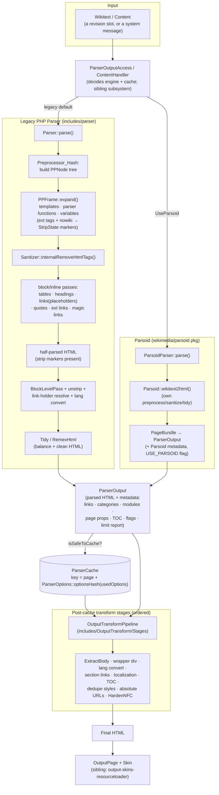

# Subsystem: Parser & Content Transformation

*Part of the MediaWiki core senior-onboarding handbook. Scope: `includes/parser/` (the
legacy PHP Parser + Parsoid glue), `includes/OutputTransform/` (the post-parse pipeline),
and `includes/Tidy/` (the RemexHtml-based HTML tidier). For how parsing fits into the
request lifecycle and the service container, see the foundation docs linked at the bottom.*

> **Read this first if you remember nothing else:** wikitext is turned into HTML in **two
> distinct phases by two different engines that produce the *same* container object,
> `ParserOutput`**, and the cached `ParserOutput` is then run through a *second*,
> independent pipeline (`OutputTransform`) before it becomes the HTML a skin emits.
> There are now **two parsers** — the legacy `Parser` (still the default for most page
> views) and **Parsoid** (`wikimedia/parsoid`, a separate Composer package that core is
> actively migrating to). They share `ParserOutput`, `ParserOptions`, `StripState`, and
> the parser-test fixtures, but almost nothing else. Most of the subtlety in this
> subsystem comes from that dual reality and from the **parser cache fragmentation** rules.

---

## Responsibility & boundaries

This subsystem owns the transformation **wikitext (or other content) → safe HTML +
rendering metadata**, plus the supporting machinery: template/parser-function/magic-word
expansion, HTML sanitization, the post-parse output pipeline, and the parser-test
behavioral contract.

**In scope**
- The legacy PHP `Parser` and its preprocessor, magic words, parser functions, tag hooks, strip state, link holders, and block-level/list handling.
- `ParserOutput` — the universal result object carrying both HTML and metadata (god node, ~163 graph edges).
- `Sanitizer` — the HTML-safety boundary (god node, ~163 graph edges).
- `ParserOptions` — the knobs that control a parse *and* fragment the parser cache.
- The `OutputTransform` pipeline (post-cache → final HTML).
- The `Tidy` (RemexHtml) HTML-correctness driver.
- The thin core-side **Parsoid glue** in `includes/parser/Parsoid/` (NOT Parsoid internals).
- The parser-test fixture format and harness (the cross-engine behavioral contract).

**Explicitly NOT in scope (owned by sibling docs or external packages)**
- **Parsoid internals** — they live in the `wikimedia/parsoid` Composer package, not this repo. We document only the *seams* where core calls into it.
- **Where parses are triggered & cached at the page level** — `ParserOutputAccess` (`includes/Page/`), `ContentHandler`/`WikitextContentHandler` (`includes/Content/`), `RevisionRenderer` (`includes/Revision/`). See `storage-revisions-content`.
- **The parser cache *storage* backend** — `ParserCache`/`ParserCacheFactory`/`RevisionOutputCache` physically live in `includes/parser/` but are storage; cache strategy/invalidation policy is shared with `caching-deferred-jobs`. We cover only the *cache-key/fragmentation* contract here because it is driven by `ParserOptions`.
- **How `ParserOutput` is merged into the page and emitted** — `OutputPage`, skins, ResourceLoader. See `output-skins-resourceloader`.
- **Language variant conversion internals** — see `localisation`.
- **Title/link resolution** — see `title-linking-namespaces`.

The hard boundary worth internalizing: **`Sanitizer` is the security boundary.** Anything
that emits HTML from user-controlled wikitext must pass through it (or through Parsoid,
which has its own sanitization). Bypassing it is how XSS gets into a wiki.

---

## Internal structure (key files & their roles)

### The legacy parser core (`includes/parser/`)
- **`Parser.php`** (~217 KB, the largest single file in core). The legacy engine. Has *seven* documented public entry points (listed verbatim in its docblock): `parse()` (→ HTML), `preSaveTransform()` (→ altered wikitext, e.g. signature/`~~~~` expansion), `preprocess()` (strip comments + expand templates), `cleanSig()`/`cleanSigInSig()`, `getSection()`, `replaceSection()`, `getPreloadText()`. It is **stateful and not reentrant** (see Invariants) — it must be obtained per-parse, never held.
- **`ParserFactory.php`** — the DI-friendly way to get a legacy `Parser`. `create()` builds a fresh one; `getInstance()` returns a shared "main" instance unless it is locked (mid-parse), in which case it creates a new one. `getMainInstance()` is for *metadata* reads, not parsing. The raw `Parser` service exists but is deprecated in favor of the factory.
- **`Preprocessor.php` / `Preprocessor_Hash.php`** — abstract preprocessor + the only implementation (`Preprocessor_Hash`, a pure-PHP tree builder; the old DOM-based one is gone). Turns wikitext into a `PPNode` tree, expanded by a `PPFrame`. The `PP*` files (`PPFrame_Hash`, `PPNode_Hash_*`, `PPDStack_Hash`, `PPTemplateFrame_Hash`, …) are the node/frame/stack types of that tree. Brace-matching rules (`{{…}}`, `{{{…}}}`, `[[…]]`, `-{…}-`) are declared as data in `Preprocessor::$rules`.
- **`StripState.php`** — the "strip marker" mechanism. During a parse, fragile content (nowiki, extension-tag output, raw HTML) is replaced by **unique, unguessable markers** (`Parser::MARKER_PREFIX`…`MARKER_SUFFIX`, built around `\x7f` which is illegal in XML) and stashed in the strip state, then **unstripped** at the right moment so later passes don't mangle it. Enforces a **depth limit (20)** and **size limit (5 MB)** to stop recursive/runaway unstripping. New `addExtTag`/`addParsoidOpaque` types (1.44) are Parsoid-only.
- **`MagicWord.php` / `MagicWordArray.php` / `MagicWordFactory.php`** — magic words = localizable keywords (`{{CURRENTDAY}}`, `__NOTOC__`, parser-function names, image params). The factory holds the canonical lists of variable IDs and double-underscore IDs and lets extensions extend them via the `GetMagicVariableIDs` / `GetDoubleUnderscoreIDs` hooks. See `docs/magicword.md`.
- **`CoreParserFunctions.php`** (~65 KB) — implementations of `{{#if:}}`, `{{#switch:}}`, `{{lc:}}`, `{{ns:}}`, `{{PAGESIZE}}`, etc. **`CoreMagicVariables.php`** — the `{{CURRENT*}}`/`{{REVISION*}}` variable values. **`CoreTagHooks.php` / `ParserCoreTagHooks.php`** — built-in tags (`<pre>`, `<nowiki>`, `<gallery>`, …).
- **`Sanitizer.php`** (~65 KB) — the HTML-safety boundary: tag/attribute allow-lists, CSS sanitization, character-reference normalization, ID/anchor escaping. Used by both the legacy parser and many non-parser callers; it is intentionally framework-light. Now drives RemexHtml for tokenization.
- **`LinkHolderArray.php`** — internal-link placeholders. Links are emitted as `<!--LINK-->` placeholders during the parse and **batch-resolved** at the end (one DB lookup for existence/redirect status of all links) — a key performance trick. See `title-linking-namespaces`.
- **`BlockLevelPass.php`** — converts line-based wikitext (lists, `:` indents, `;` definition terms, paragraphs) into block HTML. **`DateFormatter*`** — `[[date]]` magic-link formatting.
- **`ParserOutput.php`** (~125 KB, **god node**) — see "State & data it owns".
- **`ParserOptions.php`** (~59 KB) — the parse knobs and the **cache-fragmentation engine**; see "State & data it owns".
- **`ParserOutputFlags.php` / `ParserOutputLinkTypes.php` / `ParserOutputStringSets.php`** — typed enums for the contents of `ParserOutput` (flags like `VARY_REVISION`, `USE_PARSOID`, `PREVENT_SELECTIVE_UPDATE`).
- **`ParserCache.php` / `ParserCacheFactory.php` / `RevisionOutputCache.php` / `CacheTime.php` / `ParserCacheMetadata.php` / `ParserCacheFilter.php`** — parser-cache storage (covered only at the key-contract level here).
- **`ParserObserver.php`** — `@internal` diagnostics that logs *redundant* parses (same page + revid + options-hash + content-sha1 parsed twice). A good signal when hunting performance regressions.
- **`ContentHolder.php`** (1.45, `@internal`/`@unstable`) — a newer abstraction that holds page content as **either an HTML string or a Parsoid DOM fragment**, converting lazily. It exists so OutputTransform stages can avoid repeated string⇄DOM round-trips (each conversion is costly). It deliberately does **not** preserve content outside `<body>`.

### Parsoid glue (`includes/parser/Parsoid/`)
This is core's *adapter* to the external Parsoid package, not Parsoid itself.
- **`ParsoidParser.php`** (1.41, `@unstable`) — the Parsoid-backed parser. Its `parse()` builds a Parsoid `PageConfig` from `ParserOptions` + revision and calls `Parsoid::wikitext2html()`, then converts the returned page-bundle into a `ParserOutput` via `PageBundleParserOutputConverter`. Note the docblock: *"eventually this will extend `\Parser`"* — the two parsers are meant to converge on one interface (tracked in **T236809**).
- **`ParsoidParserFactory.php`** — the Parsoid equivalent of `ParserFactory`.
- **`HtmlToContentTransform.php` / `HtmlTransformFactory.php`** — the **reverse** direction (html2wt), used by VisualEditor/REST.
- **`LanguageVariantConverter.php`, `PageBundleParserOutputConverter.php`, `LintErrorChecker.php`, `Config/`** — variant conversion, page-bundle↔ParserOutput mapping, linting, and the `SiteConfig`/`PageConfig`/`DataAccess` implementations that let Parsoid read this wiki.

### Output transform pipeline (`includes/OutputTransform/`)
- **`OutputTransformPipeline.php`** — runs an ordered list of stages over a `ParserOutput`, clones it first (unless `allowClone:false`), and asks each stage `shouldRun()` before `transform()`.
- **`DefaultOutputPipelineFactory.php`** — declares the canonical, ordered `CORE_LIST` of stages and builds the pipeline via `ObjectFactory`. Extensions append stages through the `OutputPipelineStages` config. **The ordering comments in this file are load-bearing** (e.g. language conversion must precede section-link handling and TOC localization).
- **`OutputTransformStage.php` / `TextTransformStage.php` / `DOMTransformStage.php` / `ContentDOMTransformStage.php` / `ContentTextTransformStage.php` / `ContentHolderTransformStage.php`** — the stage base classes. Several transforms have **both a text and a DOM implementation** (e.g. `HandleTOCMarkersText`/`DOM`, `DeduplicateStylesText`/`DOM`); `ContentHolderTransformStage` picks the right one to minimize string⇄DOM conversions.
- **`Stages/`** — the concrete stages: `ExtractBody`, `AddRedirectHeader`, `RenderDebugInfo`, `AddWrapperDivClass`, `ExpandRelativeAttrs`, `ParsoidLanguageConverter`, `HandleSectionLinks`/`HandleParsoidSectionLinks`, `ParsoidLocalization`, `HandleTOCMarkers*`, `DeduplicateStyles*`, `ExpandToAbsoluteUrls*`, `HydrateHeaderPlaceholders`, `HardenNFC` (final NFC normalization — always last), and the hook-execution stages (`ExecuteFirstStageTransformHooks`, `ExecutePostCacheTransformHooks`, `ExecuteLastStageTransformHooks`).
- **`Hook/`** — `OutputTransformFirstStageHook` / `OutputTransformLastStageHook`.

  > Historical note (from `OutputTransform/README.md`): this pipeline is the refactored
  > extraction of what used to live inside `ParserOutput::getText()`. If you find old code
  > or docs talking about "what `getText()` does," it now means "what the pipeline does."

### HTML tidy (`includes/Tidy/`)
- **`RemexDriver.php`** — the only real tidy driver; runs HTML through **RemexHtml** (the `wikimedia/remex-html` package: a spec-compliant HTML5 tokenizer/tree-builder) to produce well-formed, balanced HTML. **`TidyDriverBase.php`** is the abstract base; **`MWTidy.php`** is a thin static shim.
- **`RemexCompatMunger.php` / `RemexCompatBuilder.php` / `RemexCompatFormatter.php` / `RemexMungerData.php`** — the "compat" layer that reproduces MediaWiki's historical p-wrapping and tag-balancing quirks on top of standards-compliant Remex.
- **`RemexStripTagHandler.php` / `RemexRemoveTagHandler.php`** (these two live in `includes/parser/`) — Remex callbacks used by the `Sanitizer`.

---

## Main flows

### A. Legacy wikitext → HTML (the classic path)

`Parser::parse()` orchestrates this. The two phases are **"internal parse" → half-parsed
HTML (strip markers still present)** then **"internal parse half-parsed" → finished HTML**.

1. **Sanitize input** — strip `\x7f` (used for markers) and `\0` NUL; lock the parser.
2. **`internalParse()`**:
   - **Preprocess** wikitext to a `PPNode` tree (`preprocessToDom`) and **expand** it with a `PPFrame` — this is where **templates, template args, parser functions, and variables** are substituted (`braceSubstitution` / `callParserFunction`). Extension tags and nowiki are pulled out into the **`StripState`** as markers here.
   - **`Sanitizer::internalRemoveHtmlTags()`** removes/escapes disallowed HTML.
   - **Block/inline passes**: tables, `----`→`
`, double-underscore behavior switches, headings, internal links (as placeholders), quotes (`''`/`'''`), external links, magic links.
3. **`onParserAfterParse`** hook fires; text is still "half-parsed".
4. **`internalParseHalfParsed()`**:
   - Unstrip **general** items; run **`BlockLevelPass`** (lists, paragraphs).
   - **Replace link-holder placeholders** with real links (batched DB lookup).
   - **Language variant conversion** (unless disabled / interface message / Parsoid).
   - Unstrip **nowiki** and **general** again.
   - **`Tidy::tidy()`** (RemexHtml) balances/cleans the HTML; `onParserAfterTidy` fires.
5. Compute **DISPLAYTITLE/title conversion**, record **timing & limit report**, copy `ParserOptions`-derived flags onto the output, and store the finished HTML in the `ParserOutput`.

The result is a `ParserOutput` whose **HTML is "parsed HTML"** — *not yet* the final page
HTML. It is what gets stored in the parser cache.

### B. Parsoid wikitext → HTML

`ParsoidParser::parse()` is much shorter: build a Parsoid `PageConfig`, call
`Parsoid::wikitext2html()` (which does its own preprocessing, sanitization, and tidying
inside the external package), convert the resulting page-bundle to a `ParserOutput`, attach
Parsoid-specific metadata (skinning module, index policy, Parsoid/HTML version in extension
data so a bad rollout can be selectively invalidated via `RejectParserCacheValue`), and set
the `USE_PARSOID` flag. **Language conversion is deferred to the OutputTransform pipeline**
(`ParsoidLanguageConverter` stage), not done inline.

### C. Post-parse: the OutputTransform pipeline (shared by both engines)

A `ParserOutput` fetched from cache (or just produced) is **not** page-ready HTML. It is
run through `OutputTransformPipeline` to become final HTML: extract the `<body>`, run first-
stage hooks, add the redirect header, render debug/limit info, add the `mw-parser-output`
wrapper div, do **language conversion**, **section edit links**, **localization**, **TOC
marker** replacement, **`<style>` deduplication**, **absolute-URL** expansion, header
placeholder hydration, last-stage hooks, and finally **NFC hardening**. The skin then merges
this HTML and the `ParserOutput` metadata into the page (see `output-skins-resourceloader`).

---

## State & data it owns

### `ParserOutput` — the central artifact (god node)

`ParserOutput extends CacheTime implements ContentMetadataCollector`. It is the **single
object that carries everything a parse produced**, and it is referenced from across the
codebase (storage, output, API, search, link-tables, jobs) — which is *why* it's a god node
and why changes here ripple widely. It holds:

- **The HTML** (`getContentHolderText()` / the `ContentHolder`).
- **Link metadata**: internal links, external links, interwiki/interlanguage links, template transclusions, image/file usage, category links — consumed by `RefreshLinksJob` to populate the `*links` DB tables (see `storage-revisions-content`).
- **Page properties** (`{{#property}}`/`__HIDDENCAT__`/`displaytitle`/index policy …) → `page_props`.
- **ResourceLoader modules** and **JS config vars** to load with the page → `OutputPage`.
- **TOC data** (`TOCData`), **section metadata**, **headings**, **indicators**.
- **Flags** (`ParserOutputFlags`) and **extension data** (arbitrary per-extension blobs with merge strategies for MCR slot combination).
- **Cache control**: cache time, expiry/TTL, revision id, and the **list of `ParserOptions` actually used** (`getUsedOptions()`), which drives the cache key.
- **Limit report** data (PP node count, expansion depth, expensive-function count, unstrip depth/size, timings).

Important architectural notes baked into its docblock: it implements Parsoid's
`ContentMetadataCollector` so Parsoid can write metadata into it directly; multiple
`ParserOutput`s are **merged** for Multi-Content-Revision slots
(`RevisionRenderer::combineSlotOutput()`) and for top-level transclusions
(`collectMetadata()`); and `OutputPage` keeps an *overlapping* copy of much of this metadata
(T301020) — a known source of confusion and bugs.

### `ParserOptions` — the parse knobs *and* the cache-fragmentation engine

This is the most subtle piece in the subsystem. `ParserOptions` does double duty:

1. It configures a parse (target language, user, date format, thumb size, `useParsoid`, interface-message mode, preview mode, section-edit-link suppression, …).
2. It determines the **parser cache key**, via `optionsHash()`.

The cache-fragmentation rule (the thing to internalize):

- Only options listed in **`$cacheVaryingOptionsHash`** can split the cache. An option splits the cache **only if it was actually *used* during the parse AND its value differs from the default** — `optionsHash()` walks `array_intersect(inCacheKey, usedOptions)` and emits `name=value` only for non-default values, else `"canonical"`.
- **Why it's done this way:** so that *adding* a new option does not blow away the entire parser cache, and so two users with different-but-irrelevant options still share a cache entry. The **trade-off, called out in the code comment**: *changing the default value of an option requires manual cache invalidation*, because old entries hashed as `"canonical"` will silently keep matching.
- **"Used" tracking** is via a watcher: `ParserOptions::registerWatcher()` is wired to `ParserOutput::recordOption()`, so every getter that calls `optionUsed()` records itself. This is why `getUsedOptions()` is meaningful.
- **`isSafeToCache()`** decides whether a result may be cached at all: it's safe if every used option is a cache-varying option, a callback pseudo-option, or equal to its default. Use of a non-varying, non-default option (e.g. a one-off custom callback) makes the parse **uncacheable**.
- **Lazy options** (`dateformat`, `speculativeRevId`, `speculativePageId`) are resolved only on read so merely *constructing* options doesn't trigger DB work.
- **Postprocessing options** (`skin`, `injectTOC`, `enableSectionEditLinks`, `variant`, `absoluteURLs`, …) belong to the *OutputTransform* phase; whether they participate in the cache key is gated by `UsePostprocCacheLegacy` / `UsePostprocCacheParsoid` config.

How to add an option is documented inline at the top of `ParserOptions.php` (core: add to
`getDefaults()`, optionally to `$initialCacheVaryingOptionsHash`/`$initialLazyOptions`, add
getter/setter; extensions: use the **`ParserOptionsRegister`** hook).

### Parser cache interplay (summary)

`ParserCache` keys are `page identity + ParserOptions::optionsHash(usedOptions)`. The
**`VARY_REVISION*`** flags on `ParserOutput` tell the edit-save path that a parse that
*guessed* the future revision id/timestamp/content/page-id must be redone with the real
values after the revision is stored. `PREVENT_SELECTIVE_UPDATE` marks output that hit a
resource limit (so incremental update can't trust it). Actual storage/eviction policy is
shared with `caching-deferred-jobs`.

---

## Dependencies (in / out)

**Inbound (who drives this subsystem):**
- `ParserOutputAccess`, `ContentHandler`/`WikitextContentHandler`, `ContentRenderer`, `RevisionRenderer` — the page-level "parse this revision" callers (sibling: `storage-revisions-content`).
- `MessageCache` / `Message` — system messages parsed as wikitext (often with `setIsMessage`/`setInterfaceMessage`).
- Special pages, action handlers, and the APIs that parse arbitrary wikitext (`action=parse`, REST transform endpoints).
- `OutputPage` / skins consume the resulting `ParserOutput` + run the OutputTransform pipeline.

**Outbound (what this subsystem calls):**
- **Parsoid** (`wikimedia/parsoid`, external Composer package) — the modern engine.
- **RemexHtml** (`wikimedia/remex-html`) — HTML5 tokenizer/tree-builder used by `Tidy` and `Sanitizer`.
- `Title`/`NamespaceInfo`/`LinkRenderer`/`LinkCache`/`BadFileLookup` (link & file resolution — `title-linking-namespaces`, `files-media-uploads`).
- `Language`/`LanguageConverterFactory` (variant conversion — `localisation`).
- `HookContainer`/`HookRunner` (extension points — `hooks-and-extension-registration`).
- `MediaWikiServices`/`ServiceWiring` (DI: `ParserFactory`, `ParsoidParserFactory`, `MagicWordFactory`, `Tidy`, `ParserCache*`, `_ParserObserver`, `ParserOutputAccess` — `service-container-and-config`).
- `RepoGroup`/`MediaHandler` (image/gallery rendering), `SpecialPageFactory`, `UserOptionsLookup`, `WANObjectCache` (preprocessor cache).

The `ParserFactory` constructor (24 injected services) is a good map of the legacy parser's
full dependency surface.

---

## Extension / customization points

Registered, in practice, from a **`ParserFirstCallInit`** hook handler that calls methods on
the passed `$parser`:

- **Tag hooks** — `Parser::setHook( 'mytag', $cb )` registers `<mytag>…</mytag>`. The tag's content is stripped into the `StripState` and the callback's return is inserted. Returning text from `recursiveTagParseFully()` lets the content be reparsed.
- **Parser functions** — `Parser::setFunctionHook( $id, $cb, $flags )` registers `{{#myfn:…}}`. `$id` is a magic-word id (so the function name is localizable). Flags: `SFH_NO_HASH` (no leading `#`, e.g. `{{plural:}}`), `SFH_OBJECT_ARGS` (receive `PPNode` args + a `PPFrame` for lazy/conditional expansion — the performant way for big switch-like functions). Return either a string or `[text, flag => …]` (`found`, `nowiki`, `isHTML`, `isRawHTML`).
- **Magic words / variables** — declare synonyms in i18n magic files (see `docs/magicword.md`); add variable ids via **`GetMagicVariableIDs`** and behavior-switch ids via **`GetDoubleUnderscoreIDs`**; compute values in **`ParserGetVariableValueSwitch`**.
- **Parser-cache & options** — **`ParserOptionsRegister`** (new options + their cache-varying/lazy behavior), **`PageRenderingHash`** (mutate the cache key), **`RejectParserCacheValue`** (reject stale/bad cached output, e.g. after a Parsoid rollout).
- **Parse-stage hooks** — `ParserBeforePreprocess`, `ParserBeforeInternalParse`, `InternalParseBeforeLinks`, `ParserAfterParse`, `ParserAfterTidy`, plus `ContentAlterParserOutput`/`ContentGetParserOutput` (sibling: `storage-revisions-content`) to post-process the whole `ParserOutput`.
- **OutputTransform** — add stages via the **`OutputPipelineStages`** config (each is an `ObjectFactory` spec implementing `OutputTransformStage`), or use the `OutputTransformFirstStage`/`OutputTransformLastStage` hooks.
- **Sanitizer policy** — generally *not* an extension point; widening the allow-list is a security decision made in core.

> **Migration heads-up:** these are the *legacy* extension points. Parsoid has its own
> extension API (`Wikimedia\Parsoid\Ext\*`) in the external package; extensions that want to
> work under both engines increasingly implement both. This is the active frontier (T236809).

---

## Invariants & gotchas

- **`Parser` is stateful, not reentrant, and not thread/recursion-safe across a parse.** A `Parser` mid-parse is *locked*; re-entering throws. Always obtain one via `ParserFactory::create()` (or `getInstance()`), use it in **local scope**, and never store it in a class property. Never reach for `$wgTitle`/`$wgRequest`/`$wgLang` inside it (the docblock literally says *"Keep them away!"*).
- **Strip markers must never leak to output.** They contain `\x7f`. Input is scrubbed of `\x7f`/`\0` precisely so markers stay unforgeable; if you generate HTML that includes a marker prefix you can break out of escaping. `StripState` enforces 20-deep / 5 MB unstrip limits to stop loops.
- **`ParserOutput` is "parsed HTML", not final HTML.** Don't ship `getContentHolderText()` straight to a browser; it still needs the OutputTransform pipeline (wrapper div, TOC, section links, dedup, absolute URLs, NFC). Older code used `ParserOutput::getText()`; that logic now lives in the pipeline.
- **Parser-cache fragmentation is value-and-usage based.** Changing an option's *default* silently keeps matching old `"canonical"` cache entries — you must **manually invalidate** (bump `$wgRenderHashAppend`/`RenderHashAppend`, or use `RejectParserCacheValue`). Adding a brand-new cache-varying option is cheap; changing a default is not.
- **Using a non-cache-varying, non-default option during a parse makes the result uncacheable** (`isSafeToCache()` returns false). Watch for this when adding custom callbacks/options on a hot path.
- **`VARY_REVISION*` flags exist because of "speculative" parses.** When a page transcludes itself or uses `{{REVISIONID}}`/`{{REVISIONTIMESTAMP}}`, the first parse guesses values that don't exist until the revision is saved; the flags force a corrective reparse afterward. Don't strip these flags.
- **Expensive parser functions are throttled.** `mExpensiveFunctionCount` vs `ExpensiveParserFunctionLimit` produces a `limitationWarn`; preprocessor work is bounded by `MaxPPNodeCount`, `MaxPPExpandDepth`, and include-size limits. Hitting these can set `PREVENT_SELECTIVE_UPDATE` (output is incomplete).
- **The two engines diverge in HTML output by design.** Parser tests encode *both* expected outputs (`html/php` vs `html/parsoid`) — see below. Do not assume a legacy fix is a Parsoid fix.
- **`Sanitizer` is the XSS boundary.** Treat any change to its allow-lists as a security review item. `Sanitizer` is also called by many non-parser callers, so changes have blast radius beyond the parser.
- **Watch for redundant parses.** `ParserObserver` logs duplicate parses (same page+revid+options+content). Seeing these in logs usually means a caching bug upstream.
- **Generated/structural test:** there is **no** generated file in this subsystem itself, but adding/moving a parser class still requires regenerating root `autoload.php` (repo-wide rule). The parser-test PHPUnit classes *are* generated into `tests/phpunit/gen/` by `composer phpunit:config` (see foundation).

### The parser-test contract (`tests/parser/`)

Behavior is pinned by **fixture files** (25 `.txt` files; `parserTests.txt` alone is ~540 KB
/ ~18k lines, plus `media.txt`, `headings.txt`, `tables.txt`, …). A test case is a block
delimited by `!! test` … `!! end`, with sections introduced by `!!` markers. Real markers in
the current tree include:

- Structure: `!! test`, `!! wikitext`, `!! options`, `!! config`, `!! end`, `!! wikitext/edited` (Parsoid selser).
- Expected output — **this is how the dual-parser reality is encoded in one file**:
  - `!! html` — both engines must produce this.
  - `!! html/php` — **legacy parser** expectation only.
  - `!! html/parsoid` (and `+integrated`/`+standalone`/`+langconv` variants) — **Parsoid** expectation only.
  - `!! metadata` / `!! metadata/php` / `!! metadata/parsoid` — expected `ParserOutput` metadata.
- Fixtures/setup: `!! article` … `!! text` … `!! endarticle` define pages (templates etc.) that "exist" during the run.

Per the file header, a `parsoid`-only test is skipped by the PHP parser unless it has an
`html/php` section, and vice versa. Common per-test **options** include `pst` (pre-save
transform mode), `msg`, `title=[[…]]`, `subpage`, `language=`/`userLanguage=`, variant
codes, `thumbsize=`, `wrap`, `disabled`, `parsoid[=…]`, `php`, and the metadata-section
toggles (`cat`, `links`, `templates`, `showflags`, …).

- **Harness:** `tests/Common/Parser/ParserTestRunner.php` (the runner) + `tests/phpunit/ParserTestFileTrait.php` (PHPUnit glue). The fixture-format reader is `Wikimedia\Parsoid\ParserTests\TestFileReader`, which **lives in the Parsoid package** (not this repo) — a concrete sign of how shared the test contract is.
- **Run them (commands; not run in this environment):**
  - PHPUnit suite: `composer phpunit -- --testsuite parsertests` (with `--filter=…` to narrow). `composer phpunit` runs `phpunit:config` first.
  - Standalone CLI with far more knobs (round-trip modes, recording, known-failures): `php tests/parser/parserTests.php` (a `Maintenance` script; supports `--file`, `--filter`, `--parsoid`, `--wt2wt`, `--update-tests`, …).
- **Adding a parser test:** add a `!! test` block to the most relevant `.txt` file with `!! wikitext` and the appropriate expected section(s). If both engines should match, use `!! html`; if they differ, give `!! html/php` and `!! html/parsoid`. To regenerate expected output interactively, use `tests/parser/editTests.php` (or `parserTests.php --update-tests`). `tests/parser/fuzzTest.php` feeds random wikitext to surface crashes, not to assert output.

---

## How to make a typical change here

**Add a parser function `{{#greet: name }}` (in an extension):**
1. Declare the magic word `mag_greet` in your i18n magic file (`docs/magicword.md`) and register it in `extension.json` `ExtensionMessagesFiles`.
2. In a `ParserFirstCallInit` handler: `$parser->setFunctionHook( 'mag_greet', [ $this, 'render' ] );`.
3. Implement `render( Parser $parser, $name = '' )` returning the text (or `[ $html, 'isHTML' => true ]`). For heavy/conditional logic, register with `SFH_OBJECT_ARGS` and expand args lazily via the `PPFrame`.
4. Add a parser test (`!! test`/`!! wikitext`/`!! html`/`!! end`) covering it.

**Add a magic variable `{{MYVAR}}`:** add the id via `GetMagicVariableIDs`, declare synonyms
in the magic i18n file, and compute the value in `ParserGetVariableValueSwitch`. (Core
variables live in `CoreMagicVariables.php` + `MagicWordFactory::$mVariableIDs`.)

**Add a cache-varying parse option (extension):** use the `ParserOptionsRegister` hook to
add it to `$defaults`/`$cacheVaryingOptionsHash`/`$lazyOptions`. Read/write it via
`getOption`/`setOption`. Confirm via tests that it splits the cache only when used + non-
default, and that an unset value still shares the `"canonical"` entry.

**Add an OutputTransform stage:** implement `OutputTransformStage` (or the text/DOM split
forms), register it through the `OutputPipelineStages` config with an `ObjectFactory` spec,
and place it correctly relative to the ordering constraints documented in
`DefaultOutputPipelineFactory::CORE_LIST` (e.g. language conversion before section links and
TOC localization; `HardenNFC` stays last).

**Change Sanitizer behavior:** treat as a **security change** — add parser tests for the
exact vectors, get security review, and remember the blast radius (non-parser callers).

**Touch `ParserOutput`/`ParserOptions` (god nodes):** scope changes tightly. New
`ParserOutputFlags` enum values **must be backported to all active release branches before
being written into the cache** (the enum's own docblock says so) for forward compatibility.
Run the parser-test suite *and* the `ParserOutput`/`Sanitizer` unit tests; check for new
redundant-parse log noise.

**Working on the legacy↔Parsoid migration:** the direction of travel is *toward* Parsoid
(T236809). Prefer adding behavior in a way that can be expressed in both engines, encode the
expected divergence in parser tests (`html/php` vs `html/parsoid`), and remember Parsoid
internals are an **external package** — your change here is in the *glue*
(`includes/parser/Parsoid/`) or the *shared* objects (`ParserOutput`, `ParserOptions`,
`StripState`).

---

## Foundation

- Repo-wide conventions, build/test/lint commands, and the "no toolchain in this checkout" constraint: root **`AGENTS.md`** / **`CLAUDE.md`**.
- The PHP-core map (the "spine": hooks, services, `OutputPage`, DB, `Title`, parser): **`includes/AGENTS.md`** / **`includes/CLAUDE.md`**.
- Magic words / parser functions / variables in depth: **`docs/magicword.md`**.
- Content models and how a revision becomes a parse: **`docs/contenthandler.md`**.
- DI / service wiring conventions: **`docs/Injection.md`**. Hook system: **`docs/Hooks.md`**.
- Graph data (god-node confirmation, edge counts): `graphify-out/GRAPH_REPORT.md` and `graph.json` (grep only).

### Cross-references (sibling subsystem docs)
- `storage-revisions-content` — `ParserOutputAccess`, `ContentHandler`, `RevisionRenderer`; *who triggers parses and merges MCR slots*; the `*links`/`page_props` tables fed by `ParserOutput`.
- `output-skins-resourceloader` — how `ParserOutput` HTML + modules become the final page; the overlapping `OutputPage` metadata (T301020).
- `caching-deferred-jobs` — parser-cache storage/eviction policy; `RefreshLinksJob`.
- `title-linking-namespaces` — link resolution, `LinkHolderArray` batch lookups, namespace behavior switches.
- `localisation` — language variant conversion (the `convert()` step and the `ParsoidLanguageConverter` stage).
- `files-media-uploads` — image/gallery rendering, `BadFileLookup`, media parser params.
- `action-api` / `rest-api` — `action=parse` and the REST transform endpoints that call into this subsystem.
- `hooks-and-extension-registration` / `service-container-and-config` — the hook and DI machinery this subsystem plugs into.

---

### Open questions / genuine unknowns
- **`TestFileReader` grammar source.** The authoritative fixture-format parser is `Wikimedia\Parsoid\ParserTests\TestFileReader` in the **external Parsoid package** (no `vendor/` in this checkout), so the exact, complete set of `!!` markers and option semantics could not be confirmed from source here — the list above is what is actually *used* in core's `.txt` files. The historical `!! functionhooks` / `!! hooks` markers were **not** found in the current tree; parser-hook test support is provided in PHP (`ParserTestParserHook.php`), not via a `.txt` marker.
- **Exact migration timeline / default-engine status.** Core can run either engine and the code (e.g. `useParsoid` option, `USE_PARSOID` flag, `ParsoidParser` "eventually extends `\Parser`") shows an in-progress migration (T236809), but *which* page views default to Parsoid on a given wiki is a configuration/deployment decision (`ParsoidCacheConfig`, `UsePostprocCacheParsoid`, etc.) not determinable from this source tree alone. Stated as an inference, not a fact.
- **`ContentHolder` (1.45) is `@internal`/`@unstable`** and clearly mid-evolution (its own docblock flags lost `<head>` content and a hypothetical future `ExtractBody` DOM pass); its final shape and the full text↔DOM stage migration are not settled.
- **Precise division of cache responsibilities** between this subsystem and `caching-deferred-jobs` (e.g. who owns `RevisionOutputCache` vs `ParserCache` policy) should be reconciled with that sibling doc; here we deliberately covered only the `ParserOptions`-driven key contract.
