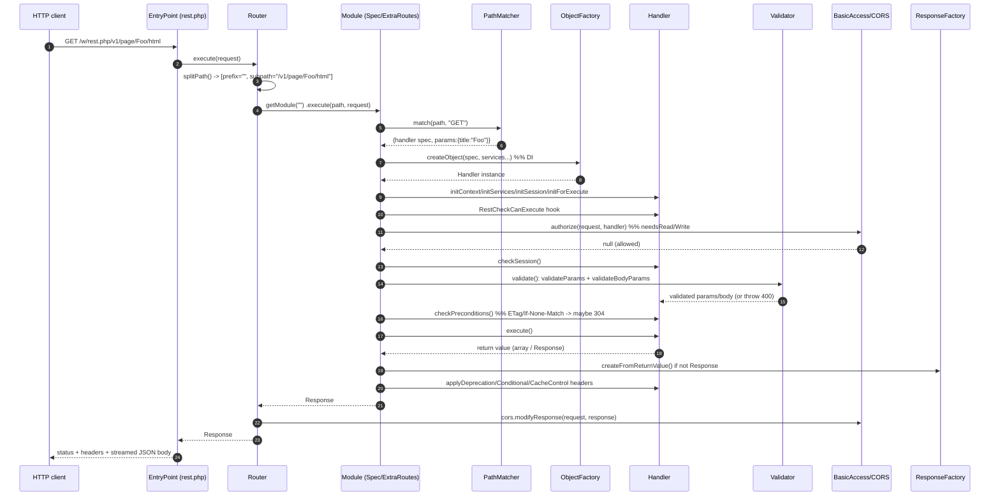

# Subsystem: REST API

*Code: `includes/Rest/`. Entry point: `rest.php`. MW_VERSION 1.47.0-alpha.*

This is the modern, route-based HTTP API. It is the newer of MediaWiki's two
machine-facing APIs; the older one is the [Action API](action-api.md). Read that
sibling doc to understand the contrast — this doc explains the REST framework and
when to reach for it instead.

> Scope note: this covers the *framework* in `includes/Rest/`, not the dozens of
> concrete core handlers (`includes/Rest/Handler/*`). Those are examples of the
> contract, cited where useful. Parsoid/HTML transform handlers belong to the
> [parser-and-content-transform](parser-and-content-transform.md) story; this doc
> treats them as consumers.

## Responsibility & boundaries (and Action API vs REST API — when to use which)

The REST API turns an HTTP request (`/w/rest.php/v1/page/Foo/html`) into a call
to a single PHP **Handler** class chosen by *path + HTTP verb*, validates the
request, and serialises the handler's return value (usually JSON) back out. It
owns: route matching, handler construction (via dependency injection), parameter
/ body validation, the error model, CORS, conditional-request handling
(ETag/Last-Modified), basic read/write authorization, and OpenAPI spec
generation. It does **not** own authentication itself (it consumes the
`Session`/`Authority` produced by [auth-permissions-sessions](auth-permissions-sessions.md))
nor business logic (handlers call into storage, parser, search, etc.).

**Action API vs REST API — the practical decision:**

| | Action API (`api.php`, `includes/Api/`) | REST API (`rest.php`, `includes/Rest/`) |
|---|---|---|
| Dispatch | One endpoint; `action=` / `list=` / `prop=` query params select a *module* | Many endpoints; `path + HTTP verb` selects a *handler* |
| HTTP semantics | Everything is effectively GET/POST to one URL; verbs not meaningful | Verb-driven (GET/POST/PUT/DELETE/HEAD), resource-shaped URLs, status codes, ETag/Last-Modified |
| Construction | `ApiModuleManager`, modules largely self-wired | Modern constructor DI via ObjectFactory object specs |
| Output | Multiple formats (json/xml/php…), generators, continuation | JSON by default; content negotiation per handler; one resource per call |
| Discoverability | `action=help`, `action=paraminfo` | OpenAPI 3.0 spec per module + `/specs/v0/discovery` |
| Maturity | Vast, battle-tested, covers ~everything | Newer, deliberately smaller surface, still growing |

Rule of thumb: **new, resource-oriented, HTTP-native endpoints go in REST**;
anything needing the Action API's huge existing module surface, generators,
multi-format output, or batching stays on the Action API. The REST API is *not*
a deprecation of the Action API — both are first-class. (Note the `Action`-bridge
handlers like `ActionModuleBasedHandler` exist precisely so a REST route can wrap
an Action API module during migration.)

## Internal structure (key files & their roles)

Request plumbing:
- **`rest.php`** — 25-line entry script: defines `MW_REST_API`, boots
  `includes/WebStart.php`, then constructs and runs `EntryPoint`.
- **`EntryPoint.php`** (`@internal`, extends `MediaWikiEntryPoint`) — wires the
  whole stack in `doSetup()`/`createRouter()`: builds `ResponseFactory`,
  `CorsUtils`, the `CompoundAuthorizer` (MWBasic + CORS), the `Validator`, the
  `ModuleManager`, and the `Router`. `execute()` runs the router, applies CORS to
  the response, then streams the body to `php://output`.
- **`Router.php`** — splits the path into `{modulePrefix}{subpath}` (regex
  `PREFIX_PATTERN`), resolves the prefix to a `Module`, and delegates. Also owns
  URL generation (`getRouteUrl`/`getPrivateRouteUrl`/`getRoutePath`), the
  module-map cache, top-level exception → response conversion, and the
  RESTBase-compat shim (`x-restbase-compat` header, T374136).

Modules (the routing layer, `includes/Rest/Module/`, since 1.43):
- **`Module.php`** (abstract) — a *collection of endpoints*. `execute()` is the
  per-module pipeline: find handler → run `RestCheckCanExecute` hook →
  `executeHandler()`. `executeHandler()` is the **canonical request lifecycle**
  (auth → session → validate → preconditions → `execute()` → headers). Also emits
  the `rest_api_*` metrics.
- **`ModuleManager.php`** (since 1.46) — decides which route files exist (core +
  extension-contributed), resolves module *mode* (audience designation / config
  overrides), and feeds the discovery / REST Sandbox spec lists.
- **`MatcherBasedModule.php`** — base for both concrete module types; holds the
  per-method `PathMatcher` trees and the cache (de)serialisation.
- **`SpecBasedModule.php`** — module defined by an OpenAPI-like JSON *module
  definition* file (has `mwapi`/`moduleId`/`paths`, e.g. `content.v1.json`,
  `site.v1.json`, `specs.v0.json`). This is the **preferred, prefixed** style.
- **`ExtraRoutesModule.php`** — the **prefix-less catch-all** module. Handles
  legacy flat route-list files (`coreRoutes.json`) and *all* extension
  `RestRoutes`. Used when no module prefix matches.
- **`ModuleMode.php` / `AudienceDesignation.php`** (1.47) — `disabled / hidden /
  discoverable / published` lifecycle, derived from the `moduleId` suffix
  (`mymodule/v1-beta`, `…-internal`) and overridable via `$wgRestModuleOverrides`.

Handler layer:
- **`Handler.php`** (`@stable to extend`, ~1500 lines) — the base class everyone
  extends. Defines the init sequence, `validate()`, `parseBodyData()`,
  param/body settings hooks, conditional-header hooks, `needsReadAccess()` /
  `needsWriteAccess()` / `requireSafeAgainstCsrf()`, and OpenAPI-spec generation.
  `execute()` is the one abstract method.
- **`SimpleHandler.php`** (`@stable to extend`) — convenience base: unpacks
  validated path params and calls `run(...$params)`. Most read handlers use it.
- **`TokenAwareHandlerTrait.php`** — opt-in CSRF-token support for handlers used
  with session providers that aren't inherently CSRF-safe.
- **`Handler/Helper/`** — shared helpers (`PageRestHelperFactory`,
  `HtmlOutputRendererHelper`, etc.) injected into page/revision/transform handlers.

Validation (`includes/Rest/Validator/`):
- **`Validator.php`** — thin wrapper over `includes/libs/ParamValidator`. Splits
  validation into `validateParams()` (path/query/header), `validateBodyParams()`
  (`body`), and the deprecated `validateBody()` path. Also the OpenAPI
  schema/parameter-spec generators.
- **`ParamValidatorCallbacks.php`** — bridges ParamValidator to the request:
  maps each `rest-param-source` (`path`/`query`/`body`/`post`/`header`) to the
  right accessor, plus NFC normalisation.
- `JsonBodyValidator` / `NullBodyValidator` / `BodyValidator` — the deprecated
  (since 1.43) custom-body-validator mechanism, superseded by `body` params.

Response / errors / HTTP:
- **`ResponseFactory.php`** — standardised `Response` construction: JSON success,
  redirects, 204/304, and the error model. `createFromException()` is where
  every exception becomes a response.
- **`HttpException.php`** / **`LocalizedHttpException.php`** — the throw-to-error
  contract (both `@newable`, `@stable to call`). `HttpException` is *not logged*;
  it's just turned into an error response.
- **`Response` / `ResponseInterface` / `RequestInterface` / `RequestData` /
  `RequestFromGlobals`** — PSR-7-flavoured request/response abstractions (note:
  MediaWiki's own interfaces, not literally `psr/http-message`).
- **`CorsUtils.php`** — preflight responses + `Access-Control-*` headers; also
  acts as a `BasicAuthorizerInterface` to block anonymous cross-origin writes.
- **`BasicAccess/`** — read/write gate (see Auth below).
- **`PathTemplateMatcher/PathMatcher.php`** — the trie that matches concrete
  paths against `{param}` templates and extracts params; cacheable.

Route/spec data files (in `includes/Rest/`):
- `coreRoutes.json` — flat route list (legacy style) → handled by
  `ExtraRoutesModule`.
- `content.v1.json`, `site.v1.json`, `specs.v0.json` — module-definition files →
  `SpecBasedModule`. `docs/rest/mwapi-1.0.json` / `mwapi-1.1.json` are their JSON
  schemas; `docs/rest/discovery-1.0.json` is the discovery schema.
- `coreDevelopmentRoutes.json` — dev-only routes (e.g. `/` → discovery redirect).

## Main flows

### Request lifecycle (the load-bearing path)

1. `rest.php` boots and constructs `EntryPoint`.
2. `EntryPoint::doSetup()` builds the `ResponseFactory`, `CorsUtils`, and the
   `Router` (with the `CompoundAuthorizer`, `Validator`, `ModuleManager`).
3. `Router::execute()` → `splitPath()` separates the module prefix (e.g. `v1`,
   `content/v1`) from the sub-path, then loads the matching `Module` (prefix-less
   `ExtraRoutesModule` if nothing matches).
4. `Module::execute()` → `getHandlerForPath()` matches path+verb via `PathMatcher`,
   instantiates the `Handler` through `ObjectFactory` (DI), then runs the
   four-stage `init*` sequence and `RestCheckCanExecute` hook.
5. `Module::executeHandler()` runs the fixed pipeline: **basic auth → session
   check → validate → conditional-request precheck → `execute()` → deprecation /
   conditional / cache-control headers**.
6. The return value is normalised to a `Response` (`createFromReturnValue`),
   CORS headers are applied, and the body is streamed out.

### Handler initialization sequence (an enforced invariant)

`Handler` splits construction from initialization into four ordered, `final`
methods, each asserting the previous ran (it will fatal otherwise):
`initContext()` → `initServices()` → `initSession()` → `initForExecute()`. The
constructor only receives injected *services* (from the object spec); request
state arrives via these init calls. This is why **handlers must be stateless
across requests** and must not read request data in their constructor.

### Error flow

Any `HttpException` thrown anywhere in the pipeline is caught (in
`Module::execute()`, then `Router::execute()` as a backstop) and converted by
`ResponseFactory::createFromException()` into a JSON error body. `HttpException`
is deliberately *not logged*; any *other* `Throwable` is reported via
`ErrorReporter` and becomes a generic 500 (with structured details only when
`$wgShowExceptionDetails` is on). The standard error body shape includes
`httpCode`, `httpReason`/`message`, `messageTranslations` (localised in content
language + English), and `errorKey`.

## State & data it owns

The REST framework is mostly **stateless per request** — that's a design goal.
The state it does own:
- **The module map and per-module matcher trees**, cached in the local-server
  object cache (APCu) keyed by route-file mtimes + extension routes hash
  (`getModuleMapHash`). Invalidates automatically when route files change. (This
  is why editing a `.json` route file takes effect without a manual cache purge,
  but a stale APCu across servers can briefly serve old routes.)
- **Module definition info** (id/title) cached for `MODULE_DEFINITION_TTL` (60s)
  in `ModuleManager`.
- Per-request: validated params/body, the chosen handler, conditional-header
  state — all discarded at end of request.

It does **not** own user identity, sessions, or DB connections; it borrows them.

## Dependencies (in / out)

In (what it consumes):
- `MediaWikiServices` / `ObjectFactory` — handler construction with DI; service
  names listed in route `services`/`optional_services` are resolved here.
- `Authority` + `Session` — from
  [auth-permissions-sessions](auth-permissions-sessions.md); used by
  `BasicAccess` and `checkSession()`.
- `includes/libs/ParamValidator` — all param typing/coercion.
- `HookContainer` — for `RestCheckCanExecute` and handler-level hooks.
- `ExtensionRegistry` attribute `RestRoutes` + `$wgRestAPIAdditionalRouteFiles`
  (see [hooks-and-extension-registration](hooks-and-extension-registration.md)).
- Local-server object cache, `StatsFactory`, message formatters (localisation),
  `MainConfig` (RestPath, CanonicalServer, CORS settings…).

Out (who/what handlers reach into): storage/revisions, parser/Parsoid, search,
files, Title — but those are the *handlers'* dependencies, injected per route,
not the framework's.

Consumed by: HTTP clients (Wikimedia apps, gadgets, external integrations), the
in-wiki REST Sandbox / discovery tooling, and extensions that add their own
routes. The Action-bridge handlers consume the Action API.

## Extension / customization points (route files, Handlers)

There are two registration mechanisms and two handler styles:

1. **`extension.json` `RestRoutes`** — a flat array of route specs (path,
   method, ObjectFactory `class`/`factory`/`services`). Collected by
   `ExtensionProcessor` into the `RestRoutes` attribute and served by the
   prefix-less `ExtraRoutesModule`. This is the **common path for extensions**.
   Schema: `docs/extension.schema.v2.json` → `RestRoutes`.
2. **Module definition files** (`$wgRestAPIAdditionalRouteFiles`, or core's
   built-in list) — OpenAPI-like JSON with a `moduleId` prefix → `SpecBasedModule`.
   This is the modern, prefixed, self-documenting style core is migrating toward.
3. **`RestCheckCanExecute` hook** (since 1.44) — lets a component veto execution
   of a handler it doesn't own (mirrors `ApiCheckCanExecute`).
4. Per-handler overrides: `getParamSettings()`, `getBodyParamSettings()`,
   `getHeaderParamSettings()`, `needsReadAccess()`, `needsWriteAccess()`,
   `requireSafeAgainstCsrf()`, `getSupportedRequestTypes()`, `parseBodyData()`,
   `getETag()`/`getLastModified()`, and the `getOpenApiSpec`/schema hooks.

### How to add a typical REST route + handler

Worked example: a read-only `GET /v1/widget/{id}` returning JSON.

1. **Write the handler** in `includes/Rest/Handler/WidgetHandler.php` extending
   `SimpleHandler`:
   - constructor takes only injected services;
   - `getParamSettings()` returns the `id` path param
     (`PARAM_SOURCE => 'path'`, `PARAM_TYPE`, `PARAM_REQUIRED`, plus a
     `PARAM_DESCRIPTION` MessageValue for OpenAPI);
   - `run( $id )` does the work and returns an array (auto-JSON) or a `Response`;
   - override `needsWriteAccess()` to return `false` (it's a safe GET);
   - optionally `getResponseBodySchemaFileName()` for OpenAPI output.
2. **Register the route.** For a core flat route, add an entry to
   `includes/Rest/coreRoutes.json` (`path`, `class`, `services`, `openApiSpec`
   with `x-i18n-*` keys). For a core module, add a `paths` entry to the relevant
   module-definition file (`content.v1.json` etc.). For an extension, add a
   `RestRoutes` entry to `extension.json`.
3. **Add i18n** for the `x-i18n-description`/`x-i18n-summary` keys in
   `languages/i18n/en.json` (+ `qqq.json`) — see
   [localisation](localisation.md).
4. **If you added/renamed the class**, regenerate `autoload.php`
   (`php maintenance/run.php generateLocalAutoload`) — *not run here*; the
   `AutoLoaderStructureTest` enforces it.
5. **Test.** Unit test the handler against the `RestTestTrait`/`HandlerTestTrait`
   harness (`tests/phpunit/unit/includes/Rest/`), and add an API-level test under
   `tests/api-testing/REST/`. Run via `composer phpunit:unit` after
   `composer phpunit:config` (commands from `composer.json`; *not run here*).

For write endpoints, additionally: return non-safe verbs (POST/PUT/DELETE), keep
`needsWriteAccess()` true, and consider `TokenAwareHandlerTrait` /
`requireSafeAgainstCsrf()` for CSRF protection.

## Invariants & gotchas

- **Handlers are stateless and per-request-initialized.** Never read request
  data in the constructor (it isn't injected there); use `postInitSetup()` /
  `postValidationSetup()` / `execute()`. The four `init*` methods are `final` and
  assert ordering — bypassing them fatals.
- **`needsWriteAccess()` defaults to `true`.** A safe GET handler that forgets to
  override it will (a) be treated as state-changing for CORS/cache purposes and
  (b) require write rights. Read handlers must override it to `false`. Likewise
  `needsReadAccess()` defaults true; only special account-management endpoints set
  it false.
- **`HttpException` is the error contract, and it is not logged.** Throw it (or
  `LocalizedHttpException` for i18n) for expected 4xx/5xx; throwing anything else
  produces a logged generic 500.
- **`post` source is deprecated (1.43); use `body`.** Mixing `post` and `body`
  params trips the extraneous-body-fields check. Custom `getBodyValidator()` is
  also deprecated (1.43) — declare `getBodyParamSettings()` instead.
- **JSON body must be an object/map.** `parseBodyData()` rejects bare arrays /
  scalars with 400. JSON requests enforce types; form-data requests coerce.
- **Path params: braces only, and they're always required by the matcher.** A
  `path` param marked non-required in `getParamSettings()` only means "this
  handler serves several routes, some without it" — the matcher still demands all
  placeholders present in the matched path. Spaces encode as `%20`, slashes as
  `%2F` (not `+`); see `substPathParams`/`urlEncodeTitle`.
- **HEAD falls back to the GET handler** automatically; `getAllowedMethods()`
  adds HEAD wherever GET exists.
- **Versioning lives in the path prefix** (`/v1/…`, `content/v1`), not in headers.
  The `moduleId` suffix (`-beta`, `-internal`) drives the audience/mode lifecycle
  (`ModuleMode`), overridable via `$wgRestModuleOverrides`. A typo in a mode
  override *disables* the module by design (fail-safe).
- **The module/matcher cache keys on route-file mtimes**, so editing a route file
  is picked up automatically — but the cache is the *local-server* (APCu) cache,
  so a multi-server farm can briefly serve mixed route maps during a deploy.
- **`/` redirects to discovery** (308 in prod via the default module, dev routes
  point at `/specs/v0/discovery`).
- **RESTBase compat** (`x-restbase-compat: true`, T374136) reshapes error bodies
  to match legacy RESTBase; responses always `Vary: x-restbase-compat`.
- **OpenAPI specs are generated, not hand-maintained** — they come from each
  handler's `getOpenApiSpec()` plus param/body/response schema hooks and the
  `x-i18n-*` route metadata. `ModuleSpecHandler` (`/specs/v0/module/{module}`)
  assembles the document; `DiscoveryHandler` lists modules.

## Foundation

Builds on: root `AGENTS.md`; `includes/AGENTS.md` (the `Rest/` row); the modern
DI conventions in `docs/Injection.md` (handlers are ObjectFactory specs); hooks
in `docs/Hooks.md` (`RestCheckCanExecute`); and the authoritative REST schema
notes in `docs/rest/` (`mwapi-1.0.json`, `mwapi-1.1.json`, `discovery-1.0.json`).

Cross-references:
- [action-api](action-api.md) — the sibling API; see the comparison table above
  for when to use which, and `ActionModuleBasedHandler` for the migration bridge.
- [auth-permissions-sessions](auth-permissions-sessions.md) — `Authority`,
  `Session`, CSRF/token semantics consumed by `BasicAccess` and
  `TokenAwareHandlerTrait`.
- [service-container-and-config](service-container-and-config.md) — service
  resolution for handler `services`/`optional_services`.
- [hooks-and-extension-registration](hooks-and-extension-registration.md) —
  `extension.json` `RestRoutes` attribute and `$wgRestAPIAdditionalRouteFiles`.
- [parser-and-content-transform](parser-and-content-transform.md) /
  [storage-revisions-content](storage-revisions-content.md) — what the core
  page/revision/transform handlers actually call into.
- [localisation](localisation.md) — `x-i18n-*` keys and `messageTranslations`
  in error bodies.
- [caching-deferred-jobs](caching-deferred-jobs.md) — the local-server object
  cache used for the module/matcher map.

## Open questions

- **Audience-designation rollout is mid-flight.** `ModuleMode::getModuleMode()`
  currently maps *every* designation (published/internal/beta) to `DISCOVERABLE`
  with `// will become PUBLISHED` TODOs. The intended end-state distinction
  between published/internal/beta visibility is not yet active; confirm the target
  semantics before relying on it.
- **`getRouter()`/`getModule()` coupling is flagged for removal (T411521).**
  Handlers that reach the `Router`/`Module` directly (e.g. `ModuleSpecHandler`)
  use an API the maintainers want to narrow; the replacement interface is TBD.
- **RESTBase-compat scope.** `Router::execute()` notes a TODO to only send
  `Vary: x-restbase-compat` for handlers that opt in; today it's sent on every
  response. Long-term lifetime of the RESTBase-compat shim (T374136) is unclear.
- **`mwapi` schema version ceiling.** `SpecBasedModule` accepts `>=1.0.0` and
  `<=1.1.999`; the policy for introducing 1.2 / breaking-change handling of module
  definition files was not found in-repo.
- Whether `psr/http-message` interfaces are intended to eventually back
  `RequestInterface`/`ResponseInterface` (they are PSR-7-shaped but bespoke) was
  not determined from the code read here.
