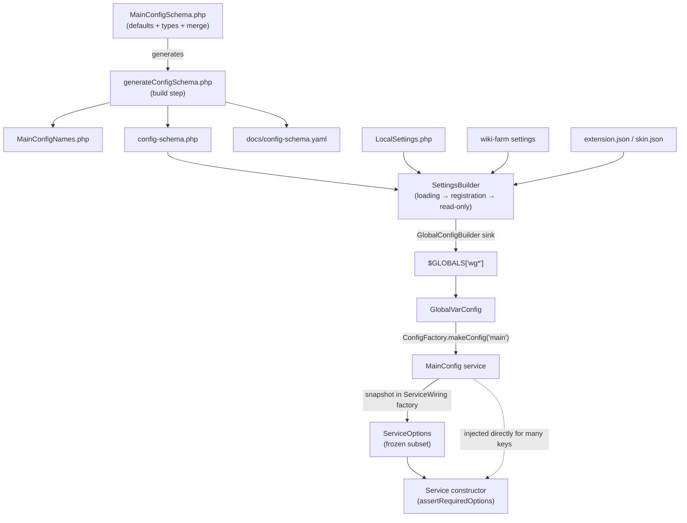

# Subsystem: Service Container & Configuration

> Part of the MediaWiki core senior-onboarding handbook. Sibling subsystems are
> documented under `docs/handbook/subsystems/`. This document owns the
> dependency-injection hub and the configuration pipeline that feeds it. Hooks
> (the *other* universal extension point) are owned by
> `hooks-and-extension-registration`; this doc only touches the `MediaWikiServices`
> hook and `extension.json`/`skin.json` settings where they intersect config.

## Responsibility & boundaries

This subsystem answers two questions for the entire engine:

1. **"Give me service X."** — `MediaWikiServices` is the central service locator /
   DI container. It is the single most-connected node in core after `HookRunner`
   (~265 structural edges in the knowledge graph). Almost every service in core is
   instantiated by a factory closure in `includes/ServiceWiring.php` and handed out
   through a typed getter on `MediaWikiServices`.
2. **"What is `$wgFoo` set to?"** — the configuration pipeline turns a *schema of
   defaults* (`MainConfigSchema`), plus site overrides (`LocalSettings.php`,
   wiki-farm files, `extension.json`), into immutable `Config` objects that services
   read from (usually via a `ServiceOptions` snapshot).

**In scope:** `MediaWikiServices`, the framework-agnostic `ServiceContainer` it
extends, `ServiceWiring.php`, the `Settings/` pipeline (`SettingsBuilder`, sources,
schema aggregator, config builders, caching), the `Config/` value objects
(`Config`, `GlobalVarConfig`, `HashConfig`, `MultiConfig`, `ConfigFactory`,
`ServiceOptions`), and the `MainConfigSchema` / `MainConfigNames` pair.

**Out of scope (owned elsewhere):** the hook system itself; `ExtensionRegistry` /
`extension.json` loading mechanics (it only *queues* and *registers* here); the
contents of individual `$wg*` settings; `MediaWikiServices`' own getters as an
inventory (there are ~400 — do not enumerate them).

The hard boundary worth internalizing: **`includes/libs/` must not touch any of
this.** Library code under `includes/libs/` (rdbms, ObjectCache, etc.) is mirrored
as standalone `wikimedia/*` Composer packages and must stay free of `$wg*` globals
and `MediaWikiServices`. The DI/config machinery is what *wires* those libraries
into MediaWiki, from the outside.

## Internal structure (key files & their roles)

### The container

- **`includes/MediaWikiServices.php`** — the service locator. Extends
  `Wikimedia\Services\ServiceContainer` (the generic engine, see below). Holds the
  global singleton (`getInstance()`), the typed convenience getters
  (`getFooService(): FooService`), and the bootstrap/reset lifecycle
  (`allowGlobalInstance`, `resetGlobalInstance`, `forceGlobalInstance`,
  `disableStorage`, `salvage`). Each getter is a one-liner that delegates to
  `getService('Foo')`; its only value is the **strict return type** (so static
  analysis and IDEs catch mistakes) and a discoverable name.
- **`Wikimedia\Services\ServiceContainer`** — the framework-agnostic DI engine
  underneath. *Not present in this checkout* — it lives in the `wikimedia/services`
  Composer package under `vendor/` (no `vendor/` here; see open questions). It
  provides `defineService()`, `getService()` (lazy singleton resolution),
  `redefineService()`, `addServiceManipulator()`, `peekService()`, `salvage()`,
  `destroy()`, and the `SalvageableService` / `DestructibleService` contracts that
  `MediaWikiServices` builds reset semantics on top of.

### The wiring

- **`includes/ServiceWiring.php`** (~3,340 lines) — *returns one big array* mapping
  service name → factory closure. This is the default implementation registry. Each
  closure has the shape
  `'Foo' => static function ( MediaWikiServices $services ): Foo { ... }`. The
  closure pulls its dependencies from `$services` (other services, or config) and
  `return new Foo( ... )`. The file header states two rules that capture the WHY:
  ServiceWiring is **not** a cache for arbitrary singletons, and services **must
  not** vary behaviour on request state (`WebRequest`, current user/title) —
  see [Injection.md §Principles](../../Injection.md).
  Services prefixed with `_` (e.g. `_SettingsBuilder`, `_SqlBlobStore`) are
  **internal**: they have no public getter and are implementation glue.

### The configuration value objects (`includes/Config/`)

- **`Config`** — the read interface: just `get($name)` and `has($name)`.
  `@stable to implement`.
- **`GlobalVarConfig`** — the default `Config` implementation. `get('Sitename')`
  reads `$GLOBALS['wgSitename']`. This is the bridge between the modern `Config`
  abstraction and the legacy `$wg*` global namespace.
- **`HashConfig`** — `Config` backed by a plain array (used in tests and as a
  building block).
- **`MultiConfig`** — chains several `Config` objects; first match wins.
- **`ConfigFactory`** — produces named `Config` objects (`makeConfig('main')`,
  `makeConfig('someextension')`). Lazy + cached: the same name returns the same
  object. Registry of builders comes from the `ConfigRegistry` setting. Implements
  `SalvageableService` so the cached `Config` survives a service reset when the
  factory callback is unchanged.
- **`ServiceOptions`** — a *frozen snapshot* of selected config keys, passed into a
  service's constructor. See the dedicated section below — the `Config` vs
  `ServiceOptions` distinction is a core concept.

### The settings pipeline (`includes/Settings/`)

- **`SettingsBuilder`** — the modern bootstrap engine. Loads settings from
  *sources*, merges them against the schema, and produces the final `Config`. It
  has a strict three-stage lifecycle (loading → registration → read-only) enforced
  by assertions. Used directly in `Setup.php`; available as the internal
  `_SettingsBuilder` service afterward.
- **`Source/`** — `SettingsSource` implementations: `FileSource` (JSON/PHP/YAML
  settings files), `ArraySource`, plus `LocalSettingsLoader` and
  `WikiFarmSettingsLoader` glue. A source returns an array with keys like `config`,
  `config-overrides`, `config-schema`, `extensions`, `skins`, `includes`,
  `php-ini`.
- **`Config/` (under Settings)** — `ConfigSchemaAggregator` (accumulates schema
  fragments and enforces "you can't redefine a type/default twice"),
  `ConfigBuilder` / `GlobalConfigBuilder` (the *sink* — writes resolved values into
  `$GLOBALS` with the `wg` prefix), `MergeStrategy`, `PhpIniSink`.
- **`Cache/`** — `CacheableSource` / `CachedSource` wrap expensive sources (e.g.
  parsing many extension.json files) in a `BagOStuff`.
- **`DynamicDefaultValues`** — evaluates `dynamicDefault` callbacks from the schema
  (defaults computed from other settings or the environment) during the
  registration stage.

### The schema (`includes/`)

- **`MainConfigSchema.php`** — the canonical declaration of every core `$wg*`
  setting, as a class with one `public const Foo = [ 'default' => ..., 'type' =>
  ..., ... ]` per setting, in JSON-Schema-ish form (`default`, `type`,
  `mergeStrategy`, `deprecated`, `obsolete`, `dynamicDefault`). This is the **single
  source of truth** for defaults and merge behaviour. Edit *this* file, never the
  derived ones.
- **`MainConfigNames.php`** — **generated** from `MainConfigSchema`. Provides
  `MainConfigNames::Sitename = 'Sitename'` constants so callers say
  `$config->get( MainConfigNames::Sitename )` instead of a typo-prone string
  literal.
- **`includes/config-schema.php`** and **`docs/config-schema.yaml`** — also
  generated from `MainConfigSchema` (a fast-to-load PHP array form and a
  human/IDE-readable YAML form respectively). All three derived files are
  regenerated by `maintenance/generateConfigSchema.php` and a structure test fails
  if they drift (see Invariants).

## Main flows

### Flow A — Configuration: schema → SettingsBuilder → Config → ServiceOptions → service

This is the load-bearing flow. The verified sequence in `includes/Setup.php`:

1. `SettingsBuilder::getInstance()` is created with a `GlobalConfigBuilder('wg')`
   sink (config values land in `$GLOBALS['wg*']`).
2. **Loading stage:** core's schema (from `MainConfigSchema`/`config-schema.php`) is
   loaded, then `LocalSettings.php` (via `LocalSettingsLoader`), then any wiki-farm
   settings. Sources are queued and merged depth-first, with `includes` resolved
   recursively (cycles are detected and throw).
3. `enterRegistrationStage()` — no more sources may load; values may still change.
   `MW_SETUP_CALLBACK`, then `DynamicDefaultValues`, then the legacy
   `SetupDynamicConfig.php`, then `ExtensionRegistry::loadFromQueue()` run here.
   Extension registration can still adjust config.
4. `enterReadOnlyStage()` — `SettingsBuilder` is frozen. Now it is safe to build
   services.
5. `MediaWikiServices::allowGlobalInstance()` then `MW_SERVICE_BOOTSTRAP_COMPLETE`
   is defined. After this point, resets are forbidden outside tests/install (see
   `failIfResetNotAllowed`).
6. A service that needs config receives a `ServiceOptions` built in its
   ServiceWiring factory from `$services->getMainConfig()`.

The key realization for the `$wg*` bridge: `MainConfig` (the service application
logic should use) is `ConfigFactory->makeConfig('main')`, and the default `'main'`
builder in `ConfigRegistry` is `GlobalVarConfig::newInstance` — i.e. **`MainConfig`
reads the very `$GLOBALS['wg*']` that `SettingsBuilder` wrote.** So the modern
pipeline and the legacy globals are two views of the same data, by design, during
the migration era.



### Flow B — Service lifecycle: definition → getter → lazy singleton

1. **Definition:** the factory closure for `'Foo'` lives in `ServiceWiring.php`.
   It is registered when `MediaWikiServices` loads the wiring files listed in the
   `ServiceWiringFiles` setting (core's file plus any from extensions).
2. **Request:** application code (ideally only a static entry point / hook handler)
   calls `MediaWikiServices::getInstance()->getFoo()`, which calls
   `getService('Foo')`.
3. **Instantiation:** on first access, `ServiceContainer` runs the closure, caches
   the result, and returns it. Every later `getFoo()` returns the **same instance**
   (lazy singleton within one container). The closure runs at most once.
4. **Reset/teardown:** `resetGlobalInstance()` builds a fresh container; the old one
   is `destroy()`ed (or `salvage()`d in `quick` mode, which reuses expensive
   `SalvageableService` instances like the `ConfigFactory` and DB load balancer).

## State & data it owns

- **The service instance cache** — one map of name → instantiated service, per
  `MediaWikiServices` container. This is the global mutable state of the subsystem.
  Lifetime = one PHP process (or one test, with resets between).
- **The global singleton** `MediaWikiServices::$instance` and the
  `$globalInstanceAllowed` gate.
- **The resolved configuration** — physically stored in `$GLOBALS['wg*']` (written
  by `GlobalConfigBuilder`), surfaced as the `BootstrapConfig` and `MainConfig`
  services, and the `_SettingsBuilder`'s frozen schema.
- It does **not** own any database table or persistent state. `SettingsBuilder`'s
  `BagOStuff` cache is a derived/disposable optimization, not authoritative.

### Config vs ServiceOptions — the distinction to internalize

- A **`Config`** (e.g. `MainConfig`) is a *live, broad* read interface over all
  settings. `get()` reads the current value; it is a service.
- A **`ServiceOptions`** is a *narrow, frozen snapshot* of just the keys one service
  declared it needs. It is built in the ServiceWiring factory from a `Config` and
  copies the values at construction time. Subsequent config changes do **not** flow
  into an existing `ServiceOptions`.

Why two? `ServiceOptions` makes a service's config dependencies **explicit and
checkable**: the service declares
`public const CONSTRUCTOR_OPTIONS = [ 'Foo', 'Bar' ]` and calls
`$options->assertRequiredOptions( self::CONSTRUCTOR_OPTIONS )` in its constructor.
That assertion fails loudly if the wiring passes too few *or too many* keys — there
are no "optional" options. This is how core documents "service Foo depends on
exactly these settings" in a way a test and a reader can both verify. Injecting the
whole `MainConfig` instead hides that contract and lets a service silently read any
setting.

## Dependencies (in / out)

**Inbound (who consumes this):** effectively everything. Every entry point
(`index.php`, `api.php`, `rest.php`, `load.php`, `maintenance/run.php`) boots through
`Setup.php` into this subsystem and then resolves services from it. Sibling
subsystems — `database-rdbms` (`ConnectionProvider`, `DBLoadBalancerFactory`),
`parser-and-content-transform` (`ParserFactory`), `output-skins-resourceloader`,
`action-api`, `rest-api`, `storage-revisions-content`, `auth-permissions-sessions`,
`caching-deferred-jobs`, `localisation`, `title-linking-namespaces`,
`files-media-uploads` — are all defined as services here and obtained through it.

**Outbound (what this needs):**
- `Wikimedia\Services\ServiceContainer` (vendor library) — the DI engine.
- `HookContainer`/`HookRunner` — to fire the `MediaWikiServices` hook so extensions
  can redefine services. (Mild chicken-and-egg: the hook container is itself a
  service obtained early.)
- `ExtensionRegistry` — `SettingsBuilder` queues `extension.json`/`skin.json` and
  the registry later registers them; resolution lives in
  `hooks-and-extension-registration`.
- `BagOStuff` (ObjectCache) — optional, for caching settings sources.
- `Wikimedia\Assert`, `StatusValue` — validation plumbing.

## Extension / customization points

1. **Add a wiring file.** Extensions append their own ServiceWiring file to the
   `ServiceWiringFiles` setting (typically via `extension.json`'s `ServiceWiringFiles`
   key) to define new services.
2. **The `MediaWikiServices` hook.** Fires right after a container is created
   (in `getInstance()` and again in `resetGlobalInstance()`). Handlers receive the
   `MediaWikiServices` instance and may call `redefineService()` to **replace** a
   core service implementation, or `addServiceManipulator()` to post-process one.
   This is the supported way to swap, e.g., a `Config` or a storage backend.
3. **`ConfigRegistry` setting.** Register a named `Config` builder so
   `ConfigFactory->makeConfig('myext')` returns an extension-specific config object
   (the convention for extension settings that want isolation from `$wg*`).
4. **Config schema in `extension.json`.** Extensions declare their own settings (and
   defaults, types, merge strategies) in `extension.json`'s `config`/`config-schema`,
   which `SettingsBuilder` merges via `ConfigSchemaAggregator`.
5. **`dynamicDefault` callbacks** in a schema, for defaults derived from other
   settings or the environment.

## Invariants & gotchas

- **Never inject `MediaWikiServices` into business logic.** Inject the specific
  services or a `ServiceOptions`. Using the locator inside a domain class defeats DI,
  hides dependencies, and breaks testability. `getInstance()` is for static entry
  points (hook handlers, `newFromGlobalState()` shims) only — and even there it is a
  migration stepping stone. (`docs/Injection.md` is the authority and has migration
  recipes for every legacy shape.)
- **Services must not vary on request state.** No reading the current `WebRequest`,
  user, title, or language inside a service. Callers pass per-request context as
  method arguments. Violating this can cause a chain reaction and *data corruption*
  (the ServiceWiring header warns of this explicitly). The narrow, documented
  exemption is "inconsequential state" — diagnostics/metrics/perf only, never
  changing functional output (Injection.md §Principle exemption).
- **No premature service access during bootstrap.** `getInstance()` before
  `allowGlobalInstance()` throws `LogicException` under PHPUnit and emits a
  deprecation otherwise. The whole point of the staged bootstrap is that services
  are built only *after* config is frozen — a service that captured config too early
  would be wrong. `MW_SERVICE_BOOTSTRAP_COMPLETE` marks the line after which
  `resetGlobalInstance()` is forbidden (outside install/test/maintenance).
- **Reset is dangerous outside tests.** `resetGlobalInstance()` builds a new
  container, but any object still holding a *stale* reference to an old service can
  cause inconsistencies or data loss — "smart records" / lazy loaders that captured
  a storage service are the classic trap. Unmanaged legacy singletons must not keep
  references to managed services. `quick` mode salvages `SalvageableService`s; the
  default destroys.
- **Generated files drift = test failure.** After editing `MainConfigSchema.php`,
  run `php maintenance/run.php generateConfigSchema` (regenerates
  `MainConfigNames.php`, `config-schema.php`, `docs/config-schema.yaml`).
  `tests/phpunit/structure/SettingsTest::testConfigGeneration` diffs the regenerated
  output against the committed files and fails if they differ.
- **Every service must round-trip.** `MediaWikiServicesTest` requires that every
  entry in `ServiceWiring.php` (a) has a typed return on its closure, (b) actually
  instantiates and returns that declared type via `getService()`, and (c) has a
  matching named getter (unless `_`-prefixed/internal), with getters kept
  alphabetically sorted. Adding wiring without a test entry fails
  `testDefaultServiceWiringServicesHaveTests`.
- **`ServiceOptions` is exact, not lenient.** `assertRequiredOptions` fails on both
  missing *and* extra keys. Adding a config dependency to a service means updating
  *both* `CONSTRUCTOR_OPTIONS` and the `ServiceOptions` built in the wiring.
- **`ConfigSchemaAggregator` forbids redefining a setting's type or default.** Two
  schemas declaring the same key with different types/defaults throw — extensions
  cannot silently clobber a core setting's schema.
- **`array` is banned as a schema type.** Use `list` (sequential) or `map`
  (associative) — see the `MainConfigSchema` class docblock — because merge strategy
  correctness depends on knowing which it is.

## How to make a typical change here

### Add a new core service (the 3-step recipe)

1. **Write the factory** in `includes/ServiceWiring.php`:
   ```php
   'FooService' => static function ( MediaWikiServices $services ): FooService {
       return new FooService(
           new ServiceOptions( FooService::CONSTRUCTOR_OPTIONS, $services->getMainConfig() ),
           $services->getDbProvider(),
           // ...other injected services, never $services itself
       );
   },
   ```
   Keep the array entry alphabetically placed. The closure **must** declare its
   return type.
2. **Add the typed getter** to `includes/MediaWikiServices.php`, in alphabetical
   order, with an `@since`:
   ```php
   public function getFooService(): FooService {
       return $this->getService( 'FooService' );
   }
   ```
3. **Add the test case** to `tests/phpunit/includes/MediaWikiServicesTest.php`
   (its `provideGetService`/getter coverage), or the structure test will fail.

If the service reads config, declare `public const CONSTRUCTOR_OPTIONS = [ ... ]`
on the class (using `MainConfigNames::` constants) and call
`assertRequiredOptions()` in its constructor.

### Add or change a `$wg*` setting

1. Add/edit the `public const Foo = [ 'default' => ..., 'type' => ... ]` constant in
   `includes/MainConfigSchema.php` (with a docblock — it becomes the documentation).
2. Run `php maintenance/run.php generateConfigSchema` to regenerate
   `MainConfigNames.php`, `config-schema.php`, and `docs/config-schema.yaml`
   *(not run here — no toolchain in this checkout)*.
3. To deprecate: add `'deprecated' => 'message'`. To remove functionality: mark
   `'obsolete' => 'message'` (obsolete = non-functional; deprecated = still works).
   `SettingsBuilder::detectDeprecatedConfig()` / `detectObsoleteConfig()` and the
   structure tests cover these.

### Migrate legacy code into the container

Follow the recipes in `docs/Injection.md` (singleton getters, static-only classes,
"smart records", static hook handlers). The common pattern: add a ServiceWiring
factory + getter + test, replace global/static access inside the factory with
`$services->getXxx()` / `getMainConfig()->get()`, then change callers to inject the
service. `MediaWikiServices::getInstance()->getXxx()` inside the migrated class is an
acceptable *intermediate* stepping stone, but the end state is constructor
injection — and never the locator itself.

### Validate / run the relevant tests (commands; not run here)

- `composer phpunit:unit` — fast DB-less unit tests (covers `Config/`, `Settings/`
  unit tests, `ServiceOptions`).
- `composer phpunit:config` then `composer phpunit` — full suite including the
  structure tests (`SettingsTest`, `MediaWikiServicesTest`).

## Foundation

- Repo map: [`AGENTS.md`](../../../AGENTS.md); core module map:
  [`includes/AGENTS.md`](../../../includes/AGENTS.md) /
  [`includes/CLAUDE.md`](../../../includes/CLAUDE.md).
- Authoritative DI doc (read it): [`docs/Injection.md`](../../Injection.md) — origin
  RFC T384, principles, and migration recipes.
- Hook system (sibling): [`docs/Hooks.md`](../../Hooks.md) and the
  `hooks-and-extension-registration` subsystem doc — owns `ExtensionRegistry` and the
  hook contract referenced above.
- Generated config artifacts: `includes/config-schema.php`,
  [`docs/config-schema.yaml`](../../config-schema.yaml).
- Tests that encode the contract: `tests/phpunit/includes/MediaWikiServicesTest.php`,
  `tests/phpunit/structure/SettingsTest.php`,
  `tests/phpunit/unit/includes/Config/ServiceOptionsTest.php`,
  `tests/phpunit/unit/includes/Settings/SettingsBuilderTest.php`,
  and the `Config/` unit tests (`ConfigFactoryTest`, `GlobalVarConfigTest`,
  `HashConfigTest`, `MultiConfigTest`).
</content>
</invoke>
