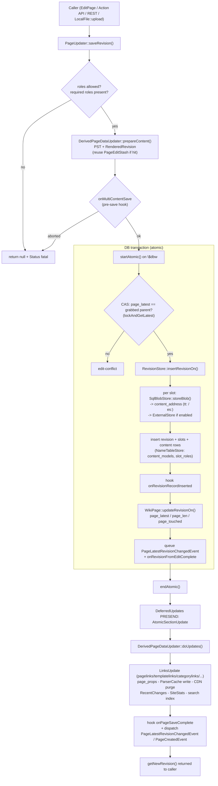

# Subsystem: Storage, Revisions & Content

> Scope: `includes/Revision/`, `includes/Storage/`, `includes/Page/`, `includes/content/`.
> This is the **canonical write path** for wiki pages and the read path for their
> historical revisions and content. Many other handbook pages funnel through here:
> [action-api](action-api.md) and [rest-api](rest-api.md) editing endpoints,
> [actions-special-pages-editing](actions-special-pages-editing.md) (`EditPage`),
> and [files-media-uploads](files-media-uploads.md) (`LocalFile::upload()` writes a
> File-namespace description-page revision) all end up calling `PageUpdater`.
>
> Foundation reading first: root `AGENTS.md`, `includes/AGENTS.md`, and the two
> **authoritative** in-tree docs `docs/pageupdater.md` and `docs/contenthandler.md`.
> This page builds on them rather than repeating them.

## Responsibility & boundaries

This subsystem answers: *how is a page's content modeled, stored, versioned, and
updated?* It owns four cooperating layers:

1. **Content abstraction** (`includes/content/`) — page content is **not** "text".
   It is a `Content` object whose behavior is supplied by a per-model
   `ContentHandler` (wikitext, json, css, javascript, text, vue, …). Code must
   never pass raw strings around; it asks a `ContentHandler` to (de)serialize.

2. **The MCR revision model** (`includes/Revision/`) — a page has many
   **revisions**; each revision has **one or more named slots** (Multi-Content
   Revisions); each slot points at a **content object** backed by a **blob**.
   `RevisionStore` is the read/write gateway for revision rows.

3. **Blob & normalization storage** (`includes/Storage/` lower half) —
   `SqlBlobStore` + `ExternalStore` store the actual serialized bytes behind an
   opaque **content address**; `NameTableStore` normalizes repeated strings
   (content-model names, slot-role names) into integer IDs.

4. **The page-update pipeline** (`includes/Storage/` upper half + `includes/Page/`)
   — `PageUpdater::saveRevision()` is the one true way to create a revision;
   `DerivedPageDataUpdater` regenerates everything *derived* from a revision
   (parser cache, links tables, `page_props`, RecentChanges, search, site stats)
   and fires the post-save hooks/events.

**Out of scope (owned by siblings):**

- *Wikitext → HTML parsing* and pre-save-transform mechanics live in
  [parser-and-content-transform](parser-and-content-transform.md). We *invoke*
  the parser (via `RevisionRenderer`/`ContentRenderer`) but don't own it.
- *Title/namespace identity* — see [title-linking-namespaces](title-linking-namespaces.md).
  We consume `PageIdentity`/`LinkTarget`; the page-identity value hierarchy is
  described below only insofar as storage needs it.
- *RDBMS query-builder / connection plumbing* — see [database-rdbms](database-rdbms.md).
  We use `IConnectionProvider`, `$dbr`/`$dbw`, and query builders.
- *Deferred-update execution, the job queue, ParserCache internals, CDN purge* —
  see [caching-deferred-jobs](caching-deferred-jobs.md). We *schedule* updates;
  that page documents how they run.
- *Per-DB DDL generation and schema evolution mechanics* — owned by the
  **data-model handbook page**. Tables we own are listed below with that page as
  the authority for column-level detail and migration history.
- *Deletion/undeletion and page moves as workflows* — `DeletePage`, `UndeletePage`,
  `MovePage` (see [actions-special-pages-editing](actions-special-pages-editing.md)).
  They *use* `RevisionStore`/`DerivedPageDataUpdater`; the `archive` table and
  RevDel visibility semantics are described here as invariants.

## Internal structure (key files & their roles)

### Content abstraction — `includes/content/`

| File | Role |
|---|---|
| `Content.php` (interface, `@stable to type`) | Value-object contract for page content: `getModel()`, `getContentHandler()`, `serialize()`, `getSize()`, `isRedirect()`/`getRedirectTarget()`, `equals()`, `copy()`. Do **not** implement directly — extend `AbstractContent`. |
| `AbstractContent.php` (`@stable to extend`) | Base implementation; delegates serialization & handler lookup; default `equals()` compares serialized form. |
| `TextContent` / `WikitextContent` / `JsonContent` / (`Css`/`JavaScript`/`Vue` via handlers) | Concrete immutable content classes. `WikitextContent` adds sections (`getSection`/`replaceSection`), redirect parsing/`updateRedirect`, magic-word matching. `JsonContent` validates/beautifies. |
| `ContentHandler.php` (`@stable to extend`, since 1.21) | Per-model **strategy + factory**. Stateless singleton. Abstract: `makeEmptyContent()`, `serializeContent()`, `unserializeContent()`, `fillParserOutput()`. Overridable: `preSaveTransform()`, `getSecondaryDataUpdates()`, `getDeletionUpdates()`, `getActionOverrides()`, `supportsDirectEditing()`, `makeRedirectContent()`. |
| `IContentHandlerFactory` / `ContentHandlerFactory` | Service to obtain handlers: `getContentHandler($modelId)`, `getContentModels()`, `isDefinedModel()`. Backed by the `$wgContentHandlers` map (`MainConfigNames::ContentHandlers`) via `ObjectFactory`; `defineContentHandler()` registers/overrides at runtime (`@internal`). |
| `FallbackContent` / `FallbackContentHandler` (since 1.36) | Graceful handling for **unknown** content models (e.g. an extension was uninstalled). Stores bytes opaquely, renders an `unsupported-content-model` error, disables direct editing — content is never lost. |
| `Transform/ContentTransformer` (1.37) | Service wrapper for `preSaveTransform()`/`preloadTransform()` so callers don't reach into `Content`/`ContentHandler` directly. |
| `Renderer/ContentRenderer` (1.38) | Service wrapper for `getParserOutput()`; decouples rendering from `Content`. |

The `CONTENT_MODEL_*` / `CONTENT_FORMAT_*` constants live in `includes/Defines.php`.
Note the **service decoupling trend**: new code uses `ContentTransformer` /
`ContentRenderer` services rather than `Content::getParserOutput()` /
`Content::preSaveTransform()` (the older instance methods route through
the parser; see [parser-and-content-transform](parser-and-content-transform.md)).

### Revision model — `includes/Revision/`

| File | Role |
|---|---|
| `RevisionRecord` (abstract) | Immutable read view of one revision: `getId()`, `getPageId()`, `getParentId()`, `getTimestamp()`, `getComment()`, `getUser()`, `getSize()`, `getSha1()`, plus **slot access** `getSlot($role,$audience)`, `getContent($role,$audience)`, `getSlotRoles()`, `getSlots()`. Carries the **audience/visibility** machinery (see invariants). |
| `MutableRevisionRecord` | The writable proto-revision used while building an edit, before insertion. |
| `SlotRecord` | One slot = (role, content, contentId, blob address, origin, size, sha1). Factories: `newUnsaved(role,$content)` (proto, no address), `newSaved(revId,contentId,address,proto)` (after storage), `newInherited(slot)` (reuse parent's blob), `newDerived(role,$content)` (computed slot, excluded from rev size/hash), `newWithSuppressedContent()`. `MAIN = 'main'`. |
| `RevisionSlots` / `MutableRevisionSlots` | The set of slots in a revision keyed by role; `getSlot`, `hasSlot`, `getOriginalSlots()` vs `getInheritedSlots()`, `getPrimarySlots()` (non-derived). |
| `SlotRoleRegistry` (1.33) | Service registering slot **roles**. `defineRole($role,$instantiator)` / `defineRoleWithModel($role,$model,$layout,$derived)`; `getRoleHandler($role)`; `getDefinedRoles()` vs `getKnownRoles()` (defined ∪ DB); `getAllowedRoles($page)`, `getRequiredRoles($page)` (defaults to `[MAIN]`). |
| `SlotRoleHandler` (1.33, `@stable to extend`) | Behavior of a role: `getDefaultModel($page)`, `isAllowedModel($model,$page)`, `getOutputLayoutHints()`, `getNameMessageKey()`, `isDerived()`, `supportsArticleCount()`. |
| `RevisionStore` (1.31; renamed from `Storage` ns in 1.32) | The gateway service. Write: `insertRevisionOn($rev,$dbw)`. Read: `getRevisionById`, `getRevisionByTitle`, `getRevisionByPageId`, `getKnownCurrentRevision`, `newRevisionFromRow`, batch loaders, `findIdenticalRevision`, `getNextRevision`/`getPreviousRevision`. Implements `RevisionFactory`, `RevisionLookup`. |
| `RevisionRenderer` / `RenderedRevision` | Lazily produce the canonical `ParserOutput` for a (multi-slot) revision, combining slot outputs per the role layout hints. |

### Storage & blobs — `includes/Storage/`

| File | Role |
|---|---|
| `PageUpdater` (1.32) | **The canonical edit API.** `setContent($role,$content)`, `grabParentRevision()`, `saveRevision($summary,$flags)`. Stateful handle with CAS protection. See save flow below. |
| `DerivedPageDataUpdater` (`@internal`) | Generates & applies everything derived from a new revision; reusable across processes via `isReusableFor()`. See `docs/pageupdater.md` (authoritative). |
| `RevisionSlotsUpdate` (1.32) | The **diff** of slots to modify/remove for an update. `modifyContent`, `removeSlot`, `getModifiedRoles`/`getRemovedRoles`. A role can't be both modified and removed. |
| `SqlBlobStore` / `BlobStore` (interface) | Store/fetch serialized content bytes behind an opaque **address**. `storeBlob($data,$hints)`, `getBlob($address)`, `getBlobBatch()`. |
| `NameTableStore` / `NameTableStoreFactory` | Normalize strings → ints with WAN-cached id↔name maps. Backs `content_models`, `slot_roles`, `change_tag_def`. `acquireId()` (upsert), `getId()`, `getName()`. |
| `ContentModelStore` (`includes/content/`) | `NameTableStore` wrapper for `content_models`. |
| `EditResult` / `EditResultBuilder` (1.35) | Post-edit classification: `isNew`, `isNullEdit`, `isRevert`/`getRevertMethod` (`REVERT_UNDO`/`ROLLBACK`/`MANUAL`), `getOriginalRevisionId`, `isExactRevert`. Drives auto change-tags (`mw-undo`, `mw-rollback`, `mw-manual-revert`). |
| `PageEditStash` (1.34) | Pre-emptive-parse cache so `saveRevision()` can reuse the `ParserOutput` already computed for a preview / `action=stashedit`. |

### Page identity & legacy hub — `includes/Page/`

`PageReference` ⊃ `PageIdentity` ⊃ `ProperPageIdentity` ⊃ `PageRecord` ⊃
`ExistingPageRecord` — a value-object hierarchy (all `@stable to type`).
Storage code consumes `PageIdentity`; `canExist()`/`exists()`/`getId()`
distinguish real pages from special/interwiki targets (full identity story:
[title-linking-namespaces](title-linking-namespaces.md)).

- `PageStore` / `PageSelectQueryBuilder` / `PageStoreFactory` (1.36, `@unstable`) —
  modern service to read `page` rows into `ExistingPageRecord`s
  (`getPageByName`, `getPageById`, `getPageByReference`, `newSelectQueryBuilder`),
  integrated with `LinkCache`.
- `WikiPage` — the **legacy God-object** for a page, being decomposed into the
  services above. Still the entry point in practice:
  `$page->newPageUpdater($user)` and `getDerivedDataUpdater()`. Low-level
  `insertOn()`/`updateRevisionOn()`/`lockAndGetLatest()` are `@internal`;
  `doEditUpdates()`/`prepareContentForEdit()`/`doUserEditContent()` are
  `@deprecated` in favor of `DerivedPageDataUpdater`/`PageUpdater`.
- `Page/Event/` — domain **events** emitted on save:
  `PageLatestRevisionChangedEvent` (aliased `PageRevisionUpdatedEvent`),
  `PageCreatedEvent`, plus siblings for delete/move/protection/visibility. These
  are the modern, typed successors to the legacy hooks.

## Main flows

### Programmatic edit (the 90% case)

```php
$updater = $wikiPageFactory->newFromTitle( $title )->newPageUpdater( $user );
$updater->setContent( SlotRecord::MAIN, $content );
$newRev = $updater->saveRevision( $comment, EDIT_UPDATE );
if ( !$updater->wasSuccessful() ) { /* inspect $updater->getStatus() */ }
```

For content that depends on the parent (section edit, 3-way conflict resolution),
call `grabParentRevision()` first — this also **arms the CAS token**: if another
revision lands before `saveRevision()`, the save fails with `edit-conflict`.

### The save path, step by step

`PageUpdater::saveRevision()`:

1. **Validation** — checks every modified role is *allowed* on this page
   (`SlotRoleHandler::isAllowedModel`) and that no required role is removed.
2. `prepareUpdate()` → `DerivedPageDataUpdater::prepareContent()`: applies
   **pre-save transform** per slot (via `ContentTransformer`), builds the
   `RenderedRevision`/canonical `ParserOutput`, and **detects null edits**
   (post-PST content identical to parent). Reuses a `PageEditStash` entry if one
   matches, avoiding a re-parse.
3. **Pre-save hook** `onMultiContentSave( $renderedRevision, … )` — can abort.
4. `doCreate()` (new page) or `doModify()` (existing page). Inside a
   `startAtomic()`/`endAtomic()` section:
   - `doModify()` re-reads `page_latest` under lock (`lockAndGetLatest()`) and
     **CAS-checks** it against the grabbed parent → `edit-conflict` if changed.
   - `RevisionStore::insertRevisionOn()` writes the revision + its slots + content
     rows, storing each slot's bytes via `SqlBlobStore::storeBlob()` (→
     `content_address`) and firing `onRevisionRecordInserted`.
   - `WikiPage::updateRevisionOn()` bumps `page_latest`/`page_len`/`page_touched`/
     `page_is_redirect`.
   - `onRevisionFromEditComplete` fires; `PageLatestRevisionChangedEvent` is
     queued (`emitEvents()`).
5. A **PRESEND** deferred `AtomicSectionUpdate` runs
   `DerivedPageDataUpdater::doUpdates()` (links tables, `page_props`, ParserCache
   write, CDN purge, RecentChanges, site stats, search) and finally fires
   `onPageSaveComplete`. PRESEND (not POSTSEND) is deliberate: the ParserCache
   must be warm before the client follows the post-edit redirect, or the page
   gets parsed twice / shows stale content.



### Read path

`RevisionStore::getRevisionBy*` (or `getKnownCurrentRevision` for the latest,
which is WAN-cached) returns a `RevisionRecord`. `getContent($role,$audience)`
lazily resolves the slot's blob through `SqlBlobStore::getBlob($address)`
(decompress, follow `external` flag to `ExternalStore`) and unserializes it via
the slot's `ContentHandler`. The `content_model`/`slot_role` integer IDs are
resolved back to strings through `NameTableStore`.

## State & data it owns (DB tables)

> Column-level detail, indexes, and migration history are owned by the
> **data-model handbook page**; `sql/tables.json` is the authoritative source
> (see [database-rdbms](database-rdbms.md) and `docs/schema.md`). Summary here:

| Table | Owns | Notes |
|---|---|---|
| `page` | One row per page: `page_id`, `page_namespace`, `page_title`, `page_latest`, `page_len`, `page_touched`, `page_links_updated`, `page_is_redirect`, `page_is_new`, `page_content_model`, optional `page_lang`. | The page-identity + current-state row. `page_content_model` is the *current* (latest-revision main-slot) model. |
| `revision` | One row per revision: id, `rev_page`, `rev_parent_id`, `rev_timestamp`, `rev_comment` (via CommentStore), actor (via ActorStore), `rev_minor_edit`, `rev_deleted` (RevDel bitfield), `rev_len`, `rev_sha1`. | Metadata only — **no content here** (the MCR split). |
| `slots` | n:m between revisions and content: `slot_revision_id`, `slot_role_id` (→ `slot_roles`), `slot_content_id` (→ `content`), `slot_origin`. | `slot_origin` ≠ `slot_revision_id` ⇒ slot is **inherited** (content reused from an earlier revision; no new blob). |
| `content` | One row per distinct content object: `content_id`, `content_size`, `content_sha1`, `content_model` (→ `content_models`), `content_address`. | The address is opaque (`tt:NNN`, `es:DB://…`). |
| `text` | Legacy blob store: `old_id`, `old_text`, `old_flags` (`gzip`,`utf-8`,`external`,`object`,`error`). | `tt:NNN` addresses point at `old_id`. Field names are a 1.4-era holdover. With ExternalStore, `old_text` is a URL, not bytes. |
| `content_models`, `slot_roles` | Normalization tables (`NameTableStore`). | Plus `change_tag_def` (shared with change tags). |
| `archive` | Rows for revisions of **deleted** pages (Special:Undelete restores them). | Slots/content/text are *not* moved on delete; the `archive` row references the same content. |
| `ip_changes` | Range-query index for anonymous-editor revisions. | Written in `insertRevisionOn` for IP edits. |

The MCR layout (`revision` → `slots` → `content` → blob) replaced the old
`rev_text_id`-points-straight-at-`text` model. **Why MCR exists:** to let a single
revision carry multiple independent content streams under named roles — e.g. an
extension storing structured data alongside the main wikitext, or
Wikibase-style "derived" slots — each with its own content model, versioned
together atomically, without overloading the main wikitext.

## Dependencies (in / out)

**Inbound (who calls this subsystem):**

- [actions-special-pages-editing](actions-special-pages-editing.md) — `EditPage`
  is the human edit UI; it builds `Content` and calls `PageUpdater`.
- [action-api](action-api.md) — `ApiEditPage`, `ApiStashEdit` (drives
  `PageEditStash`), `prop=revisions`.
- [rest-api](rest-api.md) — page/revision REST handlers.
- [files-media-uploads](files-media-uploads.md) — `LocalFile::upload()` creates
  the File: description-page revision via `WikiPageFactory`/`PageUpdater`.
- `DeletePage`/`UndeletePage`/`MovePage`, import (`WikiImporter`), and maintenance
  rebuild scripts (`refreshLinks`, `rebuildtextindex`, etc.).

**Outbound (what this subsystem needs):**

- [database-rdbms](database-rdbms.md) — `IConnectionProvider`, query builders,
  `ExternalStore`. ([files-media-uploads] note: `external store` cluster config too.)
- [parser-and-content-transform](parser-and-content-transform.md) — PST and
  `ParserOutput` generation via `RevisionRenderer`/`ContentRenderer`.
- [caching-deferred-jobs](caching-deferred-jobs.md) — `DeferredUpdates`,
  `LinksUpdate`, `ParserCache`, WAN cache, CDN purge, the job queue.
- [service-container-and-config](service-container-and-config.md) — all of the
  above are wired in `ServiceWiring.php`; `$wgContentHandlers`,
  `$wgNamespaceContentModels`, `$wgManualRevertSearchRadius` etc. in
  `MainConfigSchema`.
- [hooks-and-extension-registration](hooks-and-extension-registration.md) —
  `HookRunner` for the save hooks; the event dispatcher for `Page/Event/*`.
- `CommentStore` (edit summaries) and `ActorStore` (revision authors) —
  normalization services this subsystem reads/writes through.

## Extension / customization points

### Add a new content model

1. Implement a `ContentHandler` subclass (often extending `TextContentHandler` /
   `CodeContentHandler`) and a `Content` subclass (extend `AbstractContent`/
   `TextContent`). Override `makeEmptyContent`, `serializeContent`,
   `unserializeContent`, `fillParserOutput`, and as needed `preSaveTransform`,
   `validateSave`, `getSecondaryDataUpdates`, `getActionOverrides`,
   `supportsDirectEditing`.
2. Register it in `$wgContentHandlers[ 'mymodel' ] = MyHandler::class;` (or an
   `ObjectFactory` spec with `services`). In an extension, do this in
   `extension.json` `ContentHandlers`.
3. Decide where it applies: `$wgNamespaceContentModels[ NS_X ] = 'mymodel'`, or
   the `ContentHandlerDefaultModelFor` hook, or a custom `SlotRoleHandler`.
4. Unknown models degrade to `FallbackContentHandler` (bytes preserved, editing
   disabled) — so removing an extension never destroys content.

See `docs/contenthandler.md` (authoritative) for the full contract and caveats
(CSS/JS pages aren't parsed as wikitext; `action=raw`/`action=edit` behavior).

### Add a new slot role

In a service-wiring callback or extension hook, call
`SlotRoleRegistry::defineRole( 'myrole', fn( $role ) => new SlotRoleHandler( $role, 'mymodel', $layout, $derived ) )`
(or `defineRoleWithModel()` for the simple case). The handler controls the
default/allowed model, render layout hints, whether the slot is **derived**
(computed, excluded from revision size/hash and re-derived on demand), and
whether it counts toward article statistics. `MAIN` is registered by core.

### Hooks & events on save

- Pre-save: `MultiContentSave` (modern; gets the `RenderedRevision` and can
  abort with a `Status`). Legacy `PageContentSave` is superseded.
- Post-insert: `RevisionRecordInserted`, `RevisionFromEditComplete`.
- Post-save (deferred): `PageSaveComplete` (replaced `PageContentInsertComplete`
  + `PageContentSaveComplete` in 1.35), and the typed
  `PageLatestRevisionChangedEvent` / `PageCreatedEvent`.
- Derived data: `RevisionDataUpdates` lets extensions add `DeferrableUpdate`s.

## Invariants & gotchas

- **Revisions are immutable.** A `RevisionRecord` is never edited in place; a new
  edit creates a new revision. The only mutation of an existing revision is its
  **visibility** (`rev_deleted` / RevDel) and physical content suppression — the
  metadata/bytes themselves don't change.
- **Audience/visibility is enforced at read time.** `getContent`/`getUser`/
  `getComment` take an `$audience` (`FOR_PUBLIC`, `FOR_THIS_USER`, `RAW`).
  `FOR_PUBLIC` returns `null` for fields hidden by `rev_deleted`. Use `RAW` only
  in trusted storage/maintenance code — never to render to a user. Suppressed
  content can throw `SuppressedDataException`.
- **The main slot is mandatory.** `insertRevisionOn()` throws
  `IncompleteRevisionException` without a `MAIN` slot; `doCreate()` requires it.
  When `MAIN` is the only slot, the revision's size/sha1 **must** equal the main
  slot's (T239717 precondition).
- **Derived slots don't count** toward `rev_len`/`rev_sha1` (only *primary* slots
  do, via `getPrimarySlots()`); they can be regenerated.
- **Inherited slots store no new blob.** `slot_origin < slot_revision_id` reuses
  the prior `content` row and `content_address`. A content address, once written,
  is permanent — never repoint it.
- **CAS / edit conflicts.** `grabParentRevision()` (or `hasEditConflict()`) arms
  the compare-and-swap; `doModify()` re-checks `page_latest` under lock. Skipping
  `grabParentRevision()` still CAS-checks against the page's current revision at
  save time.
- **Null edits vs dummy revisions.** If post-PST content equals the parent,
  `isChange()` is false and (normally) no revision is written — `page_touched` is
  bumped and `edit-no-change` warned. A *dummy* revision (same content, new row)
  is created only when forced (`setForceEmptyRevision`), e.g. to record a
  `{{REVISIONID}}`/`{{REVISIONUSER}}` change (T34948/T135261).
- **`content` table vs old `text` table.** Don't confuse them: `content` is MCR
  metadata; `text` is the legacy blob store reachable via `tt:` addresses. With
  ExternalStore, the actual bytes live elsewhere (`es:` / `old_flags=external`).
  A `bad:`-schema or `error`-flag address yields an empty string +
  `BadBlobException` — corruption is surfaced, not silently hidden.
- **`NameTableStore` IDs are transaction-volatile.** An id from `acquireId()` can
  vanish on rollback; don't cache it across a transaction boundary.
- **Deletion doesn't move content.** Deleting a page writes `archive` rows that
  reference the same `slots`/`content`/blobs; undeletion re-links them.
- **`DerivedPageDataUpdater` is `@internal`.** Don't instantiate it directly; get
  it via `WikiPage::getDerivedDataUpdater()` so its expensive `ParserOutput` is
  reused across the deferred/async stages (`isReusableFor()` guards correctness).
- **Don't bypass `Content`.** Per `docs/contenthandler.md`, page content must be
  accessed via `RevisionRecord::getContent()` / `WikiPage::getContent()`, not by
  reading text. `WikiPage::getContent()` returns the *main* slot only.

## How to make a typical change here

- **"Make a page edit programmatically"** → use `PageUpdater` (see the snippet
  above). Never write `revision`/`slots`/`content`/`text` rows by hand; you'd skip
  PST, derived-data updates, hooks, RecentChanges, and CAS. For batch/no-UI
  contexts pass `EDIT_INTERNAL` / suppress flags as appropriate.
- **"Add a content model"** → see the extension-points section; the four steps are
  handler class, `Content` class, `$wgContentHandlers` registration, default-model
  wiring. Add tests modeled on the `ContentHandler` test suite.
- **"Add a slot role"** → `SlotRoleRegistry::defineRole(...)`; decide derived vs
  primary and the layout hints. Cover allowed-model enforcement in tests like
  `PageUpdaterTest`/`RevisionStoreTest`.
- **"Change blob storage / compression / ExternalStore"** → `SqlBlobStore`
  (address format and flags) — coordinate with the data-model page and
  [database-rdbms](database-rdbms.md) (ExternalStore clusters). Address-format
  changes are migration-sensitive and effectively permanent.
- **"Change a DB column"** → edit `sql/tables.json` and add a change in
  `sql/abstractSchemaChanges/`, regenerate per-DB SQL
  (`maintenance/run generateSchemaSql` / `generateSchemaChangeSql`), and follow
  the **data-model handbook page**. `AbstractSchemaTest` enforces that generated
  SQL matches. Toolchain not run here — see env constraint.
- **Tests encode the contract:** `RevisionStoreTest`, `PageUpdaterTest`,
  `DerivedPageDataUpdaterTest`, and the `ContentHandler`/`SlotRecord` tests under
  `tests/phpunit/`. Run via `composer phpunit` after `composer phpunit:config`
  (commands from `composer.json`; **not run here** — no toolchain in this checkout).

## Foundation

- **Authoritative in-tree docs:** `docs/pageupdater.md` (PageUpdater /
  DerivedPageDataUpdater lifecycle + CAS), `docs/contenthandler.md` (content
  models, serialization, caveats), `docs/schema.md` + `sql/tables.json` (schema).
- **Foundation maps:** root `AGENTS.md`, `includes/AGENTS.md`,
  `includes/CLAUDE.md` ("Storage/Revision/Page/Content" spine).
- **MediaWiki.org:** *Manual:Database layout*, *Multi-Content Revisions (MCR)*,
  *RevDel* / *Manual:RevisionDelete*, *Requests for comment/Content handler*.
- **Sibling handbook pages:** [parser-and-content-transform](parser-and-content-transform.md),
  [caching-deferred-jobs](caching-deferred-jobs.md),
  [database-rdbms](database-rdbms.md),
  [title-linking-namespaces](title-linking-namespaces.md),
  [actions-special-pages-editing](actions-special-pages-editing.md),
  [action-api](action-api.md), [rest-api](rest-api.md),
  [files-media-uploads](files-media-uploads.md), and the **data-model handbook
  page** (table/column detail & schema evolution).

### Open questions / unverified

- The **data-model handbook page** is referenced by several siblings but not yet
  present in `docs/handbook/subsystems/`; the exact filename/anchor to link is
  assumed to be that page (cross-reference may need fixing once it lands).
- I traced the save path through `PageUpdater`/`DerivedPageDataUpdater`/
  `RevisionStore` by reading the source; the **exact ordering and PRESEND vs
  POSTSEND tier of every individual secondary update** (LinksUpdate vs SiteStats
  vs search) was summarized from method-level reads, not from running the
  pipeline — treat the fine-grained ordering as indicative.
- The concrete `RevisionRecord` subclasses are `RevisionStoreRecord` (read view,
  returned by `RevisionStore`) and `MutableRevisionRecord` (write/proto view);
  any extension-specific subclasses were not enumerated.
- `EditResult` manual-revert detection depends on `$wgManualRevertSearchRadius`;
  the performance characteristics of that history scan at scale were not measured.
