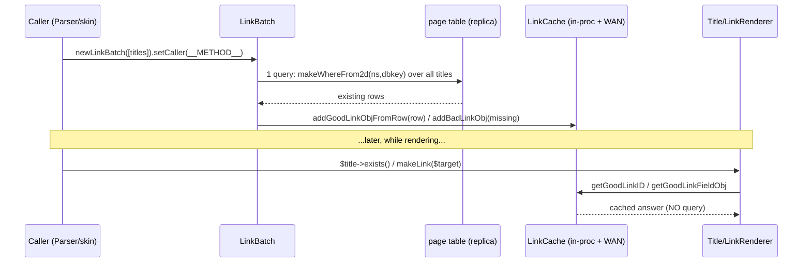

# Subsystem: Title, Linking & Namespaces

> Part of the MediaWiki core senior-onboarding handbook. Scope: page **identity**
> (`Title` and the modern value objects replacing it), the **namespace** model,
> title text → DBkey **normalization**, and link **rendering** + existence
> **caching**.
>
> Foundation to read first (not repeated here): root `AGENTS.md`,
> `includes/AGENTS.md`, and the two authoritative docs `docs/Title.md` and
> `docs/LinkCache.md`. Cross-subsystem topics live in their own handbook pages —
> see [Foundation](#foundation) at the bottom.
>
> Version context: MW 1.47.0-alpha, PHP ≥ 8.3. No toolchain in this checkout;
> commands below are quoted from `composer.json` and **not run here**.

---

## Responsibility & boundaries

This subsystem answers four questions that almost every other part of MediaWiki
asks constantly:

1. **"What page is this?"** — turn a user string, a URL, a DB row, or another
   object into a canonical, comparable page identity. (`Title`, `TitleValue`,
   `PageIdentity`/`PageReference`, `TitleParser`.)
2. **"What namespace rules apply?"** — talk/subject pairing, capitalization,
   content models, subpages, gender-aware names. (`NamespaceInfo`.)
3. **"Does this page exist, and how do I render a link to it?"** — blue vs red
   links, redirect styling, special pages, interwiki. (`LinkRenderer`, legacy
   `Linker`.)
4. **"How do I check existence for hundreds of links without hundreds of
   queries?"** — batch existence + metadata caching. (`LinkCache`, `LinkBatch`,
   `BacklinkCache`.)

**In scope:** `includes/Title/`, `includes/Linker/`, the page-existence caches in
`includes/Page/` (`LinkCache`, `LinkBatch`, `LinkBatchFactory`) and
`includes/Cache/` (`BacklinkCache`), plus the page-identity value objects in
`includes/Page/` as they relate to `Title`.

**Out of scope (owned by siblings):** how wikitext links become `Title`s during
parsing → **parser-and-content-transform**; the `page` table schema, `PageStore`
lookups, revisions → **storage-revisions-content**; URL/route building and the
skin/`OutputPage` consumers → **output-skins-resourceloader**; the
`WANObjectCache`/job-queue machinery the caches sit on → **caching-deferred-jobs**;
gender data source and message localization → **localisation**.

> ⚠️ **File-location gotcha (recent moves).** Despite the directory names in older
> docs, `LinkCache`, `LinkBatch`, and `LinkBatchFactory` now live in
> `includes/Page/` under namespace `MediaWiki\Page\` (not `MediaWiki\Cache\`).
> `MediaWikiTitleCodec` is now a near-empty **deprecated** stub; the real logic is
> in `TitleParser` + `TitleFormatter`. Old class names survive only via
> `class_alias()` at the bottom of each file. Don't trust your muscle memory here.

---

## Internal structure (key files & their roles)

### Page identity — the migration in one table

`Title` is "the god node": it implements both `LinkTarget` **and** `PageIdentity`,
threads through ~169 references across the codebase, is mutable, reaches into the
service container statically, and queries the database lazily. The decade-long
project is to replace it with small, immutable, side-effect-free pieces. The
interface hierarchy encodes how far that has gotten:

| Type | File | What it models | Mutable? | Notes |
|---|---|---|---|---|
| `LinkTarget` (interface) | `includes/Linker/LinkTarget.php` | a **link target**: ns + dbkey + fragment + interwiki. May be a section link or interwiki link — *not necessarily a page.* | impl-dependent | Extends Parsoid's `LinkTarget`. The minimal contract for "something you can link to". |
| `TitleValue` | `includes/Title/TitleValue.php` | the immutable, DB/global-free implementation of `LinkTarget`. | **no** | The thing you should pass around in new code. Does no normalization beyond space↔underscore (see warning below). |
| `PageReference` (interface) | `includes/Page/PageReference.php` | a wiki-bound page: ns + dbkey + **wiki ID**. May be a Special page. Not a link target (no fragment/interwiki). | impl-dependent | `WikiAwareEntity`; identity = (wikiId, ns, dbkey). |
| `PageReferenceValue` | `includes/Page/PageReferenceValue.php` | immutable `PageReference`. Always a *viewable* page (incl. Special). | **no** | `::localReference()` helper. |
| `PageIdentity` (interface) | `includes/Page/PageIdentity.php` | a `PageReference` that *can have a page ID* (`getId()`, `exists()`, `canExist()`). | impl-dependent | The "editable page" contract. |
| `ProperPageIdentity` | `includes/Page/ProperPageIdentity.php` | a `PageIdentity` guaranteed to be a real, ID-able page (no Special/interwiki/section). | — | The intended *end state*: once `Title` is gone, `PageIdentity` == `ProperPageIdentity`. |
| `PageIdentityValue` | `includes/Page/PageIdentityValue.php` | immutable `ProperPageIdentity` (pageId + ns + dbkey + wikiId). | **no** | `::localIdentity()` helper. Cannot represent Special/interwiki/section. |
| `Title` | `includes/Title/Title.php` (3.8k lines) | **everything above at once**, plus DB access, content model, restrictions, redirects, URL forms… | **yes** | The legacy value object being decomposed. |

The "why" is spelled out verbatim in the interface docblocks (worth reading): the
`@note`s on `PageIdentity` say Title is *the only* `PageIdentity` allowed to
represent non-pages, that Title is *the only* one allowed to be mutable, and that
"once Title has been removed… the distinction between `PageIdentity` and
`ProperPageIdentity` becomes redundant." That is the entire migration thesis.

**Bridging methods** (how the worlds connect):
- `Title` ↔ value objects: `Title::newFromLinkTarget()`, `castFromLinkTarget()`,
  `newFromPageReference()`/`castFromPageReference()`,
  `newFromPageIdentity()`/`castFromPageIdentity()`.
- The cleanest exit hatch: **`Title::toPageIdentity(): ProperPageIdentity`** —
  asserts the title is a proper page and returns an immutable `PageIdentityValue`.
  Prefer this over passing a `Title` where you only need identity.
- `TitleValue::newFromPage()` / `castPageToLinkTarget()` go the other direction.

### Parsing / formatting services

- **`TitleParser`** (`includes/Title/TitleParser.php`) — the **source of truth for
  title validity**. `parseTitle(string): TitleValue` and the workhorse
  `splitTitleString()` (copied historically from `Title::secureAndSplit()`). It is
  what does the real normalization; `Title::newFromText()` and
  `Title::secureAndSplit()` now *delegate* to it.
- **`TitleFormatter`** (`includes/Title/TitleFormatter.php`) — the inverse:
  `LinkTarget|PageReference` → display text / prefixed text / prefixed DBkey / URL.
  Holds `Language` + `GenderCache` + `NamespaceInfo`. Applies gender-aware
  namespace names; **does not** re-validate or fix malformed input.
- **`MediaWikiTitleCodec`** (`includes/Title/MediaWikiTitleCodec.php`) —
  **deprecated since 1.44**, now a 40-line stub delegating to the two services
  above. Mentioned because the name is everywhere in older code/docs.
- **`TitleFactory`** (`includes/Title/TitleFactory.php`) — an injectable wrapper
  whose only job is to make the static `Title::newFrom*` methods mockable in unit
  tests. "There is nothing interesting in this class" (its own docblock).
- **`NamespaceInfo`** (`includes/Title/NamespaceInfo.php`) — all namespace "magic"
  by index; see next section.
- **`Foreign*`/`Import*` factories** (`ForeignTitle`, `NaiveForeignTitleFactory`,
  `NamespaceAwareForeignTitleFactory`, `*ImportTitleFactory`) — used by
  import/dump tooling to map another wiki's namespace conventions onto local
  titles. Niche; touched mainly by **storage-revisions-content** / maintenance.

### Link rendering

- **`LinkRenderer`** (`includes/Linker/LinkRenderer.php`) — the **modern** way to
  build `<a>` HTML for internal links. `makeLink()` (auto blue/red),
  `makeKnownLink()` (blue), `makeBrokenLink()` (red), `makePreloadedLink()`
  (no existence query). Obtain via `LinkRendererFactory` /
  `MediaWikiServices::getLinkRenderer()`.
- **`LinkRendererFactory`** (`includes/Linker/LinkRendererFactory.php`) — DI seam;
  `create()` returns a fresh instance (with optional `renderForComment`).
- **`UserLinkRenderer`** (`includes/Linker/UserLinkRenderer.php`) — specialized
  rendering for user links (temp-account awareness, contributions/tools).
- **`Linker`** (`includes/Linker/Linker.php`, 2k lines) — the **legacy static**
  grab-bag. `Linker::link()` is deprecated since 1.28 in favor of `LinkRenderer`;
  much of the file is media/thumbnail/diff/revision helpers that have not yet
  found a home. Treat as legacy; don't add link-building methods here.
- **`LinksMigration`** (`includes/Linker/LinksMigration.php`) — maps link-table
  prefixes (`pl`, `tl`, …) to the right ns/title columns during the normalized
  link-tables migration; used by `LinkBatch::constructSet()`.
- **`LinkTargetLookup` / `LinkTargetStore`** (`includes/Linker/`) — intern
  link targets to integer IDs for the normalized link tables (a storage concern;
  mostly relevant to **storage-revisions-content**).

### Existence & backlink caching

- **`LinkCache`** (`includes/Page/LinkCache.php`) — per-request + persistent cache
  of page existence and metadata (`page_id`, `page_len`, `page_is_redirect`,
  `page_latest`, `page_content_model`, `page_lang`).
- **`LinkBatch`** / **`LinkBatchFactory`** (`includes/Page/`) — collect many
  titles, run **one** existence query, warm the `LinkCache`.
- **`BacklinkCache`** / **`BacklinkCacheFactory`** (`includes/Cache/`) — the
  *other* direction: "what links **to** this page?" Used for cascading
  invalidation (HTML cache purges, `touchLinks()`), approximate counts, and
  partitioning large backlink sets into job batches.

---

## Main flows

### Flow 1 — text → normalized Title (the canonicalization pipeline)

`Title::newFromText()` no longer contains the parsing logic; it delegates to
`TitleParser::splitTitleString()`. The order of operations is load-bearing and is
the answer to most "why did my title change?" questions:

```mermaid
flowchart TD
    A["raw text e.g. ' de:talk:foo bar '"] --> B[Sanitizer::decodeCharReferencesAndNormalize<br/>&amp;eacute; etc → real chars]
    B --> C[spaces → underscores]
    C --> D[strip bidi overrides U+200E/200F/202A-E]
    D --> E[collapse all Unicode whitespace → single '_'; trim '_']
    E --> F{leading ':'?}
    F -- yes --> G[force NS_MAIN, drop colon]
    F -- no --> H[scan prefix before first ':']
    G --> H
    H --> I{prefix is a namespace?}
    I -- yes --> J["set namespace; reject Talk:File:/Talk:iw: nesting"]
    I -- no --> K{prefix is a valid interwiki?}
    K -- yes --> L["set interwiki (lowercased);<br/>local-interwiki collapses like a colon"]
    K -- no --> M[colon stays in title text]
    J --> N[split off '#fragment']
    L --> N
    M --> N
    N --> O[reject illegal chars / %XX / &amp;refs / './..' / ~~~ ]
    O --> P[length check: 255B, 512B for Special]
    P --> Q{namespace capitalized?}
    Q -- yes, local --> R[ucfirst first letter]
    Q -- no/interwiki --> S[leave as-is]
    R --> T[NS_USER/USER_TALK: IPUtils::sanitizeIP]
    S --> T
    T --> U[TitleValue.assertValidSpec → TitleValue]
```

Why each rule exists (tribal knowledge):
- **Capitalization happens at parse time, not display time.** `[[foo]]` and
  `[[Foo]]` resolve to the same `Title` because `ucfirst` is applied here
  (governed by `$wgCapitalLinks` / per-namespace overrides). This is what makes
  link-cache equality and dedup work. Interwiki targets are **not** capitalized —
  the remote wiki may be case-sensitive.
- **`%XX` and `&entity;` are illegal in titles** because they break round-tripping
  — you couldn't reliably link to a page whose name contains an escape sequence.
- **`./`, `../`, `~~~`** are forbidden to avoid relative-URL ambiguity, subpage
  conflicts, and accidental signature expansion.
- **Talk-of-a-namespace is rejected:** `Talk:File:Foo` and `Talk:de:Foo` throw —
  MediaWiki's model has no "talk page of a File namespace".
- **IP normalization in NS_USER/USER_TALK** canonicalizes the many spellings of
  an IPv6 address (`::1` → full form) so contributions/talk are consistent.
- **Local-interwiki collapse:** an interwiki prefix that points back at this wiki
  behaves like a leading colon, and an *empty* local-interwiki link resolves to
  the Main Page (T297571) — note the recursion guard in `Title::newMainPage()`.

> ⚠️ **`new TitleValue(...)` and `Title::makeTitle(...)` skip this pipeline.**
> They only swap spaces/underscores and assert basic shape. Use them only with
> already-trusted data (DB rows, parser output). For user/external input use
> `Title::newFromText()` / `TitleParser::parseTitle()` (validating) or the
> `*Safe` variants (`makeTitleSafe`, `TitleParser::makeTitleValueSafe`).

### Flow 2 — link-existence batching (the performance reason this subsystem exists)

A single article can emit hundreds–thousands of outgoing links and transclusions.
Resolving existence one title at a time would be thousands of ~1 ms queries per
request. The fix is **batch once, then read from cache**:



Key behaviors encoded in the code/tests:
- `LinkBatch::add()` / `addObj()` **silently skip** negative namespaces, empty
  dbkeys, and interwiki targets (they have no local page row). `addUser()` adds
  both `User:` and `User_talk:` and preloads temp-account expiry in the same batch
  (T358469).
- `LinkBatch::doQuery()` builds **one** `WHERE` via `makeWhereFrom2d()`; the caller
  string ends up as `LinkBatch::doQuery (for <fname>)` in the rdbms debug log.
- The contract from `docs/LinkCache.md`: when writing new iterate-over-titles
  code, **verify** in the debug toolbar / `rdbms` channel that there is no
  per-title `page` query left — only the single `LinkBatch::doQuery`.

### Flow 3 — `LinkRenderer::makeLink()` (blue vs red)

`makeLink()` casts the target to a `Title`, calls `isKnown()`, and dispatches to
`makeKnownLink()` (blue) or `makeBrokenLink()` (red). Broken links get
`class="new"` and an `action=edit&redlink=1` query (suppressed for Special pages or
if `action` is already set; the fragment is dropped on red links). `mw-redirect`
is added only when the page exists **and** `LinkCache` reports it as a redirect.
Two hooks fire: `HtmlPageLinkRendererBegin` (can short-circuit/alter target) and
`HtmlPageLinkRendererEnd` (can rewrite the final `<a>`).

> Use `makePreloadedLink()` (or `makeKnownLink()` on a pre-warmed cache) for
> skin-generated links where you already know existence and want **zero** extra DB
> lookups — `getLinkClasses()` calls `LinkCache::addLinkObj()`, which *will* query
> if the title isn't cached.

---

## State & data it owns

- **`LinkCache` in-process cache** — a `MapCacheLRU` of up to **10,000** entries,
  keyed by prefixed DBkey. Each entry is `[ROW, FLAGS]`: the full `page` row (good
  link) or `null` (bad link), plus the `READ_*` flags it was loaded with. Three
  distinguishable states: **good** (row), **bad** (explicit null), **unknown**
  (absent → returns 0/null). `Title` both reads from and *writes to* this cache as
  it encounters titles.
- **`LinkCache` persistent layer** — `WANObjectCache` (Memcached), used **only**
  for a curated set of namespaces where a hit eliminates a whole query rather than
  shrinking a batch: Template, File, Category, MediaWiki, `.css`/`.js` pages, and
  non-talk extension namespaces ≥ 100 (e.g. Module). See `usePersistentCache()`
  and the rationale in `docs/LinkCache.md` — most page rows are deliberately *not*
  cached because on a wiki the size of enwiki the hit rate would be near-zero.
  Adaptive TTL up to 1 day, keyed by `('page', ns, sha1(dbkey))`.
- **`BacklinkCache`** — request-lifetime cache of backlink lists, approximate
  counts, and result partitions for a given target page.
- **`Title` instance cache** — `Title::$titleCache` (`MapCacheLRU`, max 1000) for
  `newFromText`, plus `Title::$cachedMainPage`. Bounded to avoid leaks in batch
  jobs. Per-instance mutable fields (`mArticleID`, `mRedirect`, `mLength`,
  `mLatestID`, content model…) are lazily filled from `LinkCache`/`PageStore` and
  reset by `resetArticleID()` (called on create/delete/move).
- **`NamespaceInfo` derived caches** — canonical names, name→index map, valid-ns
  list (lazy, per service instance).

This subsystem does **not** own the `page` table itself — that is
**storage-revisions-content**. It owns the *caches* over it.

---

## Dependencies

**Inbound (out, i.e. what this subsystem calls):**
- `Language` (namespace text, `ucfirst`/`lc`, gender names), `GenderCache`
  (gendered namespace names), `InterwikiLookup` (valid-interwiki check),
  `Sanitizer` (entity decode/normalize), `IPUtils`.
- `IConnectionProvider` / `ILoadBalancer` for the existence query;
  `WANObjectCache` for the persistent layer; `PageStore`/`PageStoreRecord` for
  the canonical field set (`LinkCache::getSelectFields()` is built from
  `PageStoreRecord::REQUIRED_FIELDS`).
- `SpecialPageFactory` (Special-page existence in `isAlwaysKnown`), `RepoGroup`
  (File existence), `HookContainer`/`HookRunner`, `MainConfig`/`ServiceOptions`,
  `DeferredUpdates`/`JobQueueGroup` (cache invalidation, `touchLinks`),
  `ShadowPageLoader` (the modern replacement for `hasSourceText`, deprecated 1.47).
- `Wikimedia\Parsoid\Core\LinkTarget` — MediaWiki's `LinkTarget` *extends*
  Parsoid's, and `TitleValue` uses Parsoid's `LinkTargetTrait`. This is a real
  coupling: Parsoid and core share the link-target abstraction.

**Outbound (in, i.e. who depends on this):** essentially everyone. `Title` is the
most-connected non-hook node in the codebase. Notable consumers: the **parser**
(every wikilink/transclusion, `replaceLinkHolders`), **output/skins** (every link
in the chrome), **action/REST APIs**, **special pages & actions/editing**,
**storage/revisions** (`WikiPage`, `PageStore`), **permissions** (titles are the
unit restrictions attach to). New code should depend on the *interfaces*
(`LinkTarget`, `PageIdentity`) and the *services* (`TitleParser`, `TitleFormatter`,
`LinkRenderer`, `LinkBatchFactory`), not on `Title` statics.

**Service wiring** (`includes/ServiceWiring.php`): `NamespaceInfo`, `TitleParser`,
`TitleFormatter`, `TitleFactory`, `LinkCache`, `LinkBatchFactory`,
`LinkRenderer`/`LinkRendererFactory`, `BacklinkCacheFactory`, `InterwikiLookup`,
`GenderCache`, `LinkTargetLookup`. The `LinkRenderer` service is just
`LinkRendererFactory->create()`. `LinkCache` gracefully accepts a `null`
LoadBalancer for the installer (no DB yet).

---

## Extension / customization points

Hooks (each is an interface `onXxx`, called via `HookRunner` — see `docs/Hooks.md`):
- **`CanonicalNamespaces`** — add/rename namespaces (also done declaratively via
  the `ExtensionNamespaces` attribute and `$wgExtraNamespaces`).
- **`NamespaceIsMovable`** — veto moves per namespace.
- **`HtmlPageLinkRendererBegin` / `HtmlPageLinkRendererEnd`** — intercept/rewrite
  internal-link HTML (the modern replacement for the old `LinkBegin`/`LinkEnd`).
- **`TitleExists`, `TitleIsAlwaysKnown`** — override existence / "is this a
  bluelink?" decisions (e.g. extensions that synthesize virtual pages).
- `includes/Title/Hook/` and `includes/Linker/Hook/` hold the interface
  definitions for this subsystem's hooks.

Config knobs that change behavior here (declared in `MainConfigSchema`): namespace
shape (`$wgExtraNamespaces`, `$wgContentNamespaces`, `$wgNamespacesWithSubpages`,
`$wgNamespaceContentModels`, `$wgNonincludableNamespaces`,
`$wgCapitalLinks`/`$wgCapitalLinkOverrides`), `$wgLegalTitleChars`,
`$wgLocalInterwikis`, `$wgNoFollowLinks`/`NsExceptions`/`DomainExceptions`.

**Stable contract:** `LinkTarget`, `PageReference`, `PageIdentity` are
`@stable to type`; `TitleValue` is `@newable` with a `@stable to call`
constructor. Breaking them requires a deprecation path. `Title` internals
(`mArticleID` et al. are `public` for legacy reasons but `@internal`).

---

## Invariants & gotchas

- **Don't pick a comparison method by accident — there are three:**
  - `Title::equals()` — same interwiki + namespace + dbkey, **ignores fragment and
    page ID** (uses `===` so number-like titles match correctly).
  - `LinkTarget::isSameLinkAs()` — like `equals()` but **includes the fragment**.
  - `PageReference::isSamePageAs()` — same **wikiId** + ns + dbkey, **ignores
    fragment**, used for page (not link) identity. `Title::isSamePageAs()` is kept
    in sync with `PageReferenceValue::isSamePageAs()`.
- **`exists()` vs `isKnown()` vs `isAlwaysKnown()`** — `exists()` is *literally* "is
  there a row in the `page` table" → **false** for Special pages, interwiki links,
  valid system messages, and existing files in NS_FILE. For "should this render as
  a bluelink?" use **`isKnown()`** (`= isAlwaysKnown() || exists()`).
  `isAlwaysKnown()` covers interwiki (always), Special (if the special page
  exists), NS_FILE/NS_MEDIA (if a file exists, possibly foreign), shadow pages, and
  self-links.
- **`Title` is mutable and process-cached.** `newFromText`/`newMainPage` may return
  a *shared* instance; `makeTitle` is the fast path that skips validation.
  `getArticleID()`/`isRedirect()`/`getLength()`/`getLatestRevID()` lazily query and
  cache; `resetArticleID()` clears the per-instance fields *and* `LinkCache` *and*
  restriction cache (call it after create/delete/move).
- **`canExist()` is the gate for "is this a real page?"** It is deliberately cheap
  (no DB query): false for ns < NS_MAIN (Special/Media), interwiki, and empty-text
  (section-only) links. `getId()`/`toPageIdentity()`/`toPageRecord()` assert
  `canExist()` and throw `PreconditionException` otherwise. Always call
  `canExist()` (or require a `ProperPageIdentity`) before treating a `Title`/
  `PageIdentity` as an editable page.
- **A `TitleValue`/`Title` can be syntactically invalid yet formattable.**
  Normalization/validation happen on **parse**, never on **format**. An out-of-range
  namespace formats as `Special:Badtitle/NS<n>:…` rather than silently becoming
  main namespace (T165149).
- **Wiki-ID safety:** cross-wiki `PageIdentity`/`PageReference` must pass `$wikiId`
  to `getId()`; `LinkCache` refuses non-local pages (logs and returns null). There
  is **no cross-wiki LinkCache** yet.
- **`READ_LATEST` in `LinkCache` is discouraged.** Mixing DB_PRIMARY rows into the
  cache breaks the consistent replica snapshot most callers assume.
- **Talk/subject parity is arithmetic:** subject namespaces are even, talk
  namespaces are odd (`getTalk()` = `index + 1`, `getSubject()` = `index - 1`).
  Special/Media (negative) have **no** talk page — `getTalk()` throws, it does not
  return null. Check `canHaveTalkPage()` first.
- **Gender-aware namespace names are a formatting-only concern** driven by
  `Language::needsGenderDistinction()` + `NamespaceInfo::hasGenderDistinction()`
  (true only for NS_USER/USER_TALK). The parser doesn't care; `TitleFormatter`
  asks `GenderCache`, which is why user-page link batches also run a gender query.
- **Content model follows extension then namespace** (`User:X/y.js` → JavaScript;
  `MediaWiki:X.js` is case-sensitive; talk pages inherit the subject namespace's
  model, so `User_talk:X/y.css` is wikitext).

---

## How to make a typical change here

**Render a link the modern way** — never hand-build `<a>` for an internal link:
```php
$linkRenderer = $services->getLinkRenderer();              // or inject LinkRenderer
$html = $linkRenderer->makeLink( $target, $text, $attribs, $query );
// $target may be a LinkTarget OR a PageReference.
// makeKnownLink/makeBrokenLink to force blue/red; makePreloadedLink to skip the DB.
```

**Work with page identity without a `Title`:**
```php
// Parse user input (validating):
$value = $services->getTitleParser()->parseTitle( $text );      // TitleValue|throws
// Trusted data only (no validation):
$value = new TitleValue( NS_MAIN, 'Foo_Bar' );
// Need a real, ID-able page? Get an immutable ProperPageIdentity:
$page  = $title->toPageIdentity();                              // asserts canExist()
$pid   = PageIdentityValue::localIdentity( $id, $ns, $dbkey );
// Format for display / DB / URL:
$services->getTitleFormatter()->getPrefixedText( $value );
```
Prefer the interfaces (`LinkTarget`, `PageIdentity`) in signatures; cast to `Title`
only at the boundary where legacy code forces it. Inject `TitleParser`,
`TitleFormatter`, `TitleFactory`, `LinkRenderer`, `LinkBatchFactory` — don't call
`Title::` statics in new service code.

**Check existence for many titles** — always batch:
```php
$batch = $services->getLinkBatchFactory()->newLinkBatch( $titles )->setCaller( __METHOD__ );
$batch->execute();                       // one query; warms LinkCache
foreach ( $titles as $t ) { $t->exists(); }   // no further queries
```
Then verify in the debug toolbar / `rdbms` channel that no per-title `page` query
remains (see `docs/LinkCache.md`).

**Add or change a namespace constant:** add the `NS_*` define in
`includes/Defines.php`, the canonical name in `NamespaceInfo::CANONICAL_NAMES`,
localized names in `languages/`, and config defaults in `MainConfigSchema`. After
adding/moving any class, regenerate `autoload.php`
(`php maintenance/run.php generateLocalAutoload` — **not run here**) or
`AutoLoaderStructureTest` fails. New namespace behavior gets a method on
`NamespaceInfo`, not scattered `$ns % 2` checks.

**Tests** (`composer phpunit:unit` for the DB-less ones — **not run here**): the
parser/formatter/namespace logic has fast **unit** tests
(`tests/phpunit/unit/includes/title/`), while existence/caching needs
**integration** tests (`tests/phpunit/integration/includes/Page/`). The
behavioral contract is pinned by `TitleTest`, `TitleParserTest`,
`TitleFormatterTest`, `NamespaceInfoTest`, `LinkRendererTest`, `LinkCacheTest`,
`LinkBatchTest`. If you change a normalization rule, expect to update
`TitleParserTest` providers (these double as the spec).

---

## Foundation

- Authoritative for this subsystem: `docs/Title.md`, `docs/LinkCache.md`.
- Cross-cutting handbook pages (don't duplicate them here):
  - **service-container-and-config** — `MediaWikiServices`, `ServiceWiring`,
    `MainConfigSchema`/`ServiceOptions`.
  - **hooks-and-extension-registration** — `HookRunner`, extension attributes
    (`ExtensionNamespaces`), `@stable` contract.
  - **parser-and-content-transform** — where wikitext links become `Title`s and
    `LinkHolderArray`/`replaceLinkHolders` consume `LinkCache`.
  - **storage-revisions-content** — `page` table, `PageStore`, link-tables
    migration (`LinksMigration`, `LinkTargetStore`), import/foreign-title
    factories.
  - **caching-deferred-jobs** — `WANObjectCache`, `DeferredUpdates`, `JobQueue`,
    `HTMLCacheUpdateJob` that `touchLinks()`/`BacklinkCache` feed.
  - **output-skins-resourceloader** — URL building and skin/`OutputPage` link
    consumers; ResourceLoader's use of `LinkCache` for `MediaWiki:`-namespace pages.
  - **localisation** — `Language` namespace text, gender, `GenderCache` data source.

### Open questions / unknowns

- **Migration end-state timing.** The interfaces say Title will eventually be
  removed and `PageIdentity` will collapse into `ProperPageIdentity`, but there is
  no dated roadmap in-tree. *Inference:* given Title's 169-way connectivity, this
  is a multi-year effort with no committed completion — treat "decompose Title"
  as a direction, not a deadline. (Not verified against a Phabricator epic.)
- **`LinkCache` cross-wiki support** is explicitly a TODO in the code ("Perhaps
  LinkCache can become wiki-aware in the future"); no design is present in this
  repo.
- I did not deep-read `UserLinkRenderer`, `LinkTargetStore`, or the
  `Foreign*/Import*` title factories beyond their headers; their finer contracts
  (esp. temp-account link styling and the link-target interning IDs) are better
  documented by **storage-revisions-content** / the auth subsystem.
- Exact, current per-test assertions were summarized via a sub-agent read of the
  test files; treat the edge-case list in "Invariants & gotchas" as
  contract-level (cross-checked against the source) but re-run the named tests to
  confirm any specific assertion before relying on it in a patch.
